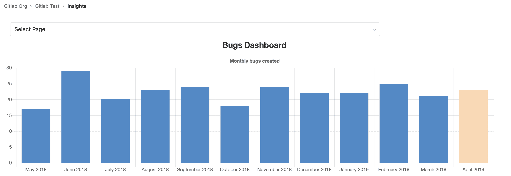
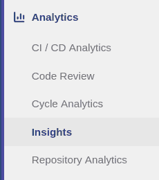
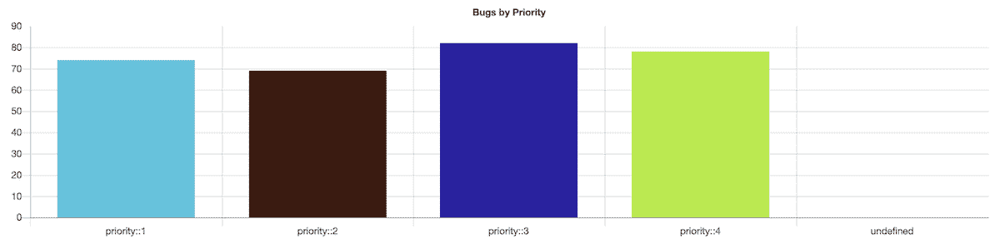
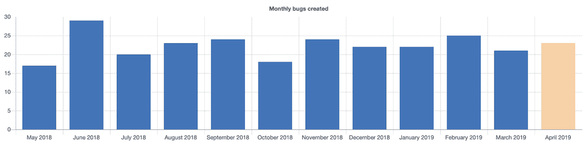
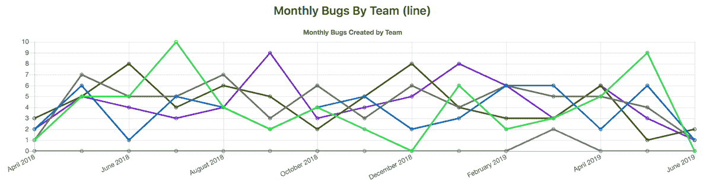
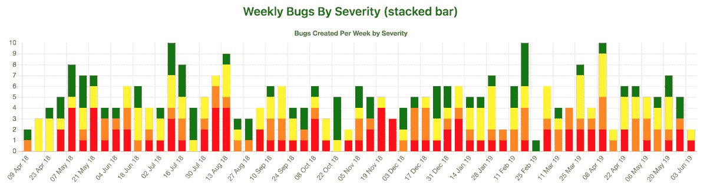

# Insights

> 原文：[https://docs.gitlab.com/ee/user/project/insights/](https://docs.gitlab.com/ee/user/project/insights/)

*   [View your project’s Insights](#view-your-projects-insights)
*   [Configure your Insights](#configure-your-insights)
*   [Permissions](#permissions)
*   [Writing your `.gitlab/insights.yml`](#writing-your-gitlabinsightsyml)
*   [Configuration parameters](#configuration-parameters)
*   [Parameter details](#parameter-details)
    *   [`title`](#title)
    *   [`description`](#description)
    *   [`type`](#type)
    *   [`query`](#query)
        *   [`query.issuable_type`](#queryissuable_type)
        *   [`query.issuable_state`](#queryissuable_state)
        *   [`query.filter_labels`](#queryfilter_labels)
        *   [`query.collection_labels`](#querycollection_labels)
        *   [`query.group_by`](#querygroup_by)
        *   [`query.period_limit`](#queryperiod_limit)
        *   [`query.period_field`](#queryperiod_field)
    *   [`projects`](#projects)
        *   [`projects.only`](#projectsonly)
*   [Complete example](#complete-example)

# Insights[](#insights-ultimate "Permalink")

[Introduced](https://gitlab.com/groups/gitlab-org/-/epics/725) in [GitLab Ultimate](https://about.gitlab.com/pricing/) 12.0.

配置对您的项目至关重要的见解，以探索数据，例如分类诊断，在给定期间内创建/关闭的问题，合并请求的平均合并时间等等.

[](img/project_insights.png)

**注意：**此功能[在组级别也可用](../../group/insights/index.html) .

## View your project’s Insights[](#view-your-projects-insights "Permalink")

您可以通过点击左侧栏中的**Analytics（分析）> Insights**链接来访问项目的 Insights：

[](img/insights_sidebar_link_v12_8.png)

## Configure your Insights[](#configure-your-insights "Permalink")

使用项目中名为`.gitlab/insights.yml`的 YAML 文件配置`.gitlab/insights.yml` . 该文件将在项目的"见解"页面中使用.

有关此文件内容的详细信息，请参见下面的[编写`.gitlab/insights.yml`](#writing-your-gitlabinsightsyml) .

**注意：**一旦创建了配置文件，您也可以[将其用于项目的 group](../../group/insights/index.html#configure-your-insights) .**注意：**如果项目没有任何配置文件，则将尽可能尝试使用组配置. 如果该组没有任何配置，将使用默认配置.

## Permissions[](#permissions "Permalink")

如果您有权查看项目，则可以查看其见解.

**注意：**您无法访问的问题或合并请求（因为您无法访问它们所属的项目，或者因为它们是机密的）会从 Insights 图表中过滤掉.

您也可以查阅[组权限表](../../permissions.html#group-members-permissions) .

## Writing your `.gitlab/insights.yml`[](#writing-your-gitlabinsightsyml "Permalink")

`.gitlab/insights.yml`文件定义了将在项目或组的每个 Insights 页面中显示的 Insights 图表的结构和顺序.

每个页面都有一个唯一的键以及一组要获取和显示的图表.

例如，这是 Insights 的单个定义，它将显示一个带有一个图表的页面：

```
bugsCharts:
  title: "Charts  for  bugs"
  charts:
    - title: "Monthly  bugs  created"
      description: "Open  bugs  created  per  month"
      type: bar
      query:
        issuable_type: issue
        issuable_state: opened
        filter_labels:
          - bug
        group_by: month
        period_limit: 24 
```

每个图表定义均由键值对组成的哈希组成.

例如，这是单个图表定义：

```
- title: "Monthly  bugs  created"
  description: "Open  bugs  created  per  month"
  type: bar
  query:
    issuable_type: issue
    issuable_state: opened
    filter_labels:
      - bug
    group_by: month
    period_limit: 24 
```

## Configuration parameters[](#configuration-parameters "Permalink")

图表被定义为定义图表行为的参数列表.

下表列出了图表的可用参数：

| Keyword | Description |
| --- | --- |
| [`title`](#title) | 图表标题. 这将显示在"见解"页面上. |
| [`description`](#description) | 单个图表的描述. 这将显示在相关图表上方. |
| [`type`](#type) | 图表类型： `bar` ， `line`或`stacked-bar` . |
| [`query`](#query) | 散列，用于定义要成为图表一部分的问题/合并请求的条件. |

## Parameter details[](#parameter-details "Permalink")

以下是用于配置 Insights 图表的参数的详细说明.

### `title`[](#title "Permalink")

`title`是图表的标题，它将显示在 Insights 页面上. 例如：

```
monthlyBugsCreated:
  title: "Monthly  bugs  created" 
```

### `description`[](#description "Permalink")

`description`文字显示在图表上方，但标题下方. 它用于提供有关图表的更多详细信息，例如：

```
monthlyBugsCreated:
  title: "Monthly  bugs  created"
  description: "Open  bugs  created  per  month" 
```

### `type`[](#type "Permalink")

`type`是图表类型.

例如：

```
monthlyBugsCreated:
  title: "Monthly  bugs  created"
  type: bar 
```

Supported values are:

| Name | Example |
| --- | --- |
| `bar` | [](img/insights_example_bar_chart.png) |
| `bar` (time series, i.e. when `group_by` is used) | [](img/insights_example_bar_time_series_chart.png) |
| `line` | [](img/insights_example_line_chart.png) |
| `stacked-bar` | [](img/insights_example_stacked_bar_chart.png) |

### `query`[](#query "Permalink")

`query`允许定义条件/合并请求成为图表的一部分.

Example:

```
monthlyBugsCreated:
  title: "Monthly  bugs  created"
  description: "Open  bugs  created  per  month"
  type: bar
  query:
    issuable_type: issue
    issuable_state: opened
    filter_labels:
      - bug
    collection_labels:
      - S1
      - S2
      - S3
      - S4
    group_by: week
    period_limit: 104 
```

#### `query.issuable_type`[](#queryissuable_type "Permalink")

定义要为其创建图表的"可发行"的类型.

支持的值为：

*   `issue` ：图表将显示问题的数据.
*   `merge_request` ：图表将显示合并请求的数据.

#### `query.issuable_state`[](#queryissuable_state "Permalink")

按查询的"可发行"状态过滤.

默认情况下，将使用`opened`状态过滤器.

支持的值为：

*   `opened` ：未解决问题/合并请求.
*   `closed` ：已关闭未解决的问题/合并请求.
*   `locked` ：已锁定讨论的问题/合并请求.
*   `merged` ：合并的合并请求.
*   `all` ：在所有状态下发出/合并请求

#### `query.filter_labels`[](#queryfilter_labels "Permalink")

按应用于查询的"可发行"的标签过滤.

默认情况下，不应用标签过滤器. 必须将所有定义的标签应用于"可发行"，才能对其进行选择.

Example:

```
monthlyBugsCreated:
  title: "Monthly  regressions  created"
  type: bar
  query:
    issuable_type: issue
    issuable_state: opened
    filter_labels:
      - bug
      - regression 
```

#### `query.collection_labels`[](#querycollection_labels "Permalink")

通过配置的标签将"可发行"分组.

默认情况下，不会进行分组. 使用此关键字时，需要将`type`设置为`line`或`stacked-bar` .

Example:

```
weeklyBugsBySeverity:
  title: "Weekly  bugs  by  severity"
  type: stacked-bar
  query:
    issuable_type: issue
    issuable_state: opened
    filter_labels:
      - bug
    collection_labels:
      - S1
      - S2
      - S3
      - S4 
```

#### `query.group_by`[](#querygroup_by "Permalink")

定义图表的 X 轴.

支持的值为：

*   `day` ： `day`组数据.
*   `week` ： `week`组数据.
*   `month` ： `month`组数据.

#### `query.period_limit`[](#queryperiod_limit "Permalink")

定义过去查询"可耗材"的距离.

该单位与您定义的`query.group_by`有关. 例如，如果您定义了`query.group_by: 'day'`则`query.period_limit: 365`意思是"收集并显示最近 365 天的数据".

默认情况下，将根据您定义的`query.group_by`应用默认值.

| `query.group_by` | 默认值 |
| --- | --- |
| `day` | 30 |
| `week` | 4 |
| `month` | 12 |

#### `query.period_field`[](#queryperiod_field "Permalink")

定义用于将"可耗材"分组的时间戳字段.

支持的值为：

*   `created_at` （默认）：使用`created_at`字段对数据进行分组.
*   `closed_at` ：使用`closed_at`字段对数据进行`closed_at` （仅针对问题）.
*   `merged_at` ：使用`merged_at`字段对数据进行`merged_at` （仅适用于合并请求）.

`period_field`自动设置为：

*   `closed_at` if `query.issuable_state` is `closed`
*   `merged_at` if `query.issuable_state` is `merged`
*   `created_at` otherwise

**注意：**在解决[此错误](https://gitlab.com/gitlab-org/gitlab/-/issues/26911)之前，您可能会看到`created_at`代替`merged_at` . 将使用`created_at`代替.

### `projects`[](#projects "Permalink")

[Introduced](https://gitlab.com/gitlab-org/gitlab/-/issues/10904) in [GitLab Ultimate](https://about.gitlab.com/pricing/) 12.4.

您可以限制从以下位置查询"可耗材"的位置：

*   如果`.gitlab/insights.yml`用于一[组的见解](../../group/insights/index.html#configure-your-insights) ，有`projects` ，你可以限制要查询的项目. 默认情况下，将使用该组下的所有项目.
*   如果将`.gitlab/insights.yml`用于项目的见解，则指定任何其他项目均不会产生任何结果. 默认情况下，将使用项目本身.

#### `projects.only`[](#projectsonly "Permalink")

`projects.only`选项指定应从中查询"可发行物品"的项目.

在以下情况下，此处列出的项目将被忽略：

*   它们不存在.
*   当前用户没有足够的权限来读取它们.
*   他们不在小组中.

在以下`insights.yml`示例中，我们指定将在其中使用查询的项目. 设置小组的见解时，此示例非常有用：

```
monthlyBugsCreated:
  title: "Monthly  bugs  created"
  description: "Open  bugs  created  per  month"
  type: bar
  query:
    issuable_type: issue
    issuable_state: opened
    filter_labels:
      - bug
  projects:
    only:
      - 3                         # You can use the project ID
      - groupA/projectA           # Or full project path
      - groupA/subgroupB/projectC # Projects in subgroups can be included
      - groupB/project            # Projects outside the group will be ignored 
```

## Complete example[](#complete-example "Permalink")

```
.projectsOnly: &projectsOnly
  projects:
    only:
      - 3
      - groupA/projectA
      - groupA/subgroupB/projectC

bugsCharts:
  title: "Charts  for  bugs"
  charts:
    - title: "Monthly  bugs  created"
      description: "Open  bugs  created  per  month"
      type: bar
      <<: *projectsOnly
      query:
        issuable_type: issue
        issuable_state: opened
        filter_labels:
          - bug
        group_by: month
        period_limit: 24

    - title: "Weekly  bugs  by  severity"
      type: stacked-bar
      <<: *projectsOnly
      query:
        issuable_type: issue
        issuable_state: opened
        filter_labels:
          - bug
        collection_labels:
          - S1
          - S2
          - S3
          - S4
        group_by: week
        period_limit: 104

    - title: "Monthly  bugs  by  team"
      type: line
      <<: *projectsOnly
      query:
        issuable_type: merge_request
        issuable_state: opened
        filter_labels:
          - bug
        collection_labels:
          - Manage
          - Plan
          - Create
        group_by: month
        period_limit: 24 
```