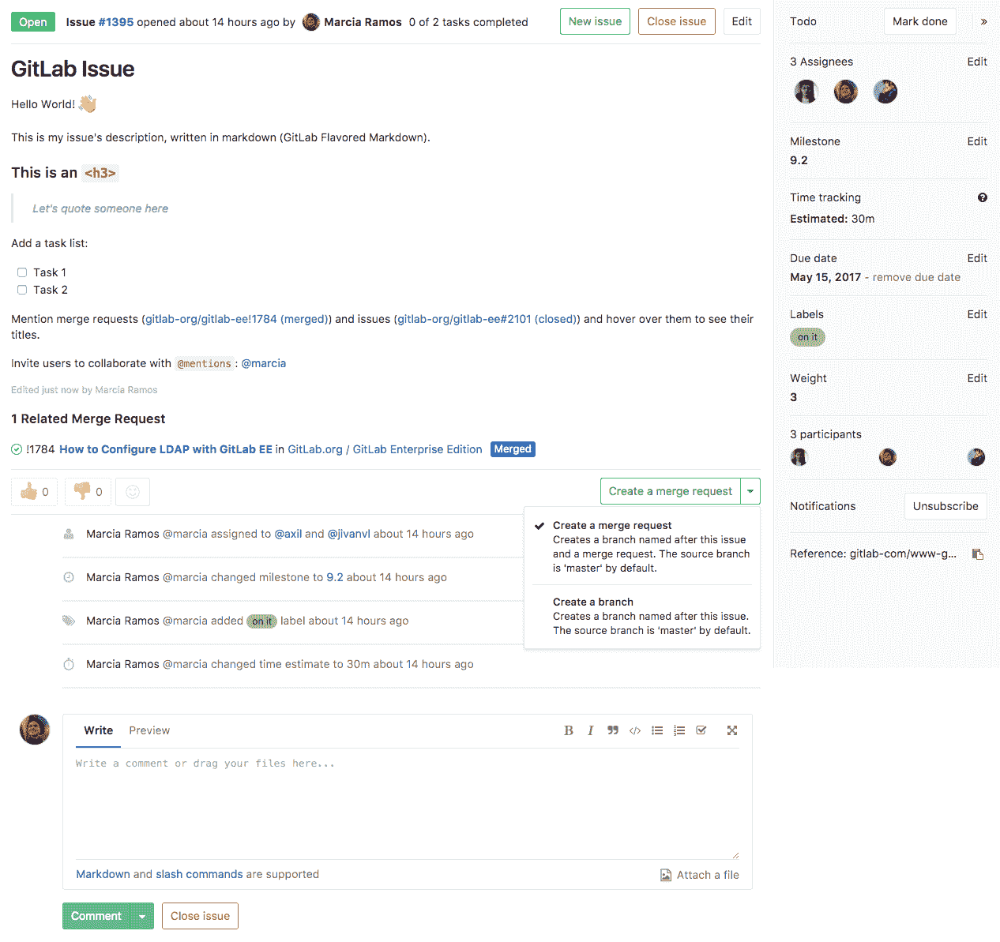
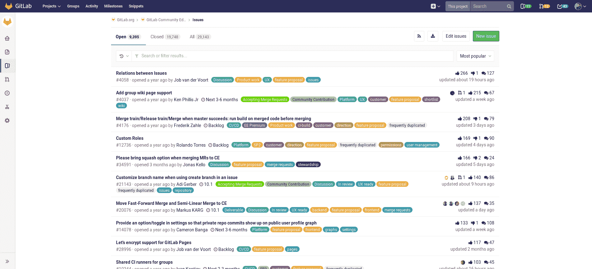
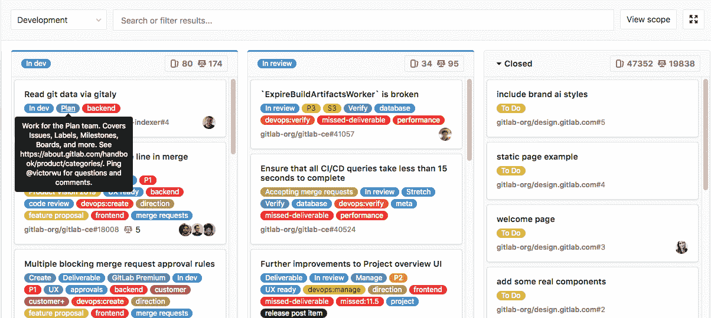
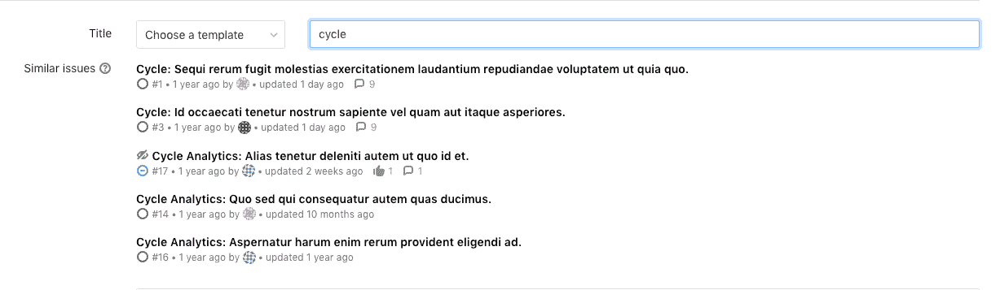
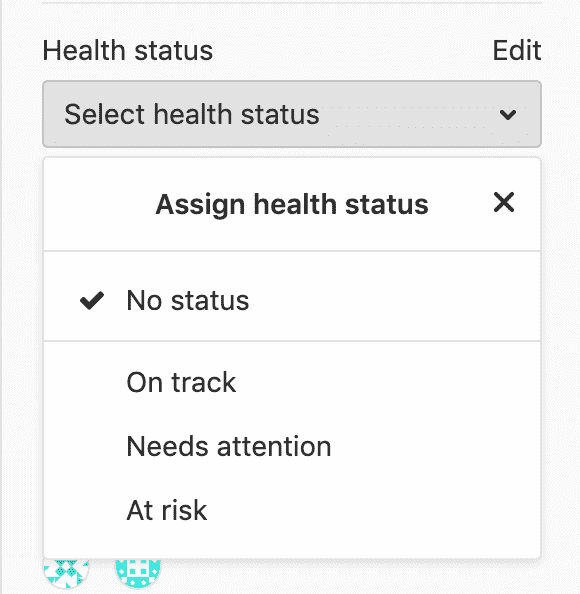

# Issues

> 原文：[https://docs.gitlab.com/ee/user/project/issues/](https://docs.gitlab.com/ee/user/project/issues/)

*   [Overview](#overview)
*   [Parts of an issue](#parts-of-an-issue)
*   [Viewing and managing issues](#viewing-and-managing-issues)
    *   [Issue page](#issue-page)
    *   [Issues list](#issues-list)
    *   [Issue boards](#issue-boards)
    *   [Design Management](#design-management)
    *   [Epics](#epics-premium)
    *   [Related issues](#related-issues-starter)
    *   [Crosslinking issues](#crosslinking-issues)
    *   [Similar issues](#similar-issues)
    *   [Health status](#health-status-ultimate)
        *   [Disable issue health status](#disable-issue-health-status)
*   [Other Issue actions](#other-issue-actions)

# Issues[](#issues "Permalink")

问题是在 GitLab 中就想法和计划工作进行协作的基本介质.

## Overview[](#overview "Permalink")

GitLab 问题跟踪器是用于协作开发想法，解决问题和计划工作的高级工具.

通过问题，可以在以下各项之间，在实施之前和期间共享和讨论提案：

*   您和您的团队.
*   外部合作者.

它们还可以用于各种其他目的，根据您的需求和工作流程进行定制.

问题始终与特定项目相关联，但是如果您在一个小组中有多个项目，则还可以在小组级别集体查看所有问题.

**常见的用例包括：**

*   讨论新想法的实施
*   跟踪任务和工作状态
*   接受功能建议，问题，支持请求或错误报告
*   详细说明新的代码实现

另请参见[始终从问题开始讨论](https://about.gitlab.com/blog/2016/03/03/start-with-an-issue/) .

要了解 GitLab 战略营销部门如何将 GitLab 问题与[标签](../labels.html)和[问题板一起使用](../issue_board.html) ，请参阅有关[管理问题的承诺](https://www.youtube.com/watch?v=cuIHNintg1o&t=3)的视频.

## Parts of an issue[](#parts-of-an-issue "Permalink")

问题包含各种内容和元数据，从而在使用方式上具有很大的灵活性. 每个问题可以包含以下属性，尽管并非必须设置所有项目.

| 

*   Content
    *   Title
    *   描述和任务
    *   评论和其他活动
*   People
    *   Author
    *   Assignee(s)
*   State
    *   状态（打开或关闭）
    *   健康状况（正常，需要注意或有危险）
    *   Confidentiality
    *   任务（完成与未完成）

 | 

*   规划和跟踪
    *   里程碑
    *   截止日期
    *   重量
    *   时间跟踪
    *   标签
    *   投票数
    *   反应表情
    *   关联问题
    *   分配史诗
    *   唯一的发行号和 URL

 |

## Viewing and managing issues[](#viewing-and-managing-issues "Permalink")

虽然您可以在[问题页面](#issue-page)上查看和管理问题的全部详细信息，但也可以一次使用" [问题列表"](#issues-list) ，" [问题板"](#issue-boards) ，"问题参考"和" [Epic"](#epics-premium)处理多个问题 .

针对问题的关键操作包括：

*   [Creating issues](managing_issues.html#create-a-new-issue)
*   [Moving issues](managing_issues.html#moving-issues)
*   [Closing issues](managing_issues.html#closing-issues)
*   [Deleting issues](managing_issues.html#deleting-issues)

### Issue page[](#issue-page "Permalink")

[](img/issues_main_view.png)

在问题的页面上，您可以查看问题的[所有方面，](issue_data_and_actions.html)如果有必要的[权限](../../permissions.html) ，可以对其进行修改.

### Issues list[](#issues-list "Permalink")

[](img/project_issues_list_view.png)

在"问题列表"上，可以从更高级别的组上下文中打开"问题列表"，从而可以查看当前项目中的所有问题，也可以查看多个项目中的所有问题. 使用[搜索查询](../../search/index.html#filtering-issue-and-merge-request-lists)过滤问题列表，包括特定的元数据，例如标签，受让人，状态等. 从此视图，您还可以对显示的问题[进行批量](../bulk_editing.html)更改.

有关更多信息，请参见[问题数据和操作](issue_data_and_actions.html)页面，以了解问题中所有字段和信息的摘要.

您可以通过多种方式对问题列表进行排序，例如，通过问题创建日期，里程碑到期日期. 有关更多信息，请参见" [排序和排序问题列表"](sorting_issue_lists.html)页面.

### Issue boards[](#issue-boards "Permalink")

[](img/issue_board.png)

[发行板](../issue_board.html)是看板，其栏目根据其标签或他们的受让人显示问题 . 它们提供了使用高度可定制的工作流来管理问题的灵活性.

您可以在栏中重新排序问题. 如果将发行卡拖到另一列，则其关联的标签或受让人将更改以匹配新列的标签或受让人. 整个董事会也可以被筛选为仅包括某个里程碑或总体标签中的问题.

### Design Management[](#design-management "Permalink")

使用[Design Management](design_management.html) ，您可以将设计资产上载到问题并一起查看它们，以轻松地与团队共享和协作.

### Epics[](#epics-premium "Permalink")

[Epics](../../group/epics/index.html)通过跟踪跨项目和里程碑共享主题的问题组，使您可以更有效，更[轻松地](../../group/epics/index.html)管理项目组合.

### Related issues[](#related-issues-starter "Permalink")

您可以将两个问题标记为"相关"，以便在查看一个问题时，另一个[问题](related_issues.html)始终列在" [相关问题"](related_issues.html)部分中. 这可以帮助显示重要的上下文，例如过去的工作，依赖项或重复项.

### Crosslinking issues[](#crosslinking-issues "Permalink")

您可以通过引用另一个问题中的问题来[交叉链接问题](crosslinking_issues.html) ，也可以通过包括其 URL 或 ID 来合并请求. 参考的问题在活动流中显示有关参考的消息，并带有指向其他问题或 MR 的链接.

### Similar issues[](#similar-issues "Permalink")

在 GitLab 11.6 中[引入](https://gitlab.com/gitlab-org/gitlab-foss/-/merge_requests/22866) .

为了防止同一主题重复出现问题，GitLab 在创建新问题时会搜索相似的问题.

在" **新问题"**页面中键入标题时，GitLab 会搜索用户在当前项目中有权访问的所有问题的标题和描述. 标题框下方最多显示五个类似问题（按最新更新排序）. 请注意，此功能需要启用[GraphQL](../../../api/graphql/index.html) .

[](img/similar_issues.png)

### Health status[](#health-status-ultimate "Permalink")

[Introduced](https://gitlab.com/gitlab-org/gitlab/-/issues/36427) in [GitLab Ultimate](https://about.gitlab.com/pricing/) 12.10.

为了帮助您跟踪问题的状态，您可以为每个问题分配一个状态，以标记按计划进行或需要注意以按时进行的工作：

*   **步入正轨** (green)
*   **需要注意** (amber)
*   **有一定风险** (red)

[](img/issue_health_status_dropdown_v12_10.png)

然后，您可以在[Epic 树上](../../group/epics/index.html#issue-health-status-in-epic-tree-ultimate)查看问题状态.

#### Disable issue health status[](#disable-issue-health-status "Permalink")

此功能默认启用`:save_issuable_health_status`功能标志. 但是，在某些情况下，此功能与旧配置不兼容. 要在迁移配置时关闭该功能，请要求具有 Rails 控制台访问权限的 GitLab 管理员运行以下命令：

```
Feature.disable(:save_issuable_health_status) 
```

## Other Issue actions[](#other-issue-actions "Permalink")

*   [Create an issue from a template](../../project/description_templates.html#using-the-templates)
*   [Set a due date](due_dates.html)
*   [批量编辑问题](../bulk_editing.html) -从问题列表中选择多个问题，以批量更改其状态，受让人，里程碑或标签.
*   [Import issues](csv_import.html)
*   [Export issues](csv_export.html)
*   [Issues API](../../../api/issues.html)
*   配置[外部问题跟踪器，](../../../integration/external-issue-tracker.html)例如 Jira，Redmine 或 Bugzilla.