# Design Management

> 原文：[https://docs.gitlab.com/ee/user/project/issues/design_management.html](https://docs.gitlab.com/ee/user/project/issues/design_management.html)

*   [Overview](#overview)
*   [Requirements](#requirements)
*   [Supported files](#supported-files)
*   [Limitations](#limitations)
*   [GitLab-Figma plugin](#gitlab-figma-plugin)
*   [The Design Management section](#the-design-management-section)
    *   [Enable or disable displaying Designs on the issue description](#enable-or-disable-displaying-designs-on-the-issue-description-core-only)
*   [Adding designs](#adding-designs)
    *   [Skipped designs](#skipped-designs)
*   [Viewing designs](#viewing-designs)
    *   [Exploring designs by zooming](#exploring-designs-by-zooming)
*   [Deleting designs](#deleting-designs)
*   [Starting discussions on designs](#starting-discussions-on-designs)
*   [Resolve Design threads](#resolve-design-threads)
*   [Referring to designs in Markdown](#referring-to-designs-in-markdown)
    *   [Enable or disable design references](#enable-or-disable-design-references-core-only)
*   [Design activity records](#design-activity-records)

# Design Management[](#design-management "Permalink")

版本历史

*   在[GitLab Premium](https://about.gitlab.com/pricing/) 12.2 中[引入](https://gitlab.com/groups/gitlab-org/-/epics/660) .
*   在 13.0 中[移至](https://gitlab.com/gitlab-org/gitlab/-/issues/212566) GitLab Core.

## Overview[](#overview "Permalink")

Design Management 允许您将设计资产（线框，模型等）上载到 GitLab 问题，并将它们存储在一个位置，由问题中的 Design Management 页面访问，从而为产品设计师，产品经理和工程师提供了一种方法在单一事实来源上进行设计合作.

您可以轻松地与团队共享设计的模型，也可以轻松查看和解决视觉回归问题.

有关概述，请参见视频[设计管理（GitLab 12.2）](https://www.youtube.com/watch?v=CCMtCqdK_aM) .

## Requirements[](#requirements "Permalink")

设计管理需要启用[大文件存储（LFS）](../../../topics/git/lfs/index.html) ：

*   对于 GitLab.com，已启用 LFS.
*   对于自我管理的实例，GitLab 管理员必须[全局启用 LFS](../../../administration/lfs/index.html) .
*   对于 GitLab.com 和自我管理实例：必须为项目本身启用 LFS. 如果全局启用，则默认情况下将对所有项目启用 LFS. 要在项目级别启用 LFS，请导航至项目的**"设置">"常规"** ，展开" **可见性"，项目功能，权限**并启用" **Git Large File Storage"** .

设计管理还要求项目使用[哈希存储](../../../administration/raketasks/storage.html#migrate-to-hashed-storage) . 从 GitLab 10.0 开始，默认情况下，新创建的项目使用哈希存储. GitLab 管理员可以通过导航到" **管理区域">"项目"** ，然后选择有问题的项目来验证项目的存储类型. 如果项目的*Gitaly 相对路径*包含`@hashed`则可以将其标识为散列存储.

如果不满足要求，则" **设计"**选项卡会向用户显示一条消息.

## Supported files[](#supported-files "Permalink")

上传的文件的文件扩展名必须为`png` ， `jpg` ， `jpeg` ， `gif` ， `bmp` ， `tiff`或`ico` .

计划在将来的版本中支持[SVG 文件](https://gitlab.com/gitlab-org/gitlab/-/issues/12771)和[PDF](https://gitlab.com/gitlab-org/gitlab/-/issues/32811) .

## Limitations[](#limitations "Permalink")

*   设计上载一次限制为 10 个文件.
*   从 GitLab 13.1 起，设计文件名限制为 255 个字符.
*   [销毁项目时，不会删除](https://gitlab.com/gitlab-org/gitlab/-/issues/13429)设计管理数据.
*   [移动](https://gitlab.com/gitlab-org/gitlab/-/issues/13426)问题时， [不会移动](https://gitlab.com/gitlab-org/gitlab/-/issues/13426) Design Management 数据； [删除](https://gitlab.com/gitlab-org/gitlab/-/issues/13427)问题时，也不会[删除](https://gitlab.com/gitlab-org/gitlab/-/issues/13427)它.
*   从 GitLab 12.7 起，设计管理数据[可以](../../../administration/geo/replication/datatypes.html#limitations-on-replicationverification)由 Geo [复制](../../../administration/geo/replication/datatypes.html#limitations-on-replicationverification) ，但[不能验证](https://gitlab.com/gitlab-org/gitlab/-/issues/32467) .
*   只能删除设计的最新版本.
*   删除的设计无法恢复，但是您可以在以前的设计版本中看到它们.

## GitLab-Figma plugin[](#gitlab-figma-plugin "Permalink")

在 GitLab 13.2 中[引入](https://gitlab.com/gitlab-org/gitlab-figma-plugin/-/issues/2) .

通过无缝的工作流程将设计环境与源代码管理连接起来. GitLab-Figma 插件通过将产品设计师的工作从 Figma 直接带到 GitLab Issues 作为上载的 Designs，使在 GitLab 中进行协作变得快捷，容易.

要使用该插件，请从[Figma 目录中](https://www.figma.com/community/plugin/860845891704482356)安装它，并通过个人访问令牌连接到 GitLab. 有关详细信息，请参见[插件文档](https://gitlab.com/gitlab-org/gitlab-figma-plugin/-/wikis/home) .

## The Design Management section[](#the-design-management-section "Permalink")

版本历史

*   在 GitLab 13.2 中[引入的](https://gitlab.com/gitlab-org/gitlab/-/issues/223193)设计直接显示在问题描述中，而不是单独的选项卡上.
*   新显示将部署在功能标记后面，默认情况下启用.
*   在 GitLab.com 上启用了它.
*   不能根据项目启用或禁用它.
*   建议用于生产.
*   对于 GitLab 自我管理的实例，GitLab 管理员可以选择[禁用它](#enable-or-disable-displaying-designs-on-the-issue-description-core-only) . 如果禁用，它将"设计"移回" **设计"**选项卡.

您可以在问题描述的" **设计管理"**部分中找到：

[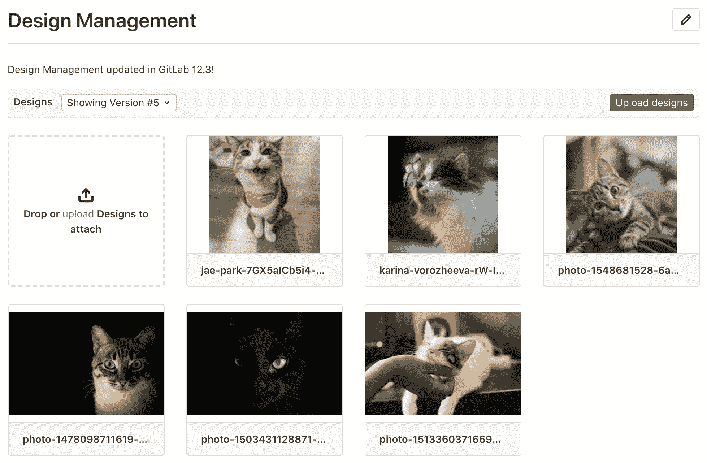](img/design_management_v13_2.png)

### Enable or disable displaying Designs on the issue description[](#enable-or-disable-displaying-designs-on-the-issue-description-core-only "Permalink")

正在开发关于问题描述的设计，但已准备好用于生产. 它部署在**默认情况下启用**的功能标志的后面. [有权访问 GitLab Rails 控制台的 GitLab 管理员](../../../administration/feature_flags.html)可以选择为您的实例禁用它.

禁用它：

```
Feature.disable(:design_management_moved) 
```

要启用它：

```
Feature.enable(:design_management_moved) 
```

通过禁用此功能，设计将显示在" **设计"**选项卡上，而不是直接显示在问题描述上.

## Adding designs[](#adding-designs "Permalink")

要上传设计图像，请将文件从计算机上拖放到"设计管理"部分，或单击" **上传"**以从文件浏览器中选择图像：

[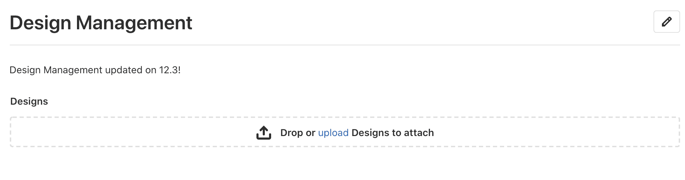](img/design_management_upload_v13.2.png)

在[GitLab Premium](https://about.gitlab.com/pricing/) 12.9 中[引入](https://gitlab.com/gitlab-org/gitlab/-/issues/34353) ，您可以将设计拖放到专用放置区域以上载它们.

[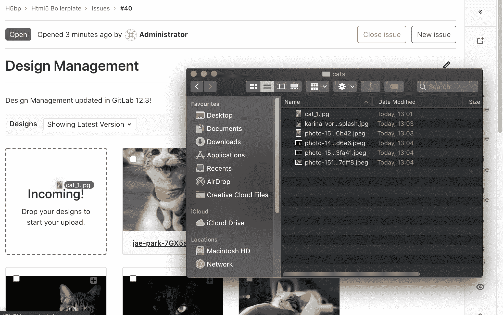](img/design_drag_and_drop_uploads_v13_2.png)

在 GitLab 12.10 中[引入](https://gitlab.com/gitlab-org/gitlab/-/issues/202634)后，您还可以从文件系统复制图像并将其作为新设计直接粘贴到 GitLab 的"设计"页面上.

在 macOS 上，您还可以截取屏幕截图，并同时单击`Control` + `Command` + `Shift` + `3` ，将其立即复制到剪贴板，然后将其粘贴为设计.

复制和粘贴有一些限制：

*   一次只能粘贴一张图像. 复制/粘贴多个文件时，只会上传第一个文件.
*   所有图像将在引擎盖下转换为`png`格式，因此当您要复制/粘贴`gif`文件时，会导致动画损坏.
*   如果要从剪贴板粘贴屏幕截图，它将被重命名为`design_<timestamp>.png`
*   Copy/pasting designs is not supported on Internet Explorer.

与现有的上载设计具有相同文件名的设计将创建该设计的新版本，并将替换以前的版本. 如果文件名相同，则在[GitLab Premium](https://about.gitlab.com/pricing/) 12.9 中[引入](https://gitlab.com/gitlab-org/gitlab/-/issues/34353)后，将设计放到现有的上载设计上也会创建一个新版本.

如果问题已移动或[讨论被锁定](../../discussions/#lock-discussions) ，则无法添加设计.

### Skipped designs[](#skipped-designs "Permalink")

与现有上传的设计具有相同文件名*且*其内容未更改的设计将被跳过. 这意味着将不会创建该设计的新版本. 跳过设计时，将通过关于"问题"的警告消息通知您.

## Viewing designs[](#viewing-designs "Permalink")

单击"设计管理"页面上的图像可以将其放大. 您可以通过单击右上角的导航按钮或使用`左` / `右`键盘按钮来浏览设计.

设计文件名右侧列出了有关设计的讨论数（如果有）. 单击此数字可以放大设计，就像单击设计上的其他任何位置一样. 添加或修改设计时，项目上会显示一个图标，以帮助总结版本之间的更改.

| Indicator | Example |
| --- | --- |
| Discussions | [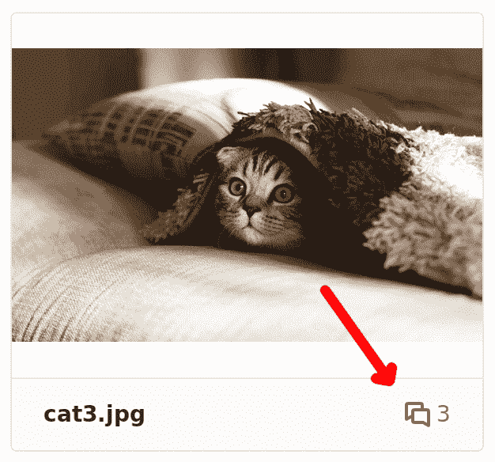](img/design_comments_v12_3.png) |
| 已修改（在所选版本中） | [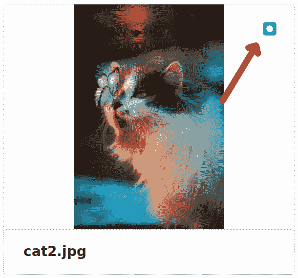](img/design_modified_v12_3.png) |
| 已添加（在所选版本中） | [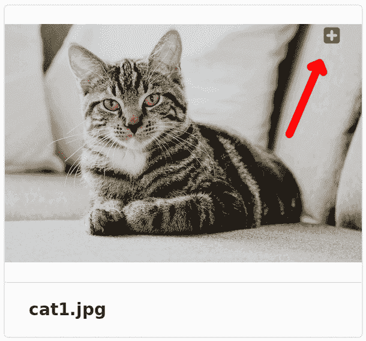](img/design_added_v12_3.png) |

### Exploring designs by zooming[](#exploring-designs-by-zooming "Permalink")

[Introduced](https://gitlab.com/gitlab-org/gitlab/-/issues/13217) in [GitLab Premium](https://about.gitlab.com/pricing/) 12.7.

通过放大和缩小图像，可以更详细地探索设计. 使用图像底部的`+`和`-`按钮控制缩放量. 缩放后，您仍然可以在图像上[开始新的讨论](#starting-discussions-on-designs) ，并查看任何现有的讨论. 在 GitLab 12.10 中[引入](https://gitlab.com/gitlab-org/gitlab/-/issues/197324) ，放大后，您可以在图像上单击并拖动以在图像中移动.

[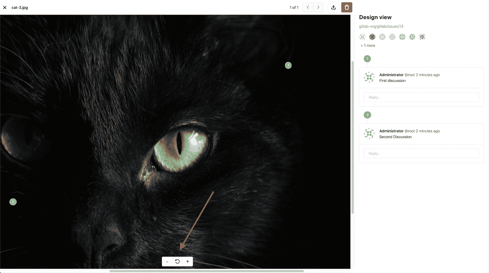](img/design_zooming_v12_7.png)

## Deleting designs[](#deleting-designs "Permalink")

[Introduced](https://gitlab.com/gitlab-org/gitlab/-/issues/11089) in [GitLab Premium](https://about.gitlab.com/pricing/) 12.4.

有两种删除设计的方法：分别手动删除它们，或选择其中几个立即删除，如下所示.

要删除单个设计，请单击它以将其放大查看，然后单击右上角的垃圾桶图标，并通过单击模式窗口上的" **删除"**按钮来确认删除：

[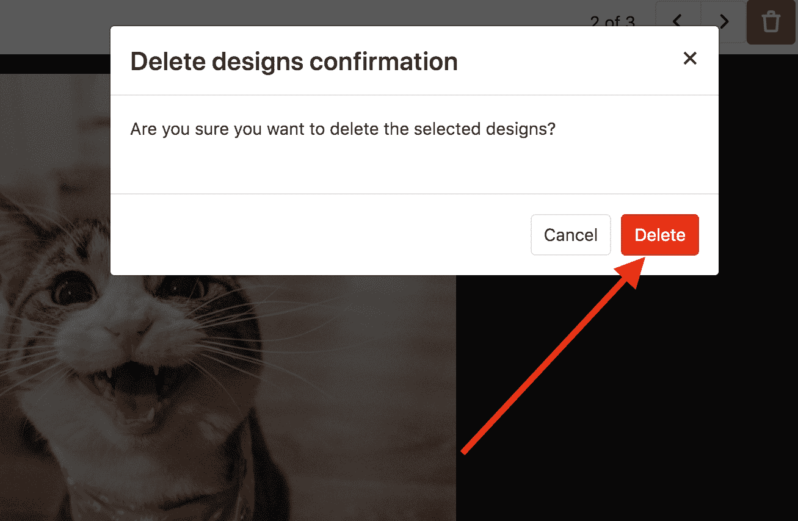](img/confirm_design_deletion_v12_4.png)

要一次删除多个设计，请在设计的列表视图上，首先选择要删除的设计：

[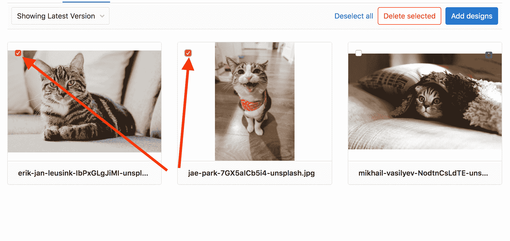](img/select_designs_v12_4.png)

选择后，单击" **删除所选的"**按钮以确认删除：

[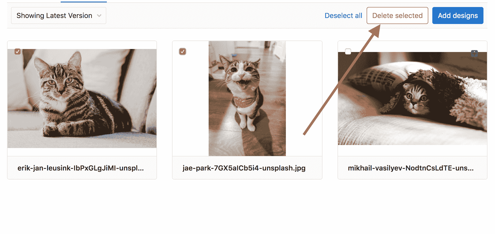](img/delete_multiple_designs_v12_4.png)

**注意：**只能删除设计的最新版本. 删除的设计不会永久丢失； 可以通过浏览以前的版本来查看它们.

## Starting discussions on designs[](#starting-discussions-on-designs "Permalink")

上传设计后，您可以通过单击您要关注讨论的确切位置上的图像来开始讨论. 将图钉添加到图像，以标识讨论的位置.

[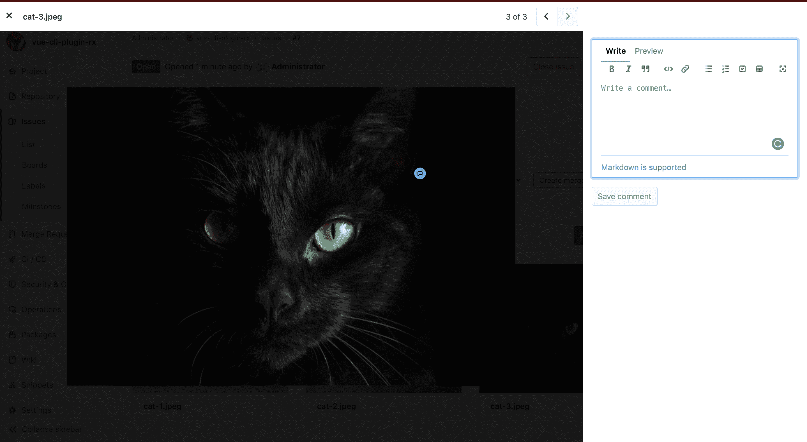](img/adding_note_to_design_1.png)

在[GitLab Premium](https://about.gitlab.com/pricing/) 12.8 中[引入](https://gitlab.com/gitlab-org/gitlab/-/issues/34353) ，您可以通过在图像周围拖动来调整销的位置. 当您的设计布局在各修订版之间进行了更改时，或者需要移动现有的引脚以在其位置添加新的引脚时，这很有用.

不同的讨论有不同的引脚号：

[](img/adding_note_to_design_2.png)

从 GitLab 12.5 起，新的讨论将输出到问题活动中，以便所有相关人员都可以参与讨论.

## Resolve Design threads[](#resolve-design-threads "Permalink")

在 GitLab 13.1 中[引入](https://gitlab.com/gitlab-org/gitlab/-/issues/13049) .

Discussion threads can be resolved on Designs.

有两种解决/取消解决设计线程的方法：

1.  您可以通过单击讨论的第一个评论的右上角的" **解决线程"**的复选标记图标，将一个线程标记为已解决或未解决：

[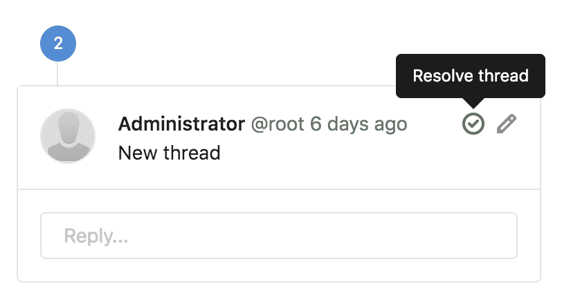](img/resolve_design-discussion_icon_v13_1.png)

1.  还可以通过使用复选框在其线程中解析或不解析设计线程. 回复评论时，您会看到一个复选框，您可以单击该复选框以在发布后解决或取消解决线程：

[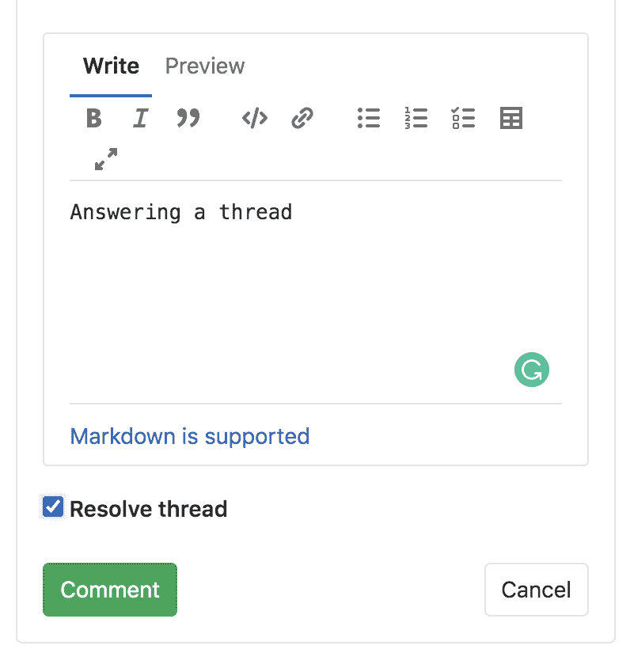](img/resolve_design-discussion_checkbox_v13_1.png)

请注意，您已解决的注释图钉将从设计中消失，以腾出空间进行新的讨论. 但是，如果您需要重新访问或找到已解决的讨论，则所有已解决的主题将在右侧栏底部的" **已解决的注释"**区域中可用.

## Referring to designs in Markdown[](#referring-to-designs-in-markdown "Permalink")

> *   [Introduced](https://gitlab.com/gitlab-org/gitlab/-/issues/217160) in **亚搏体育 app 13.1**.
> *   它部署在功能标志后面，默认情况下处于禁用状态.
> *   它在 GitLab.com 上被禁用.
> *   不建议将其用于生产.
> *   要在 GitLab 自管实例中使用它，请让 GitLab 管理员[启用它](#enable-or-disable-design-references-core-only) .

我们支持在[Markdown 中](../../markdown.html)引用设计，在整个应用程序中都可用，包括合并请求和问题描述，讨论和评论以及 Wiki 页面.

目前，支持完整的 URL 引用. 例如，如果我们使用以下内容引用设计：

```
See https://gitlab.com/your-group/your-project/-/issues/123/designs/homescreen.png 
```

这将呈现为：

> See [#123[homescreen.png]](https://gitlab.com/your-group/your-project/-/issues/123/designs/homescreen.png)

### Enable or disable design references[](#enable-or-disable-design-references-core-only "Permalink")

设计参考解析正在开发中，尚未准备好用于生产. 它部署在**默认情况下禁用**的功能标志的后面. [有权访问 GitLab Rails 控制台的 GitLab 管理员](../../../administration/feature_flags.html)可以为您的实例启用它.

要启用它：

```
Feature.enable(:design_management_reference_filter_gfm_pipeline) 
```

禁用它：

```
Feature.disable(:design_management_reference_filter_gfm_pipeline) 
```

## Design activity records[](#design-activity-records "Permalink")

版本历史

*   在 GitLab 13.1 中[引入](https://gitlab.com/gitlab-org/gitlab/-/issues/33051) .
*   在 GitLab 13.2 中[删除](https://gitlab.com/gitlab-org/gitlab/-/issues/225205)了[功能标志](https://gitlab.com/gitlab-org/gitlab/-/issues/225205) .

GitLab 跟踪设计上的用户活动事件（创建，删除和更新），并显示在[用户配置文件](../../profile/index.html#user-profile) ， [组](../../group/index.html#view-group-activity)和[项目](../index.html#project-activity)活动页面上.