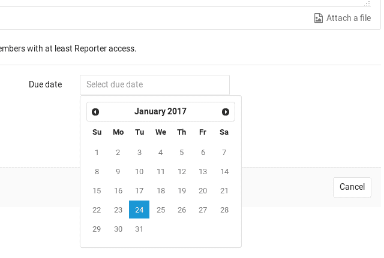
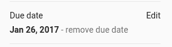
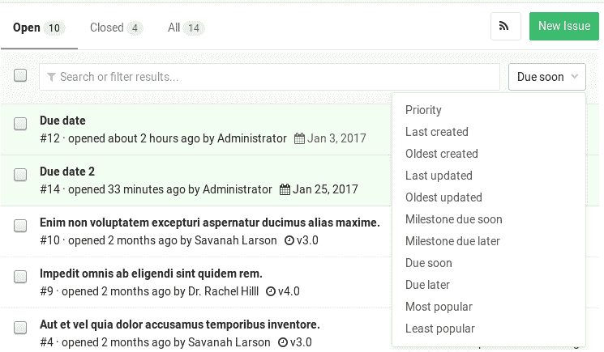
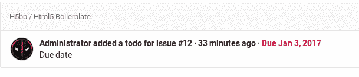

# Due dates

> 原文：[https://docs.gitlab.com/ee/user/project/issues/due_dates.html](https://docs.gitlab.com/ee/user/project/issues/due_dates.html)

*   [Setting a due date](#setting-a-due-date)
*   [Making use of due dates](#making-use-of-due-dates)

# Due dates

在 GitLab 8.7 中[引入](https://gitlab.com/gitlab-org/gitlab-foss/-/merge_requests/3614) .

请通读[GitLab 问题文档](index.html)以获取有关 GitLab 问题的概述.

Due dates can be used in issues to keep track of deadlines and make sure features are shipped on time. Users must have at least [Reporter permissions](../../permissions.html) to be able to edit them, but they can be seen by everybody with permission to view the issue.

## Setting a due date

创建或编辑问题时，您可以单击**截止日期**字段，然后出现一个日历来帮助您选择所需的日期. 要删除日期，请选择日期文本并将其删除. 该日期与服务器的时区有关，而不与设置到期日期的用户的时区有关.

您还可以通过问题侧边栏设置截止日期. 展开边栏，然后单击" **编辑"**以选择截止日期或删除现有的日期. 更改将立即保存.

设置截止日期的最后一种方法是直接在问题的描述或注释中使用[快速操作](../quick_actions.html) ：

*   `/due <date>` ：设置到期日. 有效的`<date>`示例包括`in 2 days` （ `this Friday`和`December 31st` .
*   `/remove_due_date` ：删除到期日.

## Making use of due dates

具有到期日期的问题可以在问题跟踪器中轻松查看，并在它们旁边显示一个日期. 日期过期的问题将图标和日期标记为红色. 您可以从右侧的下拉菜单中按`Due soon` `Due later`或`Due later` `Due soon`问题对问题进行排序.

截止日期也会出现在您的[待办事项清单中](../../todos.html) .

未解决问题的前一天，将向该问题的所有参与者发送电子邮件. 与截止日期一样，"截止日期之前的一天"由服务器的时区确定.

截止日期的问题也可以导出为 iCalendar 供稿. 提要的 URL 可以添加到日历应用程序中. 通过单击以下页面上的**订阅日历**按钮可以访问该提要：

*   在**分配的问题**页面上，该页面链接在 GitLab 标头的右侧
*   在" **项目问题"**页面上
*   在**组问题**页面上