# Issue Boards

> 原文：[https://docs.gitlab.com/ee/user/project/issue_board.html](https://docs.gitlab.com/ee/user/project/issue_board.html)

*   [Overview](#overview)
    *   [Advanced features of issue boards](#advanced-features-of-issue-boards)
*   [How it works](#how-it-works)
*   [Use cases](#use-cases)
    *   [Use cases for a single issue board](#use-cases-for-a-single-issue-board)
    *   [Use cases for multiple issue boards](#use-cases-for-multiple-issue-boards)
        *   [Scrum team](#scrum-team)
        *   [Organization of topics](#organization-of-topics)
        *   [Advanced team handover](#advanced-team-handover)
        *   [Quick assignments](#quick-assignments)
*   [Issue board terminology](#issue-board-terminology)
*   [Permissions](#permissions)
*   [GitLab Enterprise features for issue boards](#gitlab-enterprise-features-for-issue-boards)
    *   [Summary of features per tier](#summary-of-features-per-tier)
    *   [Multiple issue boards](#multiple-issue-boards)
        *   [Create an issue board](#create-an-issue-board)
        *   [Delete an issue board](#delete-an-issue-board)
    *   [Configurable issue boards](#configurable-issue-boards-starter)
    *   [Focus mode](#focus-mode)
    *   [Sum of issue weights](#sum-of-issue-weights-starter)
    *   [Group issue boards](#group-issue-boards-premium)
    *   [Assignee lists](#assignee-lists-premium)
    *   [Milestone lists](#milestone-lists-premium)
*   [Work In Progress limits](#work-in-progress-limits-starter)
*   [Blocked issues](#blocked-issues)
*   [Actions you can take on an issue board](#actions-you-can-take-on-an-issue-board)
    *   [First time using an issue board](#first-time-using-an-issue-board)
    *   [Create a new list](#create-a-new-list)
    *   [Delete a list](#delete-a-list)
    *   [Add issues to a list](#add-issues-to-a-list)
    *   [Remove an issue from a list](#remove-an-issue-from-a-list)
    *   [Filter issues](#filter-issues)
    *   [Create workflows](#create-workflows)
    *   [Drag issues between lists](#drag-issues-between-lists)
    *   [Multi-select issue cards](#multi-select-issue-cards)
    *   [Issue ordering in a list](#issue-ordering-in-a-list)
*   [Tips](#tips)

# Issue Boards

[Introduced](https://gitlab.com/gitlab-org/gitlab-foss/-/merge_requests/5554) in [GitLab 8.11](https://about.gitlab.com/releases/2016/08/22/gitlab-8-11-released/#issue-board).

## Overview

GitLab 发行板是一个软件项目管理工具，用于计划，组织和可视化功能或产品发布的工作流程. 它可以用作[看板](https://en.wikipedia.org/wiki/Kanban_(development))或[Scrum](https://en.wikipedia.org/wiki/Scrum_(software_development))板.

它结合了问题跟踪和项目管理功能，将所有内容保持在同一位置，因此您无需在不同平台之间切换即可组织工作流程.

使用问题板，您可以将问题组织在与其分配的标签相对应的列表中，从而在这些列表中可视化设计为卡片的问题.

您定义流程，GitLab 会为您进行组织. 您添加标签，然后创建相应的列表以提取现有问题. 准备就绪后，可以将发行卡从一个步骤拖放到下一个步骤.

[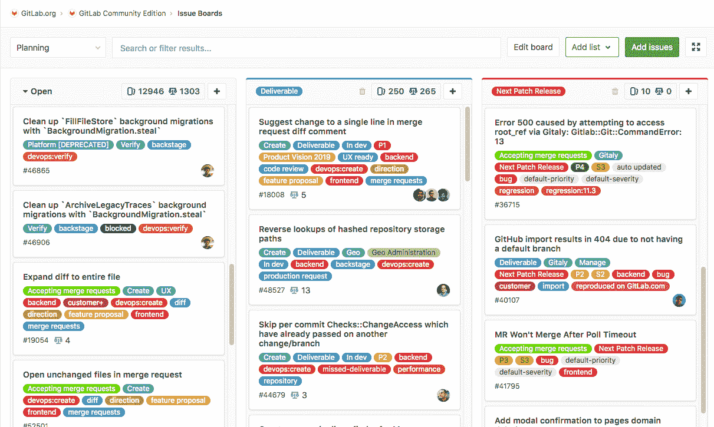](img/issue_boards_core.png)

观看发布板功能的[视频演示](https://youtu.be/UWsJ8tkHAa8) （在 GitLab 8.11 中引入-2016 年 8 月）.

### Advanced features of issue boards

*   每个项目创建多个发行板.
*   每个组创建多个发行板.
*   添加[受让人](#assignee-lists-premium)和[里程碑的](#milestone-lists-premium)列表.

检查[GitLab Enterprise 的](#gitlab-enterprise-features-for-issue-boards)所有[功能是否有发行板](#gitlab-enterprise-features-for-issue-boards) .

[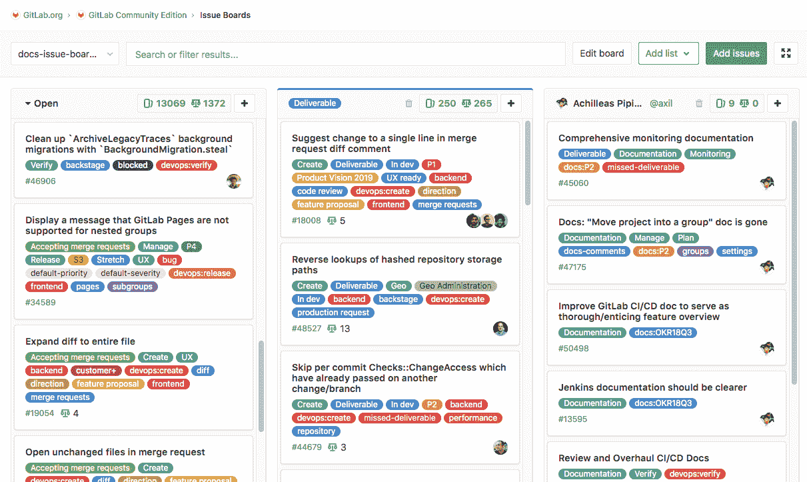](img/issue_boards_premium.png)

## How it works

发行板功能通过将 GitLab 现有的[发行跟踪功能](issues/index.html#issues-list)和[标签](labels.html)用作 Scrum 板的列表而建立.

使用问题板，您可以对问题有不同的看法，同时保持在问题跟踪器中看到的相同过滤和排序功能. 发行板基于其项目的标签结构，因此它使用相同的描述性标签来指示在板上的位置，从而在整个开发生命周期中保持一致性.

问题板向您显示团队正在处理的问题，分配给每个人的问题以及这些问题在工作流中的位置.

您可以从一个平台创建问题，托管代码，执行审阅，构建，测试和部署. 问题板可帮助您在 GitLab 中可视化和管理整个过程.

有了[多个发行板](#use-cases-for-multiple-issue-boards) ，您可以走得更远，因为您不仅可以从更广阔的角度组织自己和您的项目，每个项目使用一个发行板，还可以让您的团队成员通过在多个发行板中创建多个发行板来组织自己的工作流程.同一项目.

## Use cases

有多种方法可以使用针对自己喜欢的工作流程量身定制的 GitLab 发行板. 这是发行板的一些常见用例.

### Use cases for a single issue board

借助 GitLab 工作流程，您可以讨论问题中的提案，使用标签对其进行分类，然后在其中使用问题委员会进行组织并确定优先级.

例如，让我们考虑以下简化的开发工作流程：

1.  您有一个托管应用程序代码库的存储库，而您的团队则在积极贡献代码.
2.  您的**后端**团队将开始新的实施工作，收集反馈和批准，并将其传递给**前端**团队.
3.  前端完成后，新功能将部署到要测试的**登台**环境中.
4.  成功后，它将部署到**生产中** .

如果您具有标签" **后端** "，" **前端** "，" **暂存** "和" **生产** "，以及带有每个列表的发行板，则可以：

*   可视化从开发生命周期开始到部署到生产的整个实现流程.
*   通过垂直移动优先顺序排列列表中的问题.
*   在列表之间移动问题，以根据您设置的标签进行整理.
*   通过选择一个或多个现有问题，将多个问题添加到板中的列表中.

[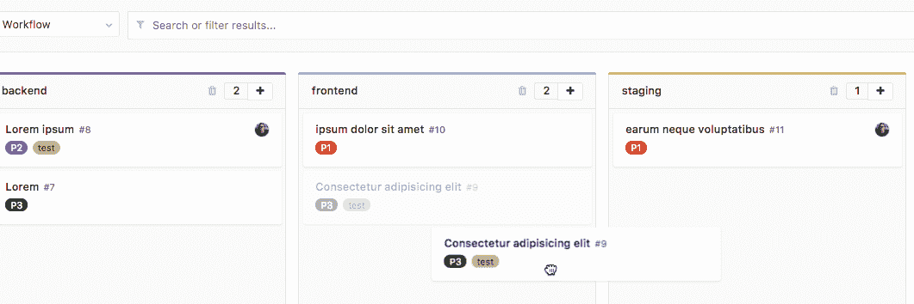](img/issue_board_move_issue_card_list.png)

### Use cases for multiple issue boards

借助[多个发行委员会](#multiple-issue-boards) ，每个团队可以拥有自己的董事会来单独组织其工作流程.

#### Scrum team

具有多个发行董事会，每个团队只有一个董事会. 现在，您可以在流程的每个部分中解决问题. 例如： **To Do** ， **Doing**和**Done** .

#### Organization of topics

创建列表以按主题对问题进行排序，并快速在主题或组之间（例如**UX** ， **Frontend**和**Backend**之间）进行更改. 更改反映在各个方面，因为更改列表会相应更新每个问题的标签.

#### Advanced team handover

例如，假设我们有一个 UX 小组，其问题板包含：

*   **去做**
*   **Doing**
*   **Frontend**

完成操作后，他们将卡移至**Frontend** . 前端团队的董事会看起来像：

*   **Frontend**
*   **Doing**
*   **Done**

由 UX 团队**整理的**卡片准备就绪后，会自动显示在" **前端"**列中.

**注意：**有关更广泛的用例，请参阅博客文章[GitLab 工作流程，概述](https://about.gitlab.com/blog/2016/10/25/gitlab-workflow-an-overview/#gitlab-workflow-use-case-scenario) . 对于一个真实的用例示例，您可以了解为什么[Codepen 决定采用发行版](https://about.gitlab.com/blog/2017/01/27/codepen-welcome-to-gitlab/#project-management-everything-in-one-place)来改善多个[发行版](https://about.gitlab.com/blog/2017/01/27/codepen-welcome-to-gitlab/#project-management-everything-in-one-place)的工作流程.

#### Quick assignments

为每个团队成员创建列表，然后将问题快速拖放到每个团队成员的列表中.

## Issue board terminology

**发行板**代表您的**发行**的独特视图. 它可以有多个列表，每个列表由卡代表的问题组成.

**列表**是问题板上的一列，显示与某些属性匹配的问题. 除了默认的"打开"和"关闭"列表外，每个其他列表还显示与您选择的标签，受让人或里程碑匹配的问题. 在每个列表的顶部，您可以看到属于该问题的数量. 列表类型包括：

*   **开** （默认）：不属于其他列表中的一个所有打开的问题. 始终显示为最左边的列表.
*   **已关闭** （默认）：所有已关闭的问题. 始终显示为最右边的列表.
*   **标签列表** ： **标签的**所有未解决问题.
*   [**受让人列表**](#assignee-lists-premium) ：分配给用户的所有未解决的问题.
*   [**里程碑列表**](#milestone-lists-premium) ： [**里程碑的**](#milestone-lists-premium)所有未解决的问题.

**卡**是列表中的一个框，它代表一个问题. 您可以将卡片从一个列表拖动到另一个列表，以更改其标签，受让人或里程碑. 卡上显示的信息包括：

*   发行标题
*   相关标签
*   发行数量
*   Assignee

## Permissions

具有[报告者和更高角色的](../permissions.html)用户可以使用发布板功能的所有功能来创建或删除列表，并将问题从一个列表拖动到另一个列表.

## GitLab Enterprise features for issue boards

GitLab 核心和 GitLab.com 免费层上均提供 GitLab 发行板，但某些高级功能仅在[更高层中提供](https://about.gitlab.com/pricing/) .

### Summary of features per tier

下表列出了在不同的[GitLab 层](https://about.gitlab.com/pricing/)中可用的不同发行板功能：

| Tier | 项目发行委员会的数量 | Number of Group issue boards | 可配置的发行板 | 受让人名单 |
| --- | --- | --- | --- | --- |
| 核心/免费 | Multiple | 1 | No | No |
| 入门/青铜 | Multiple | 1 | Yes | No |
| 高级/白银 | Multiple | Multiple | Yes | Yes |
| 终极/金 | Multiple | Multiple | Yes | Yes |

### Multiple issue boards

版本历史

*   在 GitLab 8.13 中[引入](https://about.gitlab.com/releases/2016/10/22/gitlab-8-13-released/) .
*   每个项目有多个发行板[移至](https://gitlab.com/gitlab-org/gitlab-foss/-/issues/53811) GitLab 12.1 中的[GitLab Core](https://about.gitlab.com/pricing/) .
*   每套[GitLab Premium 中](https://about.gitlab.com/pricing/)都有多个发行板.

多个发行板允许给定项目或组使用多个发行板. 对于具有多个团队的大型项目，或者在使用存储库托管多个产品代码的情况下，这非常有用.

使用菜单顶部的搜索框，您可以过滤列出的板.

当您有十个或更多的板可用时，菜单中还会显示" **最近"**部分，其中包含最后四个被访问板的快捷方式.

[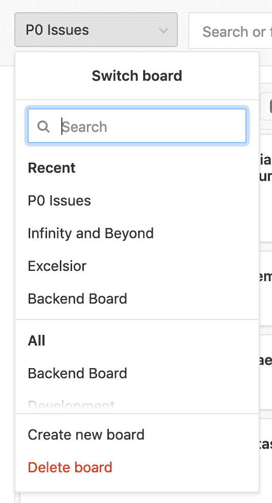](img/issue_boards_multiple.png)

当您在具有多个板的项目或组中重新访问问题板时，GitLab 会自动加载您上次访问的板.

#### Create an issue board

要创建新的发行板：

1.  单击"发行板"页面左上角的具有当前板名称的下拉菜单.
2.  Click **创建新板**.
3.  输入新板的名称并选择其范围：里程碑，标签，受让人或权重.

#### Delete an issue board

要删除当前活动的发行板：

1.  单击"发行板"页面左上角的具有当前板名称的下拉菜单.
2.  Click **删除板**.
3.  单击**删除**进行确认.

### Configurable issue boards

[Introduced](https://about.gitlab.com/releases/2017/11/22/gitlab-10-2-released/#issue-boards-configuration) in [GitLab Starter](https://about.gitlab.com/pricing/) 10.2.

发行板可以与 GitLab [里程碑](milestones/index.html#milestones) ， [标签](labels.html) ，受让人和权重关联，它们会根据这些字段自动过滤发行板问题. 这使您可以根据团队的需要创建独特的董事会.

[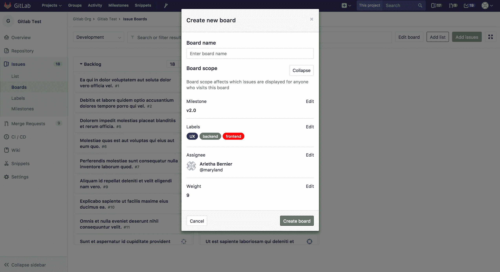](img/issue_board_creation.png)

您可以在创建木板时或单击"编辑木板"按钮来定义木板的范围. 将里程碑，受让人或权重分配给发行板后，您将不再能够在搜索栏中进行筛选. 为此，您需要从发行板上删除所需的范围（例如，里程碑，受让人或权重）.

[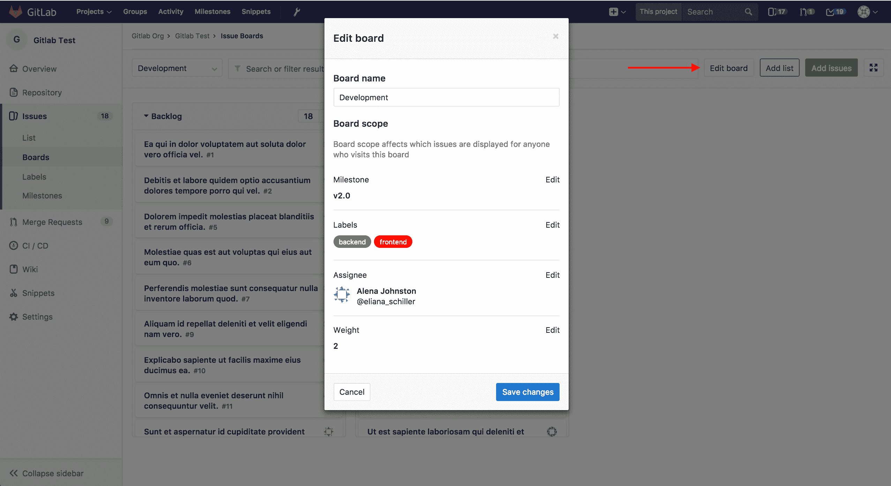](img/issue_board_edit_button.png)

如果您在木板中没有编辑权限，则仍然可以通过点击**查看范围**来**查看**配置.

[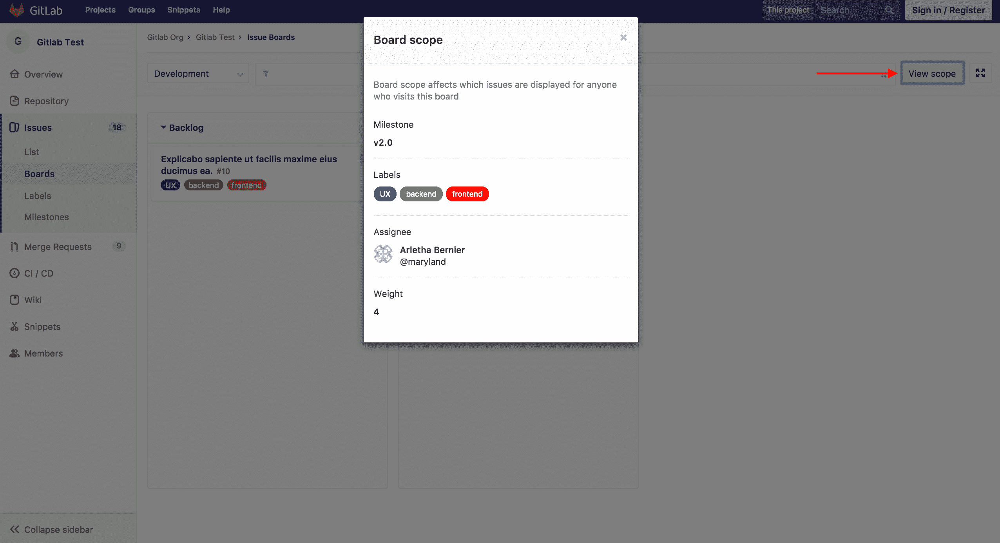](img/issue_board_view_scope.png)

### Focus mode

版本历史

*   在[GitLab Starter](https://about.gitlab.com/pricing/) 9.1 中[引入]((https://about.gitlab.com/releases/2017/04/22/gitlab-9-1-released/#issue-boards-focus-mode-ees-eep)) .
*   [移动](https://gitlab.com/gitlab-org/gitlab/-/merge_requests/28597)到 GitLab.com 的自由层在 12.10\.
*   在 13.0 中[移至](https://gitlab.com/gitlab-org/gitlab/-/issues/212331) GitLab Core.

单击右上角的按钮可打开和关闭聚焦模式. 在焦点模式下，导航 UI 处于隐藏状态，使您可以集中精力处理板上的问题.

[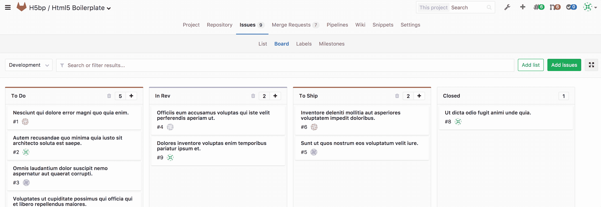](img/issue_board_focus_mode.gif)

* * *

### Sum of issue weights

每个列表的顶部指示属于该列表的问题的问题权重之和. 当使用板进行容量分配时，尤其是与[受让人列表](#assignee-lists-premium)结合使用时，这很有用.

[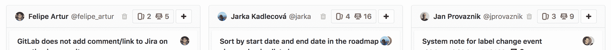](img/issue_board_summed_weights.png)

### Group issue boards

[Introduced](https://about.gitlab.com/releases/2017/09/22/gitlab-10-0-released/#group-issue-boards) in [GitLab Premium](https://about.gitlab.com/pricing/) 10.0.

可以在组导航级别上访问，组问题委员会提供与项目级委员会相同的功能，但是它可以显示该组及其子孙组中所有项目的问题. 同样，您只能按组标签过滤这些板. 通过边栏更新机制更新问题的里程碑和标签时，再次只有组级对象可用.

**注意：** [GitLab Premium](https://about.gitlab.com/pricing/) 10.0 最初[引入](https://about.gitlab.com/releases/2017/09/22/gitlab-10-0-released/#group-issue-boards)了多个组发行板，而 GitLab Core 10.6 提供了每个组一个组发行板.

[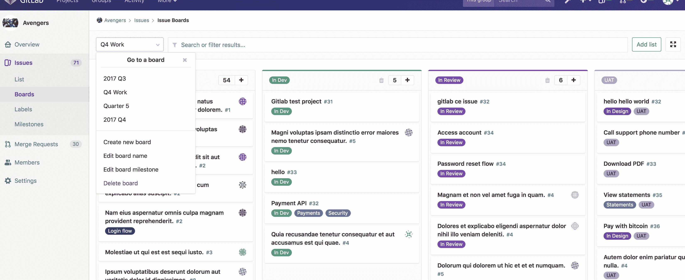](img/group_issue_board.png)

### Assignee lists

[Introduced](https://gitlab.com/gitlab-org/gitlab/-/issues/5784) in [GitLab Premium](https://about.gitlab.com/pricing/) 11.0.

就像在常规列表中显示带有选定标签的所有问题一样，您可以添加一个受让人列表，该列表显示分配给用户的所有问题. 您可以拥有一个包含标签列表和受让人列表的木板. 添加受让人列表：

1.  Click **新增清单**.
2.  选择" **受理人列表"**选项卡.
3.  搜索并单击要添加为受让人的用户.

现在已添加了受让人列表，您可以通过[将问题拖到](#drag-issues-between-lists)受让人列表中或从受让人列表中[拖动问题](#drag-issues-between-lists)来向该用户分配或取消分配问题. 要删除受让人列表（与标签列表一样），请单击垃圾桶图标.

[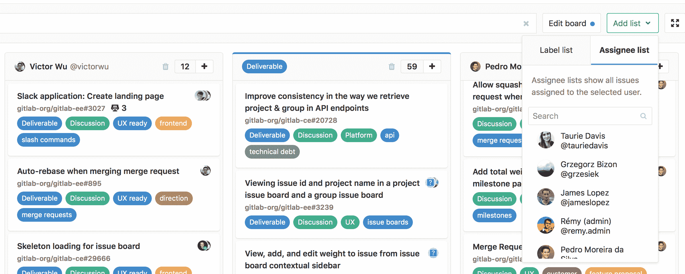](img/issue_board_assignee_lists.png)

### Milestone lists

[Introduced](https://gitlab.com/gitlab-org/gitlab/-/issues/6469) in [GitLab Premium](https://about.gitlab.com/pricing/) 11.2.

You’re also able to create lists of a milestone. These are lists that filter issues by the assigned milestone, giving you more freedom and visibility on the issue board. To add a milestone list:

1.  Click **新增清单**.
2.  选择" **里程碑"**选项卡.
3.  搜索并单击里程碑.

与受让人列表类似，您现在可以[将问题拖到](#drag-issues-between-lists)里程碑列表中或从里程碑列表中[拖动](#drag-issues-between-lists)出来，以操纵所拖动问题的里程碑. 与其他列表类型一样，单击垃圾桶图标以删除列表.

[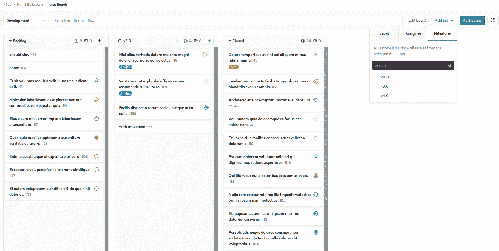](img/issue_board_milestone_lists.png)

## Work In Progress limits

在 GitLab 12.7 中[引入](https://gitlab.com/gitlab-org/gitlab/-/issues/11403)

您可以为每个问题列表设置进行中（WIP）限制. 设置限制后，列表的标题将显示列表中的问题数和问题的软限制.

Examples:

*   您有一个包含四个问题的列表，限制为五个，标题将显示**4/5** . 如果超出限制，则当前的问题数将显示为红色.
*   您有一个包含五个问题的列表，限制为五个. 当您将另一个问题移到该列表时，列表的标题显示**6/5** ，其中六个显示为红色.

设置列表的在制品限制：

1.  导航到您所属的项目或小组委员会.
2.  点击设置图标（ ）放在列表​​标题中.
3.  在"进行中的**工作限制"**旁边，单击" **编辑"** .
4.  输入最大问题数.
5.  按`Enter`保存.

## Blocked issues

在 GitLab 12.8 中[引入](https://gitlab.com/gitlab-org/gitlab/-/issues/34723) .

如果一个问题被另一个问题阻止，则其标题旁边会出现一个图标，指示其阻止状态.

[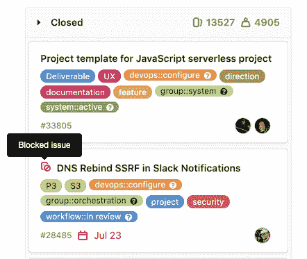](img/issue_boards_blocked_icon_v12_8.png)

## Actions you can take on an issue board

*   [Create a new list](#create-a-new-list).
*   [Delete an existing list](#delete-a-list).
*   [Add issues to a list](#add-issues-to-a-list).
*   [Remove an issue from a list](#remove-an-issue-from-a-list).
*   [筛选](#filter-issues)出现在问题板上的问题.
*   [Create workflows](#create-workflows).
*   [Drag issues between lists](#drag-issues-between-lists).
*   [Multi-select issue cards](#multi-select-issue-cards).
*   [Re-order issues in lists](#issue-ordering-in-a-list).
*   拖动列表并重新排序.
*   更改问题标签（通过在列表之间拖动问题）.
*   解决问题（将其拖动到" **完成"**列表中）.

如果您无法执行上述某些操作，请确保您具有正确的[权限](#permissions) .

### First time using an issue board

第一次打开问题面板时，会显示默认列表（" **打开"**和" **关闭"** ）以及欢迎消息，其中提供了两个选项. 您可以：

*   创建一组预定义的标签（默认情况下： **To Do**和**Doing** ），并在发行板上创建其对应的列表.
*   退出并使用自己的列表.

[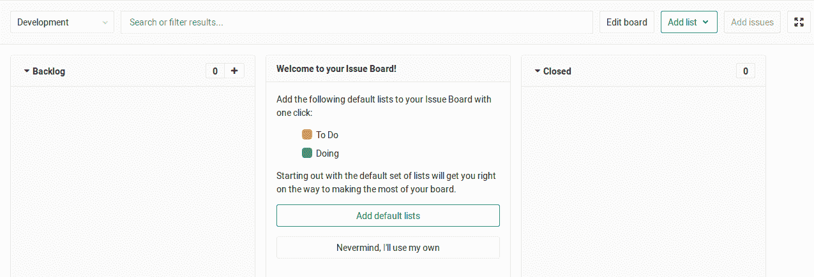](img/issue_board_welcome_message.png)

如果选择使用并创建预定义列表，则它们将显示为空，因为与它们关联的标签要到那时才存在，这意味着系统无法自动填充它们. 当然，如果预定义标签还不存在. 如果确实存在，则会创建该列表，并填充具有该标签的问题.

### Create a new list

通过单击发行板右上角的" **添加列表"**按钮来创建新列表.

[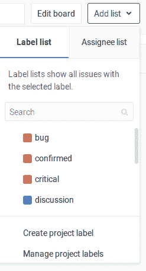](img/issue_board_add_list.png)

然后，选择标签或用户以从中创建列表. 新列表将被插入列表的末尾，在**完成**之前. 移动和重新排序列表就像拖动列表一样简单.

要为尚不存在的标签创建列表，请选择**创建新标签**来**创建标签** . 这将立即创建标签并将其添加到下拉列表中. 现在，您可以选择它来创建列表.

### Delete a list

要从发布板上删除列表，请使用列表标题中的小垃圾桶图标. 将出现一个确认对话框供您确认.

删除列表对问题和标签没有任何影响，只是删除了列表视图. 如果需要，您随时可以将其添加回去.

### Add issues to a list

您可以通过单击**问题**面板右上角的" **添加问题"**按钮将问题添加到列表中. 这将打开一个模式窗口，您可以在其中查看不属于任何列表的所有问题.

通过单击卡片选择一个或多个问题，然后单击" **添加问题"**以将其添加到所选列表中. 您可以通过按作者，受让人，里程碑和标签筛选来限制要添加到列表中的问题.

[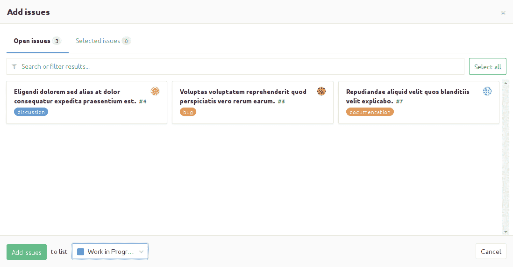](img/issue_boards_add_issues_modal.png)

### Remove an issue from a list

从列表中删除问题可以通过单击问题卡，然后单击侧边栏中的**从**面板中**删除**按钮来完成. 相应的标签被删除.

[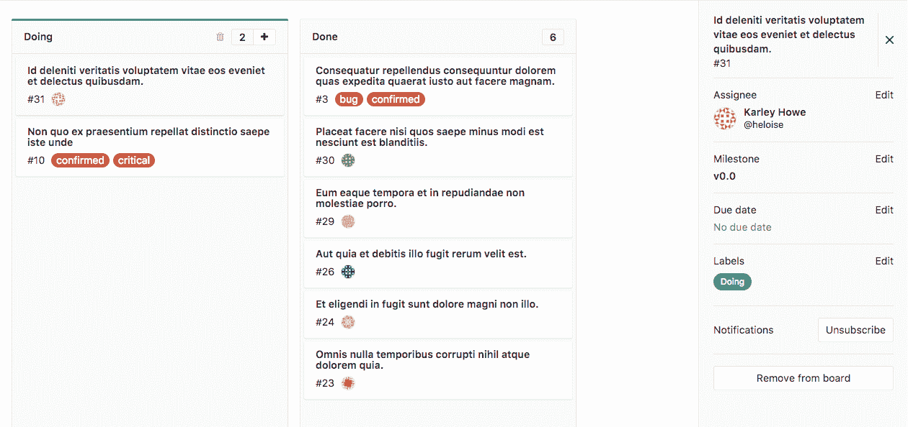](img/issue_boards_remove_issue.png)

### Filter issues

You should be able to use the filters on top of your issue board to show only the results you want. This is similar to the filtering used in the issue tracker since the metadata from the issues and labels are re-used in the issue board.

您可以按作者，受让人，里程碑和标签过滤.

### Create workflows

通过对列表重新排序，可以创建工作流程. 由于发行版中的列表基于标签，因此可以与您现有的发行版一起使用. 因此，如果您已经用"后端"和"前端"标记了事物，则问题在创建它们时会出现在列表中. 此外，这意味着您可以通过更改标签轻松地在列表之间移动某些内容.

使用发行板的典型工作流程为：

1.  您已经[创建了](labels.html#label-management)标签并对其进行了[优先排序，](labels.html#label-priority)以便可以轻松地对问题进行分类.
2.  您遇到很多问题（理想情况下是带有标签的）.
3.  您访问发行板并开始[创建列表](#create-a-new-list)以创建工作流程.
4.  您可以在列表中四处移动问题，以便您的团队知道谁应该处理什么问题.
5.  当一个团队的工作完成时，可以将问题拖到下一个列表中，以便其他人来接听.
6.  最终解决问题后，该问题将移至" **完成"**列表并自动关闭.

例如，您可以基于"前端"标签和"后端"标签创建一个列表. 设计师可以通过将问题添加到"前端"列表来开始处理问题. 这样，每个人都知道设计师现在正在研究此问题. 然后，一旦完成，所有要做的就是将其拖到下一个列表"后端"，后端开发人员最终可以在该列表中进行选择. 完成后，将其移至**完成** ，以解决问题.

访问问题时可以清楚地看到此过程，因为每次移动到另一个列表时，标签都会更改，并且不会记录系统.

[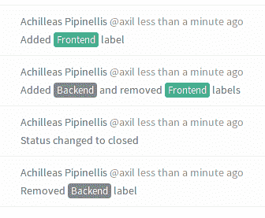](img/issue_board_system_notes.png)

### Drag issues between lists

在列表之间拖动问题时，根据源列表和目标列表，会发生不同的行为.

|   | 打开 | 要关闭 | 标记`B`列表 | 分配受让人`Bob`清单 |
| --- | --- | --- | --- | --- |
| 从开放 | - | 问题已结案 | `B` added | `Bob` assigned |
| 从关闭 | 问题重新开放 | - | 问题重新开放
`B`添加 | 问题重新开放
`Bob`分配 |
| 从标签`A`列表 | `A` removed | 问题已结案 | `A` removed
`B` added | `Bob` assigned |
| 从受让人`Alice`名单 | `Alice` unassigned | 问题已结案 | `B` added | `Alice` unassigned
`Bob` assigned |

### Multi-select issue cards

在 GitLab 12.4 中[引入](https://gitlab.com/gitlab-org/gitlab/-/issues/18954) .

您可以选择多个发行卡，然后将组拖动到列表中的另一个位置或另一个列表中. 这样可以更快地一次重新排序许多问题.

要选择并移动多张卡片：

1.  使用`Ctrl`选择每个卡+ `Click`在 Windows 或 Linux，或者`Cmd 的` + `Click`在 MacOS.
2.  将所选卡中的一张拖到另一个位置或列表，所有所选卡都将移动.

[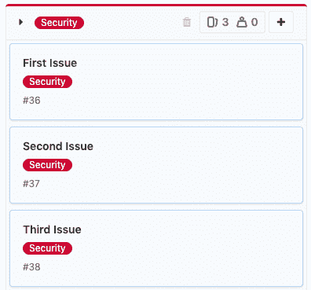](img/issue_boards_multi_select_v12_4.png)

### Issue ordering in a list

访问董事会时，问题在任何列表中都显示为有序. 您可以通过拖放问题来更改顺序. 更改后的订单将保存到系统中，以便以后访问同一板的任何人都可以看到重新排序，但有一些例外.

给定问题首次出现在任何面板中（即，用户首次加载包含该问题的面板）时，将根据[优先级顺序](labels.html#label-priority)对该列表中的其他问题进行[排序](labels.html#label-priority) .

此时，系统会为该问题分配一个相对顺序值，该值代表其相对于列表中其他问题的相对顺序. 每当您拖放该问题的重新排序时，其相对订单值都会相应更改.

同样，当问题由用户加载时，在任何板上出现的任何时间，都会使用更新的相对订单值进行订购. （这是第一次出现从上述优先顺序中提取问题的问题.）这意味着，如果您的 GitLab 实例内给定板上的任何用户将问题`A`拖放到问题`B`上方的顺序进行了重新排序，每当随后将这两个问题加载到同一实例中的任何板（例如，可以是不同的项目板或不同的组板）中时，都将维持订购.

此顺序还会影响[问题列表](issues/sorting_issue_lists.html) . 在发行板上更改订单会更改发行列表中的顺序，反之亦然.

## Tips

需要记住的几件事：

*   在列表之间移动问题会从其来源列表中删除标签，并从其去往列表中添加标签.
*   如果一个问题有多个标签，则它可以存在于多个列表中.
*   如果标记了问题，则会自动用问题填充列表.
*   单击卡片内的问题标题，将您转到该问题.
*   单击卡内的标签可快速筛选整个问题板，并仅显示所有带有该标签的列表中的问题.
*   出于性能和可见性的原因，每个列表默认显示前 20 个问题. 如果问题超过 20 个，请开始向下滚动，然后出现下 20 个问题.