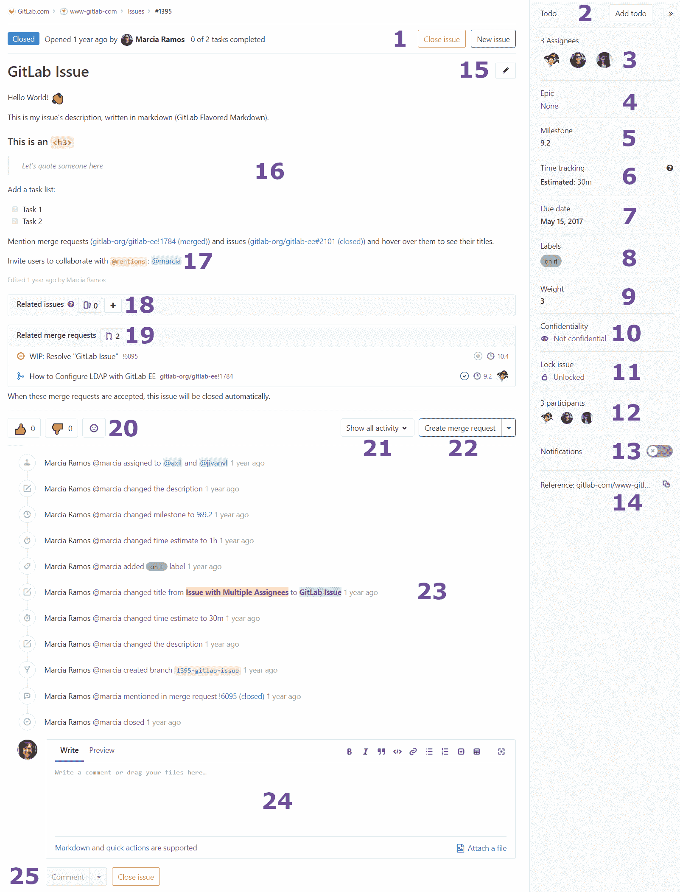
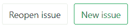
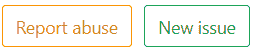
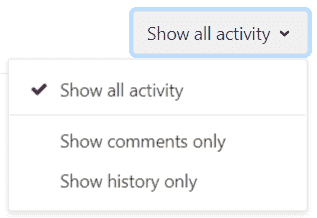
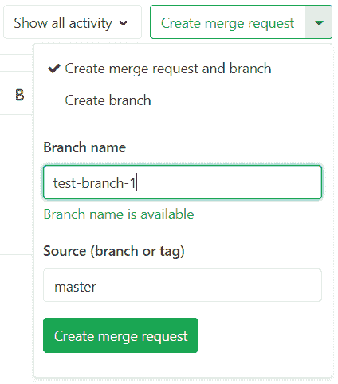
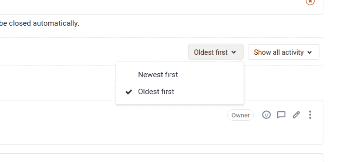
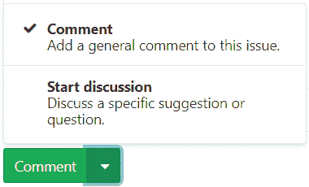

# Issue Data and Actions

> 原文：[https://docs.gitlab.com/ee/user/project/issues/issue_data_and_actions.html](https://docs.gitlab.com/ee/user/project/issues/issue_data_and_actions.html)

*   [Parts of an Issue](#parts-of-an-issue)
    *   [New Issue, close issue (reopen issue, report issue)](#new-issue-close-issue-reopen-issue-report-issue)
    *   [To Do](#to-do)
    *   [Assignee](#assignee)
        *   [Multiple Assignees](#multiple-assignees-starter)
    *   [Epic](#epic-premium)
    *   [Milestone](#milestone)
    *   [Time tracking](#time-tracking)
    *   [Due date](#due-date)
    *   [Labels](#labels)
    *   [Weight](#weight-starter)
    *   [Confidentiality](#confidentiality)
    *   [Lock issue](#lock-issue)
    *   [Participants](#participants)
    *   [Notifications](#notifications)
    *   [Reference](#reference)
    *   [Edit](#edit)
    *   [Description](#description)
    *   [Mentions](#mentions)
    *   [Related Issues](#related-issues-starter)
    *   [Related Merge Requests](#related-merge-requests)
    *   [Award emoji](#award-emoji)
    *   [Show all activity](#show-all-activity)
    *   [Create Merge Request](#create-merge-request)
    *   [Issue history](#issue-history)
        *   [Activity sort order](#activity-sort-order)
    *   [Comments](#comments)
    *   [Submit comment, start a thread, or comment and close](#submit-comment-start-a-thread-or-comment-and-close)
    *   [Zoom meetings](#zoom-meetings)
    *   [Publish an issue](#publish-an-issue-ultimate)

# Issue Data and Actions

请通读[GitLab 问题文档](index.html)以获取有关 GitLab 问题的概述.

## Parts of an Issue

下图说明了问题的外观. 请注意，根据使用的 GitLab 版本和查看问题的用户权限，某些部分看起来可能会略有不同或不存在.

您可以在一个屏幕上找到该问题的所有信息.

*   **1.** [New Issue, close issue (reopen issue, report issue)](#new-issue-close-issue-reopen-issue-report-issue)
*   **2.** [To Do](#to-do)
*   **3.** [Assignee](#assignee)
    *   **3.1.** [Multiple Assignees](#multiple-assignees-starter)
*   **4.** [Epic](#epic-premium)
*   **5.** [Milestone](#milestone)
*   **6.** [Time tracking](#time-tracking)
*   **7.** [Due date](#due-date)
*   **8.** [Labels](#labels)
*   **9.** [Weight](#weight-starter)
*   **10.** [Confidentiality](#confidentiality)
*   **11.** [Lock issue](#lock-issue)
*   **12.** [Participants](#participants)
*   **13.** [Notifications](#notifications)
*   **14.** [Reference](#reference)
*   **15.** [Edit](#edit)
*   **16.** [Description](#description)
*   **17.** [Mentions](#mentions)
*   **18.** [Related Issues](#related-issues-starter)
*   **19.** [Related Merge Requests](#related-merge-requests)
*   **20.** [Award emoji](#award-emoji)
*   **21.** [Show all activity](#show-all-activity)
*   **22.** [Create Merge Request](#create-merge-request)
*   **23.** [Issue history](#issue-history)
    *   [Activity sort order](#activity-sort-order)
*   **24.** [Comments](#comments)
*   **25.** [Submit comment, start a thread, or comment and close](#submit-comment-start-a-thread-or-comment-and-close)
*   **26.** [Zoom meetings](#zoom-meetings)

问题从状态（打开或关闭）开始，然后是作者，并包括许多其他功能，在上图中编号，以逐一解释其含义.

当问题由其他用户更改时，问题屏幕的许多元素都会自动刷新，例如标题和说明. 注释和系统注释也会根据各种操作和内容更新自动更新.

### New Issue, close issue (reopen issue, report issue)

单击" **新问题"**将打开一个新窗口，以在同一项目中创建一个新问题. 单击**关闭问题**将关闭此问题，但不会被删除. 如果问题已经关闭，您仍然可以访问它，并且按钮将显示**Reopen issue** ，如下所示，您可以单击以重新打开问题. 重新开放的问题与其他任何问题都没有不同.

如果您无权修改问题，则" **关闭问题"**按钮将替换为" **报告问题"** ，您可以单击该按钮以[提交](../../abuse_reports.html)有关该问题[的滥用情况报告](../../abuse_reports.html) . 如果您有权修改问题，但仅在关闭问题后，它也会显示.

### To Do

您可以在[GitLab 任务列表中](../../todos.html)添加问题或从中删除问题.

执行此操作的按钮具有不同的标签，具体取决于问题是否已在"任务列表"中. 如果问题是：

*   已在您的待办事项清单上：该按钮标有" **标记为已完成"** . 单击按钮以从您的任务列表中删除该问题.
*   不在您的待办事项清单上：该按钮标有**添加待办事项** . 单击按钮将问题添加到您的"任务列表"中.

### Assignee

可以将问题分配给：

*   Yourself.
*   另一个人.
*   [Many people](#multiple-assignees-starter).

可以根据需要频繁更改受让人. 想法是，受让人应对该问题负责，直到将其重新分配给其他人以解决该问题为止. 分配给某人后，它将显示在其分配的问题列表中.

**提示：**如果用户不是该项目的成员，则只有他们自己创建问题后才能将其分配给他们.

#### Multiple Assignees

通常，多个人会共同处理同一问题，而在拥有问题共享所有权的大型团队中，跟踪这些问题尤其困难.

在[GitLab Starter 中](https://about.gitlab.com/pricing/) ，您可以[将多个人分配](multiple_assignees_for_issues.html)给一个问题.

### Epic

您可以将问题分配给[Epic](../../group/epics/index.html) ，从而可以更好地管理相关问题组.

### Milestone

选择一个[里程碑](../milestones/index.html) ，将问题归因于此.

### Time tracking

使用[GitLab 快速行动](../quick_actions.html)来[跟踪估计和花费在问题上的时间](../time_tracking.html) . 您可以添加解决问题[所需时间](../time_tracking.html#estimates)的[估计，](../time_tracking.html#estimates)还可以添加解决问题[所花费的时间](../time_tracking.html#time-spent) .

### Due date

当您的工作时间很紧时，重要的是要有一种方法来为实现和解决问题设置截止日期. 这可以在[截止日期](due_dates.html)元素中完成. 截止日期可以根据需要进行多次更改.

### Labels

通过给它们加上[标签](../labels.html)来对问题进行分类. 它们有助于组织工作流程，并使您能够与[GitLab 发行委员会合作](index.html#issue-boards) .

还可以为组标签分配问题，该组标签允许您对同一组内的所有项目使用相同的标签. 它们的工作原理完全相同，但可立即用于该组中的所有项目.

**提示：**如果标签尚不存在，可以单击**编辑** ，它会打开一个下拉菜单，从中可以选择**创建新标签** .

### Weight

为问题[分配权重](issue_weight.html) . 使用较大的值表示完成此问题需要付出更多的努力. 仅允许正值或零.

### Confidentiality

您可以[将问题设置为机密](confidential_issues.html) . 设置后，未经授权的用户将无法访问该问题，也不会在项目问题委员会或问题列表中看到该问题.

### Lock issue

您可以[锁定问题中的线程](../../discussions/index.html#lock-discussions) ，以防止添加更多评论.

### Participants

涉及该问题的所有用户. 他们要么参与了该[线程](../../discussions/index.html) ，要么在描述或线程中被提及.

### Notifications

单击该图标以启用/禁用该问题的[通知](../../profile/notifications.html#issue--epics--merge-request-events) . 如果您以任何方式参与该问题，它将自动启用.

*   **Enable**: If you are not a participant in the discussion on that issue, but want to receive notifications on each update, subscribe to it.
*   **禁用** ：如果您正在接收有关该问题的更新通知，但不再希望接收它们，请取消订阅.

### Reference

*   快速"复制"按钮，这个问题的参考，它看起来像`foo/bar#xxx` ，其中`foo`是`username`或`groupname` ， `bar`是`project-name` ，并且`xxx`是发行数量.

### Edit

单击此图标可打开要编辑的问题，您将有权访问与创建问题时相同的所有字段. 如果用户没有编辑问题的权限，则不会显示此图标.

### Description

纯文本标题和问题描述位于问题页面的顶部中心. 该描述完全支持[GitLab 风味 Markdown](../../markdown.html#gitlab-flavored-markdown-gfm) ，允许许多格式选项.

> [自 GitLab 12.6 起](https://gitlab.com/gitlab-org/gitlab/-/issues/10103) ， [问题历史记录](#issue-history)中列出了对[问题](#issue-history)描述的更改.

### Mentions

您可以使用`@username`或`@groupname`提及您的 GitLab 实例中存在的用户或组，除非他们在配置文件设置中禁用了所有通知，否则它们将通过待办事项和电子邮件得到通知. 这是在[通知设置中](../../profile/notifications.html)控制的.

自己的提及（当前登录的用户）将以不同的颜色突出显示，使您可以轻松查看涉及到的评论，帮助您快速关注它们.

**提示：**避免在问题中提及`@all`并合并请求，因为它会向该项目组的所有成员发送电子邮件通知，这可以解释为垃圾邮件.

### Related Issues

这里列出了被称为[相关问题的问题](related_issues.html) . 您也可以单击`+`添加更多相关问题.

### Related Merge Requests

该问题的描述或问题线程中提到的[合并请求](crosslinking_issues.html#from-merge-requests)在此处列为[相关合并请求](crosslinking_issues.html#from-merge-requests) . 另外，如果当前问题在另一个合并请求中被提及是相关的，则该合并请求将在此处列出.

### Award emoji

您可以为该问题授予表情符号. 有" thumbs_up"和" thumbs_down"的快捷方式，或者您可以单击浅灰色的" face"从可用的[GitLab 风味 Markdown Emoji](../../markdown.html#emoji)下拉列表中选择其他反应.

**提示：在主题中**张贴" +1"作为评论会对该问题的所有订阅参与者造成垃圾邮件，会使主题混乱，因此不建议这样做. 授予表情符号是一种让他们知道您的反应而不会向其发送垃圾邮件的方法.

### Show all activity

您可以通过单击**显示所有活动**并选择以下任一内容来过滤问题历史记录中**显示的内容** ：

*   **仅显示评论** ，仅显示主题并隐藏问题的更新.
*   **仅显示历史记录** ，它隐藏线程并且仅显示更新.

Also:

*   您可以使用`@username`或`@groupname`提及您的 GitLab 实例中存在的用户或组，除非他们已[禁用](#notifications)其配置文件设置中的[所有通知](#notifications) ，否则它们将通过待办事项和电子邮件得到[通知](#notifications) .
*   自己的提及（当前登录的用户）将以不同的颜色突出显示，使您可以轻松查看涉及到的评论，帮助您快速关注它们.

### Create Merge Request

在一个动作中创建一个新的分支和[**草稿**合并请求](../merge_requests/work_in_progress_merge_requests.html) . 默认情况下，该分支将被命名为`issuenumber-title` ，但是您可以选择任何名称，并且 GitLab 会验证该分支尚未被使用. 合并请求将自动继承问题的里程碑和标签，并设置为在合并时关闭问题.

（可选）您可以选择仅创建一个[新分支](../repository/web_editor.html#create-a-new-branch-from-an-issue) ，以该问题命名.

### Issue history

All comments and updates to the issue are tracked and listed here, but this can be filtered, as shown above.

#### Activity sort order

在 GitLab 12.10 中[引入](https://gitlab.com/gitlab-org/gitlab/-/issues/14588) .

您可以颠倒默认顺序，并与按顶部的最新项目排序的活动供稿进行交互. 您的首选项通过本地存储保存，并自动应用于您查看的每个问题.

要更改活动排序顺序，请单击**最旧的第一个**下拉菜单，然后选择最旧或最新的项目以首先显示.

### Comments

通过在其主题中发布评论来协作解决问题. 该文本字段还完全支持[GitLab 风味 Markdown](../../markdown.html#gitlab-flavored-markdown-gfm) .

### Submit comment, start a thread, or comment and close

撰写评论后，您可以：

*   单击**评论** ，您的评论将被发布.
*   选择从下拉列表中**启动线程** ，并启动一个新[的线程](../../discussions/index.html#threaded-discussions)这个问题的主线程中讨论具体的点. 这邀请其他参与者直接回复您的主题，并将相关评论分组在一起.

您也可以从此处关闭问题，因此无需滚动到问题页面的顶部.

### Zoom meetings

在 GitLab 12.3 中[引入](https://gitlab.com/gitlab-org/gitlab/-/issues/31103) .

您可以使用`/zoom`和`/remove_zoom` [快速动作](../quick_actions.html)将[GitLab](../../markdown.html#gitlab-flavored-markdown-gfm) `/remove_zoom` [Markdown](../../markdown.html#gitlab-flavored-markdown-gfm)作为附件添加和删除 Zoom 会议.

附加问题的[Zoom](https://zoom.us)呼叫会导致问题顶部顶部标题下方的" **加入 Zoom"会议**按钮.

详细了解如何[添加或删除缩放会议](associate_zoom_meeting.html) .

### Publish an issue

[Introduced](https://gitlab.com/gitlab-org/gitlab/-/merge_requests/30906) in [GitLab Ultimate](https://about.gitlab.com/pricing/) 13.1.

If a status page application is associated with the project, you can use the `/publish` [quick action](../quick_actions.html) to publish the issue. Refer to [GitLab Status Page](../status_page/index.html) for more information.