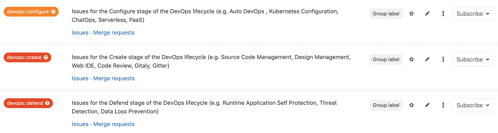
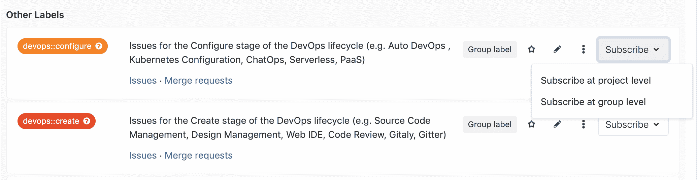
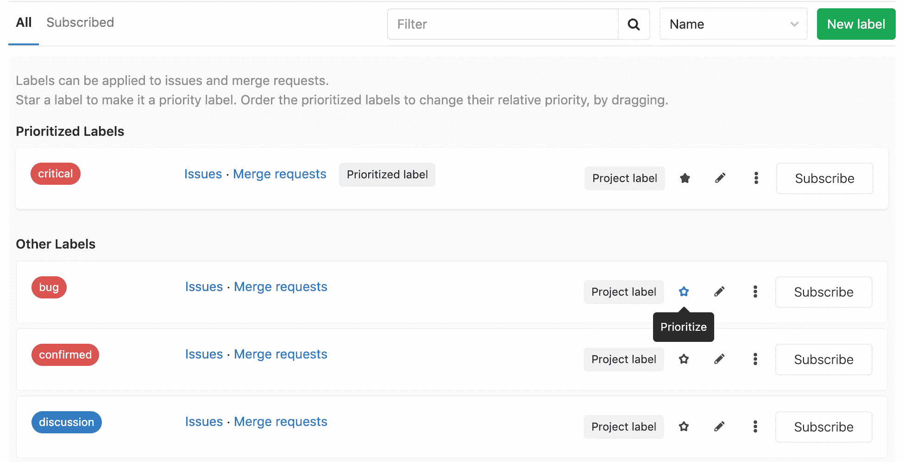
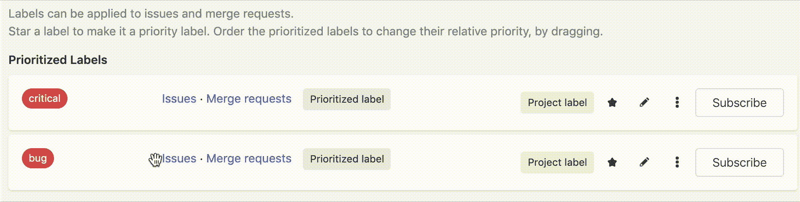
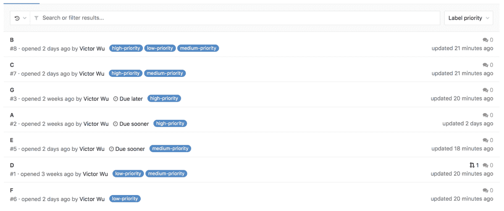
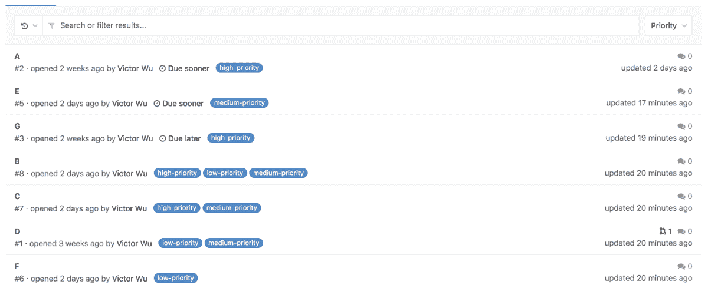

# Labels

> 原文：[https://docs.gitlab.com/ee/user/project/labels.html](https://docs.gitlab.com/ee/user/project/labels.html)

*   [Overview](#overview)
*   [Project labels and group labels](#project-labels-and-group-labels)
*   [Assign and unassign labels](#assign-and-unassign-labels)
*   [Label management](#label-management)
    *   [Project labels](#project-labels)
        *   [Promote a project label to a group label](#promote-a-project-label-to-a-group-label)
    *   [Group labels](#group-labels)
        *   [Create group labels from epics](#create-group-labels-from-epics-ultimate)
    *   [Generate default labels](#generate-default-labels)
*   [Scoped labels](#scoped-labels-premium)
    *   [Workflows with scoped labels](#workflows-with-scoped-labels)
    *   [Scoped labels with nested scopes](#scoped-labels-with-nested-scopes)
*   [Subscribing to labels](#subscribing-to-labels)
*   [Label priority](#label-priority)
*   [Troubleshooting](#troubleshooting)
    *   [Some label titles end with `_duplicate<number>`](#some-label-titles-end-with-_duplicatenumber)

# Labels

## Overview

随着您在 GitLab 中问题，合并请求和史诗数量的增长，跟踪这些项目变得越来越困难. 尤其是随着您的组织从只有几个人发展到成百上千. 标签就是在这里出现的.它们可以帮助您组织和标记工作，以便您可以跟踪和找到您感兴趣的工作项.

标签是[发行板](issue_board.html)的关键部分. 使用标签，您可以：

*   使用颜色和描述性标题（例如`bug` ， `feature request`或`docs`对史诗，问题和合并请求进行分类.
*   动态过滤和管理史诗，问题和合并请求.
*   [搜索问题列表，合并请求和史诗](../search/index.html#issues-and-merge-requests)以及[问题面板](../search/index.html#issue-boards) .

## Project labels and group labels

GitLab 中有两种类型的标签：

*   **项目标签**只能分配给该项目，并且只能合并该项目中的请求.
*   可以将**组标签**分配给选定组或其子组中的任何项目中的问题并合并请求.
    *   也可以将它们分配给所选组或其子组中的史诗.

## Assign and unassign labels

每个问题，合并请求和史诗都可以分配任意数量的标签. 标签在右侧栏中管理，您可以在其中根据需要分配或取消分配标签.

要将标签分配给问题，请合并请求或史诗：

1.  在侧边栏的标签部分，点击**编辑** ，然后：
    *   在列表中，单击所需的标签. 每个标签都带有复选标记.
    *   通过输入搜索查询并单击搜索来查找标签（ ），然后点击它们. 您可以反复搜索并添加更多标签.
2.  单击**X**或标签部分之外的任何位置，然后将应用标签.

您也可以使用[`/assign @username`快速操作](quick_actions.html)来分配标签.

## Label management

具有 Reporter 或更高[权限级别](../permissions.html)的用户可以创建和编辑标签.

### Project labels

通过转到项目并单击**问题>标签**来查看项目标签列表. 该列表包括在项目级别定义的所有标签，以及从直接父组继承的所有标签. 您可以通过在顶部输入搜索查询并点击搜索（ ）.

要创建一个新的项目标签：

1.  导航到项目中的" **问题">"标签** ".
2.  单击**新建标签**按钮.
    *   输入标题.
    *   （可选）输入描述.
    *   （可选）通过单击可用颜色来选择背景颜色，或输入特定颜色的十六进制颜色值.
3.  单击**创建标签**以创建标签.

您也可以从发布或合并请求中创建新的项目标签. 在问题或合并请求的右侧栏中的标签部分：

1.  Click **Edit**.
2.  Click **创建项目标签**.
    *   填写名称字段. 请注意，如果以此方式创建标签，则无法指定描述. 您可以稍后通过编辑标签来添加描述（请参见下文）.
    *   （可选）通过单击可用颜色来选择颜色，或输入特定颜色的十六进制颜色值.
3.  Click **Create**.

创建标签后，您可以通过点击铅笔（ ），或通过单击三个点（ ）旁边的" **订阅"**按钮，然后选择" **删除"** .

#### Promote a project label to a group label

如果您以前创建了项目标签，现在想使其可用于同一组中的其他项目，则可以将其升级为组标签.

如果同一组中的其他项目具有相同标题的标签，则它们将全部与新的组标签合并. 如果存在具有相同标题的组标签，则它也会被合并.

所有发行，合并请求，发行板列表，发行板过滤器以及带有旧标签的标签订阅都将分配给新的组标签.

警告： **警告：**提升标签是永久性的操作，不能撤消.

要将项目标签提升为组标签：

1.  导航到项目中的" **问题">"标签** ".
2.  单击三个点（ ）旁边的**订阅**按钮，然后选择**升级为组标签** .

### Group labels

通过转到组并单击**问题>标签**来查看组标签列表. 该列表包括仅在组级别定义的所有标签. 它没有列出项目中定义的任何标签. 您可以通过在顶部输入搜索查询并点击搜索（ ）.

要创建**组标签** ，请导航到**组中的"** **问题">"标签"** ，并按照与[创建项目标签](#project-labels)相同的过程进行操作.

#### Create group labels from epics

您可以从 Epic 侧边栏创建组标签. 您创建的标签将属于该史诗所属的直接组. 该过程与根据[发布或合并请求](#project-labels)创建[项目标签](#project-labels)的过程相同.

### Generate default labels

如果项目或组没有标签，则可以从标签列表页面生成一组默认的项目或组标签. 如果列表为空，该页面将显示一个" **生成默认标签集"**按钮，单击该按钮会将以下默认标签添加到项目中：

*   `bug`
*   `confirmed`
*   `critical`
*   `discussion`
*   `documentation`
*   `enhancement`
*   `suggestion`
*   `support`

## Scoped labels

[Introduced](https://gitlab.com/gitlab-org/gitlab/-/issues/9175) in [GitLab Premium](https://about.gitlab.com/pricing/) 11.10.

范围标签允许团队使用标签功能来注释问题，合并请求和具有互斥标签的史诗. 通过防止某些标签一起使用，可以启用更复杂的工作流程.

当标签标题中使用特殊的双冒号（ `::` :）语法时，该标签将成为作用域，例如：

issue，merge request 或 epic 不能具有形式为`key::value`且具有相同`key`两个范围标签. 使用相同的`key`添加一个新标签，但是使用不同的`value`将导致以前的`key`标签被新标签替换.

用例示例：

1.  一个问题被标识为低优先级，并向其添加了`priority::low`项目标签.
2.  经过更多审查后，问题优先级增加了，并添加了`priority::high`标签.
3.  manbetx 客户端打不开会自动删除`priority::low`标签，因为一个问题不应同时具有两个优先级标签.

### Workflows with scoped labels

假设您要在问题中创建一个自定义字段，以跟踪功能所针对的操作系统平台，而每个问题只应针对一个平台. 然后，您将创建三个标签`platform::iOS` ， `platform::Android` ， `platform::Linux` . 在给定的问题上应用这些标签中的任何一个都会自动删除以`platform::`开头的任何其他现有标签.

可以将相同的模式应用于代表团队的工作流状态. 假设您具有标签以下标签`workflow::development` ， `workflow::review`和`workflow::deployed` . 如果一个问题已经应用了标签`workflow::development` ，并且开发人员想要将该问题推进到`workflow::review` ，他们将简单地应用该标签，然后`workflow::development`标签将被自动删除. 当您在整个标签列表中移动的问题这种行为已经存在[问题板](issue_board.html#create-workflows) ，但现在，谁可能无法在一个问题板上工作的团队成员直接将仍然能够推进工作流程中的问题始终国家本身.

在有关[将范围标签用于自定义字段和工作流](https://www.youtube.com/watch?v=4BCBby6du3c)的视频中演示了此功能.

### Scoped labels with nested scopes

创建标签时，可以使用多个双冒号`::`来创建具有嵌套作用域的标签. 在这种情况下，最后一个`::`之前的所有内容都将成为作用域.

例如， `workflow::backend::review`和`workflow::backend::development`是有效的作用域标签，但是它们**不能同时**存在于同一问题上，因为它们都共享相同的作用域， `workflow::backend` .

此外， `workflow::backend::review`和`workflow::frontend::review`是有效的范围标签，并且它们**可以同时**存在于同一问题上，因为它们都具有不同的范围， `workflow::frontend`和`workflow::backend` .

## Subscribing to labels

在项目标签列表页面和组标签列表页面中，您可以单击任何标签右侧的**订阅**以启用该标签的[通知](../profile/notifications.html) . 只要将标签分配给史诗，发行或合并请求，您就会收到通知.

如果要从项目内订阅组标签，则可以选择仅订阅项目或整个组的标签通知.

## Label priority

版本历史

*   在 GitLab 8.9 中[引入](https://gitlab.com/gitlab-org/gitlab-foss/-/issues/14189) .
*   优先级排序仅基于最高优先级标签. [讨论中](https://gitlab.com/gitlab-org/gitlab/-/issues/14523)考虑改变这一点.

标签可以具有相对优先级，在史诗，发布和合并请求列表页面的" **标签优先级"**和" **优先级"**排序顺序中使用. 组标签和项目标签的优先级都在项目级别进行，不能从组标签列表中进行.

在项目标签列表页面上，在标签上加上星号以表明它具有优先级.

在列表中上下拖动已加星标的标签以更改其优先级，列表中的较高表示优先级较高.

在史诗般的，合并请求和问题列表页面上（针对组和项目），您可以按`Label priority`或`Priority`进行排序.

如果您按`Label priority`排序，则 GitLab 将使用以下排序比较顺序：

1.  具有较高优先级标签的项目.
2.  没有优先标签的项目.

领带被任意打破. 请注意，只会检查优先级最高的标签，而忽略优先级较低的标签. 有关更多信息，请参见此[相关问题](https://gitlab.com/gitlab-org/gitlab/-/issues/14523) .

如果您按`Priority`排序，则 GitLab 将使用以下排序比较顺序：

1.  具有里程碑的截止日期的项目，最早分配的[里程碑](milestones/index.html)在此列出.
2.  具有里程碑的项目，没有截止日期.
3.  具有较高优先级标签的项目.
4.  没有优先标签的项目.

领带被任意打破.

## Troubleshooting

### Some label titles end with `_duplicate<number>`

在特定情况下，可以在同一名称空间中创建具有重复标题的标签.

为了解决重复问题， [在 GitLab 13.2](https://gitlab.com/gitlab-org/gitlab/-/merge_requests/21384)和更高版本中，某些重复标签的标题后面`_duplicate<number>` .

如果愿意，可以安全地更改这些标签的标题. 有关原始问题的详细信息，请参见[问题 30390](https://gitlab.com/gitlab-org/gitlab/issues/30390) .