# Managing issues

> 原文：[https://docs.gitlab.com/ee/user/project/issues/managing_issues.html](https://docs.gitlab.com/ee/user/project/issues/managing_issues.html)

*   [Create a new issue](#create-a-new-issue)
    *   [Accessing the New Issue form](#accessing-the-new-issue-form)
    *   [Elements of the New Issue form](#elements-of-the-new-issue-form)
    *   [New issue from the group-level Issue Tracker](#new-issue-from-the-group-level-issue-tracker)
    *   [New issue via Service Desk](#new-issue-via-service-desk-starter)
    *   [New issue via email](#new-issue-via-email)
    *   [New issue via URL with prefilled fields](#new-issue-via-url-with-prefilled-fields)
*   [Moving Issues](#moving-issues)
    *   [Moving Issues in Bulk](#moving-issues-in-bulk)
*   [Closing issues](#closing-issues)
    *   [Closing issues automatically](#closing-issues-automatically)
        *   [Default closing pattern](#default-closing-pattern)
        *   [Disabling automatic issue closing](#disabling-automatic-issue-closing)
        *   [Customizing the issue closing pattern](#customizing-the-issue-closing-pattern-core-only)
*   [Deleting issues](#deleting-issues)

# Managing issues[](#managing-issues "Permalink")

[GitLab 问题](index.html)是在[GitLab](index.html)中就想法和计划工作进行协作的基本介质. [创建](#create-a-new-issue) ， [移动](#moving-issues) ， [关闭](#closing-issues)和[删除](#deleting-issues)是可以解决问题的关键操作.

## Create a new issue[](#create-a-new-issue "Permalink")

创建新问题时，系统将提示您填写问题的[数据和字段，](issue_data_and_actions.html)如下所示. 如果知道要分配给问题的值，则可以使用" [快速操作"](../quick_actions.html)功能输入值，而不用从列表中选择它们.

创建问题时，您可以使用**Epic**下拉列表将其与当前组中的现有史诗相关联.

### Accessing the New Issue form[](#accessing-the-new-issue-form "Permalink")

有多种方法可以从项目中获取"新问题"表单：

*   导航到**项目的仪表板** > **问题** > **新问题** ：

    [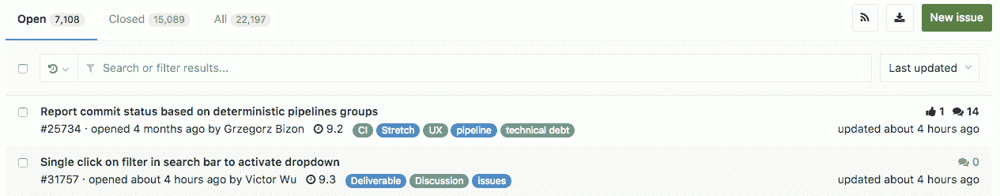](img/new_issue_from_tracker_list.png)

*   从项目中未**解决的问题**中，单击**"**新问题"以在同一项目中创建一个新问题：

    [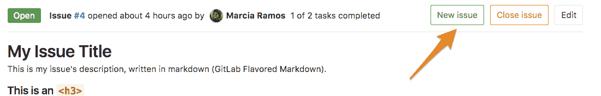](img/new_issue_from_open_issue.png)

*   在**项目的仪表板中** ，单击加号（ **+** ）以打开带有一些选项的下拉菜单. 选择" **新问题"**以在该项目中创建一个问题：

    [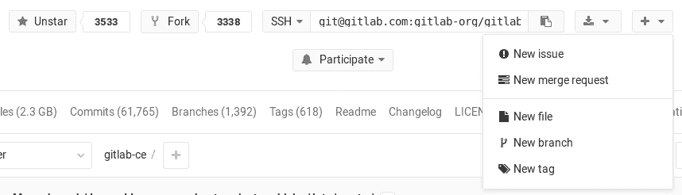](img/new_issue_from_projects_dashboard.png)

*   在**发行板中** ，通过单击列表顶部的加号（ **+** ）创建新发行. 它为该项目打开了一个新问题，并预先标记了各自的列表.

    [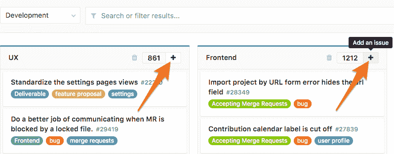](img/new_issue_from_issue_board.png)

### Elements of the New Issue form[](#elements-of-the-new-issue-form "Permalink")

> 在[GitLab Premium](https://about.gitlab.com/pricing/) 13.1 中[引入](https://gitlab.com/gitlab-org/gitlab/-/issues/13847)了将新版本添加到史诗的功能.

[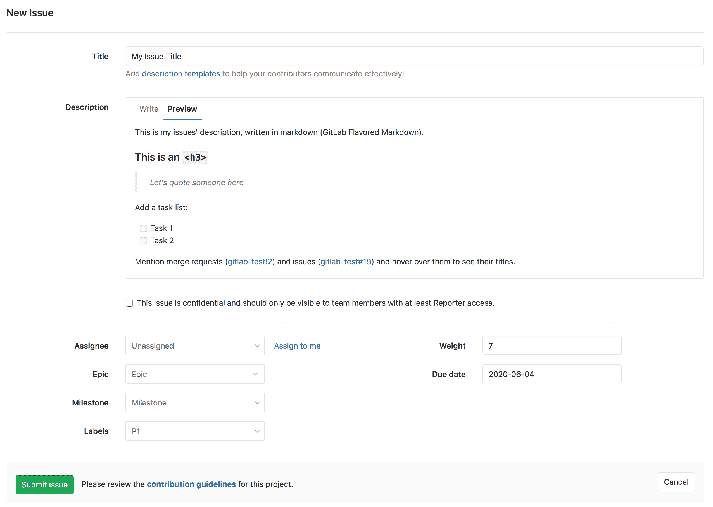](img/new_issue_v13_1.png)

创建新期刊时，可以填写以下字段：

*   Title
*   Description
*   复选框以使问题保密
*   Assignee
*   Weight
*   Epic
*   截止日期
*   Milestone
*   Labels

### New issue from the group-level Issue Tracker[](#new-issue-from-the-group-level-issue-tracker "Permalink")

转到"小组"仪表板，然后单击侧边栏中的" **问题** "以访问"小组"中所有项目的问题跟踪器. 使用页面右上方的下拉按钮，选择要添加问题的项目.

[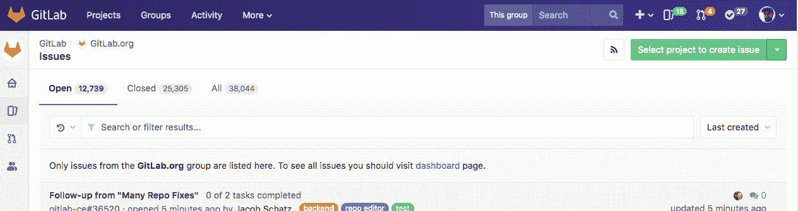](img/select_project_from_group_level_issue_tracker.png)

我们将跟踪您最近选择的项目，并将其用作下次访问的默认项目. 如果您主要是为同一项目创建问题，这应该可以节省大量时间和点击次数.

[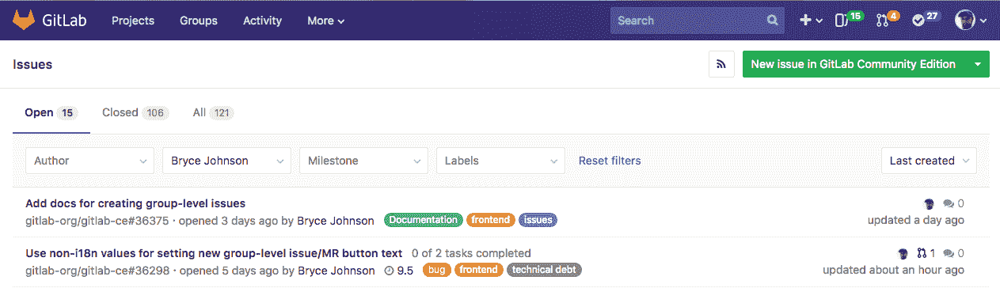](img/create_issue_from_group_level_issue_tracker.png)

### New issue via Service Desk[](#new-issue-via-service-desk-starter "Permalink")

为您的项目启用[Service Desk](../service_desk.html)并提供电子邮件支持. 这样，当您的客户发送新电子邮件时，可以在适当的项目中创建一个新的问题，然后从那里进行后续操作.

### New issue via email[](#new-issue-via-email "Permalink")

如果您的 GitLab 实例配置了[传入电子邮件](../../../administration/incoming_email.html) ，则在项目的" **问题列表"**页面的底部会显示**一个"将新问题发送到该项目的电子邮件** "链接.

[](img/new_issue_from_email.png)

当您单击此链接时，将生成并显示一个电子邮件地址，该电子邮件地址**仅供您自己使用** ，以在此项目中创建问题. 您可以将此地址另存为联系人，以方便访问.

**注意：**这是一个私人电子邮件地址，仅为您生成. **保密** ，因为任何知道它的人都可以创建问题或合并请求，就好像它们是您一样. 如果地址被盗用，或者您出于任何原因希望重新生成该地址，请再次单击"通过**电子邮件将新问题发送到此项目"** ，然后单击"重置"链接.

向该地址发送电子邮件将以您的名字在此项目中创建一个新问题，其中：

*   The email subject becomes the issue title.
*   电子邮件正文成为问题描述.
*   支持[降价](../../markdown.html)和[快速行动](../quick_actions.html) .

**注意：**在 GitLab 11.7 中，我们更新了生成的电子邮件地址的格式. 但是，仍支持较旧的格式，从而允许现有别名或联系人继续工作.

### New issue via URL with prefilled fields[](#new-issue-via-url-with-prefilled-fields "Permalink")

您可以使用 URL 中的查询字符串参数，使用预填充的字段值直接链接到给定项目的新问题页面. 这对于在外部 HTML 页面中嵌入 URL 以及在某些情况下（希望用户创建带有预填某些字段的问题）很有用.

标题，描述，描述模板和机密字段可以使用此方法进行预填充. 您不能在同一 URL 中预先填写描述和描述模板字段（因为描述模板也会填充描述字段）.

| Field | URL 参数名称 | Notes |
| --- | --- | --- |
| title | `issue[title]` |   |
| description | `issue[description]` |   |
| 描述模板 | `issuable_template` |   |
| confidential | `issue[confidential]` | 参数值必须为`true`才能设置为机密 |

请按照以下示例使用预填字段来形成新的问题 URL.

*   对于 GitLab 社区版项目中的新问题，带有预填充的标题和预填充的描述，URL 为`https://gitlab.com/gitlab-org/gitlab-foss/-/issues/new?issue[title]=Validate new concept&issue[description]=Research idea`
*   对于 GitLab 社区版项目中的新问题，带有预填充的标题和预填充的描述模板，URL 为`https://gitlab.com/gitlab-org/gitlab-foss/-/issues/new?issue[title]=Validate new concept&issuable_template=Research proposal`
*   对于 GitLab 社区版项目中的新问题，其中包含预填充的标题，预填充的描述以及机密标志集，其 URL 为`https://gitlab.com/gitlab-org/gitlab-foss/-/issues/new?issue[title]=Validate new concept&issue[description]=Research idea&issue[confidential]=true`

## Moving Issues[](#moving-issues "Permalink")

移动问题会将其复制到新位置（项目），并在旧项目中将其关闭，但不会被删除. 这两个问题上还将添加一个系统注释，以指示它来自何处.

The “Move issue” button is at the bottom of the right-sidebar when viewing the issue.

[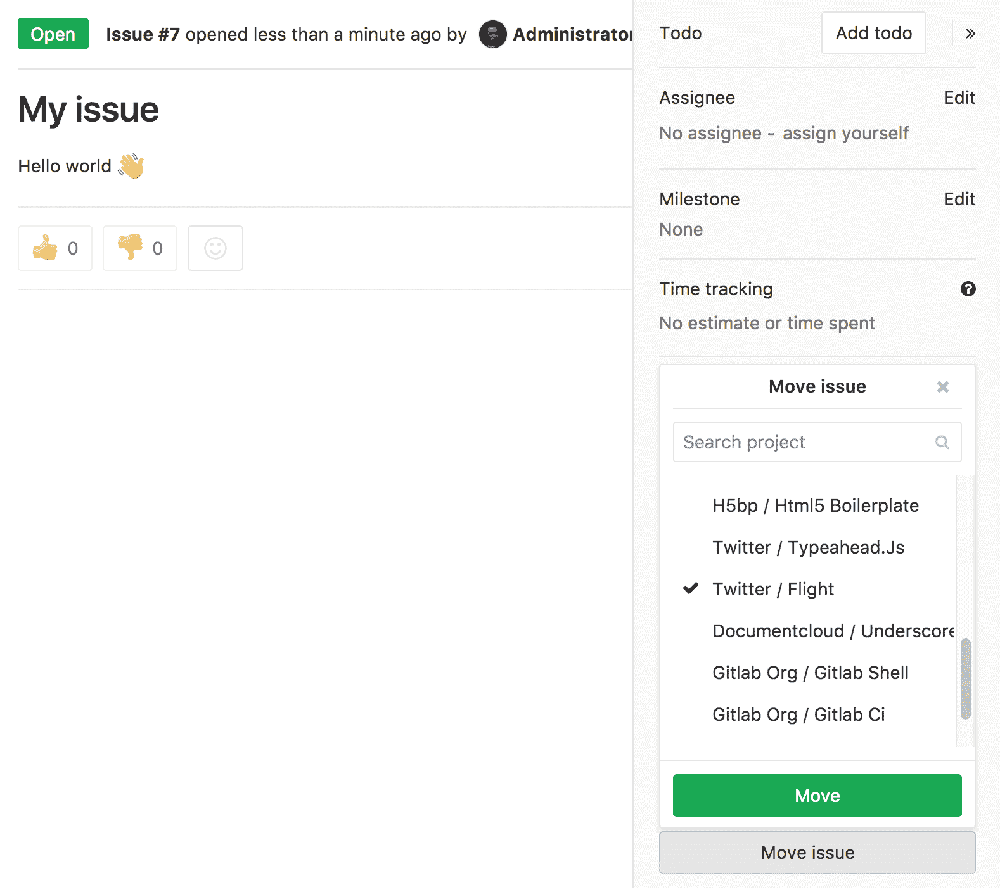](img/sidebar_move_issue.png)

### Moving Issues in Bulk[](#moving-issues-in-bulk "Permalink")

如果您具有高级技术技能，也可以在 Rails 控制台中将所有问题从一个项目批量转移到另一个项目. 下面的脚本会将所有问题从一个项目移至另一个状态尚未**关闭的项目** .

要访问 rails 控制台，请在 GitLab 服务器上运行`sudo gitlab-rails console`并运行以下脚本. 请确保将**project** ， **admin_user**和**target_project**更改为您的值. 我们也建议您在尝试对控制台进行任何更改之前先[创建备份](../../../raketasks/backup_restore.html#back-up-gitlab) .

```
project = Project.find_by_full_path('full path of the project where issues are moved from')
issues = project.issues
admin_user = User.find_by_username('username of admin user') # make sure user has permissions to move the issues
target_project = Project.find_by_full_path('full path of target project where issues moved to')

issues.each do |issue|
   if issue.state != "closed" && issue.moved_to.nil?
      Issues::MoveService.new(project, admin_user).execute(issue, target_project)
   else
      puts "issue with id: #{issue.id} and title: #{issue.title} was not moved"
   end
end; nil 
```

## Closing issues[](#closing-issues "Permalink")

当您确定问题已解决或不再需要时，可以使用"关闭"按钮关闭该问题：

[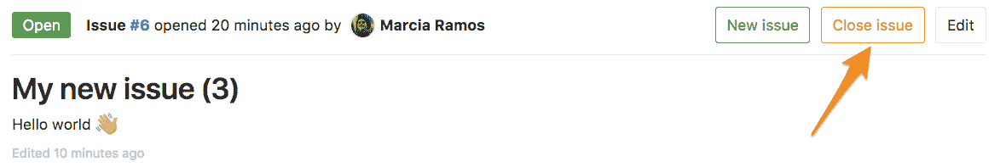](img/button_close_issue.png)

您还可以通过将发行卡从其发行版列表中拖放到" **已关闭"**列表中来**关闭** [发行板中](../issue_board.html)的发行.

[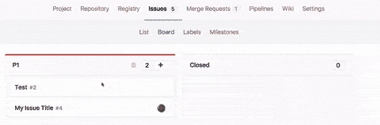](img/close_issue_from_board.gif)

### Closing issues automatically[](#closing-issues-automatically "Permalink")

**注意：**由于性能原因，从现有存储库的第一次推送将禁用自动问题关闭.

当提交或合并请求解决了一个或多个问题时，当提交或合并请求到达项目的默认分支时，可能会自动关闭这些问题.

如果提交消息或合并请求描述包含与[定义的模式](#default-closing-pattern)匹配的文本，则匹配文本中引用的所有问题均将关闭. 将提交推送到项目的[**默认**分支时](../repository/branches/index.html#default-branch) ，或者将提交或合并请求合并到其中时，就会发生这种情况.

例如，如果合并请求描述中包含`Closes #4, #6, Related to #5`则合并 MR 时问题`#4`和`#6`将自动关闭，但不会合并`#5` . 将" `Related to` `#5`标记[相关"](related_issues.html)用作[相关问题](related_issues.html) ，但不会自动关闭.

[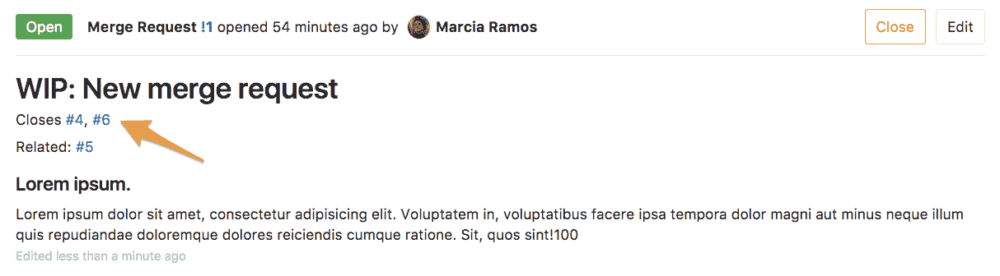](img/merge_request_closes_issue.png)

如果问题与 MR 位于不同的存储库中，请添加问题的完整 URL：

```
Closes #4, #6, and https://gitlab.com/<username>/<projectname>/issues/<xxx> 
```

#### Default closing pattern[](#default-closing-pattern "Permalink")

如果未指定，将使用如下所示的默认问题关闭模式：

```
\b((?:[Cc]los(?:e[sd]?|ing)|\b[Ff]ix(?:e[sd]|ing)?|\b[Rr]esolv(?:e[sd]?|ing)|\b[Ii]mplement(?:s|ed|ing)?)(:?) +(?:(?:issues? +)?%{issue_ref}(?:(?: *,? +and +| *,? *)?)|([A-Z][A-Z0-9_]+-\d+))+) 
```

这将转换为以下关键字：

*   关闭，关闭，关闭，关闭，关闭，关闭，关闭，关闭
*   修正，修正，修正，修正，修正，修正，修正，修正
*   解决，解决，解决，解决，解决，解决，解决，解决
*   实施，实施，实施，实施，实施，实施，实施，实施

请注意， `%{issue_ref}`是在 GitLab 的源代码中定义的复杂正则表达式，可以匹配对以下内容的引用：

*   本地问题（ `#123` ）.
*   跨项目问题（ `group/project#123` ）.
*   指向问题的链接（ `https://gitlab.example.com/group/project/issues/123` ）.

例如以下提交消息：

```
Awesome commit message

Fix #20, Fixes #21 and Closes group/otherproject#22.
This commit is also related to #17 and fixes #18, #19
and https://gitlab.example.com/group/otherproject/issues/23. 
```

将在提交被推送到的项目中关闭`#18` ， `#19` ， `#20`和`#21` ，以及`group/otherproject` `#22`和`#23` . `#17`将不会关闭，因为它与模式不匹配. 当从命令行与`git commit -m`一起使用时，它可以处理多行提交消息以及单行代码.

#### Disabling automatic issue closing[](#disabling-automatic-issue-closing "Permalink")

在 GitLab 12.7 中[引入](https://gitlab.com/gitlab-org/gitlab/-/issues/19754) .

可以在[项目的存储库设置中](../settings/index.html)针对每个项目禁用自动关闭问题功能. 引用的问题仍将按原样显示，但不会自动关闭.

[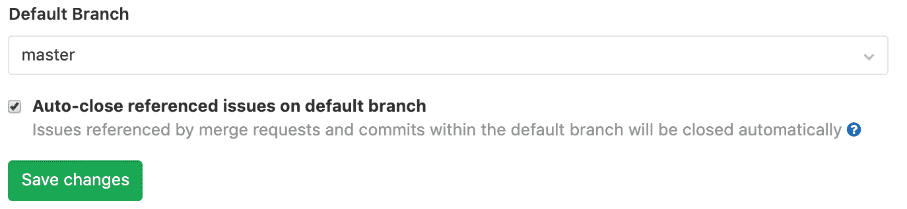](img/disable_issue_auto_close.png)

这仅适用于受新合并请求或提交影响的问题. 已经解决的问题仍然保持原样. 禁用自动关闭的问题仅影响到项目*中*的合并请求，并不会阻止其他项目从通过跨项目的问题，将其关闭.

#### Customizing the issue closing pattern[](#customizing-the-issue-closing-pattern-core-only "Permalink")

为了更改默认的问题关闭模式，GitLab 管理员必须编辑安装的[`gitlab.rb`或`gitlab.yml`文件](../../../administration/issue_closing_pattern.html) .

## Deleting issues[](#deleting-issues "Permalink")

在 GitLab 8.6 中[引入](https://gitlab.com/gitlab-org/gitlab-foss/-/merge_requests/2982)

具有[项目所有者权限的](../../permissions.html)用户可以通过编辑问题并单击删除按钮来删除问题.

[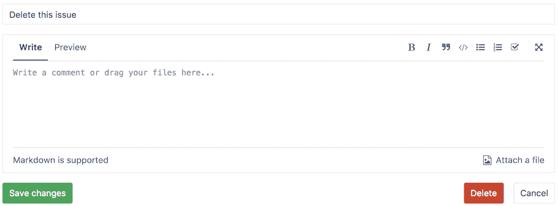](img/delete_issue.png)