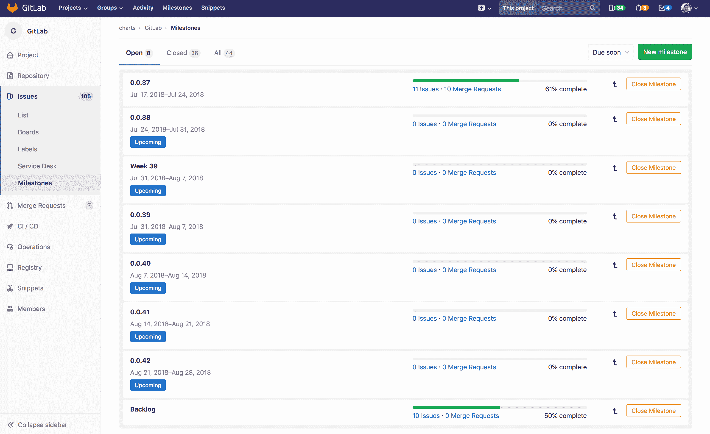
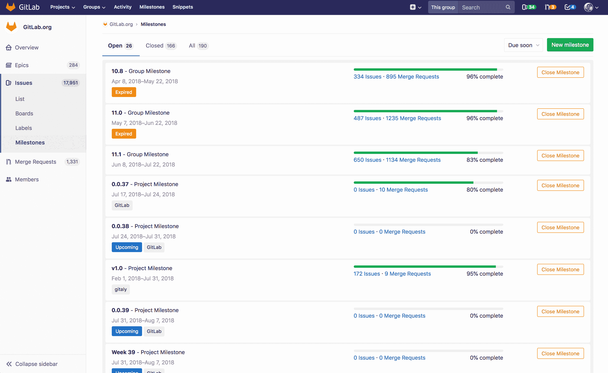
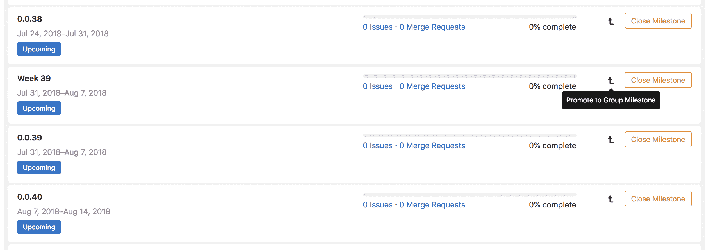
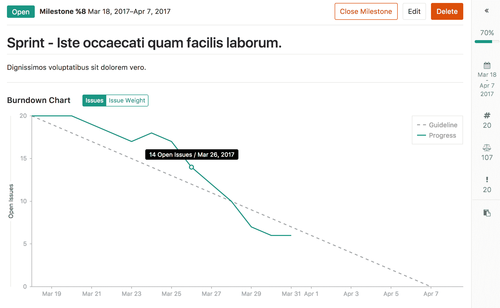
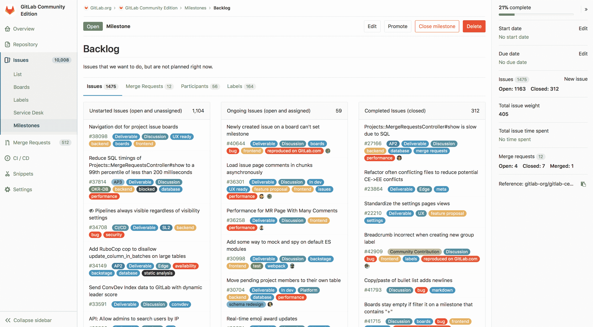

# Milestones

> 原文：[https://docs.gitlab.com/ee/user/project/milestones/](https://docs.gitlab.com/ee/user/project/milestones/)

*   [Overview](#overview)
*   [Milestones as Agile sprints](#milestones-as-agile-sprints)
*   [Milestones as releases](#milestones-as-releases)
*   [Project milestones and group milestones](#project-milestones-and-group-milestones)
*   [Creating milestones](#creating-milestones)
    *   [New project milestone](#new-project-milestone)
    *   [New group milestone](#new-group-milestone)
*   [Editing milestones](#editing-milestones)
    *   [Promoting project milestones to group milestones](#promoting-project-milestones-to-group-milestones)
*   [Assigning milestones from the sidebar](#assigning-milestones-from-the-sidebar)
*   [Filtering issues and merge requests by milestone](#filtering-issues-and-merge-requests-by-milestone)
    *   [Filtering in list pages](#filtering-in-list-pages)
    *   [Filtering in issue boards](#filtering-in-issue-boards)
    *   [Special milestone filters](#special-milestone-filters)
*   [Milestone view](#milestone-view)
    *   [Project Burndown Charts](#project-burndown-charts-starter)
    *   [Group Burndown Charts](#group-burndown-charts-premium)
    *   [Milestone sidebar](#milestone-sidebar)

# Milestones

## Overview

GitLab 中的里程碑是一种跟踪问题并合并为在一定时期内实现更广泛目标而创建的请求的方法.

里程碑使您可以组织问题并将请求合并到一个紧密联系的组中，并带有一个可选的开始日期和一个可选的截止日期.

## Milestones as Agile sprints

里程碑可用作敏捷冲刺，因此您可以跟踪所有问题并合并与特定冲刺有关的请求. 为此：

1.  设置里程碑的开始日期和截止日期，以代表敏捷冲刺的开始和结束.
2.  将里程碑标题设置为敏捷 sprint 的名称，例如`November 2018 sprint` .
3.  通过将问题的右侧边栏关联到所需的里程碑，将问题添加到敏捷冲刺中.

## Milestones as releases

同样，里程碑可以用作发布. 为此：

1.  设置里程碑到期日期以表示发布的发布日期，并将里程碑开始日期保留为空白.
2.  将里程碑标题设置为您的发行版，例如`Version 9.4` .
3.  通过关联问题右侧的期望里程碑，将问题添加到您的发行中.

此外，您可以将里程碑与 GitLab 的[Releases 功能](../releases/index.html#associate-milestones-with-a-release)集成.

## Project milestones and group milestones

您可以将**项目里程碑**分配给问题或仅合并该项目中的请求. 要查看项目里程碑列表，请在项目中转到 **问题>里程碑** .

您可以将**组里程碑**分配给该**组**中任何项目的任何发行或合并请求. 要查看组里程碑列表，请在组中转到 **问题>里程碑** .

您还可以在仪表板里程碑列表中查看您有权访问的所有里程碑. 要查看您可以访问的项目里程碑和组里程碑，请单击顶部导航栏上的**更多>里程碑** .

有关项目和组里程碑 API 的信息，请参阅：

*   [Project Milestones API](../../../api/milestones.html)
*   [Group Milestones API](../../../api/group_milestones.html)

**注意：**如果您在一个小组中，然后单击**问题>里程碑** ，您将看到小组里程碑和该小组中的项目里程碑. 如果您在项目中，然后单击" **问题">"里程碑"** ，则只会看到该项目的里程碑.

## Creating milestones

**注意：**创建里程碑需要[开发者或更高](../../permissions.html)级别的权限.

### New project milestone

创建**项目里程碑** ：

1.  在一个项目中，转到 **问题>里程碑** .
2.  Click **新的里程碑**.
3.  输入标题，可选描述，可选开始日期和可选截止日期.
4.  Click **新的里程碑**.

### New group milestone

创建**组里程碑** ：

1.  在一个小组中，转到 **问题>里程碑** .
2.  Click **新的里程碑**.
3.  输入标题，可选描述，可选开始日期和可选截止日期.
4.  Click **新的里程碑**.

## Editing milestones

**注意：**编辑里程碑需要[开发者或更高的](../../permissions.html)权限级别.

要编辑里程碑：

1.  在项目或小组中，转到 **问题>里程碑** .
2.  单击里程碑标题.
3.  Click **Edit**.

您可以通过单击" **删除"**按钮来删除里程碑.

### Promoting project milestones to group milestones

If you are expanding from a few projects to a larger number of projects within the same group, you may want to share the same milestone among multiple projects in the same group. If you previously created a project milestone and now want to make it available for other projects within the same group, you can promote it to a group milestone.

从项目里程碑列表页面，您可以将项目里程碑升级为组里程碑. 这会将具有相同名称的该组中所有项目中的所有项目里程碑合并为一个组里程碑. 以前已分配给这些项目里程碑之一的所有问题和合并请求现在都将分配给新的组里程碑. 此操作不能撤消，更改是永久的.

**警告：**从 GitLab 12.4 和更早版本开始，将项目里程碑提升为组里程碑时，某些信息会丢失. 组里程碑视图上并非项目里程碑视图上的所有功能都可用. 如果将项目里程碑升级为组里程碑，则将失去这些功能. 请参阅" [里程碑"视图，](#milestone-view)以查看组里程碑视图中缺少哪些功能.

## Assigning milestones from the sidebar

可以为每个问题和合并请求分配一个里程碑. 里程碑在边栏中的每个问题和合并请求页面上可见. 它们在发行板上也可见. 您可以从边栏中为对象分配或取消分配里程碑. 您也可以在评论中[快速](../quick_actions.html)执行此[操作](../quick_actions.html) . [如前所述](#project-milestones-and-group-milestones) ，对于给定的发布或合并请求，可以选择项目里程碑和组里程碑并将其分配给对象.

## Filtering issues and merge requests by milestone

### Filtering in list pages

在项目发布/合并请求列表页面和组发布/合并请求列表页面中，可以按组里程碑和项目里程碑进行[筛选](../../search/index.html#issues-and-merge-requests) .

### Filtering in issue boards

*   在[项目发布板上](../issue_board.html) ，您可以在[搜索和过滤器栏中](../../search/index.html#issue-boards)按组里程碑和项目里程碑进行[筛选](../../search/index.html#issue-boards) .
*   在[组发布板上](../issue_board.html#group-issue-boards-premium) ，您只能在[搜索和过滤器栏中](../../search/index.html#issue-boards)按组里程碑进行[过滤](../../search/index.html#issue-boards) .
*   在[项目发行板中](../issue_board.html) ，可以在[发行板配置中](../issue_board.html#configurable-issue-boards-starter)按组里程碑和项目里程碑进行筛选.
*   在[组发行板上，](../issue_board.html#group-issue-boards-premium)您只能按[发行板配置](../issue_board.html#configurable-issue-boards-starter)中的组里程碑进行筛选.

### Special milestone filters

在按里程碑进行筛选时，除了选择特定的项目里程碑或组里程碑之外，还可以选择特殊的里程碑筛选器.

*   **无** ：显示问题或没有分配里程碑的合并请求.
*   **任何** ：显示问题或合并具有指定里程碑的请求.
*   **即将到来的** ：显示已分配的公开里程碑的问题或合并请求，该里程碑具有下一个即将到来的到期日（即将来的最近到期日）.
*   **已开始** ：显示具有打开的指定里程碑且开始日期在今天之前的问题或合并请求.

## Milestone view

里程碑视图显示标题和描述.

这些标签下面还包含显示以下内容的标签：

*   **问题** ：显示分配给里程碑的所有问题. 这些内容显示在名为：
    *   未开始的问题（未解决和未分配）
    *   进行中的问题（未解决和已分配）
    *   已完成的问题（已关闭）
*   **合并请求** ：显示分配给里程碑的所有合并请求. 这些将显示在名为：
    *   进行中的工作（开放且未分配）
    *   等待合并（打开和未分配）
    *   拒绝（关闭）
    *   合并后
*   **参与者** ：显示分配给该里程碑的所有问题的受让人.
*   **Labels**: Shows all labels that are used in issues assigned to the milestone.

### Project Burndown Charts

对于[GitLab Starter 中的](https://about.gitlab.com/pricing/)项目里程碑，里程碑视图中有一个[燃尽图](burndown_charts.html) ，显示完成里程碑的进度.

### Group Burndown Charts

对于[GitLab Premium 中的](https://about.gitlab.com/pricing/)组里程碑，里程碑视图中有一个[燃尽图](burndown_charts.html) ，显示完成里程碑的进度.

### Milestone sidebar

里程碑视图上的里程碑侧栏显示以下内容：

*   完成百分比，计算方式为已完成的问题数除以问题总数.
*   开始日期和截止日期.
*   在分配给里程碑的所有问题和合并请求上花费的总时间.
*   分配给里程碑的所有问题的总问题权重.

