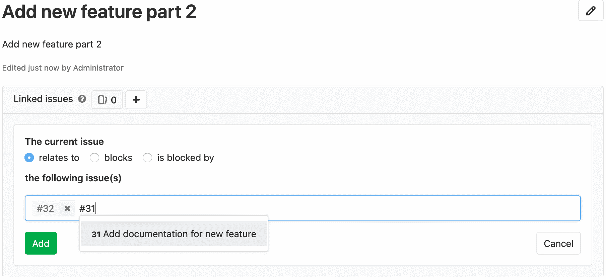
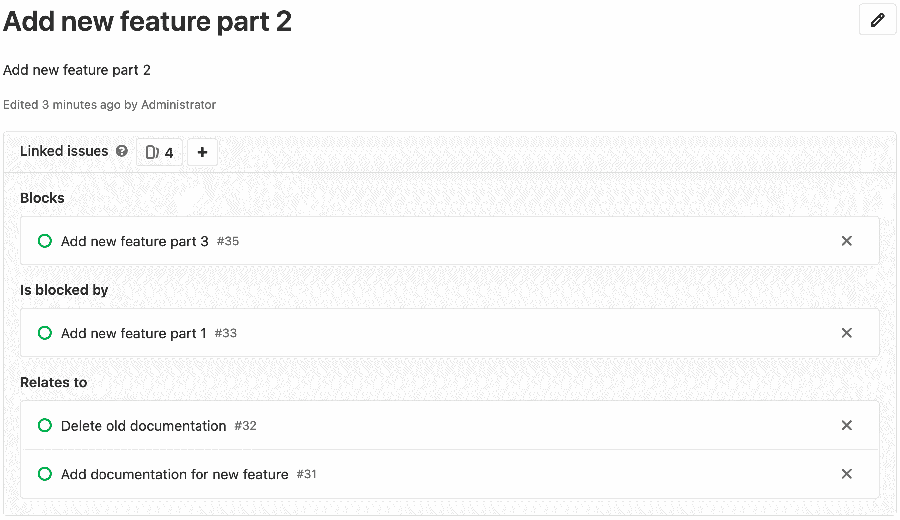
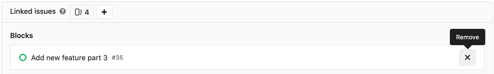

# Related issues

> 原文：[https://docs.gitlab.com/ee/user/project/issues/related_issues.html](https://docs.gitlab.com/ee/user/project/issues/related_issues.html)

*   [Adding a related issue](#adding-a-related-issue)
*   [Removing a related issue](#removing-a-related-issue)

# Related issues

[Introduced](https://gitlab.com/gitlab-org/gitlab/-/merge_requests/1797) in [GitLab Starter](https://about.gitlab.com/pricing/) 9.4.

相关问题是任何两个问题之间的双向关系，并出现在问题描述下方的方框中. 问题可能会跨越小组和项目.

如果用户可以看到两个问题，则该关系仅显示在 UI 中.

## Adding a related issue

版本历史

*   在[GitLab Starter](https://about.gitlab.com/pricing/) 12.8 中[引入](https://gitlab.com/gitlab-org/gitlab/-/issues/2035) .
*   在[GitLab Starter](https://about.gitlab.com/pricing/) 13.0 中进行了[改进](https://gitlab.com/gitlab-org/gitlab/-/issues/34239) . 当您尝试使用打开的阻止程序来解决问题时，您会看到一条警告，您可以将其关闭.

You can relate one issue to another by clicking the related issues “+” button in the header of the related issue block. Then, input the issue reference number or paste in the full URL of the issue.

此外，您可以选择当前问题是与输入的问题相关，被阻止还是被阻止.

同一项目的问题只能通过参考编号指定. 来自其他项目的问题需要其他信息，例如组和项目名称. 例如：

*   同一项目： `#44`
*   同一组： `project#44`
*   不同的组： `group/project#44`

有效参考将添加到您可以查看的临时列表中. 添加完所有相关问题后，请单击**添加**以提交.

完成所有相关问题的添加后，您将能够看到它们的分类，以便可以从视觉上更好地理解它们之间的关系.

## Removing a related issue

在相关问题区域中，单击要删除的每个问题令牌右侧的" x"图标. 由于双向关系，它将不再出现在任何一个问题中.

请访问我们的[权限](../../permissions.html)页面以获取更多信息.

此外，您还可以通过[我们的 API](../../../api/issue_links.html)管理相关问题.