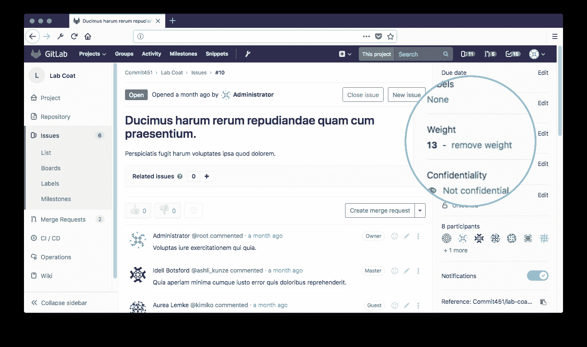

# Issue weight

> 原文：[https://docs.gitlab.com/ee/user/project/issues/issue_weight.html](https://docs.gitlab.com/ee/user/project/issues/issue_weight.html)

# Issue weight

[Introduced](https://gitlab.com/gitlab-org/gitlab/-/merge_requests/76) in [GitLab Starter](https://about.gitlab.com/pricing/) 8.3.

当您遇到很多问题时，可能很难获得概述. 通过为每个问题增加权重，您可以更好地了解给定问题要花费或花费多少时间，价值或复杂性.

您可以通过简单地更改下拉菜单中的值来设置问题的权重. 您可以将其设置为 0、1、2 等的非负整数值. （数据库存储一个 4 字节的值，因此上限基本上是无限的）. 您也可以减轻问题的负担.

该值将显示在单个问题的右侧栏上，以及在独特的余额比例图标旁边的问题页面中.

另外，您可以在里程碑页面上查看所有问题的总和.

