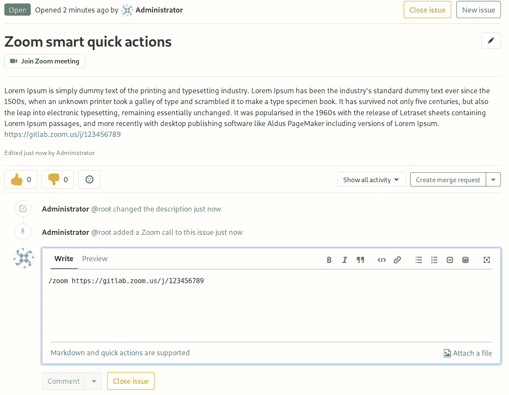

# Associate a Zoom meeting with an issue

> 原文：[https://docs.gitlab.com/ee/user/project/issues/associate_zoom_meeting.html](https://docs.gitlab.com/ee/user/project/issues/associate_zoom_meeting.html)

*   [Adding a zoom meeting to an issue](#adding-a-zoom-meeting-to-an-issue)
*   [Removing an existing Zoom meeting from an issue](#removing-an-existing-zoom-meeting-from-an-issue)

# Associate a Zoom meeting with an issue[](#associate-a-zoom-meeting-with-an-issue "Permalink")

在 GitLab 12.4 中[引入](https://gitlab.com/gitlab-org/gitlab/-/merge_requests/16609) .

为了同步进行事件管理通信，GitLab 允许将 Zoom 会议与问题相关联. 一旦开始进行消防战斗的变焦呼叫，就需要一种将电话会议与问题相关联的方法，以便您的团队成员可以快速加入而无需请求链接.

## Adding a zoom meeting to an issue[](#adding-a-zoom-meeting-to-an-issue "Permalink")

要将缩放会议与问题相关联，可以使用 GitLab 的[快速操作](../quick_actions.html#quick-actions-for-issues-merge-requests-and-epics) .

在一个问题中，使用`/zoom`快速操作和有效的 Zoom 链接发表评论：

```
/zoom https://zoom.us/j/123456789 
```

如果"缩放会议 URL"有效且您至少具有" [报告者"权限](../../permissions.html) ，则系统警报将通知您会议 URL 添加成功. 该问题的描述将被自动编辑以包含"缩放"链接，并且在该问题的标题下方将出现一个按钮.

[](img/zoom-quickaction-button.png)

您只能将单个 Zoom 会议附加到一个问题. 如果您尝试使用`/zoom`快速操作添加第二个 Zoom 会议，它将无法正常工作，您需要先将其[删除](#removing-an-existing-zoom-meeting-from-an-issue) .

## Removing an existing Zoom meeting from an issue[](#removing-an-existing-zoom-meeting-from-an-issue "Permalink")

与添加缩放会议类似，您可以通过快速操作将其删除：

```
/remove_zoom 
```

如果您至少具有[Reporter 权限](../../permissions.html) ，系统警报将通知您会议 URL 已成功删除.