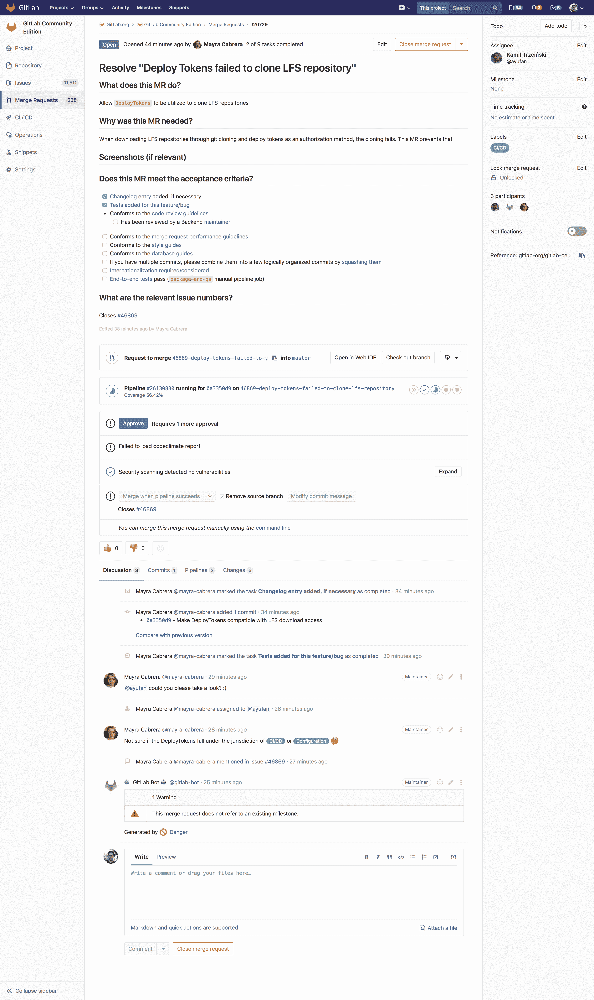
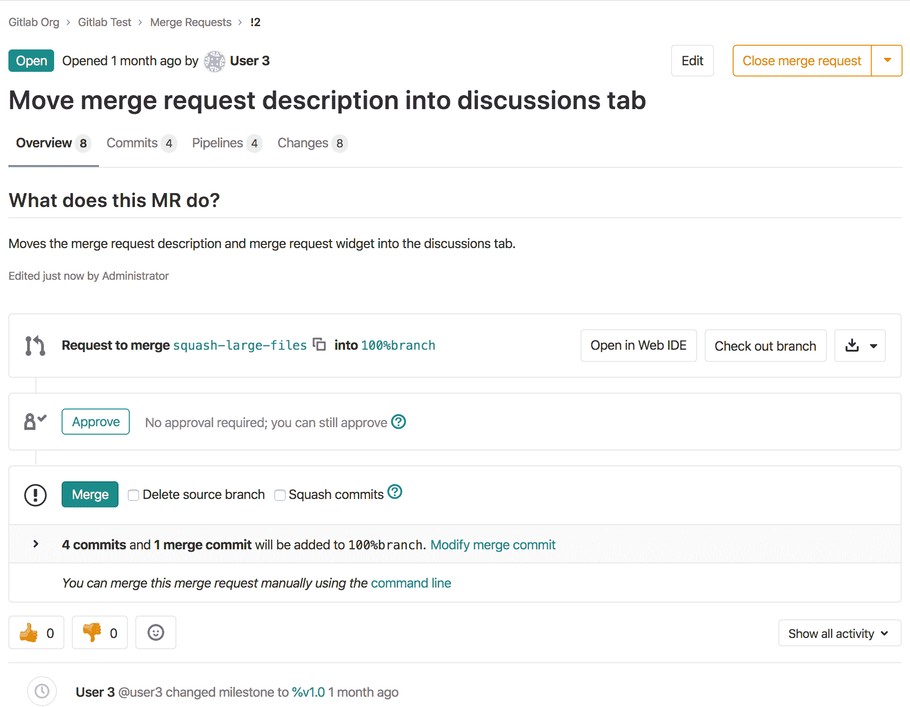

# Merge requests

> 原文：[https://docs.gitlab.com/ee/user/project/merge_requests/](https://docs.gitlab.com/ee/user/project/merge_requests/)

*   [Use cases](#use-cases)
*   [Overview](#overview)
*   [Merge request navigation tabs at the top](#merge-request-navigation-tabs-at-the-top)
*   [Creating merge requests](#creating-merge-requests)
*   [Reviewing and managing merge requests](#reviewing-and-managing-merge-requests)
*   [Testing and reports in merge requests](#testing-and-reports-in-merge-requests)
*   [Authorization for merge requests](#authorization-for-merge-requests)

# Merge requests[](#merge-requests "Permalink")

合并请求使您可以可视化并协作对作为对指定 Git 分支的提交而存在的源代码的建议更改.

[](img/merge_request.png)

合并请求（ **MR** ）是 GitLab 作为代码协作和版本控制平台的基础. 顾名思义，它就是一个*将*一个分支*合并*到另一个分支的*请求* .

## Use cases[](#use-cases "Permalink")

答：考虑您是一个团队中的软件开发人员：

1.  您签出新分支，并通过合并请求提交更改
2.  您从团队中收集反馈
3.  您可以使用["代码质量"报告来进行](code_quality.html)优化代码的实现
4.  您可以在 GitLab CI / CD 中使用[JUnit 测试报告](../../../ci/junit_test_reports.html)来验证您的更改
5.  通过" [许可证合规性"报告，](../../compliance/license_compliance/index.html)可以避免使用许可证与您的项目不兼容的依赖项
6.  您要求您的经理[批准](merge_request_approvals.html)
7.  您的经理：
    1.  推动提交并进行最终审查
    2.  [批准合并请求](merge_request_approvals.html)
    3.  将其设置为[在管道成功时合并](merge_when_pipeline_succeeds.html)
8.  您的更改将通过[手动操作](../../../ci/yaml/README.html#whenmanual) GitLab CI / CD 部署到生产中
9.  您的实施已成功交付给客户

B.考虑您是为您公司网站编写网页的 Web 开发人员：

1.  您签出新分支，并通过合并请求提交新页面
2.  您从审稿人那里收集反馈
3.  您的更改将通过[Review Apps](../../../ci/review_apps/index.html)进行预览
4.  您要求您的网页设计师实施
5.  您要求您的经理[批准](merge_request_approvals.html)
6.  一旦批准，您的合并请求将被[压缩和合并](squash_and_merge.html) ，并[部署到带有 GitLab 页面的暂存中](https://about.gitlab.com/blog/2016/08/26/ci-deployment-and-environments/)
7.  您的生产团队[选择](cherry_pick_changes.html)合并提交到生产中

## Overview[](#overview "Permalink")

合并请求（也称为" MR"）显示有关建议的更改的大量信息. MR 的主体包含其描述以及其小部件（显示有关 CI / CD 管道的信息，如果存在的话），然后是与该 MR 合作的人员的讨论线程.

MR 还包含导航选项卡，从中可以查看线程上正在进行的讨论，提交列表，管道和作业列表，代码更改以及内联代码审阅.

首先，请阅读[合并请求简介](getting_started.html) .

## Merge request navigation tabs at the top[](#merge-request-navigation-tabs-at-the-top "Permalink")

在 GitLab 12.6 中[引入](https://gitlab.com/gitlab-org/gitlab/-/issues/33813) . 此定位是实验性的.

到目前为止，在合并请求窗口小部件之后，位于合并请求中以显示" **讨论区"** ，" **提交"** ，" **管道** "和" **更改"**的导航选项卡.

To facilitate this navigation without having to scroll up and down through the page to find these tabs, based on user feedback, we’re experimenting with a new positioning of these tabs. They are now located at the top of the merge request, with a new **Overview** tab, containing the description of the merge request followed by the widget. Next to **Overview**, you can find **Pipelines**, **Commits**, and **Changes**.

[](img/merge_request_tab_position_v12_6.png)

请注意，此更改当前位于默认情况下启用的功能标志之后. 对于自我管理的实例，GitLab 管理员可以通过 Rails 控制台使用以下命令将其禁用：

```
Feature.disable(:mr_tabs_position) 
```

## Creating merge requests[](#creating-merge-requests "Permalink")

Learn [how to create a merge request](creating_merge_requests.html).

## Reviewing and managing merge requests[](#reviewing-and-managing-merge-requests "Permalink")

查看可使用的功能来[查看和管理合并请求](reviewing_and_managing_merge_requests.html) .

## Testing and reports in merge requests[](#testing-and-reports-in-merge-requests "Permalink")

了解有关合并请求中的[测试](testing_and_reports_in_merge_requests.html)选项[和报告](testing_and_reports_in_merge_requests.html)更改的信息.

## Authorization for merge requests[](#authorization-for-merge-requests "Permalink")

使用 GitLab 进行合并请求的主要方法有两种：

1.  在单个存储库中使用[受保护的分支](../protected_branches.html)
2.  使用权威项目的分支

[Learn more about the authorization for merge requests.](authorization_for_merge_requests.html)