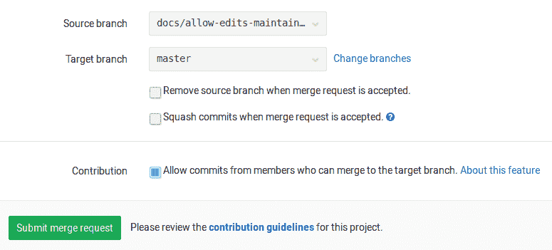
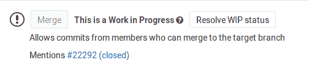

# Allow collaboration on merge requests across forks

> 原文：[https://docs.gitlab.com/ee/user/project/merge_requests/allow_collaboration.html](https://docs.gitlab.com/ee/user/project/merge_requests/allow_collaboration.html)

*   [Enabling commit edits from upstream members](#enabling-commit-edits-from-upstream-members)
*   [Pushing to the fork as the upstream member](#pushing-to-the-fork-as-the-upstream-member)

# Allow collaboration on merge requests across forks[](#allow-collaboration-on-merge-requests-across-forks "Permalink")

在 GitLab 10.6 中[引入](https://gitlab.com/gitlab-org/gitlab-foss/-/merge_requests/17395) .

当用户从派生打开合并请求时，将为他们提供允许上游成员在源分支上与其进行协作的选项. 这使上游项目的成员可以在合并之前进行小规模修复或重新分支，从而减少了接受外部贡献的来回过程.

此功能可用于可公开访问的分支项目之间的合并请求.

为合并请求启用后，对项目目标分支具有合并访问权限的成员将被授予对合并请求的源分支的写权限.

## Enabling commit edits from upstream members[](#enabling-commit-edits-from-upstream-members "Permalink")

只有具有对源项目的推送访问权限的用户才能启用该功能，并且只有在合并请求打开时才能持续使用. 启用后，上游成员也将能够重试合并请求的管道和作业：

1.  在创建或编辑合并请求时启用贡献.

    [](img/allow_collaboration.png)

2.  创建合并请求后，您将看到允许可以合并到目标分支的成员的提交.

    [](img/allow_collaboration_after_save.png)

## Pushing to the fork as the upstream member[](#pushing-to-the-fork-as-the-upstream-member "Permalink")

如果合并请求的创建者启用了上游成员的贡献，则可以直接推送到派生存储库的分支.

假如说：

*   分叉的项目 URL 为`git@gitlab.com:thedude/awesome-project.git` .
*   合并请求的分支是`update-docs` .

流程如下所示：

1.  首先，您需要获取合并请求已引入的更改. 单击" **签出"分支**按钮，其中包含可以运行的一些预填充命令.

    [](img/checkout_button.png)

2.  使用复制按钮复制第一个命令并将其粘贴到您的终端中：

    ```
    git fetch git@gitlab.com:thedude/awesome-project.git update-docs
    git checkout -b thedude-awesome-project-update-docs FETCH_HEAD 
    ```

    这将获取派生项目的分支，然后基于所获取的分支创建本地分支.

3.  Make any changes you want and commit.
4.  推送到分叉的项目：

    ```
    git push git@gitlab.com:thedude/awesome-project.git thedude-awesome-project-update-docs:update-docs 
    ```

    注意冒号（ `:`两个分支之间）. 上面的命令会将本地分支`thedude-awesome-project-update-docs` `git@gitlab.com:thedude/awesome-project.git`存储库的`update-docs`分支.