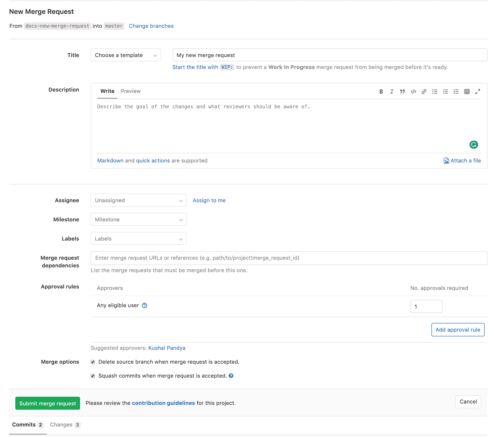
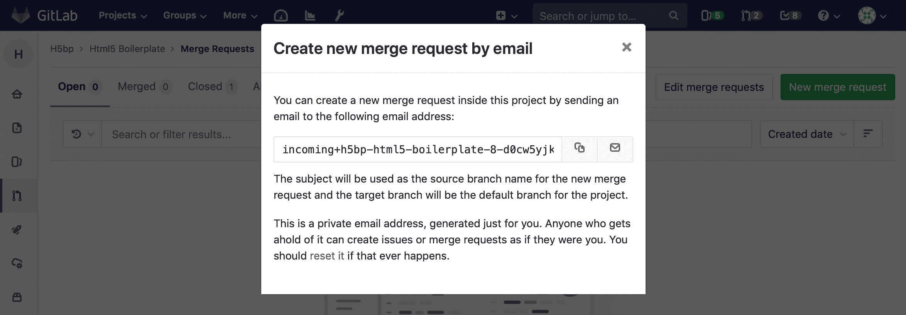

# How to create a merge request

> 原文：[https://docs.gitlab.com/ee/user/project/merge_requests/creating_merge_requests.html](https://docs.gitlab.com/ee/user/project/merge_requests/creating_merge_requests.html)

*   [New Merge Request page](#new-merge-request-page)
*   [Create Merge Request button](#create-merge-request-button)
*   [New merge request by adding, editing, and uploading a file](#new-merge-request-by-adding-editing-and-uploading-a-file)
*   [New merge request from a new branch created through the UI](#new-merge-request-from-a-new-branch-created-through-the-ui)
*   [New merge request from your local environment](#new-merge-request-from-your-local-environment)
*   [New merge request from an issue](#new-merge-request-from-an-issue)
*   [New merge request from the Merge Requests page](#new-merge-request-from-the-merge-requests-page)
*   [New merge request from a fork](#new-merge-request-from-a-fork)
*   [New merge request by email](#new-merge-request-by-email-core-only)
    *   [Adding patches when creating a merge request via e-mail](#adding-patches-when-creating-a-merge-request-via-e-mail)
*   [Reviewing and managing Merge Requests](#reviewing-and-managing-merge-requests)

# How to create a merge request[](#how-to-create-a-merge-request "Permalink")

在创建合并请求之前，请通读"合并请求"的[简介，](getting_started.html)以熟悉概念，术语并了解如何使用它们.

每个合并请求都从创建一个分支开始. 您可以通过[命令行](#new-merge-request-from-your-local-environment) ，Git CLI 应用程序或[GitLab UI](#new-merge-request-from-a-new-branch-created-through-the-ui)在本地进行操作.

本文档介绍了创建合并请求的几种方法.

启动新的合并请求时，无论使用哪种方法，都将转到" [**新合并请求"**页面，](#new-merge-request-page)以在其中添加有关合并请求的信息.

如果将新分支推送到 GitLab，也不管使用哪种方法，都可以单击[**Create Merge Request**](#create-merge-request-button)按钮并从此处启动合并请求.

## New Merge Request page[](#new-merge-request-page "Permalink")

在" **新合并请求"**页面上，首先填写**合并请求**的标题和描述. 如果分支上已经有提交，则标题将用第一条提交消息的第一行预填充，描述将用提交消息中的任何其他行预填充. 在所有情况下，标题都是唯一的必填字段.

在此处，您可以在其中填充信息（标题，描述，受让人，里程碑，标签，批准人），然后点击**创建合并请求** .

在初始屏幕上，您还可以查看提交合并请求之前推送到分支的所有提交，管道和文件更改.

[](img/new_merge_request_page_v12_6.png)

**提示：**您可以在创建合并请求之前将一次或多次推送到 GitLab 中的分支.

## Create Merge Request button[](#create-merge-request-button "Permalink")

将新分支推送到 GitLab 后，请访问 GitLab 中的存储库，并在屏幕顶​​部看到一个号召性用语，您可以从中单击**创建合并请求**按钮.

[](img/create_merge_request_button_v12_6.png)

您还可以在以下页面的右上方看到" **创建合并请求"**按钮：

*   **Project** page.
*   **资料库>文件** page.
*   **合并请求** page.

In this case, GitLab will use the most recent branch you pushed changes to as the source branch, and the default branch in the current project as the target.

## New merge request by adding, editing, and uploading a file[](#new-merge-request-by-adding-editing-and-uploading-a-file "Permalink")

当您选择通过 GitLab UI 编辑，添加或上传文件时，在文件末尾，您会看到以下选项：添加**Commit 消息** ，选择该**提交**的**Target 分支** ，然后选中**Start new**复选框. **具有这些更改的合并请求** .

同样，如果通过 Web IDE 更改文件，则在左侧边栏中导航到" **提交"**时，将看到这些相同的选项.

添加，编辑或上传文件后，请执行以下操作：

1.  在提交消息中描述您的更改.
2.  选择一个现有分支以将您的提交添加到其中，或者，如果您想创建一个新分支，请键入新的分支名称（不带空格，大写字母或特殊字符）.
3.  保持选中复选框以立即开始新的合并请求，或者取消选中该复选框以在开始合并请求之前向该分支添加更多更改.
4.  Click **提交变更**.

如果您选择开始合并请求，则将转到" [**新合并请求"**页面](#new-merge-request-page) ，您可以在其中填写信息并提交合并请求.

合并请求将针对存储库的默认分支. 如果要更改它，可以稍后通过编辑合并请求来进行更改.

## New merge request from a new branch created through the UI[](#new-merge-request-from-a-new-branch-created-through-the-ui "Permalink")

要通过 GitLab UI 快速开始处理文件，请导航至项目的" **存储库">"分支"** ，然后单击" **新建分支"** . 将创建一个新分支，您可以开始编辑文件.

提交并推送后，您可以单击" [**创建合并请求"**](#create-merge-request-button)按钮以打开" [**新合并请求"**页面](#new-merge-request-page) . 将使用当前分支作为源，并使用当前项目中的默认分支作为目标来启动新的合并请求.

## New merge request from your local environment[](#new-merge-request-from-your-local-environment "Permalink")

假设您已将存储库克隆到计算机中，并且想要开始处理文件更改，请先创建并签出一个新分支：

```
git checkout -b my-new-branch 
```

处理文件更改，暂存并提交它们：

```
git add .
git commit -m "My commit message" 
```

完成后， [将分支推送到 GitLab](../../../gitlab-basics/start-using-git.html#send-changes-to-gitlabcom) ：

```
git push origin my-new-branch 
```

在输出中，GitLab 将提示您一个直接链接来创建合并请求：

```
...
remote: To create a merge request for docs-new-merge-request, visit:
remote:   https://gitlab-instance.com/my-group/my-project/merge_requests/new?merge_request%5Bsource_branch%5D=my-new-branch 
```

复制该链接并将其粘贴到浏览器中，将显示" [**新合并请求"页面**](#new-merge-request-page) .

在[通过命令行推送时](../push_options.html) ， [还可以向命令添加](../push_options.html)一些[标志，](../push_options.html)以减少通过 UI 手动编辑合并请求的需要.

如果您没有通过命令行将分支推送到 GitLab（例如，您使用 Git CLI 应用程序来推送更改），则可以通过单击" [**创建合并请求"**](#create-merge-request-button)按钮通过 GitLab UI [**创建合并请求**](#create-merge-request-button) .

## New merge request from an issue[](#new-merge-request-from-an-issue "Permalink")

您也可以[直接从 issue 创建一个新的合并请求](../repository/web_editor.html#create-a-new-branch-from-an-issue) .

## New merge request from the Merge Requests page[](#new-merge-request-from-the-merge-requests-page "Permalink")

您可以通过在项目中的" **合并请求"**页面上单击" **新建合并请求"**按钮来开始创建新的合并请求. 然后选择包含更改的源项目和分支，以及要将更改合并到的目标项目和分支. 单击**比较分支，然后继续**转到" [**新合并请求"**页面](#new-merge-request-page)并填写详细信息.

## New merge request from a fork[](#new-merge-request-from-a-fork "Permalink")

分叉项目并应用本地更改后，请完成以下步骤，从您的 fork 创建一个合并请求以贡献回主项目：

1.  转到**项目>您的项目，**然后选择存储库的分支.
2.  在左侧菜单中，转到**合并请求** ，然后点击**新建合并请求** .
3.  在" **源分支"**下拉列表框中，在分支的存储库中选择您的分支作为源分支.
4.  在" **目标分支"**下拉列表框中，从上游存储库中选择分支作为目标分支.
5.  输入凭据后，单击" **比较分支"，然后继续**将本地更改与上游存储库进行比较.
6.  分配用户以查看您的更改，然后点击**提交合并请求** .

合并更改后，您的更改将按照规范添加到上游存储库和分支中. 合并工作后，如果您不想对上游项目做出任何其他贡献，则可以通过[删除分支关系](../settings/index.html#removing-a-fork-relationship) ，在**Settings> Advanced Settings**部分[中将 fork 与](../settings/index.html#removing-a-fork-relationship)上游项目断开链接.

有关更多详细信息， [请参阅分叉工作流文档](../repository/forking_workflow.html) .

## New merge request by email[](#new-merge-request-by-email-core-only "Permalink")

*要使用此功能，需要由 GitLab 管理员配置[传入电子邮件](../../../administration/incoming_email.html)才能使用.* 它在 GitLab.com 中不可用.

您可以通过将电子邮件发送到特定于用户的电子邮件地址来创建新的合并请求. 通过单击**将新的合并请求**通过**电子邮件发送到该项目**按钮，可以在合并请求页面上获取地址. 该主题将用作新合并请求的源分支名称，而目标分支将是项目的默认分支. 消息正文（如果不为空）将用作合并请求描述. 您需要启用["通过电子邮件回复"](../../../administration/reply_by_email.html)才能使用此功能. 如果您的实例未启用它，则可以要求您的 GitLab 管理员这样做.

这是一个私人电子邮件地址，仅为您生成. **将其保存在自己**手中，因为拥有它的任何人都可以像您一样创建问题或合并请求. 您可以将此地址添加到您的联系人列表中以便于访问.

[](img/create_from_email.png)

*在 GitLab 11.7 中，我们更新了生成的电子邮件地址的格式. 但是，仍支持较旧的格式，从而允许现有别名或联系人继续工作.*

### Adding patches when creating a merge request via e-mail[](#adding-patches-when-creating-a-merge-request-via-e-mail "Permalink")

在 GitLab 11.5 中[引入](https://gitlab.com/gitlab-org/gitlab-foss/-/merge_requests/22723) .

您可以通过将补丁添加为电子邮件的附件，将提交添加到正在创建的合并请求中. 文件名以`.patch`结尾的所有附件都将被视为补丁程序，并将按名称顺序对其进行处理.

补丁的总大小可以是 2MB.

如果主题的源分支不存在，那么将从存储库的 HEAD 或指定的目标分支创建源分支以应用补丁. 可以使用[`/target_branch`快速操作](../quick_actions.html)指定目标分支. 如果源分支已经存在，则将在其顶部应用补丁.

## Reviewing and managing Merge Requests[](#reviewing-and-managing-merge-requests "Permalink")

提交合并请求后，可以通过 GitLab 进行[审查和管理](reviewing_and_managing_merge_requests.html) .