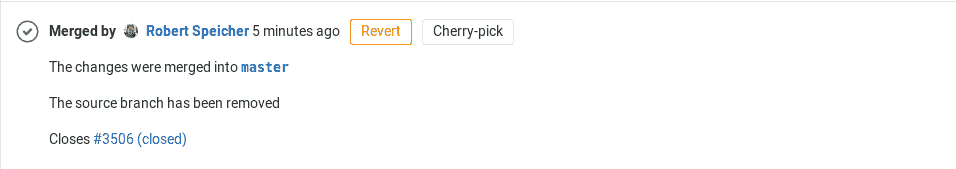
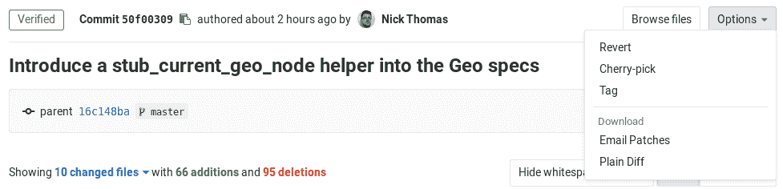

# Cherry-pick changes

> 原文：[https://docs.gitlab.com/ee/user/project/merge_requests/cherry_pick_changes.html](https://docs.gitlab.com/ee/user/project/merge_requests/cherry_pick_changes.html)

*   [Cherry-picking a merge request](#cherry-picking-a-merge-request)
    *   [Cherry-pick tracking](#cherry-pick-tracking)
*   [Cherry-picking a commit](#cherry-picking-a-commit)

# Cherry-pick changes[](#cherry-pick-changes "Permalink")

GitLab 实现了 Git 的强大功能，通过在合并请求和提交详细信息中引入**Cherry-pick**按钮来[挑选任何提交](https://git-scm.com/docs/git-cherry-pick "Git Cherry-Pick 文档") .

## Cherry-picking a merge request[](#cherry-picking-a-merge-request "Permalink")

合并请求合并后，将可以使用**Cherry-pick**按钮来选择该合并请求引入的更改.

[](img/cherry_pick_changes_mr.png)

单击该按钮后，将出现一个模态，显示一个[分支过滤器搜索框](../repository/branches/index.html#branch-filter-search-box) ，您可以在其中选择：

*   将更改直接选择到所选分支中.
*   使用经过精心挑选的更改创建一个新的合并请求.

### Cherry-pick tracking[](#cherry-pick-tracking "Permalink")

在 GitLab 12.9 中[引入](https://gitlab.com/groups/gitlab-org/-/epics/2675) .

当您选择一个合并提交时，GitLab 将向相关的合并请求线程输出系统注释，使新提交与现有合并请求交联.

[](img/cherry_pick_mr_timeline_v12_9.png)

每个部署的[关联合并请求列表](../../../api/deployments.html#list-of-merge-requests-associated-with-a-deployment)将包括精心挑选的合并提交.

**注意：**我们仅跟踪从 GitLab（UI 和 API）执行的 cherry-pick. 计划在将来的发行版中支持[通过命令行跟踪精心挑选的提交](https://gitlab.com/gitlab-org/gitlab/-/issues/202215) .

## Cherry-picking a commit[](#cherry-picking-a-commit "Permalink")

您可以从提交详细信息页面中挑选一个提交：

[](img/cherry_pick_changes_commit.png)

与选择合并请求类似，您可以选择将更改直接选择到目标分支中，也可以选择创建新的合并请求以选择更改.

请注意，在进行樱桃挑选合并提交时，主线将始终是第一父级. 如果要使用其他主线，则需要从命令行执行.

这是一个使用第二个父级作为主线来挑选合并提交的快速示例：

```
git cherry-pick -m 2 7a39eb0 
```