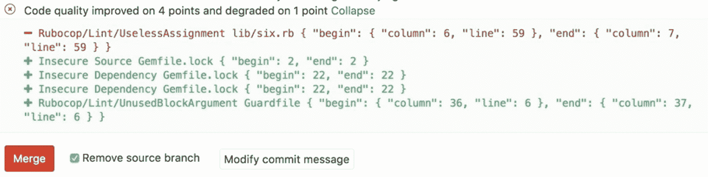

# Code Quality

> 原文：[https://docs.gitlab.com/ee/user/project/merge_requests/code_quality.html](https://docs.gitlab.com/ee/user/project/merge_requests/code_quality.html)

*   [Use cases](#use-cases)
*   [Example configuration](#example-configuration)
    *   [Previous job definitions](#previous-job-definitions)
*   [Configuring jobs using variables](#configuring-jobs-using-variables)
*   [Implementing a custom tool](#implementing-a-custom-tool)
*   [Code Quality reports](#code-quality-reports)
*   [Extending functionality](#extending-functionality)
    *   [Using Analysis Plugins](#using-analysis-plugins)
*   [Troubleshooting](#troubleshooting)
    *   [Changing the default configuration has no effect](#changing-the-default-configuration-has-no-effect)
    *   [No Code Quality report is displayed in a Merge Request](#no-code-quality-report-is-displayed-in-a-merge-request)
    *   [Only a single Code Quality report is displayed, but more are defined](#only-a-single-code-quality-report-is-displayed-but-more-are-defined)

# Code Quality[](#code-quality-starter "Permalink")

[Introduced](https://gitlab.com/gitlab-org/gitlab/-/merge_requests/1984) in [GitLab Starter](https://about.gitlab.com/pricing/) 9.3.

确保项目的代码保持简单，易读和易于贡献可能会引起问题. 借助[GitLab CI / CD](../../../ci/README.html) ，您可以使用 GitLab 代码质量分析源代码质量.

代码质量：

*   使用[Code Climate Engines](https://codeclimate.com) ，它们是免费的开放源代码. 代码质量不需要"代码气候"订阅.
*   使用[默认的 Code Climate 配置](https://gitlab.com/gitlab-org/ci-cd/codequality/-/tree/master/codeclimate_defaults)在[GitLab Code Quality](https://gitlab.com/gitlab-org/ci-cd/codequality)项目中构建的 Docker 映像在[管道中](../../../ci/pipelines/index.html)运行.
*   可以利用[模板](#example-configuration) .
*   可与[Auto DevOps 一起使用](../../../topics/autodevops/stages.html#auto-code-quality-starter) .
*   可以通过[分析插件](https://docs.codeclimate.com/docs/list-of-engines)或[自定义工具](#implementing-a-custom-tool)进行扩展.

更进一步，GitLab 可以在合并请求小部件区域中显示"代码质量"报告：

[](img/code_quality.png)

观看实践中的代码质量快速演练：

观看视频： [代码质量：快速运行](https://www.youtube.com/watch?v=B32LxtJKo9M) .

<figure class="video-container"><iframe src="https://www.youtube.com/embed/B32LxtJKo9M" frameborder="0" allowfullscreen=""></iframe></figure>

**注意：**对于一位客户，审核员发现，在 GitLab CI / CD 中使代码质量，SAST 和容器扫描全部自动化几乎比手动审核要好！ [阅读更多](https://about.gitlab.com/customers/bi_worldwide/) .

另请参阅" [可维护性支持的语言](https://docs.codeclimate.com/docs/supported-languages-for-maintainability)的代码气候列表".

## Use cases[](#use-cases "Permalink")

例如，考虑以下工作流程：

1.  您的后端团队成员将开始新的实施，以更快地使您的应用中的某些功能.
2.  通过代码质量报告，他们可以分析其实施如何影响代码质量.
3.  The metrics show that their code degrades the quality by 10 points.
4.  您要求同事来帮助他们进行此修改.
5.  他们都将对更改进行处理，直到"代码质量"报告显示不降级，仅显示改进.
6.  您批准合并请求并授权其部署到暂存.
7.  验证后，其更改将部署到生产中.

## Example configuration[](#example-configuration "Permalink")

**注意：** GitLab 11.11 和更高版本支持以下所示的作业定义. 它还需要 GitLab Runner 11.5 或更高版本. 对于早期版本，请使用[先前的作业定义](#previous-job-definitions) .

本示例说明如何使用 GitLab CI / CD 和 Docker 在代码上运行代码质量.

首先，您需要配置 GitLab Runner：

*   对于[Docker-in-Docker 工作流程](../../../ci/docker/using_docker_build.html#use-docker-in-docker-workflow-with-docker-executor) .
*   有足够的磁盘空间来处理生成的代码质量文件. 例如，在[GitLab 项目上](https://gitlab.com/gitlab-org/gitlab) ，文件约为 7 GB.

设置运行器后，在您的 CI 配置中包括代码质量模板：

```
include:
  - template: Code-Quality.gitlab-ci.yml 
```

上面的示例将在 CI / CD 管道中创建一个`code_quality`作业，该作业将扫描源代码以查看代码质量问题. 该报告将另存为["代码质量"报告工件](../../../ci/pipelines/job_artifacts.html#artifactsreportscodequality-starter) ，您以后可以下载和分析该[工件](../../../ci/pipelines/job_artifacts.html#artifactsreportscodequality-starter) .

通过设置`CODE_QUALITY_IMAGE`变量，也可以覆盖 URL 到"代码质量"图像. 如果您想锁定特定版本的 Code Quality 或使用其中的一个分支，这将特别有用：

```
include:
  - template: Code-Quality.gitlab-ci.yml

code_quality:
  variables:
    CODE_QUALITY_IMAGE: "registry.example.com/codequality-fork:latest" 
```

默认情况下，报告工件不可下载. 如果需要在工作详细信息页面上下载它们，则可以将`gl-code-quality-report.json`到工件路径，如下所示：

```
include:
  - template: Code-Quality.gitlab-ci.yml

code_quality:
  artifacts:
    paths: [gl-code-quality-report.json] 
```

包含的`code_quality`作业正在`test`阶段运行，因此需要将其包含在 CI 配置中，如下所示：

```
stages:
  - test 
```

**提示：**该信息将被自动提取并显示在合并请求小部件中.**注意：**在自我管理的实例上，如果恶意行为者破坏了 Code Quality 作业定义，则他们将能够在 Runner 主机上执行特权的 Docker 命令. 拥有适当的访问控制策略，可以通过仅允许访问受信任的参与者来减轻这种攻击.

### Previous job definitions[](#previous-job-definitions "Permalink")

**警告：**在 GitLab 11.5 之前，必须专门命名代码质量作业和工件以自动提取报告数据并将其显示在合并请求小部件中. 尽管这些旧的作业定义仍然保留，但它们已被弃用，并且在 GitLab 12.0 或更高版本中不再受支持. 建议您更新`.gitlab-ci.yml`配置以反映该更改.

对于 GitLab 11.5 及更高版本，该工作应如下所示：

```
code_quality:
  image: docker:stable
  variables:
    DOCKER_DRIVER: overlay2
  allow_failure: true
  services:
    - docker:stable-dind
  script:
    - export SP_VERSION=$(echo "$CI_SERVER_VERSION" | sed 's/^\([0-9]*\)\.\([0-9]*\).*/\1-\2-stable/')
    - docker run
        --env SOURCE_CODE="$PWD"
        --volume "$PWD":/code
        --volume /var/run/docker.sock:/var/run/docker.sock
        "registry.gitlab.com/gitlab-org/ci-cd/codequality:$SP_VERSION" /code
  artifacts:
    reports:
      codequality: gl-code-quality-report.json 
```

在 GitLab 12.6 中，"代码质量"切换到了[新的版本控制方案](https://gitlab.com/gitlab-org/ci-cd/codequality#versioning-and-release-cycle) . 强烈建议包括代码质量模板，如[示例配置](#example-configuration)所示，该模板使用新的版本控制方案. 如果不使用模板，则可以将`SP_VERSION`变量硬编码为使用新的映像版本：

```
code_quality:
  image: docker:stable
  variables:
    DOCKER_DRIVER: overlay2
    SP_VERSION: 0.85.6
  allow_failure: true
  services:
    - docker:stable-dind
  script:
    - docker run
        --env SOURCE_CODE="$PWD"
        --volume "$PWD":/code
        --volume /var/run/docker.sock:/var/run/docker.sock
        "registry.gitlab.com/gitlab-org/ci-cd/codequality:$SP_VERSION" /code
  artifacts:
    reports:
      codequality: gl-code-quality-report.json 
```

对于 GitLab 11.4 和更早版本，该工作应如下所示：

```
code_quality:
  image: docker:stable
  variables:
    DOCKER_DRIVER: overlay2
  allow_failure: true
  services:
    - docker:stable-dind
  script:
    - export SP_VERSION=$(echo "$CI_SERVER_VERSION" | sed 's/^\([0-9]*\)\.\([0-9]*\).*/\1-\2-stable/')
    - docker run
        --env SOURCE_CODE="$PWD"
        --volume "$PWD":/code
        --volume /var/run/docker.sock:/var/run/docker.sock
        "registry.gitlab.com/gitlab-org/ci-cd/codequality:$SP_VERSION" /code
  artifacts:
      paths: [gl-code-quality-report.json] 
```

或者，作业名称可以是`codeclimate`或`codequality` ，工件名称可以是`codeclimate.json` . 这些名称已在 GitLab 11.0 中弃用，并可能在下一个主要版本 GitLab 12.0 中删除.

对于 GitLab 10.3 及更早版本，该工作应如下所示：

```
codequality:
  image: docker:latest
  variables:
    DOCKER_DRIVER: overlay
  services:
    - docker:dind
  script:
    - docker pull codeclimate/codeclimate:0.69.0
    - docker run --env CODECLIMATE_CODE="$PWD" --volume "$PWD":/code --volume /var/run/docker.sock:/var/run/docker.sock --volume /tmp/cc:/tmp/cc codeclimate/codeclimate:0.69.0 init
    - docker run --env CODECLIMATE_CODE="$PWD" --volume "$PWD":/code --volume /var/run/docker.sock:/var/run/docker.sock --volume /tmp/cc:/tmp/cc codeclimate/codeclimate:0.69.0 analyze -f json > codeclimate.json || true
  artifacts:
    paths: [codeclimate.json] 
```

## Configuring jobs using variables[](#configuring-jobs-using-variables "Permalink")

代码质量作业支持环境变量，用户可以将其设置为在运行时配置作业执行.

For a list of available environment variables, see [Environment variables](https://gitlab.com/gitlab-org/ci-cd/codequality#environment-variables).

## Implementing a custom tool[](#implementing-a-custom-tool "Permalink")

可以使用自定义工具在 GitLab 中提供代码质量报告. 去做这个：

1.  在`.gitlab-ci.yml`文件中定义一个生成[代码质量报告工件的作业](../../../ci/pipelines/job_artifacts.html#artifactsreportscodequality-starter) .
2.  配置您的工具以将代码质量报告工件作为 JSON 文件生成，该文件实现了[Code Climate 规范](https://github.com/codeclimate/platform/blob/master/spec/analyzers/SPEC.md#data-types)的子集.

代码质量报告工件 JSON 文件必须包含具有以下属性的对象数组：

| Name | Description |
| --- | --- |
| `description` | A description of the code quality violation. |
| `fingerprint` | 用于识别代码质量违规的唯一指纹. 例如，MD5 哈希. |
| `location.path` | 包含代码质量违规的文件的相对路径. |
| `location.lines.begin` | 发生代码质量违规的行. |

Example:

```
[  {  "description":  "'unused' is assigned a value but never used.",  "fingerprint":  "7815696ecbf1c96e6894b779456d330e",  "location":  {  "path":  "lib/index.js",  "lines":  {  "begin":  42  }  }  }  ] 
```

**注意：**尽管 Code Climate 规范支持更多属性，但 GitLab 会忽略这些属性.

## Code Quality reports[](#code-quality-reports "Permalink")

代码质量工作完成后：

*   管道生成的违反代码质量的完整列表可在"管道详细信息"页面的"代码质量"选项卡中找到.
*   代码质量的潜在更改直接在合并请求中显示. 合并请求中的"代码质量"窗口小部件比较分支基础和头部的报告，然后列出合并分支时将解决或创建的所有违例.
*   完整的 JSON 报告可作为`code_quality`作业的可[下载工件](../../../ci/pipelines/job_artifacts.html#downloading-artifacts)获得.

## Extending functionality[](#extending-functionality "Permalink")

### Using Analysis Plugins[](#using-analysis-plugins "Permalink")

如果有需要延长的代码质量所提供的默认功能，如在规定[的代码质量](#code-quality-starter) ， [分析插件](https://docs.codeclimate.com/docs/list-of-engines)可供选择.

例如，要使用[SonarJava 分析器](https://docs.codeclimate.com/docs/sonar-java) ，请在存储库的根目录中添加一个名为`.codeclimate.yml`的文件， `.codeclimate.yml`包含插件的[启用代码](https://docs.codeclimate.com/docs/sonar-java#enable-the-plugin) ：

```
version: "2"
plugins:
  sonar-java:
    enabled: true 
```

这会将 SonarJava 添加到项目中[默认`.codeclimate.yml`](https://gitlab.com/gitlab-org/ci-cd/codequality/-/blob/master/codeclimate_defaults/.codeclimate.yml)的`plugins:`部分.

对`plugins:`部分的更改不会影响 defeault `.codeclimate.yml`的`exclude_patterns`部分. 有关更多详细信息，请参见代码气候文档以[排除文件和文件夹](https://docs.codeclimate.com/docs/excluding-files-and-folders) .

这是[一个示例项目](https://gitlab.com/jheimbuck_gl/jh_java_example_project) ， [该示例项目](https://gitlab.com/jheimbuck_gl/jh_java_example_project)将 Code Quality 与`.codeclimate.yml`文件一起使用.

## Troubleshooting[](#troubleshooting "Permalink")

### Changing the default configuration has no effect[](#changing-the-default-configuration-has-no-effect "Permalink")

一个普遍的问题是`Code Quality` （特定于 GitLab）和`Code Climate` （GitLab 使用的引擎）这两个术语非常相似. 您必须添加**`.codeclimate.yml`**文件来更改默认配置， **而不是** `.codequality.yml`文件. 如果使用错误的文件名，仍将使用[默认的`.codeclimate.yml`](https://gitlab.com/gitlab-org/ci-cd/codequality/-/blob/master/codeclimate_defaults/.codeclimate.yml) .

### No Code Quality report is displayed in a Merge Request[](#no-code-quality-report-is-displayed-in-a-merge-request "Permalink")

这可能是由于多种原因：

*   您刚刚在`.gitlab-ci.yml`添加了代码质量工作. 该报告尚无可比较的内容，因此无法显示任何信息. 将来的合并请求将具有可比性.
*   如果未[检测到降级或错误](https://docs.codeclimate.com/docs/maintainability#section-checks) ，则不会显示任何内容.
*   [`artifacts:expire_in`](../../../ci/yaml/README.html#artifactsexpire_in) CI / CD 设置可能导致代码质量构件过期快于所需.
*   `codeclimate.json`较大的`codeclimate.json`文件（尤其是> 10 MB）会[阻止报告的显示](https://gitlab.com/gitlab-org/gitlab/-/issues/2737) . 解决方法是，尝试删除[GitLab 忽略的](#implementing-a-custom-tool) [属性](https://github.com/codeclimate/platform/blob/master/spec/analyzers/SPEC.md#data-types) . 您可以：
    *   配置代码质量工具以不输出那些类型.
    *   在作业完成之前，请在`.gitlab-ci.yml`脚本中使用`sed` ， `awk`或类似命令来编辑`codeclimate.json` .

### Only a single Code Quality report is displayed, but more are defined[](#only-a-single-code-quality-report-is-displayed-but-more-are-defined "Permalink")

GitLab 仅使用最新创建的作业（具有最大的作业 ID）的代码质量工件. 如果管道中的多个作业生成代码质量工件，则较早作业的那些将被忽略. 为避免混淆，仅配置一个作业即可生成`codeclimate.json` .