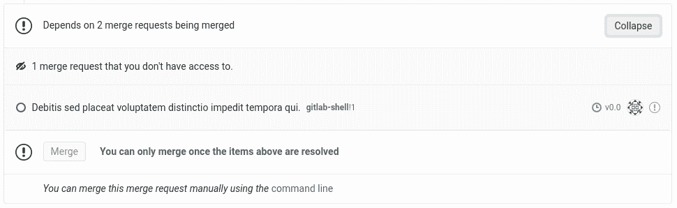

# Merge Request dependencies

> 原文：[https://docs.gitlab.com/ee/user/project/merge_requests/merge_request_dependencies.html](https://docs.gitlab.com/ee/user/project/merge_requests/merge_request_dependencies.html)

*   [Use cases](#use-cases)
*   [Configuration](#configuration)
*   [Limitations](#limitations)

# Merge Request dependencies

版本历史

*   在[GitLab Premium](https://about.gitlab.com/pricing/) 12.2 中[引入](https://gitlab.com/gitlab-org/gitlab/-/issues/9688) .
*   在[GitLab Premium](https://about.gitlab.com/pricing/) 12.4 中从"跨项目依赖项" [重命名](https://gitlab.com/gitlab-org/gitlab/-/merge_requests/17291)为"合并请求依赖项".
*   [GitLab Premium](https://about.gitlab.com/pricing/) 12.4 中[引入](https://gitlab.com/gitlab-org/gitlab/-/merge_requests/16799)了项目内 MR 依赖关系.

合并请求相关性允许表达合并请求之间的合并所需顺序. 如果合并请求"依赖"另一个请求，则在合并其依赖项之前，不能将其合并.

**注意：**合并请求依赖项是**PREMIUM**功能，但是此限制仅对依赖合并请求强制执行. **CORE**或**STARTER**项目中的合并请求可以是**PREMIUM**合并请求的依赖项，反之亦然.

## Use cases

*   在更改导入库的项目之前，请确保对库的更改已合并.
*   在实现要记录功能的合并请求之前，防止仅文档合并请求被合并.
*   在合并来自尚未被授予权限的人的合并请求之前，要求合并请求更新要合并的权限矩阵.

单个逻辑更改通常会跨越多个合并请求，并分散到多个项目中，并且合并的顺序可能很重要.

例如，给定项目`mycorp/awesome-project`在`myfriend/awesome-lib`处导入了库，在`awesome-project`添加功能可能**还**需要更改`awesome-lib` ，因此需要两个合并请求. 在`awesome-lib`之前合并`awesome-project`合并请求会破坏`master`分支.

`awesome-project`合并请求可以[标记为**Draft**](work_in_progress_merge_requests.html) ，注释中包含所述草案的原因. 但是，这要求手动跟踪`awesome-lib`合并请求的状态，并且如果`awesome-project`合并请求依赖于对其他**几个**项目的更改，则伸缩性不好.

通过使`awesome-project`合并请求依赖于`awesome-lib`合并请求，此关系将由 GitLab 自动跟踪，草稿状态可用于在每个单独的合并请求中传达代码的就绪状态.

## Configuration

要继续上面的示例，您可以在`awesome-project`创建新的合并请求时配置依赖项（或通过编辑（如果已经存在））. 需要在**依赖**合并请求上配置**依赖** . 表单中有一个" **合并请求依赖项"**部分：

任何可以编辑合并请求的人都可以更改依赖关系列表.

可以通过引用或 URL 添加新的依赖项. 要删除依赖项，请按其引用旁边的**X.**

由于可以在项目之间指定依赖关系，因此其他人可能为您无权访问的项目中的合并请求添加了依赖关系. 这些显示为简单计数：

如有必要，您可以按**X**来删除所有类似的依赖项，就像对单个可见的依赖项一样.

完成后，请按" **保存更改"**按钮以提交请求，或按" **取消"**以不做任何更改地返回.

合并请求窗口小部件中显示了已配置依赖项的列表以及每个依赖项的状态：

在所有依赖项本身都被合并之前，对于依赖项合并请求将禁用" **合并"**按钮. 特别要注意的是， **封闭的合并请求**仍会阻止其依赖项被合并-无法自动确定是否已以其他某种方式满足了由封闭的合并请求表示的依赖关系.

如果已关闭合并请求**，**并且依赖项不再相关，则必须在合并之前按照上述说明将其作为依赖项除去.

## Limitations

*   API 支持： [问题＃12551](https://gitlab.com/gitlab-org/gitlab/-/issues/12551)
*   在项目导出/导入之间未保留依赖项： [问题＃12549](https://gitlab.com/gitlab-org/gitlab/-/issues/12549)
*   不支持复杂的合并顺序相关性： [问题＃11393](https://gitlab.com/gitlab-org/gitlab/-/issues/11393)

最后一项值得更多解释. 合并请求之间的依赖关系可以描述为关系图. 最简单的图可能有一个合并请求，该合并请求取决于另一个：

图 LR; myfriend / awesome-lib！10-> mycorp / awesome-project！100;

更为复杂（且仍受支持）的图可能具有一个合并请求，该合并请求直接取决于其他几个：

图 LR; myfriend / awesome-lib！10-> mycorp / awesome-project！100; herfriend / another-lib！1-> mycorp / awesome-project！100;

几个不同的合并请求也可以直接依赖于同一合并请求：

图 LR; herfriend / another-lib！1-> myfriend / awesome-lib！10; herfriend / another-lib！1-> mycorp / awesome-project！100;

**不**支持的是依赖项的"深度"或"嵌套"图. 例如：

图 LR; herfriend / another-lib！1-> myfriend / awesome-lib！10; myfriend / awesome-lib！10-> mycorp / awesome-project！100;

在此示例中， `myfriend/awesome-lib!10`取决于`herfriend/another-lib!1` ，它本身是`mycorp/awesome-project!100`的依赖项. 这意味着`myfriend/awesome-lib!10`成为`mycorp/awesome-project!100`的**间接**依赖项，尚不受支持.