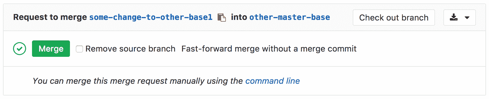
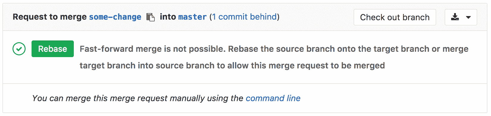
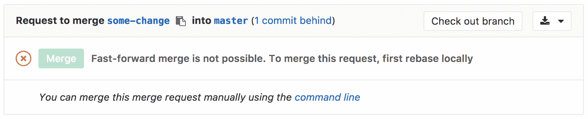

# Fast-forward merge requests

> 原文：[https://docs.gitlab.com/ee/user/project/merge_requests/fast_forward_merge.html](https://docs.gitlab.com/ee/user/project/merge_requests/fast_forward_merge.html)

*   [Overview](#overview)
*   [Enabling fast-forward merges](#enabling-fast-forward-merges)

# Fast-forward merge requests

有时，工作流策略可能会强制要求没有合并提交的干净提交历史记录. 在这种情况下，快速合并是理想的选择.

使用快速转发合并请求，您可以保留线性 Git 历史记录以及一种无需创建合并提交即可接受合并请求的方法.

## Overview

启用快进合并（ [`--ff-only`](https://git-scm.com/docs/git-merge#git-merge---ff-only) ）设置时，将不会创建任何合并提交，并且所有合并都将被快速转发，这意味着仅当分支可以被快速转发时才允许合并.

当无法进行快速合并时，将为用户提供重新设置基准的选项.

## Enabling fast-forward merges

1.  导航到项目的**设置，**然后搜索"合并方法"
2.  选择**快速合并**选项
3.  点击**保存更改**以使更改生效

现在，当您访问合并请求页面时， **只有在可能进行快速**合并的情况下，您才能接受它.

如果无法进行快速合并，但可以进行无冲突的变基，则将提供一个变基按钮.

如果目标分支位于源分支的前面，并且无法进行无冲突的变基，则需要先在本地对源分支进行变基，然后才能进行快速合并.

