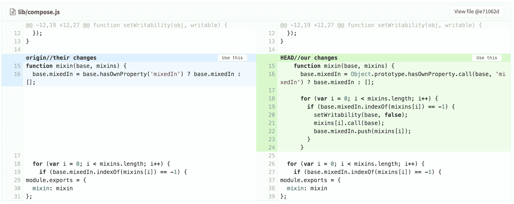

# Merge request conflict resolution

> 原文：[https://docs.gitlab.com/ee/user/project/merge_requests/resolve_conflicts.html](https://docs.gitlab.com/ee/user/project/merge_requests/resolve_conflicts.html)

*   [Resolve conflicts: interactive mode](#resolve-conflicts-interactive-mode)
*   [Resolve conflicts: inline editor](#resolve-conflicts-inline-editor)
*   [Conflicts available for resolution](#conflicts-available-for-resolution)

# Merge request conflict resolution

当两个分支具有无法自动合并的不同更改时，将发生合并冲突.

在大多数情况下，Git 能够自动合并分支之间的更改，但是在某些情况下，Git 需要您的帮助来手动解决冲突. 通常，当人们更改同一文件的相同部分时，这是必需的.

在解决所有冲突之前，GitLab 将阻止合并请求. 冲突可以在本地解决，也可以在许多情况下在 GitLab 中解决（有关何时可用的信息，请参见可解决的[冲突](#conflicts-available-for-resolution) ）.

**注意：** GitLab 通过在未自动合并到目标分支的源分支中创建合并提交来解决冲突. 这允许在合并更改之前对合并提交进行检查和测试，从而防止意外更改进入目标分支而无需检查或破坏构建.

## Resolve conflicts: interactive mode

在 GitLab 8.11 中[引入](https://gitlab.com/gitlab-org/gitlab-foss/-/merge_requests/5479) .

单击此按钮将显示有冲突的文件列表，突出显示冲突部分：

一旦所有冲突都标记为使用"我们的"或"他们的"，则可以解决冲突. 这将执行合并请求的目标分支到源分支的合并，使用选择的选项解决冲突. 如果源分支是`feature` ，目标分支是`master` ，则类似于执行`git checkout feature; git merge master` `git checkout feature; git merge master`本地`git checkout feature; git merge master` .

## Resolve conflicts: inline editor

[Introduced](https://gitlab.com/gitlab-org/gitlab-foss/-/merge_requests/6374) in GitLab 8.13.

合并冲突解决编辑器允许更复杂的合并冲突，需要用户手动修改文件以解决冲突，才能从 GitLab 界面中解决. 使用**内联编辑**按钮打开编辑器. 确定更改后，请单击" **提交到源"分支**按钮.

## Conflicts available for resolution

GitLab 允许解决以下所有条件均成立的文件中的冲突：

*   该文件是文本，不是二进制
*   该文件采用 UTF-8 兼容编码
*   该文件尚未包含冲突标记
*   添加了冲突标记的文件大小不超过 200 KB
*   该文件在两个分支中位于相同路径下

如果该合并请求中有冲突的任何文件均不满足所有这些条件，则无法在 UI 中解决该合并请求的冲突.

此外，GitLab 不会在路径之外的重命名中检测到冲突. 例如，这不会造成冲突：在分支`a`执行`git mv file1 file2` ； 在分支`b` ，执行`git mv file1 file3` . 而是，合并请求合并后，两个文件都将出现在分支中.