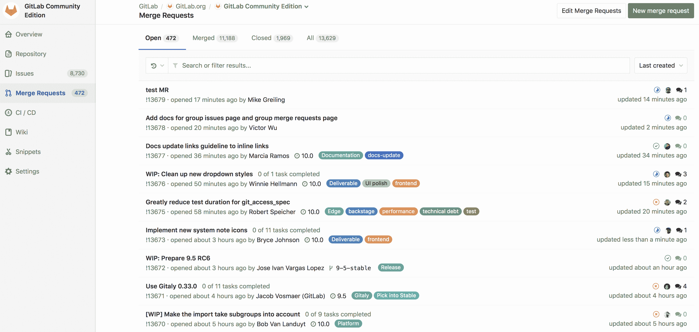
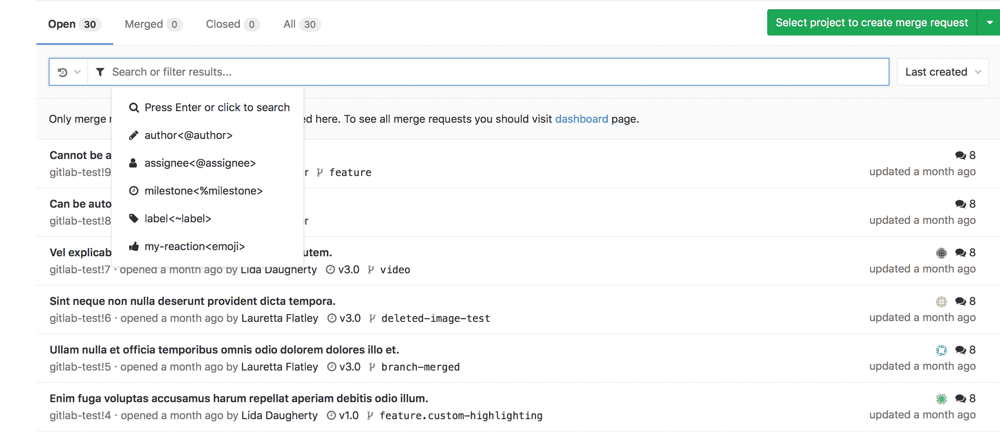
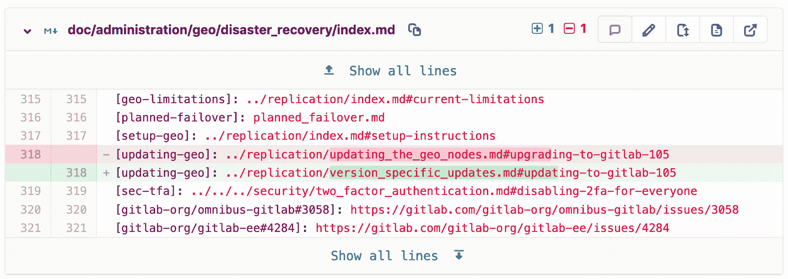
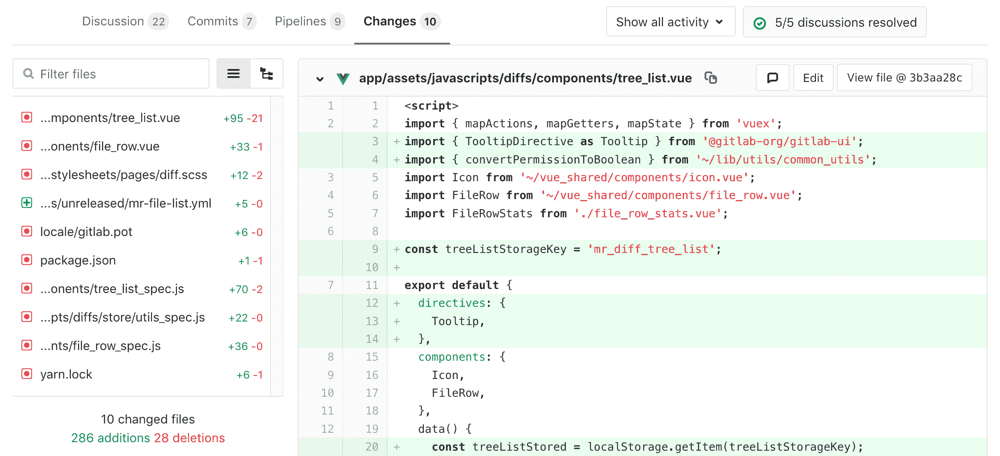
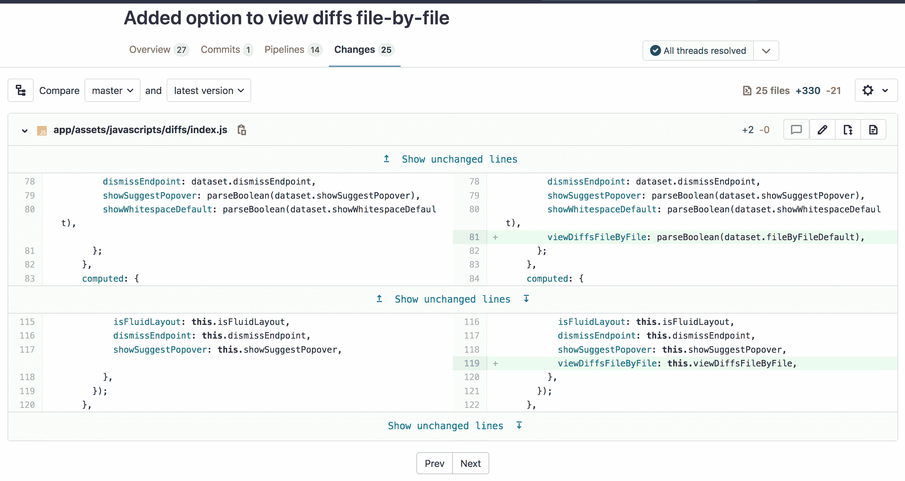
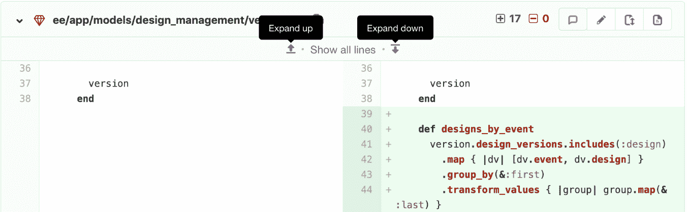
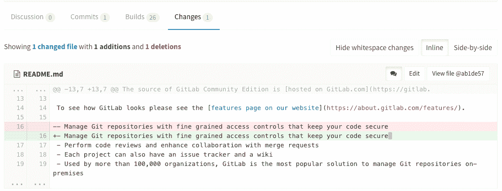
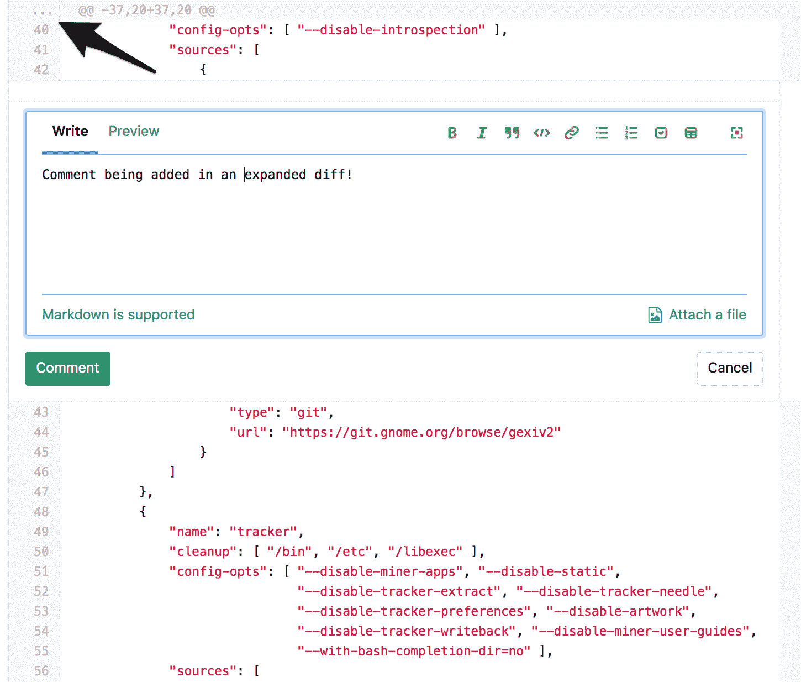
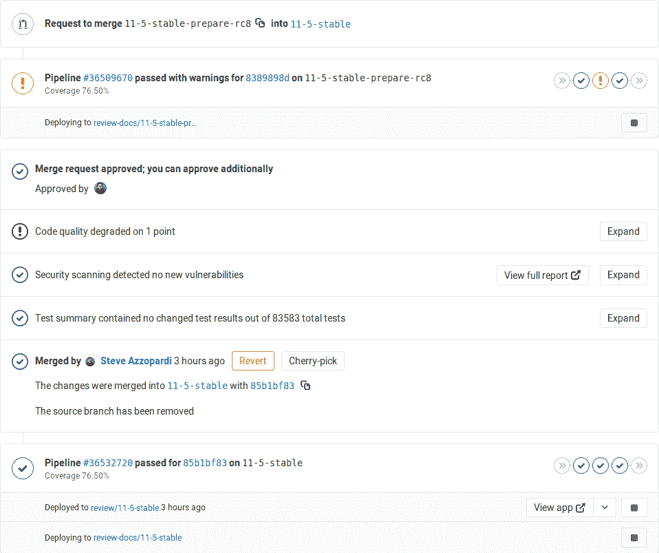

# Reviewing and managing merge requests

> 原文：[https://docs.gitlab.com/ee/user/project/merge_requests/reviewing_and_managing_merge_requests.html](https://docs.gitlab.com/ee/user/project/merge_requests/reviewing_and_managing_merge_requests.html)

*   [View project merge requests](#view-project-merge-requests)
*   [View merge requests for all projects in a group](#view-merge-requests-for-all-projects-in-a-group)
*   [Semi-linear history merge requests](#semi-linear-history-merge-requests)
*   [View changes between file versions](#view-changes-between-file-versions)
    *   [Merge request diff file navigation](#merge-request-diff-file-navigation)
    *   [File-by-file diff navigation](#file-by-file-diff-navigation)
        *   [Enable or disable file-by-file diff navigation](#enable-or-disable-file-by-file-diff-navigation-core-only)
    *   [Merge requests commit navigation](#merge-requests-commit-navigation)
    *   [Incrementally expand merge request diffs](#incrementally-expand-merge-request-diffs)
    *   [Ignore whitespace changes in Merge Request diff view](#ignore-whitespace-changes-in-merge-request-diff-view)
*   [Perform inline code reviews](#perform-inline-code-reviews)
*   [Pipeline status in merge requests widgets](#pipeline-status-in-merge-requests-widgets)
    *   [Post-merge pipeline status](#post-merge-pipeline-status)
    *   [Merge when pipeline succeeds (MWPS)](#merge-when-pipeline-succeeds-mwps)
    *   [Live preview with Review Apps](#live-preview-with-review-apps)
*   [Associated features](#associated-features)
*   [Troubleshooting](#troubleshooting)
    *   [Merge request cannot retrieve the pipeline status](#merge-request-cannot-retrieve-the-pipeline-status)
        *   [Sidekiq](#sidekiq)
        *   [Bug](#bug)
*   [Tips](#tips)
    *   [Checkout merge requests locally](#checkout-merge-requests-locally)
        *   [Checkout locally by adding a Git alias](#checkout-locally-by-adding-a-git-alias)
        *   [Checkout locally by modifying `.git/config` for a given repository](#checkout-locally-by-modifying-gitconfig-for-a-given-repository)

# Reviewing and managing merge requests[](#reviewing-and-managing-merge-requests "Permalink")

合并请求是在 GitLab 项目中更改文件的主要方法. 通过[创建并提交合并请求](creating_merge_requests.html)来提出更改，然后将其审核并接受（或拒绝）.

## View project merge requests[](#view-project-merge-requests "Permalink")

导航到" **项目">"合并请求"，**以查看项目中的所有**合并请求** .

当您访问项目的合并请求时，GitLab 会将它们显示在列表中，并且您可以使用可用的选项卡来快速按打开和关闭进行过滤. 您还可以[搜索和过滤结果](../../search/index.html#filtering-issue-and-merge-request-lists) .

[](img/project_merge_requests_list_view.png)

## View merge requests for all projects in a group[](#view-merge-requests-for-all-projects-in-a-group "Permalink")

查看组中所有项目中的合并请求，包括组中所有后代子组的所有项目. 导航到**组>合并请求**以查看这些合并请求. 该视图还具有打开和关闭的合并请求选项卡.

您可以从此处[搜索和过滤结果](../../search/index.html#filtering-issue-and-merge-request-lists) .

[](img/group_merge_requests_list_view.png)

## Semi-linear history merge requests[](#semi-linear-history-merge-requests "Permalink")

将为每个合并创建一个合并提交，但是只有在可能进行快速合并的情况下才合并分支. 这样可以确保如果合并请求构建成功，则合并后目标分支构建也将成功.

导航到项目的设置，在" **合并请求：合并"方法**下选择" **使用半线性历史** **合并合并"**选项，然后保存更改.

## View changes between file versions[](#view-changes-between-file-versions "Permalink")

**更改**选项卡位于主要合并请求详细信息下方，并且在讨论选项卡旁边，显示了分支或提交之间文件的更改. 这种对文件更改的视图也称为**diff** . 默认情况下，差异视图将合并请求分支中的文件与目标分支中的文件进行比较.

The diff view includes the following:

*   文件的名称和路径.
*   添加和删​​除的行数.
*   用于以下选项的按钮：
    *   切换此文件的注释； 用于内联评论.
    *   在合并请求的分支中编辑文件.
    *   显示完整文件，以防您要查看上下文中文件其余部分的更改.
    *   在当前提交时查看文件.
    *   使用[Review Apps](../../../ci/review_apps/index.html)预览更改.
*   已更改的行，突出显示了特定的更改.

[](img/merge_request_diff_v12_2.png)

### Merge request diff file navigation[](#merge-request-diff-file-navigation "Permalink")

在" **更改"**选项卡中查看更改时，可以使用文件树或文件列表来浏览差异. 在具有许多更改的大型差异中滚动时，可以使用文件树或文件列表快速跳转到任何更改的文件.

[](img/merge_request_diff_file_navigation.png)

### File-by-file diff navigation[](#file-by-file-diff-navigation "Permalink")

版本历史

*   在 GitLab 13.2 中[引入](https://gitlab.com/gitlab-org/gitlab/-/issues/222790) .
*   它部署在默认情况下启用的功能标志后面.
*   建议用于生产.
*   在 GitLab.com 上启用了它.
*   对于 GitLab 自我管理的实例，GitLab 管理员可以选择[禁用它](#enable-or-disable-file-by-file-diff-navigation-core-only) .

对于较大的合并请求，有时一次查看单个文件可能会很有用. 要启用，请从右上角导航栏上的头像，单击**"设置"** ，然后转到左侧边栏上的**"首选项"** . 向下滚动到" **行为"**部分，然后**在合并请求的"更改"标签上**选择**"一次显示一个文件"** . 点击**保存更改**以应用.

从那里，在查看合并请求的" **更改"**选项卡时，一次只能看到一个文件. 然后，您可以单击按钮上**一个**和**下一个**以查看其他已更改的文件.

[](img/file_by_file_v13_2.png)

#### Enable or disable file-by-file diff navigation[](#enable-or-disable-file-by-file-diff-navigation-core-only "Permalink")

逐文件差异导航正在开发中，但已准备好用于生产. 它部署在**默认情况下启用**的功能标志的后面. [有权访问 GitLab Rails 控制台的 GitLab 管理员](../../../administration/feature_flags.html)可以选择为您的实例禁用它.

要启用它：

```
# Instance-wide
Feature.enable(:view_diffs_file_by_file) 
```

禁用它：

```
# Instance-wide
Feature.disable(:view_diffs_file_by_file>) 
```

### Merge requests commit navigation[](#merge-requests-commit-navigation "Permalink")

[Introduced](https://gitlab.com/gitlab-org/gitlab/-/issues/18140) in GitLab 13.0.

要在合并请求中的**提交**之间无缝导航，请从" **提交"**选项卡中，单击其中一个提交以打开单提交视图. 从那里，您可以通过单击页面右上角的**Prev**和**Next**按钮或使用`X`和`C`键盘快捷键在提交之间进行导航.

### Incrementally expand merge request diffs[](#incrementally-expand-merge-request-diffs "Permalink")

默认情况下，差异仅显示文件中已更改的部分. 要查看更改上方或下方的更多未更改行，请单击" **向上** **扩展"**或" **向下扩展"**图标. 您也可以单击**显示未更改的行**以展开整个文件.

[](img/incrementally_expand_merge_request_diffs_v12_2.png)

在 GitLab 13.1 中[引入](https://gitlab.com/gitlab-org/gitlab/-/issues/205401) ，当查看合并请求的**更改**选项卡时，如果仅重命名了某个文件，则可以通过单击**显示文件内容**展开它以查看全部**内容** .

### Ignore whitespace changes in Merge Request diff view[](#ignore-whitespace-changes-in-merge-request-diff-view "Permalink")

如果单击" **隐藏空白更改"**按钮，则可以看到没有空白更改的差异（如果有的话）. 在特定的提交页面上，这也可以工作.

[](img/merge_request_diff.png)

> **提示：**您可以在合并请求的差异页面上附加`?w=1` ，以忽略任何空格更改.

## Perform inline code reviews[](#perform-inline-code-reviews "Permalink")

在 GitLab 11.5 中[引入](https://gitlab.com/gitlab-org/gitlab-foss/-/issues/13950) .

GitLab 提供了一种在合并请求中更改文件的任何部分中保留注释的方法. 为此，请在"合并请求"差异 UI 的装订线中单击**…**按钮以展开差异行并留下评论，就像更改行一样.

[](img/comment-on-any-diff-line.png)

## Pipeline status in merge requests widgets[](#pipeline-status-in-merge-requests-widgets "Permalink")

如果您在项目中设置了[GitLab CI / CD](../../../ci/README.html) ，您将能够看到：

*   合并前和合并后管道以及环境信息（如果有）.
*   正在进行哪些部署.

如果存在[环境](../../../ci/environments/index.html)并且已将应用程序成功部署到该环境，则还将显示已部署的环境以及指向 Review App 的链接.

### Post-merge pipeline status[](#post-merge-pipeline-status "Permalink")

合并请求合并后，可以看到合并请求合并到的分支的合并后管道状态. 例如，当合并请求合并到 master 分支中，然后触发到暂存环境的部署时.

将显示正在进行的部署，以及环境的部署/部署状态. 如果是第一次部署分支，则该链接将返回`404`错误，直到完成. 在部署期间，停止按钮将被禁用. 如果管道无法部署，则部署信息将被隐藏.

[](img/merge_request_pipeline.png)

有关更多信息，请[阅读有关管道](../../../ci/pipelines/index.html) .

### Merge when pipeline succeeds (MWPS)[](#merge-when-pipeline-succeeds-mwps "Permalink")

设置一个看起来准备合并的合并请求，以[在 CI 管道成功时自动合并](merge_when_pipeline_succeeds.html) .

### Live preview with Review Apps[](#live-preview-with-review-apps "Permalink")

如果为项目配置了[Review Apps](https://about.gitlab.com/stages-devops-lifecycle/review-apps/) ，则可以逐分支预览通过合并请求提交给功能分支的更改. 无需检出分支机构，在本地安装和预览； 带有"评论应用"链接的任何人都可以预览所有更改.

设置了 GitLab 的" [路线图"后](../../../ci/review_apps/index.html#route-maps) ，合并请求小部件会将您直接带到已更改的页面，从而使预览建议的修改变得更加轻松快捷.

[Read more about Review Apps](../../../ci/review_apps/index.html).

## Associated features[](#associated-features "Permalink")

还有大量与合并请求关联的功能：

| Feature | Description |
| --- | --- |
| [Bulk editing merge requests](../../project/bulk_editing.html) | 同时更新多个合并请求的属性. |
| [Cherry-pick changes](cherry_pick_changes.html) | 只需在合并的合并请求或提交中单击**Cherry-pick**按钮，即可在 UI 中 Cherry-pick 任何**选择** . |
| [Fast-forward merge requests](fast_forward_merge.html) | 有关线性 Git 历史记录以及接受合并请求而不创建合并提交的方法 |
| [Find the merge request that introduced a change](versions.html) | 当查看提交详细信息页面时，GitLab 将链接到包含该提交的合并请求. |
| [Merge requests versions](versions.html) | 选择并比较合并请求差异的不同版本 |
| [Resolve conflicts](resolve_conflicts.html) | GitLab 可以提供选项来解决 GitLab UI 中的某些合并请求冲突. |
| [Revert changes](revert_changes.html) | 从合并请求中的任何提交还原更改. |

## Troubleshooting[](#troubleshooting "Permalink")

有时，合并请求中的操作并没有按预期进行，这是一些故障排除步骤.

### Merge request cannot retrieve the pipeline status[](#merge-request-cannot-retrieve-the-pipeline-status "Permalink")

如果 Sidekiq 没有足够快地进行更改，则会发生这种情况.

#### Sidekiq[](#sidekiq "Permalink")

Sidekiq 没有足够快地处理 CI 状态更改. 请等待几秒钟，状态将自动更新.

#### Bug[](#bug "Permalink")

发生以下情况时，无法检索合并请求管道的状态：

1.  创建合并请求
2.  合并请求已关闭
3.  在项目中进行了更改
4.  合并请求被重新打开

要正确检索管道状态，请再次关闭并重新打开"合并请求".

## Tips[](#tips "Permalink")

以下是一些技巧，可帮助您在命令行中更有效地处理合并请求.

> **注意：**此部分将来可能会在其自己的文档中移动.

### Checkout merge requests locally[](#checkout-merge-requests-locally "Permalink")

合并请求包含来自存储库的所有历史记录，以及添加到与合并请求关联的分支的其他提交. 这是一些在本地检出合并请求的技巧.

请注意，即使源项目是目标项目的分支（甚至是私有分支），也可以在本地签出合并请求.

#### Checkout locally by adding a Git alias[](#checkout-locally-by-adding-a-git-alias "Permalink")

将以下别名添加到`~/.gitconfig` ：

```
[alias]
    mr = !sh -c 'git fetch $1 merge-requests/$2/head:mr-$1-$2 && git checkout mr-$1-$2' - 
```

现在，您可以从任何存储库和任何远程签出特定的合并请求. 例如，要从`origin`远程服务器签出 ID 为 5 的合并请求（如 GitLab 所示），请执行以下操作：

```
git mr origin 5 
```

这会将合并请求提取到本地`mr-origin-5`分支中，并检出它.

#### Checkout locally by modifying `.git/config` for a given repository[](#checkout-locally-by-modifying-gitconfig-for-a-given-repository "Permalink")

在`.git/config`文件中找到适用于 GitLab 遥控器的部分. 看起来像这样：

```
[remote "origin"]
  url = https://gitlab.com/gitlab-org/gitlab-foss.git
  fetch = +refs/heads/*:refs/remotes/origin/* 
```

您可以使用以下方式打开文件：

```
git config -e 
```

现在，将以下行添加到上面的部分：

```
fetch = +refs/merge-requests/*/head:refs/remotes/origin/merge-requests/* 
```

最后，它应如下所示：

```
[remote "origin"]
  url = https://gitlab.com/gitlab-org/gitlab-foss.git
  fetch = +refs/heads/*:refs/remotes/origin/*
  fetch = +refs/merge-requests/*/head:refs/remotes/origin/merge-requests/* 
```

现在，您可以获取所有合并请求：

```
git fetch origin

...
From https://gitlab.com/gitlab-org/gitlab-foss.git
 * [new ref]         refs/merge-requests/1/head -> origin/merge-requests/1
 * [new ref]         refs/merge-requests/2/head -> origin/merge-requests/2
... 
```

并检查特定的合并请求：

```
git checkout origin/merge-requests/1 
```

以上所有操作均可通过[`git-mr`](https://gitlab.com/glensc/git-mr)脚本完成.