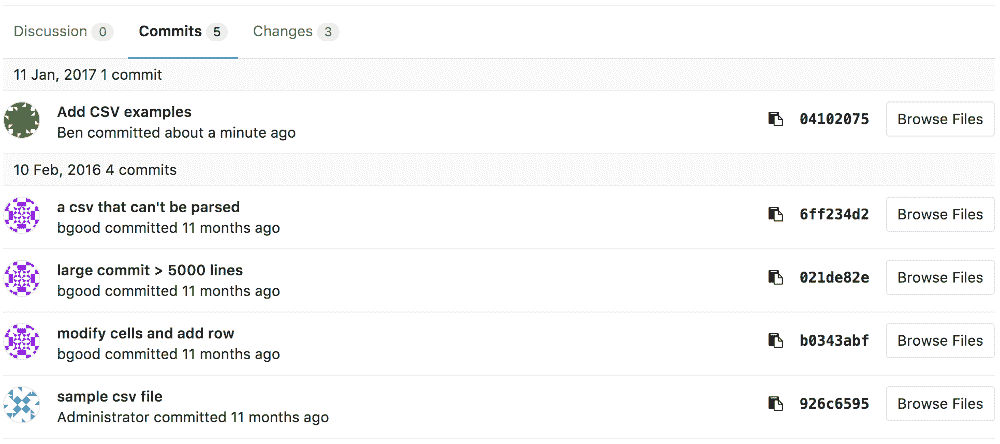
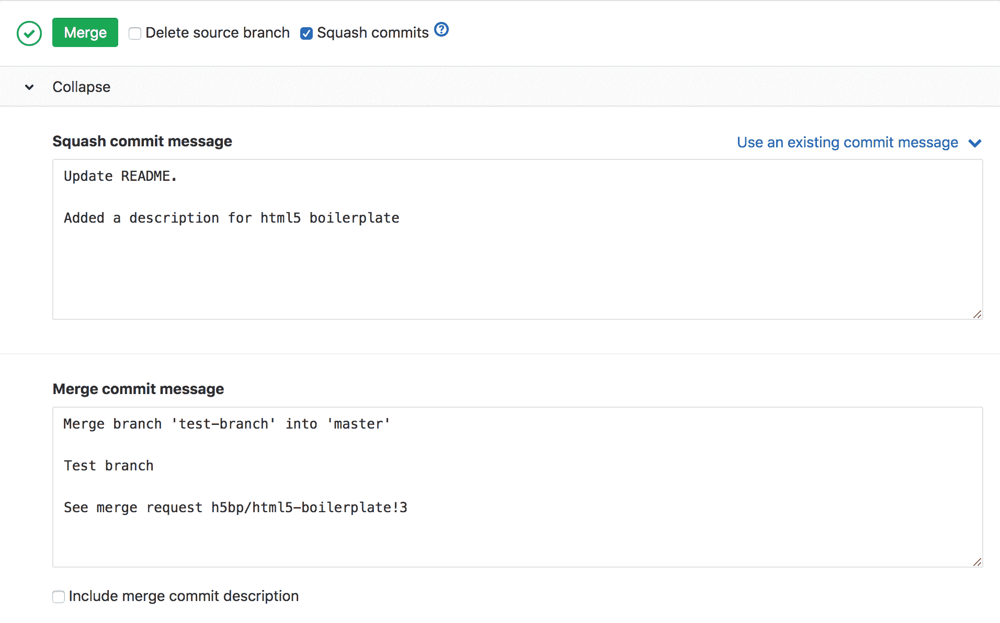
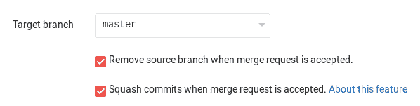

# Squash and merge

> 原文：[https://docs.gitlab.com/ee/user/project/merge_requests/squash_and_merge.html](https://docs.gitlab.com/ee/user/project/merge_requests/squash_and_merge.html)

*   [Overview](#overview)
*   [Use cases](#use-cases)
*   [Enabling squash for a merge request](#enabling-squash-for-a-merge-request)
*   [Commit metadata for squashed commits](#commit-metadata-for-squashed-commits)
*   [Squash and fast-forward merge](#squash-and-fast-forward-merge)
*   [Squash Commits Options](#squash-commits-options)
    *   [Enable or disable Squash Commit Options](#enable-or-disable-squash-commit-options-core-only)

# Squash and merge[](#squash-and-merge "Permalink")

版本历史

*   在[GitLab Starter](https://about.gitlab.com/pricing/) 8.17 中[引入](https://gitlab.com/gitlab-org/gitlab/-/merge_requests/1024) .
*   [移植](https://gitlab.com/gitlab-org/gitlab-foss/-/merge_requests/18956)到 GitLab Core 11.0\.

使用 squash 和 merge，您可以将所有合并请求的提交合并为一个并保留干净的历史记录.

## Overview[](#overview "Permalink")

通过压接，您可以在接受合并请求时整理分支的提交历史记录. 它将合并请求中的所有更改作为单个提交应用，然后使用为项目设置的合并方法合并该提交.

换句话说，挤压合并请求会变成一长串提交：

[](img/squash_mr_commits.png)

合并为单个提交：

[](img/squash_squashed_commit.png)

压缩的提交的提交消息将是：

*   取自合并中的第一条多行提交消息.
*   如果找不到多行提交消息，则合并请求的标题.

**注意：**仅在至少 2 次提交时，此选项才生效. 由于没有什么可压缩的，因此如果只有 1 次提交，则提交消息不会更改.

可以在合并合并请求之前对其进行自定义.

[](img/squash_mr_message.png)

**注意：**在此示例中，压缩的提交之后是合并提交，因为此示例存储库的合并方法使用了合并提交.

压缩也适用于快进合并策略，有关更多详细信息，请参见[压缩和快进合并](#squash-and-fast-forward-merge) .

## Use cases[](#use-cases "Permalink")

在功能分支上工作时，有时您想提交当前进度，但实际上并不关心提交消息. 这些"进行中的提交"不一定包含重要的信息，因此，您宁愿不将其包含在目标分支中.

使用 squash 和 merge，当准备好要合并的合并请求时，您要做的就是在按下 merge 之前将挤压启用，以将合并请求中的提交加入到单个提交中.

这样，您的基本分支的历史记录将保留有意义的提交消息，并且：

*   如有必要， [还原](revert_changes.html)更为简单.
*   合并的分支将保留完整的提交历史记录.

## Enabling squash for a merge request[](#enabling-squash-for-a-merge-request "Permalink")

可以创建或编辑合并请求的任何人都可以选择将其压缩在合并请求表单上：

[](img/squash_edit_form.png)

然后可以在接受合并请求时覆盖它：

[](img/squash_mr_widget.png)

## Commit metadata for squashed commits[](#commit-metadata-for-squashed-commits "Permalink")

压缩的提交具有以下元数据：

*   消息：壁球提交消息或自定义消息.
*   作者：合并请求的作者.
*   提交者：发起壁球的用户.

## Squash and fast-forward merge[](#squash-and-fast-forward-merge "Permalink")

当项目[启用](fast_forward_merge.html#enabling-fast-forward-merges)了[快进合并设置时](fast_forward_merge.html#enabling-fast-forward-merges) ，合并请求必须能够不压缩而进行快速转发以进行压缩. 这是因为压缩仅在接受合并请求时可用，因此即使挤压本身可以被认为等同于重新基准化，也可能需要在压缩之前对合并请求进行重新基准化.

## Squash Commits Options[](#squash-commits-options "Permalink")

版本历史

*   在 GitLab 13.2 中[引入](https://gitlab.com/gitlab-org/gitlab/-/issues/17613) .
*   它部署在功能标记后面，默认情况下处于禁用状态.
*   在 GitLab.com 上已禁用.
*   不建议将其用于生产.
*   要在 GitLab 自管实例中使用它，请让 GitLab 管理员[启用它](#enable-or-disable-squash-commit-options-core-only) .

使用 Squash Commits Options，您可以为项目配置 Squash 和 Merge 的行为. 要进行设置，请导航至项目的**设置>常规，**然后展开**合并请求** . 您将找到以下选项可供选择，这将影响提交给您的项目的现有和新合并请求：

*   **不允许** ：用户不能在合并之前立即使用 Squash 和 Merge 来压缩所有提交. 启用或禁用它的复选框将被取消选中，并且对用户隐藏.
*   **Allow**: users will have the option to enable Squash and Merge on a merge request basis. The checkbox will be unchecked (disabled) by default, but and the user is allowed to enable it.
*   **鼓励** ：用户可以选择在合并请求的基础上启用 Squash 和 Merge. 默认情况下会选中（启用）该复选框以鼓励使用，但允许用户禁用它.
*   **要求** ：对所有合并请求都启用了"挤压和合并"，因此将始终执行. 启用或禁用它的复选框将被选中并向用户隐藏.

创建合并请求以及编辑现有请求的描述时，将显示" Squash and Merge"复选框，但" Squash Commit Options"设置为**"不允许"**或" **Require"**时除外.

**注意：**如果您的项目设置为**"不允许**挤压和合并"，则用户仍然可以选择通过命令行在本地挤压提交，并在合并之前强制将其推送到其远程分支.

### Enable or disable Squash Commit Options[](#enable-or-disable-squash-commit-options-core-only "Permalink")

壁球提交选项正在开发中，尚未准备好用于生产. 它部署在**默认情况下禁用**的功能标志的后面. [有权访问 GitLab Rails 控制台的 GitLab 管理员](../../../administration/feature_flags.html)可以为您的实例启用它. 可以根据项目启用或禁用壁球提交选项.

要启用它：

```
# Instance-wide
Feature.enable(:squash_options)
# or by project
Feature.enable(:squash_options, Project.find(<project id>)) 
```

禁用它：

```
# Instance-wide
Feature.disable(:squash_options)
# or by project
Feature.disable(:squash_options, Project.find(<project id>)) 
```