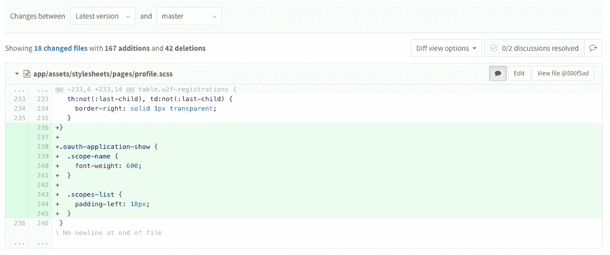
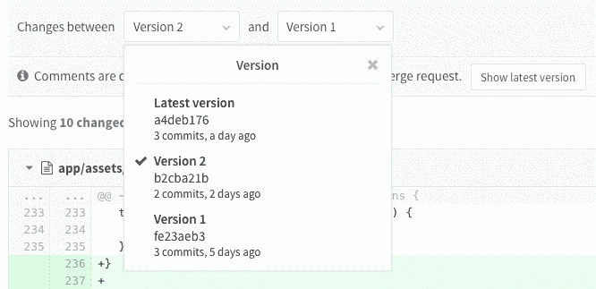
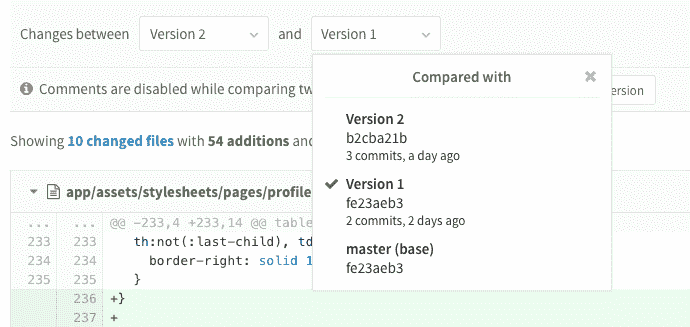
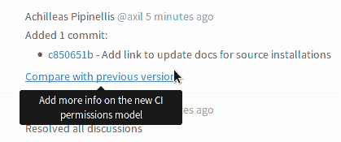
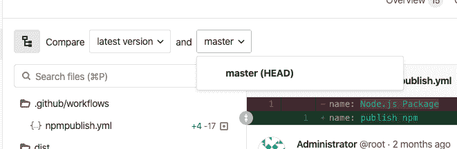

# Merge requests versions

> 原文：[https://docs.gitlab.com/ee/user/project/merge_requests/versions.html](https://docs.gitlab.com/ee/user/project/merge_requests/versions.html)

*   [Selecting a version](#selecting-a-version)
*   [Find the merge request that introduced a change](#find-the-merge-request-that-introduced-a-change)
*   [`HEAD` comparison mode for Merge Requests](#head-comparison-mode-for-merge-requests)

# Merge requests versions

每次您推送到与合并请求绑定的分支时，都会创建新版本的合并请求 diff. 当您访问包含多个推送的合并请求时，可以选择并比较那些合并请求差异的版本.

## Selecting a version

默认情况下，显示更改的最新版本. 但是，您可以从版本下拉列表中选择一个较旧的版本.

合并请求版本基于推送而不是提交. 因此，如果您单次推送了 5 次提交，那么下拉菜单中的选项就是一个. 如果您按了 5 次，则算上 5 个选项.

您还可以将合并请求版本与旧版本进行比较，以查看此后发生了什么变化.

在查看过时的合并版本或与基本版本以外的版本进行比较时，将禁用注释.

每次将新更改推送到分支时，系统都会显示一个用于比较最后更改的链接.

## Find the merge request that introduced a change

在 GitLab 10.5 中[引入](https://gitlab.com/gitlab-org/gitlab-foss/-/issues/2383) .

在查看提交详细信息页面时，GitLab 将链接到包含该提交的合并请求（或合并请求，如果存在多个）.

这仅适用于最新版本的合并请求中的提交-如果某个提交位于合并请求中，然后根据该合并请求重新建立基础，则不会链接它们.

## `HEAD` comparison mode for Merge Requests

在 GitLab 12.10 中[引入](https://gitlab.com/gitlab-org/gitlab/-/issues/27008) .

合并请求（尤其是" **更改"**选项卡）是查看和讨论源代码的地方. 在目标分支被合并到合并请求的源分支的情况下，源分支和目标分支中的更改可以显示为混合在一起，这使得很难理解目标分支中正在添加哪些更改以及已经存在哪些更改.

在 GitLab 12.10 中，我们添加了一个比较模式，该模式显示了通过模拟合并后的差异计算出的差异-更准确地表示更改，而不是使用两个分支的基础. 通过选择**master（HEAD），**可以从比较目标下拉列表中使用新模式. 将来它将[替换](https://gitlab.com/gitlab-org/gitlab/-/issues/198458)当前的默认比较.

