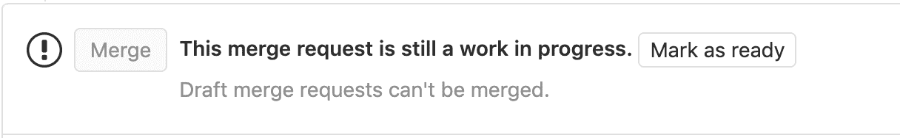
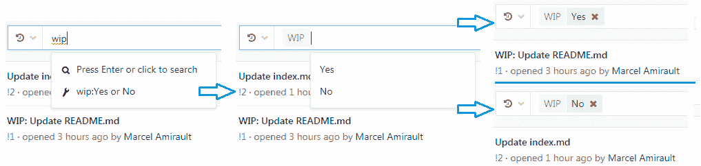

# Draft merge requests

> 原文：[https://docs.gitlab.com/ee/user/project/merge_requests/work_in_progress_merge_requests.html](https://docs.gitlab.com/ee/user/project/merge_requests/work_in_progress_merge_requests.html)

*   [Adding the “Draft” flag to a merge request](#adding-the-draft-flag-to-a-merge-request)
*   [Removing the “Draft” flag from a merge request](#removing-the-draft-flag-from-a-merge-request)
*   [Including/excluding WIP merge requests when searching](#includingexcluding-wip-merge-requests-when-searching)

# Draft merge requests

如果合并请求尚未准备好进行合并（可能是由于持续的开发或开放的线程），则可以通过将其标记为**Draft**来阻止在合并之前接受该合并请求. 这将禁用"合并"按钮，从而防止其被合并，并且在删除"草稿"标志之前它将保持禁用状态.

## Adding the “Draft” flag to a merge request

在 GitLab 13.2 中[引入](https://gitlab.com/gitlab-org/gitlab/-/issues/32692)的在进行中（WIP）合并请求已重命名为**Draft** . 在 GitLab 14.0 中将删除对使用**WIP 的**支持.

There are several ways to flag a merge request as a Draft:

*   将`[Draft]` ， `Draft:`或`(Draft)`到合并请求标题的开头. 单击标题框下的" **以草稿开始标题：** "，在编辑合并请求的描述时将具有相同的效果.
*   **不推荐使用**将`[WIP]`或`WIP:`添加到合并请求标题的开头. **WIP**仍然有效，但不赞成使用**Draft** . 它将在下一个主要版本（GitLab 14.0）中删除.
*   在合并请求的注释中添加`/wip` [快速操作](../quick_actions.html#quick-actions-for-issues-merge-requests-and-epics) . 这是一个切换，可以重复进行以将状态改回. 请注意，注释中的任何其他文本将被丢弃.
*   将`draft:`或`Draft:`添加到针对合并请求的源分支的提交消息的开头. 这不是切换，并且在另一次提交中再次执行将无效.

## Removing the “Draft” flag from a merge request

与上述类似，当准备合并请求时，可以通过以下几种方式删除" `Draft`标志：

*   从合并请求标题的开头删除`[Draft]` ， `Draft:`或`(Draft)` . 在编辑合并请求的描述时，在标题框下单击" **从标题中删除草稿："前缀** ，将具有相同的效果.
*   在合并请求的注释中添加`/wip` [快速操作](../quick_actions.html#quick-actions-for-issues-merge-requests-and-epics) . 这是一个切换，可以重复进行以将状态改回. 请注意，注释中的任何其他文本将被丢弃.
*   点击靠近合并请求描述底部的**解决草案状态**按钮，旁边的**合并**按钮（见[上面的图片](#draft-merge-requests) ）. 必须对该项目至少具有开发人员级别的权限，该按钮才可见.

## Including/excluding WIP merge requests when searching

查看/搜索合并请求列表时，可以通过在搜索框中添加" WIP"过滤器，然后选择"是"（包括）或"否"（排除）来选择包括或排除 WIP 合并请求.

