# Members of a project

> 原文：[https://docs.gitlab.com/ee/user/project/members/](https://docs.gitlab.com/ee/user/project/members/)

*   [Inherited membership](#inherited-membership)
*   [Add a user](#add-a-user)
*   [Import users from another project](#import-users-from-another-project)
*   [Invite people using their e-mail address](#invite-people-using-their-e-mail-address)
*   [Project membership and requesting access](#project-membership-and-requesting-access)
*   [Share project with group](#share-project-with-group)
*   [Remove a member from the project](#remove-a-member-from-the-project)

# Members of a project

您可以在所有项目中管理组和用户及其访问级别. 您还可以个性化为每个项目赋予每个用户的访问级别.

您应该具有维护者或所有者[权限，](../../permissions.html)才能将新用户添加或导入到项目中.

要查看，编辑，添加和删除项目的成员，请转到项目的**成员** .

## Inherited membership

当您的项目属于该组时，组成员将从该组继承该项目的成员资格和权限级别.

[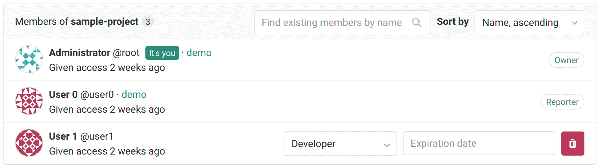](img/project_members.png)

从上图可以得出以下几点：

*   有 3 个成员可以访问该项目.
*   User0 是记者，并且已从包含当前项目的组`demo`继承了他们的权限.
*   对于 User1，没有组的指示，因此它们直接属于我们正在检查的项目.
*   管理员是**所有**组的所有者和所有者，因此，有迹象表明祖先组和继承的所有者权限.

[在 GitLab 12.6 中](https://gitlab.com/gitlab-org/gitlab/-/issues/21727) ，您可以使用右侧的下拉列表过滤此列表：

*   **仅显示直接成员**仅显示 User1.
*   **仅显示继承的成员将**显示 User0 和 Administrator.

## Add a user

旁边的**人** ，开始输入要添加的用户的姓名或用户名.

[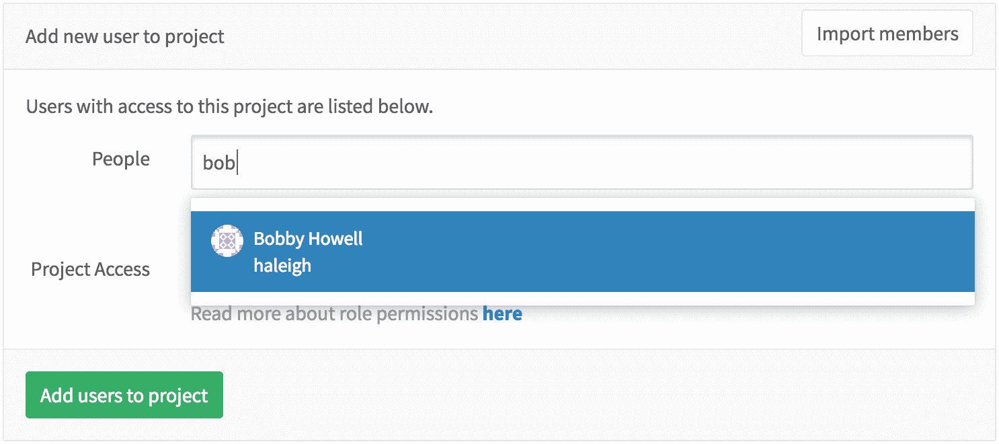](img/add_user_search_people.png)

选择用户以及您要赋予该用户的[权限级别](../../permissions.html) . 请注意，您可以选择多个用户.

[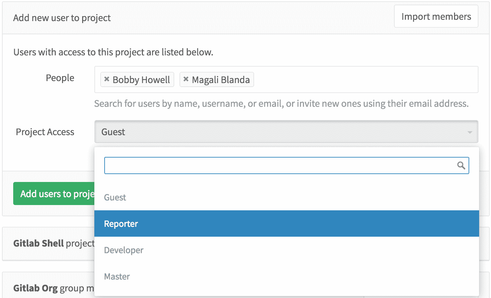](img/add_user_give_permissions.png)

完成后，点击**将用户添加到项目中** ，这些**用户**将立即使用您在上面授予他们的权限添加到您的项目中.

[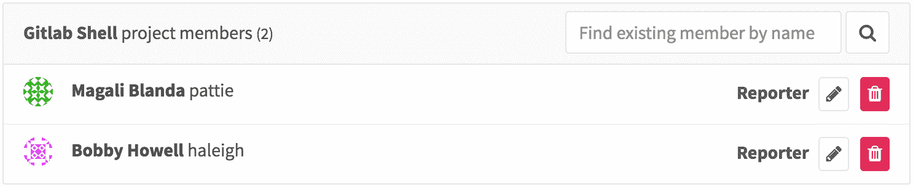](img/add_user_list_members.png)

从那里开始，您可以删除现有用户或更改其对项目的访问级别.

## Import users from another project

您可以通过单击" **成员"**菜单右上角的" **导入成员"**按钮，将另一个项目的用户导入您自己的项目中.

在下拉菜单中，您只能看到维护者所在的项目.

[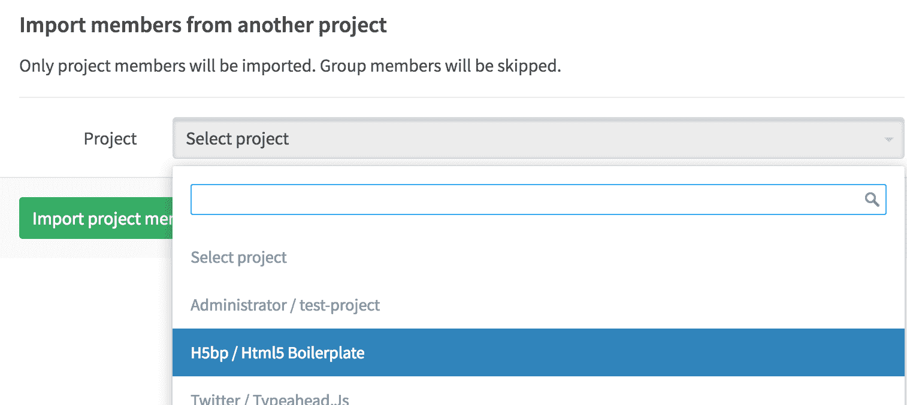](img/add_user_import_members_from_another_project.png)

选择所需的一个，然后单击" **导入项目成员"** . 将会出现一条简短的消息，通知您导入已成功，并且新成员现在位于项目的成员列表中. 请注意，保留了他们对您从中导入的项目的权限.

[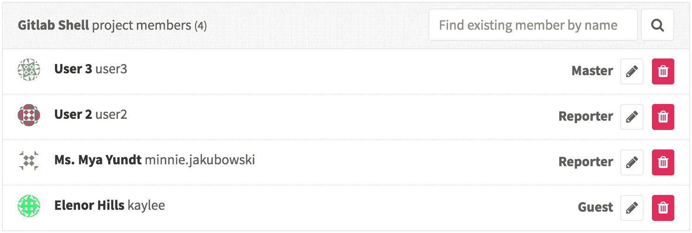](img/add_user_imported_members.png)

## Invite people using their e-mail address

如果要授予访问权限的用户在您的 GitLab 实例上没有帐户，则可以通过在用户搜索字段中键入其电子邮件地址来邀请他们.

[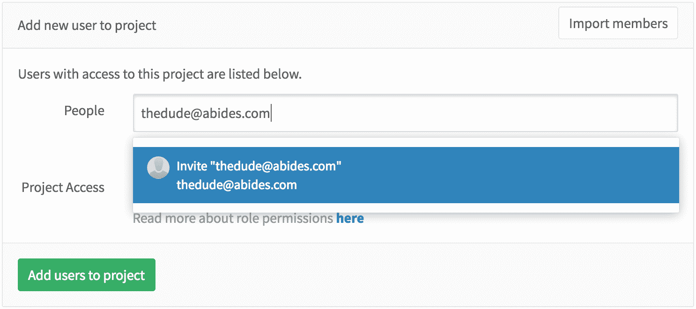](img/add_user_email_search.png)

可以想象，您可以混合邀请多个人并将现有的 GitLab 用户添加到项目中.

[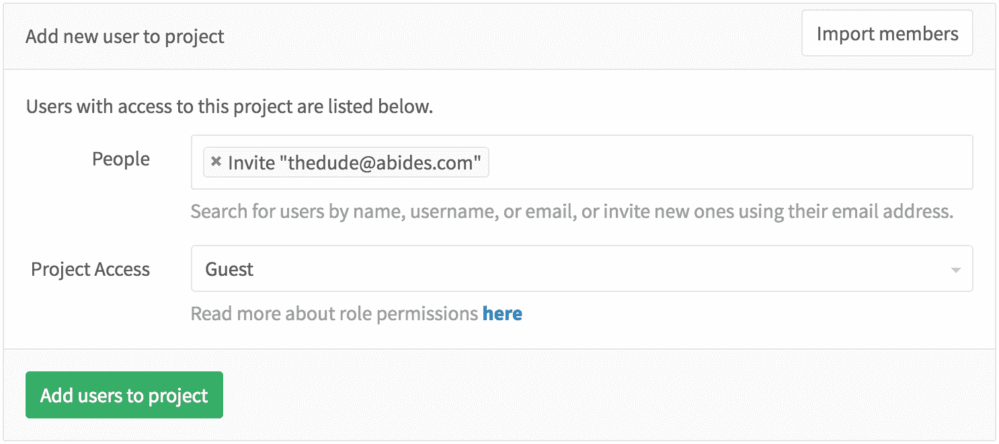](img/add_user_email_ready.png)

完成后，点击" **将用户添加到项目中"，**然后观察到有一个新成员具有我们上面使用的电子邮件地址. 在此之后，您可以重新发送邀请，更改其访问级别，甚至删除它们.

[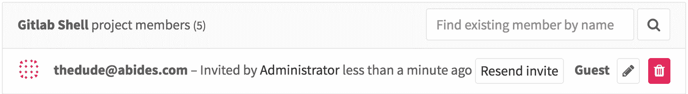](img/add_user_email_accept.png)

用户接受邀请后，将提示他们使用邀请发送到的相同电子邮件地址创建一个新的 GitLab 帐户.

## Project membership and requesting access

项目所有者可以：

*   允许非成员请求访问该项目.
*   防止非会员请求访问.

要进行配置，请转到项目设置，然后单击**允许用户请求访问权限** .

GitLab 用户可以请求成为项目成员. 转到您要加入的项目，然后单击屏幕右侧的" **请求访问**权"按钮.

[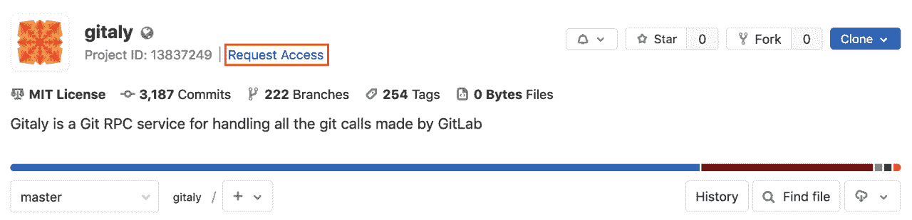](img/request_access_button.png)

请求访问后：

*   通过电子邮件将最多十个项目维护者通知该请求. 电子邮件被发送给最近活跃的项目维护者.
*   任何项目维护者都可以在成员页面上批准或拒绝该请求.

**注意：**如果项目没有任何维护者，则将通知发送给该项目组的最近活动的所有者.

[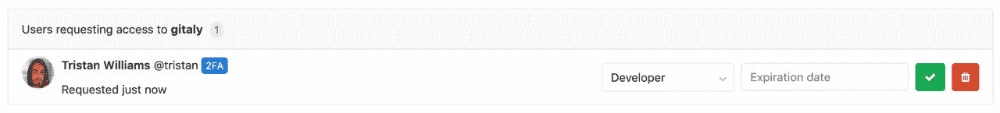](img/access_requests_management.png)

如果您在批准请求之前改变主意，只需单击" **撤回访问请求"**按钮.

[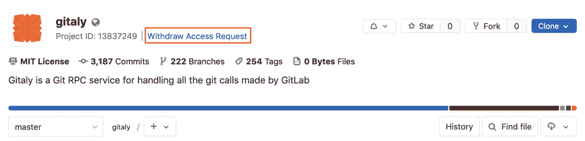](img/withdraw_access_request_button.png)

## Share project with group

或者，您可以[与整个组共享一个项目，](share_project_with_groups.html)而不是一个一个地添加用户.

## Remove a member from the project

只有[拥有所有者](../../permissions.html#group-members-permissions)权限的[用户](../../permissions.html#group-members-permissions)才能管理项目成员.

如果给定成员在项目中具有直接成员资格，则可以从项目中删除用户. 如果成员资格是从父组继承的，则该成员只能从父组本身中删除.

删除成员时，您可以决定是从所有问题中取消分配用户，还是合并当前已分配的请求，还是保留分配.

*   当用户离开私有项目并且您希望撤消他们对所有问题和已分配的合并请求的访问时，从所有问题和合并请求中**取消分配已删除的成员**可能会有所帮助.
*   **保留问题和合并请求的分配**可能对于接受公共贡献的项目很有帮助，在这些项目中，用户不必成为成员就可以为问题和合并请求做出贡献.

To remove a member from a project:

1.  在一个项目中，转到 **成员们** .
2.  点击**删除** 要删除的项目成员旁边的按钮. 出现" **删除成员"**模态.
3.  （可选）选中" **也从相关问题中取消分配此用户并合并请求"**复选框.
4.  Click **删除会员**.