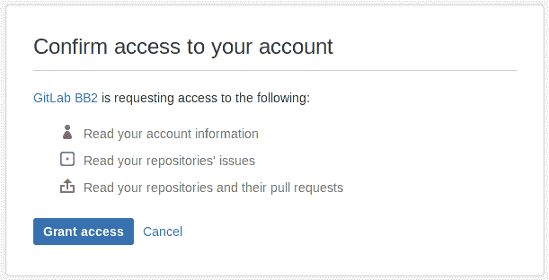
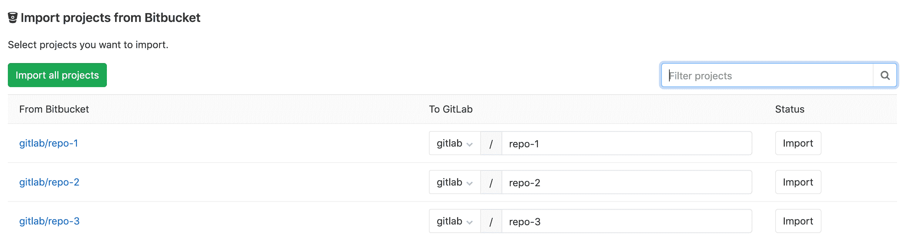

# Import your project from Bitbucket Cloud to GitLab

> 原文：[https://docs.gitlab.com/ee/user/project/import/bitbucket.html](https://docs.gitlab.com/ee/user/project/import/bitbucket.html)

*   [Overview](#overview)
*   [Requirements](#requirements)
*   [How it works](#how-it-works)
*   [Import your Bitbucket repositories](#import-your-bitbucket-repositories)
*   [Troubleshooting](#troubleshooting)

# Import your project from Bitbucket Cloud to GitLab

**注意：** Bitbucket Cloud 导入程序仅适用于 Bitbucket.org，不适用于 Bitbucket Server（又名 Stash）. 如果您尝试从 Bitbucket Server 导入项目，请使用[Bitbucket Server importer](bitbucket_server.html) .

轻松地将项目从 Bitbucket Cloud 导入到 GitLab.

## Overview

*   在当前状态下，Bitbucket 导入器可以导入：
    *   仓库描述（GitLab 7.7+）
    *   Git 存储库数据（GitLab 7.7+）
    *   问题（GitLab 7.7+）
    *   问题评论（GitLab 8.15+）
    *   拉取请求（GitLab 8.4+）
    *   拉取请求注释（GitLab 8.15+）
    *   里程碑（GitLab 8.15+）
    *   Wiki（GitLab 8.15+）
*   保留对拉取请求和问题的引用（GitLab 8.7+）
*   知识库公共访问权限保留. 如果存储库在 Bitbucket 中是私有的，则它也会在 GitLab 中也创建为私有的.

## Requirements

必须首先启用[Bitbucket Cloud 集成](../../../integration/bitbucket.html) ，以便能够从 Bitbucket Cloud 导入项目. 请您的 GitLab 管理员启用该功能（如果尚未启用）.

## How it works

当导入问题/拉取请求时，Bitbucket 导入程序将尝试使用 Bitbucket `nickname`在 GitLab 的数据库中查找 Bitbucket 作者/受让人. 为此，Bitbucket 作者/受让人应事先在 GitLab 中登录并**关联其 Bitbucket 帐户** . 他们的`nickname`也必须与他们的 Bitbucket `username.`匹配`username.` . 如果在 GitLab 的数据库中找不到该用户，则将项目创建者（大多数情况下，当前用户已开始导入过程）设置为作者，但保留有关原始 Bitbucket 作者的问题的参考.

如果不存在任何新的名称空间（组），或者如果采用了该名称空间，则导入器将创建任何新的名称空间（组），存储库将在启动导入过程的用户名称空间下导入.

## Import your Bitbucket repositories

1.  Sign in to GitLab and go to your dashboard.
2.  单击**新建项目** .

3.  点击" Bitbucket Cloud"按钮.

    

4.  授予 GitLab 访问您的 Bitbucket 帐户的权限

    

5.  点击您要**导入的项目**或**导入所有项目** . 您还可以按名称过滤项目，并选择将在其下导入每个项目的名称空间.

    

## Troubleshooting

如果您拥有多个 Bitbucket 帐户，请确保登录正确的帐户. 如果您不小心以错误的帐户启动了导入过程，请按照以下步骤操作：

1.  撤消对您的 Bitbucket 帐户的 GitLab 访问，实质上是通过以下过程来逆转该过程： [导入 Bitbucket 存储库](#import-your-bitbucket-repositories) .

2.  退出 Bitbucket 帐户. 请遵循上一步中链接的过程.