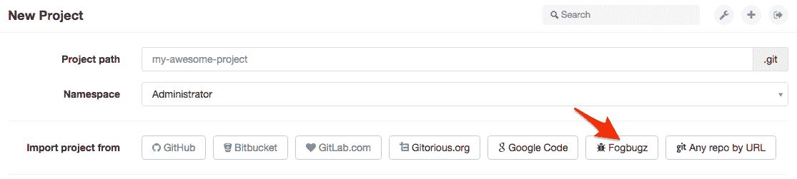
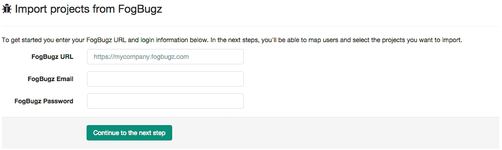
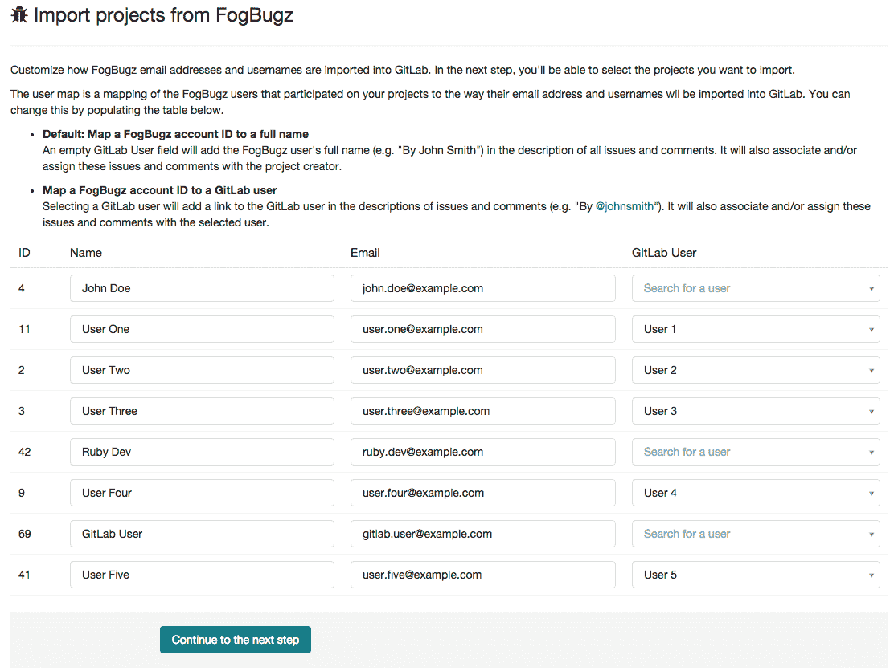
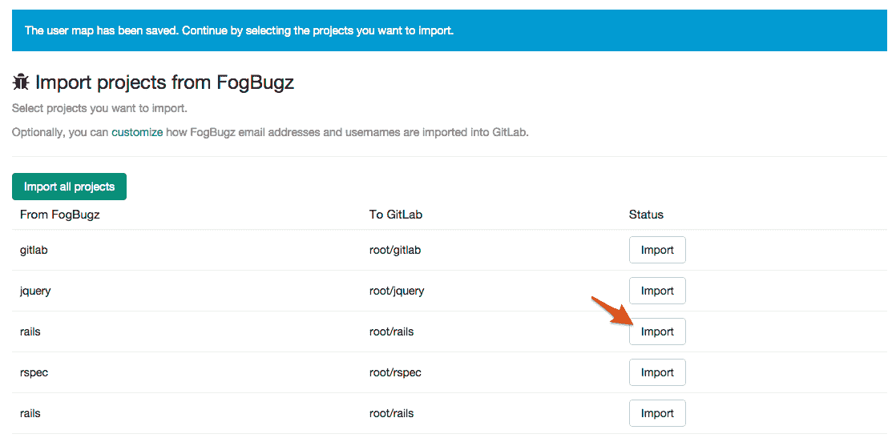
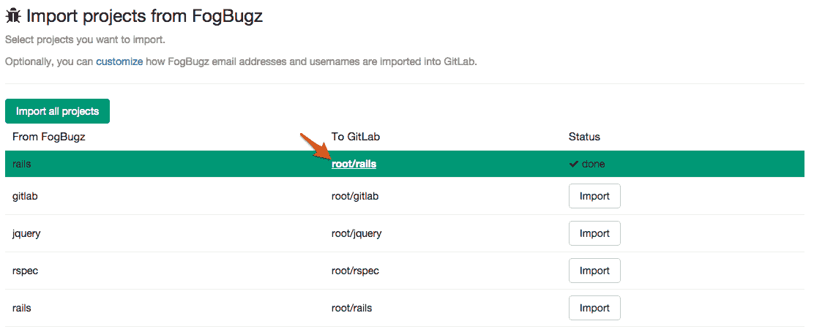

# Import your project from FogBugz to GitLab

> 原文：[https://docs.gitlab.com/ee/user/project/import/fogbugz.html](https://docs.gitlab.com/ee/user/project/import/fogbugz.html)

# Import your project from FogBugz to GitLab

从 FogBugz 导入项目只需几个简单的步骤. 导入程序将导入您的所有案例和注释以及原始案例编号和时间戳. 您还将有机会将 FogBugz 用户映射到 GitLab 用户.

1.  在您的 GitLab 仪表板中，单击"新建项目"
2.  点击" FogBugz"按钮

1.  输入您的 FogBugz URL，电子邮件地址和密码.

1.  创建从 FogBugz 用户到 GitLab 用户的映射.

1.  通过单击导入按钮选择要导入的项目

1.  导入完成后，单击链接将您带到项目仪表板. 按照说明推送现有存储库.

