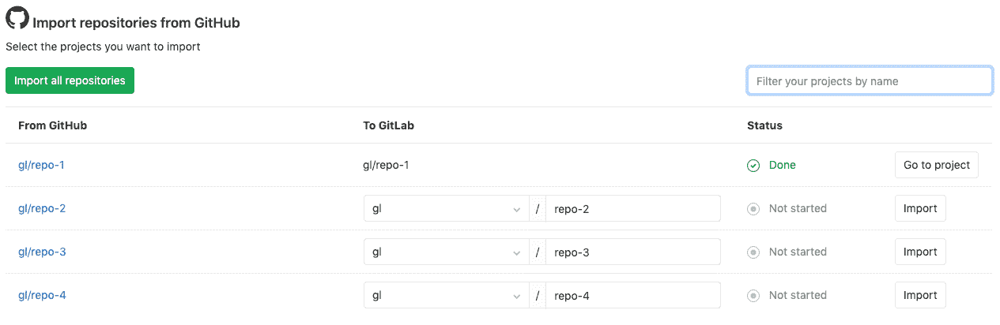

# Import your project from GitHub to GitLab

> 原文：[https://docs.gitlab.com/ee/user/project/import/github.html](https://docs.gitlab.com/ee/user/project/import/github.html)

*   [Overview](#overview)
*   [How it works](#how-it-works)
*   [Import your GitHub repository into GitLab](#import-your-github-repository-into-gitlab)
    *   [Using the GitHub integration](#using-the-github-integration)
    *   [Using a GitHub token](#using-a-github-token)
    *   [Selecting which repositories to import](#selecting-which-repositories-to-import)
*   [Mirroring and pipeline status sharing](#mirroring-and-pipeline-status-sharing)
*   [Improving the speed of imports on self-managed instances](#improving-the-speed-of-imports-on-self-managed-instances)

# Import your project from GitHub to GitLab

使用导入器，您可以将 GitHub 存储库导入 GitLab.com 或自管理的 GitLab 实例.

## Overview

**注意：**这些说明适用于 GitLab.com 上的用户，但是如果您是自助 GitLab 实例的管理员，或者要从 GitHub Enterprise 导入，则必须启用[GitHub 集成](../../../integration/github.html) . GitHub 集成是从 GitHub Enterprise 导入的唯一方法. 如果您使用的是 GitLab.com，则可以使用[个人访问令牌](#using-a-github-token)导入 GitHub 存储库，但不建议使用此方法，因为该方法无法将所有用户活动（例如问题和请求请求）与匹配的 GitLab 用户相关联. 如果您是自我管理的 GitLab 实例的管理员，则还可以使用[GitHub Rake 任务](../../../administration/raketasks/github_import.html)从 GitHub 导入项目，而不受 Sidekiq worker 的限制.

导入了项目的以下方面：

*   仓库描述（GitLab.com＆7.7+）
*   Git 存储库数据（GitLab.com＆7.7+）
*   问题（GitLab.com 和 7.7+）
*   拉取请求（GitLab.com＆8.4+）
*   Wiki 页面（GitLab.com＆8.4+）
*   里程碑（GitLab.com＆8.7+）
*   标签（GitLab.com 和 8.7+）
*   发行说明说明（GitLab.com 和 8.12+）
*   拉取请求评论评论（GitLab.com＆10.2+）
*   定期发布和请求请求注释

保留对拉取请求和问题的引用（GitLab.com＆8.7+），并且每个导入的存储库都保持可见性级别，除非该[可见性级别受到限制](../../../public_access/public_access.html#restricting-the-use-of-public-or-internal-projects) ，在这种情况下，它默认为默认项目可见性.

## How it works

导入问题和请求请求时，导入程序会尝试在 GitLab 实例的数据库中查找其 GitHub 作者和受让人（请注意，请求请求在 GitLab 中称为"合并请求"）.

For this association to succeed, each GitHub author and assignee in the repository must meet one of the following conditions prior to the import:

*   以前使用 GitHub 图标登录到 GitLab 帐户.
*   有一个 GitHub 帐户，其[主要电子邮件地址](https://help.github.com/en/github/setting-up-and-managing-your-github-user-account/setting-your-commit-email-address)与其 GitLab 帐户的电子邮件地址匹配.

如果在 GitLab 的数据库中未找到项目中引用的用户，则将项目创建者（通常是启动导入过程的用户）设置为作者/受让人，但是会添加关于该问题的注释，其中提及原始 GitHub 作者.

如果不存在任何新的名称空间（组），或者如果采用了名称空间，则导入器会创建存储库，该存储库将在启动导入过程的用户的名称空间下导入. 命名空间/存储库名称也可以使用适当的权限进行编辑.

进口商还将在与未完成拉取请求相关的项目的分支上导入分支. 这些分支将以类似于`GH-SHA-username/pull-request-number/fork-name/branch`的命名方案导入. 与 GitHub 存储库相比，这可能导致分支中的差异.

有关更多技术细节，您可以参考[GitHub Importer](../../../development/github_importer.html "使用 GitHub 导入器")开发人员文档.

有关导入过程的概述，请参阅[从 GitHub 迁移到 GitLab](https://youtu.be/VYOXuOg9tQI)的视频.

## Import your GitHub repository into GitLab

### Using the GitHub integration

在开始之前，请确保要映射到 GitLab 用户的所有 GitHub 用户都具有以下任一条件：

*   使用 GitHub 图标登录的 GitLab 帐户-或-
*   一个 GitLab 帐户，其电子邮件地址与 GitHub 用户的[公共电子邮件地址](https://help.github.com/en/github/setting-up-and-managing-your-github-user-account/setting-your-commit-email-address)匹配

用户匹配尝试将按该顺序进行，并且如果两种方法均未识别到用户，则该活动将与执行导入的用户帐户相关联.

**注意：**如果您使用的是自助式 GitLab 实例，或者要从 GitHub Enterprise 导入，则此过程要求您已配置[GitHub 集成](../../../integration/github.html) .

1.  在顶部导航栏中，单击**+** ，然后选择**新建项目** .
2.  选择**导入项目**选项卡，然后选择**GitHub** .
3.  选择第一个按钮以**列出您的 GitHub 存储库** . 您将被重定向到[GitHub 上](https://github.com)的页面以授权 GitLab 应用程序.
4.  点击**授权 gitlabhq** . 您将被重定向回 GitLab 的 Import 页面，并列出所有 GitHub 存储库.
5.  继续[选择要导入的存储库](#selecting-which-repositories-to-import) .

### Using a GitHub token

**注意：**不建议使用个人访问令牌导入项目. 如果您是 GitLab.com 用户，则可以使用个人访问令牌从 GitHub 导入项目，但是该方法无法将所有用户活动（例如问题和请求请求）与匹配的 GitLab 用户关联. 如果您是自我管理的 GitLab 实例的管理员，或者要从 GitHub Enterprise 导入，则不能使用个人访问令牌. 建议所有用户使用[GitHub 集成方法（上述）](#using-the-github-integration) . 在" [如何工作"](#how-it-works)部分中了解更多信息.

如果您不使用 GitHub 集成，则仍可以通过 GitHub 执行授权以授予 GitLab 访问您的存储库的权限：

1.  转到[https://github.com/settings/tokens/new](https://github.com/settings/tokens/new)
2.  输入令牌描述.
3.  选择回购范围​​.
4.  Click **生成令牌**.
5.  复制令牌哈希.
6.  返回到 GitLab 并将令牌提供给 GitHub 导入器.
7.  点击**列出您的 GitHub 存储库**按钮，并等待 GitLab 读取您的存储库信息. 完成后，将带您到导入器页面以选择要导入的存储库.

### Selecting which repositories to import

在授权访问 GitHub 存储库后，您将重定向到 GitHub 导入程序页面，并列出 GitHub 存储库.

1.  默认情况下，建议的存储库名称空间与 GitHub 中存在的名称匹配，但是根据您的权限，您可以选择在继续导入任何名称之前编辑这些名称.
2.  选择任意数量的存储库旁边的**导入**按钮，或选择**导入所有存储库** . 此外，您可以按名称过滤项目. 如果应用了过滤器，则" **导入所有存储库"**仅导入匹配的存储库.
3.  " **状态"**列显示每个存储库的导入状态. 您可以选择让页面保持打开状态，它将实时更新，也可以稍后返回.
4.  导入存储库后，单击其 GitLab 路径以打开其 GitLab URL.

## Mirroring and pipeline status sharing

根据您的 GitLab 层，可以设置[项目镜像](../repository/repository_mirroring.html) ，以使导入的项目与其 GitHub 副本保持同步.

此外，您可以配置 GitLab 以通过[GitHub Project Integration](../integrations/github.html)将管道状态更新发送回 GitHub.

如果使用[CI / CD 作为外部存储库](../../../ci/ci_cd_for_external_repos/index.html)导入项目，则会自动配置以上两项.

## Improving the speed of imports on self-managed instances

**注意：**必须具有对 GitLab 服务器的管理员访问权限.

对于大型项目，可能需要一段时间才能导入所有数据. 为了减少必要的时间，您可以增加处理以下队列的 Sidekiq 工作程序的数量：

*   `github_importer`
*   `github_importer_advance_stage`

For an optimal experience, it’s recommended having at least 4 Sidekiq processes (each running a number of threads equal to the number of CPU cores) that *only* process these queues. It’s also recommended that these processes run on separate servers. For 4 servers with 8 cores this means you can import up to 32 objects (e.g., issues) in parallel.

减少克隆存储库所花费的时间可以通过增加存储 Git 存储库（适用于您的 GitLab 实例）的磁盘的网络吞吐量，CPU 容量和磁盘性能（例如，使用高性能 SSD）来完成. 增加 Sidekiq 工作人员的数量*不会*减少克隆存储库所花费的时间.