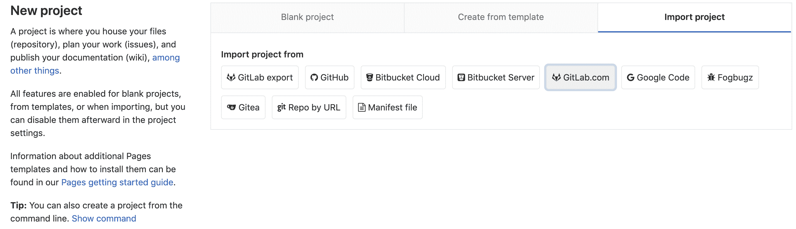
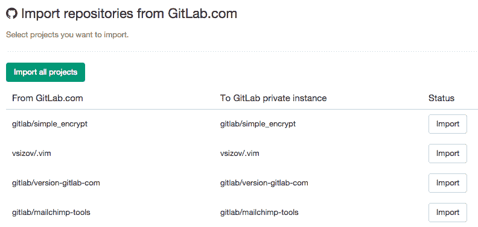

# Project importing from GitLab.com to your private GitLab instance

> 原文：[https://docs.gitlab.com/ee/user/project/import/gitlab_com.html](https://docs.gitlab.com/ee/user/project/import/gitlab_com.html)

# Project importing from GitLab.com to your private GitLab instance

您可以将现有的 GitLab.com 项目导入到 GitLab 实例中，但请记住，只有在 GitLab 实例上启用了 GitLab.com 集成后，才有可能. [阅读有关 GitLab.com 集成的更多信息，以实现自我管理的 GitLab 实例](../../../integration/gitlab.html) .

要进入进口商页面，您需要进入"新项目"页面.

> **注意：**如果您有兴趣将 Wiki 和合并请求数据导入到新实例，则需要按照说明[导出项目](../settings/import_export.html#exporting-a-project-and-its-data)

转到" **导入项目"**选项卡，然后单击**GitLab.com** ，您将被重定向到 GitLab.com 以获取访问项目的权限. 接受后，您将自动重定向到导入程序.

要导入项目，请单击"导入". 导入程序将导入您的存储库和问题. 导入器完成后，将使用导入的数据创建一个新的 GitLab 项目.