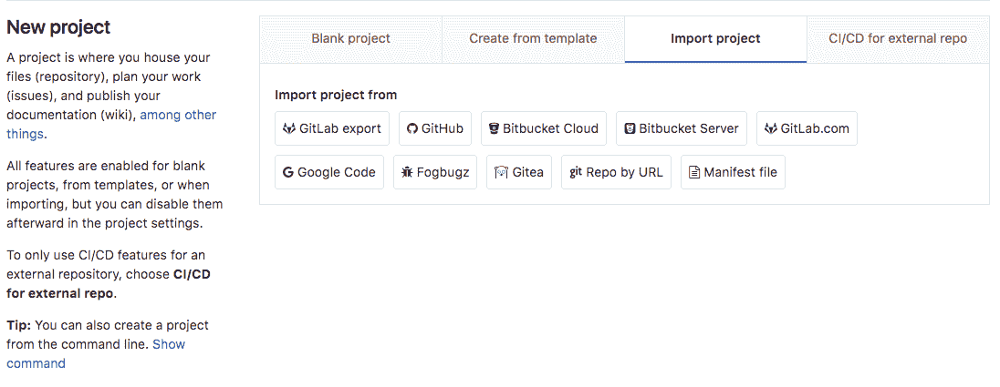
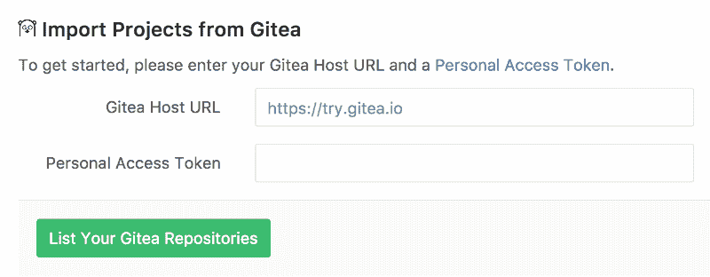
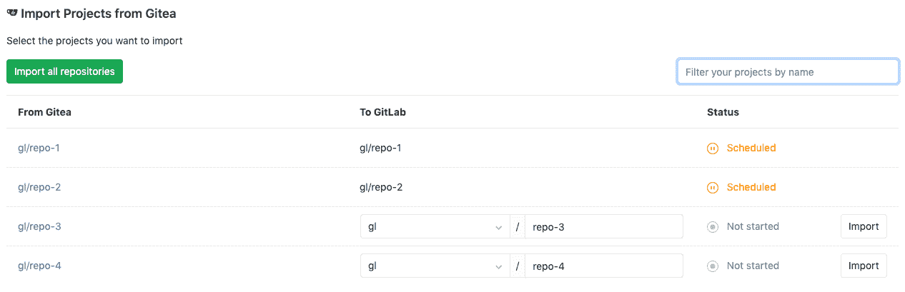

# Import your project from Gitea to GitLab

> 原文：[https://docs.gitlab.com/ee/user/project/import/gitea.html](https://docs.gitlab.com/ee/user/project/import/gitea.html)

*   [Overview](#overview)
*   [How it works](#how-it-works)
*   [Importing your Gitea repositories](#importing-your-gitea-repositories)
    *   [Authorize access to your repositories using a personal access token](#authorize-access-to-your-repositories-using-a-personal-access-token)
    *   [Select which repositories to import](#select-which-repositories-to-import)

# Import your project from Gitea to GitLab

Import your projects from Gitea to GitLab with minimal effort.

## Overview

> **注意：**这需要 Gitea `v1.0.0`或更高版本.

*   在当前状态下，Gitea 进口商可以进口：
    *   仓库描述（GitLab 8.15+）
    *   Git 存储库数据（GitLab 8.15+）
    *   问题（GitLab 8.15+）
    *   拉取请求（GitLab 8.15+）
    *   里程碑（GitLab 8.15+）
    *   标签（GitLab 8.15+）
*   知识库公共访问权限保留. 如果存储库在 Gitea 中是私有的，则它也将在 GitLab 中创建为私有的.

## How it works

由于 Gitea 当前不是 OAuth 提供者，因此无法将作者/受让人映射到您的 GitLab 实例中的用户. 这意味着将项目创建者（大多数情况下是当前开始导入过程的当前用户）设置为作者，但是保留了有关原始 Gitea 作者的问题的参考.

如果不存在任何新的名称空间（组），或者如果采用了该名称空间，则导入器将创建任何新的名称空间（组），存储库将在启动导入过程的用户名称空间下导入.

## Importing your Gitea repositories

创建新项目时，将显示导入器页面.

单击**Gitea**链接，导入授权过程将开始.

### Authorize access to your repositories using a personal access token

使用这种方法，您将对 Gitea 执行一次性授权，以授权 GitLab 访问您的存储库：

1.  转到`https://your-gitea-instance/user/settings/applications` （将`your-gitea-instance`替换`your-gitea-instance`的主机）.
2.  Click **生成新令牌**.
3.  输入令牌描述.
4.  Click **生成令牌**.
5.  复制令牌哈希.
6.  返回到 GitLab 并将令牌提供给 Gitea 进口商.
7.  点击**列出您的 Gitea 存储库**按钮，然后等待 GitLab 读取您的存储库信息. 完成后，将带您到导入器页面以选择要导入的存储库.

### Select which repositories to import

在授权访问 Gitea 存储库后，您将被重定向到 Gitea 导入程序页面.

从那里，您可以查看 Gitea 存储库的导入状态.

*   那些正在导入的将显示*开始*状态，
*   那些已经成功导入的将变成绿色，状态为" *完成"* ，
*   而尚未导入的表格将在表格的右侧具有" **导入"**按钮.

您还可以：

*   点击左上角的" **导入所有项目"** ，一次性导入所有 Gitea 项目.
*   按名称过滤项目. 如果应用了过滤器，则点击**导入所有项目**将仅导入匹配的项目

如果您有特权，也可以为项目选择其他名称和名称空间.