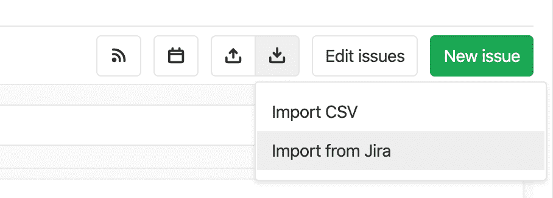
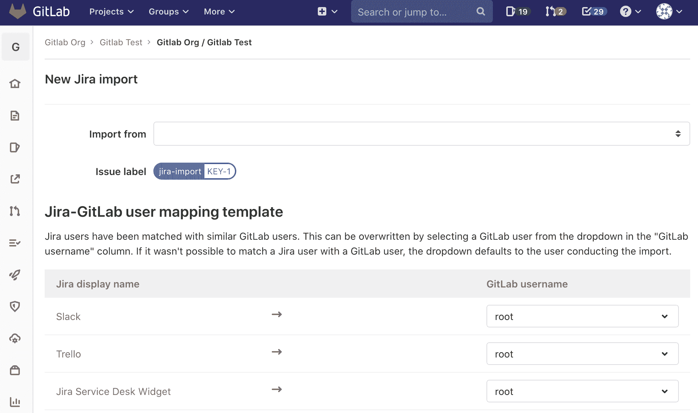

# Import your Jira project issues to GitLab

> 原文：[https://docs.gitlab.com/ee/user/project/import/jira.html](https://docs.gitlab.com/ee/user/project/import/jira.html)

*   [Future iterations](#future-iterations)
*   [Prerequisites](#prerequisites)
    *   [Permissions](#permissions)
    *   [Jira integration](#jira-integration)
*   [Import Jira issues to GitLab](#import-jira-issues-to-gitlab)

# Import your Jira project issues to GitLab

在 GitLab 12.10 中[引入](https://gitlab.com/groups/gitlab-org/-/epics/2766) .

使用 GitLab Jira 导入器，您可以将 Jira 问题导入到 GitLab.com 或您自己管理的 GitLab 实例.

Jira 问题导入是 MVC 项目级别的功能，这意味着可以将来自多个 Jira 项目的问题导入到 GitLab 项目中. MVC 版本将问题标题和描述以及一些其他问题元数据作为问题描述的一部分导入.

## Future iterations

从 GitLab 12.10 开始，Jira 问题导入程序仅提供问题的标题和描述.

有[史诗般的](https://gitlab.com/groups/gitlab-org/-/epics/2738)跟踪项目的添加，例如问题受让人，标签，评论，用户映射等等. 这些将包含在 GitLab Jira 进口商的未来版本中.

## Prerequisites

### Permissions

In order to be able to import issues from a Jira project you need to have read access on Jira issues and a [Maintainer or higher](../../permissions.html#project-members-permissions) role in the GitLab project that you wish to import into.

### Jira integration

此功能使用现有的 GitLab [Jira 集成](../integrations/jira.html) .

在尝试导入 Jira 问题之前，请确保已设置集成.

## Import Jira issues to GitLab

GitLab 13.2 中[引入](https://gitlab.com/gitlab-org/gitlab/-/issues/216145)了新的导入表单.

要将 Jira 问题导入到 GitLab 项目，请执行以下步骤.

**注意：**导入 Jira 问题是作为异步后台作业完成的，这可能会由于导入队列负载，系统负载或其他因素而导致延迟. 导入大型项目可能需要几分钟，具体取决于导入的大小.

1.  在 **在问题**页面上，点击**导入问题** （ ） **>从 Jira 导入** .

    

    仅当您具有[正确的权限时，"](#permissions) **从 Jira 导入"**选项才可见.

    出现以下形式. 如果您先前已经设置了[Jira 集成](../integrations/jira.html) ，现在可以在下拉列表中看到您有权访问的 Jira 项目.

    

2.  单击**导入自**下拉列表，然后选择要从中导入问题的 Jira 项目.

    在" **Jira-GitLab 用户映射模板"**部分中，该表显示了您的 Jira 用户将映射到哪些 GitLab 用户. 如果无法将 Jira 用户与 GitLab 用户匹配，则该下拉列表默认为执行导入的用户.

3.  要更改任何建议的映射，请单击**GitLab 用户名列中**的下拉列表，然后选择要映射到每个 Jira 用户的用户.

    该下拉列表可能不会显示所有用户，因此请使用搜索栏在此 GitLab 项目中查找特定用户.

4.  点击**继续** . 系统会提示您已开始导入.

    当导入在后台运行时，您可以从导入状态页面导航到问题页面，并且您会看到新问题出现在问题列表中.

5.  要检查导入状态，请再次转到" Jira 导入"页面.