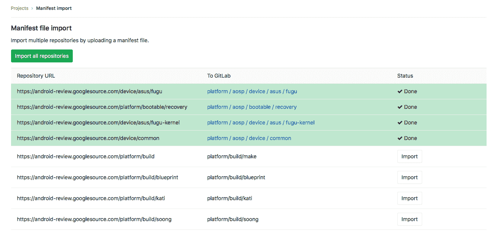

# Import multiple repositories by uploading a manifest file

> 原文：[https://docs.gitlab.com/ee/user/project/import/manifest.html](https://docs.gitlab.com/ee/user/project/import/manifest.html)

*   [Requirements](#requirements)
*   [Manifest format](#manifest-format)
*   [Importing the repositories](#importing-the-repositories)

# Import multiple repositories by uploading a manifest file[](#import-multiple-repositories-by-uploading-a-manifest-file "Permalink")

在 GitLab 11.2 中[引入](https://gitlab.com/gitlab-org/gitlab-foss/-/issues/28811) .

GitLab 允许您基于清单文件（如[Android 存储库](https://android.googlesource.com/platform/manifest/+/2d6f081a3b05d8ef7a2b1b52b0d536b2b74feab4/default.xml)使用的清单文件）导入所有必需的 Git 存储[库](https://android.googlesource.com/platform/manifest/+/2d6f081a3b05d8ef7a2b1b52b0d536b2b74feab4/default.xml) . 当您需要导入具有许多存储库（例如 Android 开放源项目（AOSP））的项目时，此功能非常方便.

## Requirements[](#requirements "Permalink")

GitLab 必须为其数据库使用 PostgreSQL，因为清单导入工作需要[子组](../../group/subgroups/index.html) .

阅读有关[数据库要求的](../../../install/requirements.html#database)更多信息.

## Manifest format[](#manifest-format "Permalink")

清单必须是 XML 文件. 必须有一个带有`review`属性的`remote`标签，该`review`属性包含指向 Git 服务器的 URL，并且每个`project`标签都必须具有`name`和`path`属性. 然后，GitLab 将通过将`remote`标记中的 URL 与项目名称组合来构建到存储库的 URL. 路径属性将用于表示 GitLab 中的项目路径.

以下是清单文件的有效示例：

```
<manifest>
  <remote review="https://android.googlesource.com/" />

  <project path="build/make" name="platform/build" />
  <project path="build/blueprint" name="platform/build/blueprint" />
</manifest> 
```

结果，将创建以下项目：

| GitLab | 导入网址 |
| --- | --- |
| `https://gitlab.com/YOUR_GROUP/build/make` | [https://android.googlesource.com/platform/build](https://android.googlesource.com/platform/build) |
| `https://gitlab.com/YOUR_GROUP/build/blueprint` | [https://android.googlesource.com/platform/build/blueprint](https://android.googlesource.com/platform/build/blueprint) |

## Importing the repositories[](#importing-the-repositories "Permalink")

You can start the import with:

1.  在您的 GitLab 仪表板中，单击" **新建项目".**
2.  切换到**导入项目**选项卡
3.  单击**清单文件**按钮
4.  为 GitLab 提供清单 xml 文件
5.  选择要导入的组（如果没有，则需要先创建一个组）
6.  单击**列出可用的存储库** . 此时，您将根据清单文件重定向到带有项目列表的导入状态页面.
7.  检查列表，然后单击" **导入所有存储库"**以开始导入.

    [](img/manifest_status.png)