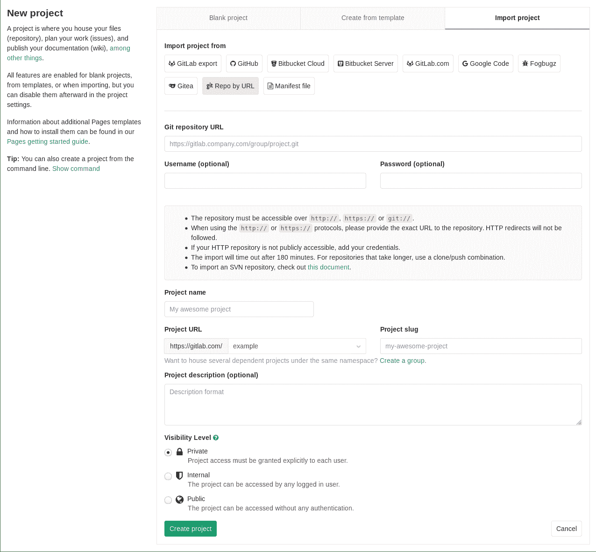

# Import project from repo by URL

> 原文：[https://docs.gitlab.com/ee/user/project/import/repo_by_url.html](https://docs.gitlab.com/ee/user/project/import/repo_by_url.html)

# Import project from repo by URL

您可以通过提供 Git URL 来导入现有存储库：

1.  在您的 GitLab 仪表板中，单击" **新建项目".**
2.  切换到**导入项目**选项卡
3.  点击**按 URL 回购**按钮
4.  填写" Git 存储库 URL"和其余项目字段
5.  单击**创建项目**开始导入过程
6.  完成后，您将被重定向到新创建的项目

