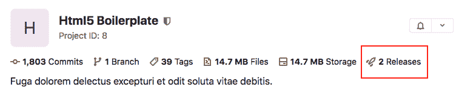
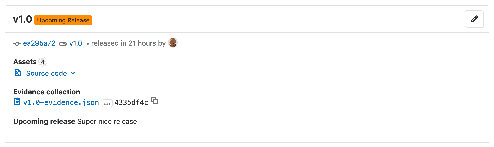
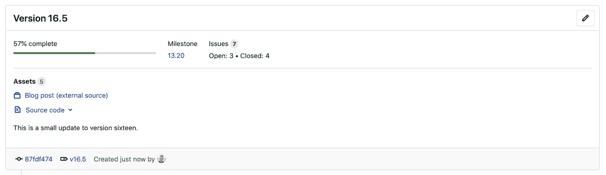
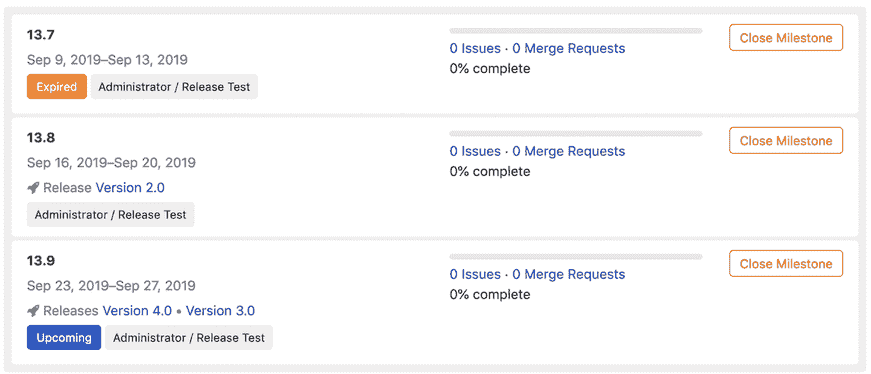

# Releases

> 原文：[https://docs.gitlab.com/ee/user/project/releases/](https://docs.gitlab.com/ee/user/project/releases/)

*   [View releases](#view-releases)
*   [Create a release](#create-a-release)
    *   [Schedule a future release](#schedule-a-future-release)
*   [Edit a release](#edit-a-release)
*   [Add release notes to Git tags](#add-release-notes-to-git-tags)
*   [Associate milestones with a release](#associate-milestones-with-a-release)
*   [Get notified when a release is created](#get-notified-when-a-release-is-created)
*   [Prevent unintentional releases by setting a deploy freeze](#prevent-unintentional-releases-by-setting-a-deploy-freeze)
*   [Release fields](#release-fields)
    *   [Tag name](#tag-name)
    *   [Release notes description](#release-notes-description)
    *   [Release assets](#release-assets)
        *   [Permanent links to release assets](#permanent-links-to-release-assets)
    *   [Source code](#source-code)
    *   [Links](#links)
*   [Release evidence](#release-evidence)
    *   [Collect release evidence](#collect-release-evidence-premium-only)
    *   [Include report artifacts as release evidence](#include-report-artifacts-as-release-evidence-ultimate-only)
    *   [Schedule release evidence collection](#schedule-release-evidence-collection)
    *   [Disable release evidence display](#disable-release-evidence-display-core-only)
*   [GitLab Releaser](#gitlab-releaser)

# Releases[](#releases "Permalink")

在 GitLab 11.7 中[引入](https://gitlab.com/gitlab-org/gitlab-foss/-/issues/41766) .

要在源代码历史记录中引入检查点，可以在发布时分配[Git 标签](https://git-scm.com/book/en/v2/Git-Basics-Tagging) . 但是，在大多数情况下，您的用户不仅需要原始源代码. 他们需要 CI / CD 系统输出的已编译对象或其他资产.

GitLab *发行版*是与代码的发行版本相关联的源，构建输出，工件和其他元数据的快照.

您可以在任何分支上创建一个 GitLab 版本. 创建发行版时：

*   manbetx 客户端打不开自动归档源代码，并将其与版本关联.
*   GitLab 会自动创建一个 JSON 文件，其中列出了发行版中的所有内容，因此您可以比较和审核发行版. 该文件称为[发布证据](#release-evidence) .
*   您可以添加发行说明以及与发行版关联的标签的消息.

创建发行版后，您可以将[里程碑与其关联](#associate-milestones-with-a-release) ，并附加[发行资产](#release-assets) ，例如运行手册或软件包.

## View releases[](#view-releases "Permalink")

在 GitLab 12.8 中[引入](https://gitlab.com/gitlab-org/gitlab/-/issues/36667) .

要查看版本列表：

*   转到**项目概述>版本** ，或

*   在项目的概述页面上，如果存在至少一个版本，请单击版本数.

    [](img/releases_count_v13_2.png)

    *   在公共项目上，此数字对所有用户可见.
    *   在私有项目上，具有 Reporter [权限](../../permissions.html#project-members-permissions)或更高[权限的](../../permissions.html#project-members-permissions)用户可以看到此数字.

## Create a release[](#create-a-release "Permalink")

在 GitLab 12.9 中[引入](https://gitlab.com/gitlab-org/gitlab/-/issues/32812) . 可以在 GitLab UI 中直接创建发布.

**注意：**只有具有开发者权限或更高权限的用户才能创建发行版. 阅读有关[释放权限的](../../../user/permissions.html#project-members-permissions)更多信息.

您可以在用户界面中或使用[Releases API](../../../api/releases/index.html#create-a-release)创建发布. 我们建议使用 API​​添加发行说明，作为 CI / CD 发行流程中的最后步骤之一.

要通过 GitLab UI 创建新版本：

1.  导航到**项目概述>发布** ，然后单击**新发布**按钮.
2.  在[**标签名称**](#tag-name)框中，输入一个名称.
3.  In the **从创建** list, select the branch or enter a tag or commit SHA.
4.  在" **消息"**框中，输入与标签关联的消息.
5.  （可选）在" [**发行说明"**](#release-notes-description)字段中，输入发行说明. 您可以使用 Markdown 并将文件拖放到此字段.
    *   如果将此字段留空，则只会创建一个标签.
    *   如果您填充它，将同时创建标签和发行版.
6.  Click **创建标签**.

如果创建了发行​​版，则可以在**项目概述>发行版中**对其进行查看. 如果创建了标签，则可以在**存储库>标签中**查看它.

现在，您可以编辑发布以[添加里程碑](#associate-milestones-with-a-release)和[发布资产](#release-assets) .

### Schedule a future release[](#schedule-a-future-release "Permalink")

在 GitLab 12.1 中[引入](https://gitlab.com/gitlab-org/gitlab-foss/-/issues/38105) .

您可以使用[Releases API](../../../api/releases/index.html#upcoming-releases)提前创建发行[版](../../../api/releases/index.html#upcoming-releases) . 当您设置将来的`released_at`日期时，将在发布标签旁边显示**即将发布**的发布标志. 经过`released_at`日期和时间后，会自动删除徽章.

[](img/upcoming_release_v12_7.png)

## Edit a release[](#edit-a-release "Permalink")

在 GitLab 12.6 中[引入](https://gitlab.com/gitlab-org/gitlab/-/issues/26016) . 在 GitLab 12.10 中[引入](https://gitlab.com/gitlab-org/gitlab/-/issues/9427)了资产链接编辑.

**注意：**只有具有开发者权限或更高权限的用户才能编辑发行版. 阅读有关[释放权限的](../../../user/permissions.html#project-members-permissions)更多信息.

要编辑发布的详细信息：

1.  导航到**项目概述>发布** .
2.  在您要修改的发行版的右上角，单击" **编辑此发行版"** （铅笔图标）.
3.  在" **编辑版本"**页面上，更改版本的详细信息.
4.  Click **保存更改**.

您可以编辑发行标题，注释，关联的里程碑和资产链接. 要更改其他发行信息，例如标签或发行日期，请使用[Releases API](../../../api/releases/index.html#update-a-release) .

## Add release notes to Git tags[](#add-release-notes-to-git-tags "Permalink")

If you have an existing Git tag, you can add release notes to it.

您可以在用户界面中或使用[Releases API](../../../api/releases/index.html)来执行此操作. 我们建议使用 API​​添加发行说明，作为 CI / CD 发行流程中的最后步骤之一.

在界面中，要向新的 Git 标签添加发行说明：

1.  导航到您项目的**Repository> Tags** .
2.  Click **新的一天**.
3.  在**发行说明**字段中，输入发行说明. 您可以使用 Markdown 并将文件拖放到此字段.
4.  Click **创建标签**.

在界面中，要将发行说明添加到现有的 Git 标签：

1.  导航到您项目的**Repository> Tags** .
2.  单击**编辑发行说明** （铅笔图标）.
3.  在**发行说明**字段中，输入发行说明. 您可以在此字段中使用 Markdown，并将文件拖放到该字段中.
4.  Click **保存更改**.

## Associate milestones with a release[](#associate-milestones-with-a-release "Permalink")

版本历史

*   在 GitLab 12.5 中[引入](https://gitlab.com/gitlab-org/gitlab/-/issues/29020) .
*   [已更新](https://gitlab.com/gitlab-org/gitlab/-/issues/39467) ，可在 GitLab 13.0 中的 UI 中编辑里程碑.

您可以将一个版本与一个或多个[项目里程碑](../milestones/index.html#project-milestones-and-group-milestones)相关联.

您可以在用户界面中执行此操作，也可以在对[Releases API 的](../../../api/releases/index.html#create-a-release)请求中包含一个`milestones`数组.

在用户界面中，要将里程碑与版本关联：

1.  导航到**项目概述>发布** .
2.  在您要修改的发行版的右上角，单击" **编辑此发行版"** （铅笔图标）.
3.  从" **里程碑"**列表中，选择要关联的每个里程碑. 您可以选择多个里程碑.
4.  Click **保存更改**.

在" **项目概述">"发布"**页面上， **里程碑**列在顶部，以及有关里程碑问题的统计信息.

[](img/release_with_milestone_v12_9.png)

在" **问题">"里程碑"**页面上，以及当您单击此页面上的里程碑时，也可以看到发行版本.

这是一个里程碑示例，分别没有发布，一个发布和两个发布.

[](img/milestone_list_with_releases_v12_5.png)

## Get notified when a release is created[](#get-notified-when-a-release-is-created "Permalink")

在 GitLab 12.4 中[引入](https://gitlab.com/gitlab-org/gitlab/-/issues/26001) .

为您的项目创建新版本时，将通过电子邮件通知您.

订阅发布通知：

1.  导航到" **项目概述"** .
2.  单击**通知设置** （响铃图标）.
3.  在列表中，点击**自定义** .
4.  Select the **新品发布** check box.
5.  关闭对话框进行保存.

## Prevent unintentional releases by setting a deploy freeze[](#prevent-unintentional-releases-by-setting-a-deploy-freeze "Permalink")

在 GitLab 13.0 中[引入](https://gitlab.com/gitlab-org/gitlab/-/merge_requests/29382) .

通过设置[*部署冻结*期，](../../../ci/environments/deployment_safety.html)可以在指定的时间内防止意外的生产发布. 冻结部署有助于减少自动化部署时的不确定性和风险.

使用" [冻结时间" API](../../../api/freeze_periods.html)设置被定义为[crontab](https://crontab.guru/)条目的`freeze_start`和`freeze_end` .

如果正在执行的作业处于冻结期，则 GitLab CI / CD 会创建一个名为`$CI_DEPLOY_FREEZE`的环境变量.

为了防止执行部署作业，请在`gitlab-ci.yaml`创建一个`rules`条目，例如：

```
deploy_to_production:
  stage: deploy
  script: deploy_to_prod.sh
  rules:
    - if: $CI_DEPLOY_FREEZE == null 
```

如果项目包含多个冻结期，则所有时期都适用. 如果它们重叠，则冻结将覆盖整个重叠期间.

有关更多信息，请参阅[部署安全](../../../ci/environments/deployment_safety.html) .

## Release fields[](#release-fields "Permalink")

创建或编辑发行版时，以下字段可用.

### Tag name[](#tag-name "Permalink")

发行标签名称应包括发行版本. GitLab 在我们的发行版中使用[语义版本控制](https://semver.org/) ，我们建议您也这样做. 使用`(Major).(Minor).(Patch)` ，如[GitLab 版本控制政策](../../../policy/maintenance.html#versioning)中所述.

例如，对于 GitLab 版本`10.5.7` ：

*   `10`代表主要版本. 主要版本是`10.0.0` ，但通常称为`10.0` .
*   `5`代表次要版本. 次要版本为`10.5.0` ，但通常称为`10.5` .
*   `7`代表补丁号码.

版本号的任何部分都可以是多个数字，例如`13.10.11` .

### Release notes description[](#release-notes-description "Permalink")

每个版本都有说明. 您可以添加任何您喜欢的文本，但是我们建议您添加一个变更日志来描述发行版本的内容. 这可以帮助用户快速扫描您发布的每个版本之间的差异.

**注意：** [Git 的标记消息](https://git-scm.com/book/en/v2/Git-Basics-Tagging)和发行说明描述无关. 说明支持[Markdown](../../markdown.html) .

### Release assets[](#release-assets "Permalink")

当前，您可以将以下类型的资产添加到每个版本：

*   [Source code](#source-code)
*   [Links](#links)

manbetx 客户端打不开将在未来支持更多的资产类型，包括诸如预装包，合规性/安全证据或容器图像之类的对象.

#### Permanent links to release assets[](#permanent-links-to-release-assets "Permalink")

在 GitLab 12.9 中[引入](https://gitlab.com/gitlab-org/gitlab/-/issues/27300) .

与发布相关联的资产可通过永久 URL 访问. GitLab 将始终将此 URL 重定向到实际资产位置，因此，即使资产移动到其他位置，您也可以继续使用相同的 URL. 这是在[链接创建](../../../api/releases/links.html#create-a-link)或[更新](../../../api/releases/links.html#update-a-link)期间定义的.

每个资产都有一个名称， *实际*资产位置的 URL，以及一个可选的`filepath`参数，如果您指定它，它将创建指向发布的资产的 URL. URL 的格式为：

```
https://host/namespace/project/releases/:release/downloads/:filepath 
```

如果您对资产`v11.9.0-rc2`的发布`gitlab-org`命名空间和`gitlab-runner`项目上`gitlab.com` ，例如：

```
{  "name":  "linux amd64",  "filepath":  "/binaries/gitlab-runner-linux-amd64",  "url":  "https://gitlab-runner-downloads.s3.amazonaws.com/v11.9.0-rc2/binaries/gitlab-runner-linux-amd64"  } 
```

该资产具有以下直接链接：

```
https://gitlab.com/gitlab-org/gitlab-runner/releases/v11.9.0-rc2/downloads/binaries/gitlab-runner-linux-amd64 
```

资产的物理位置可以随时更改，并且直接链接将保持不变.

### Source code[](#source-code "Permalink")

GitLab 会根据给定的 Git 标签自动生成`zip` ， `tar.gz` ， `tar.bz2`和`tar`归档的源代码. 这些是只读资产.

### Links[](#links "Permalink")

A link is any URL which can point to whatever you like: documentation, built binaries, or other related materials. These can be both internal or external links from your GitLab instance.

链接的四种类型是" Runbook"，" Package"，" Image"和" Other".

## Release evidence[](#release-evidence "Permalink")

在 GitLab 12.6 中[引入](https://gitlab.com/gitlab-org/gitlab/-/issues/26019) .

每次创建发行版时，GitLab 都会拍摄与之相关的数据快照. 此数据保存在 JSON 文件中，称为*发布证据* . 它包括链接的里程碑和问题，并且可以促进内部流程，例如外部审核.

要访问发布证据，请在"发布"页面上，单击" **证据集合"**标题下列出的 JSON 文件的链接.

您还可以[使用 API](../../../api/releases/index.html#collect-release-evidence-premium-only)生成现有版本的版本证据. 因此，每个版本可以具有多个版本证据快照. 您可以在"发布"页面上查看发布证据及其详细信息.

**注意：**禁用问题跟踪器后， [将无法下载](https://gitlab.com/gitlab-org/gitlab/-/issues/208397)发布证据.

这是释放证据对象的示例：

```
{  "release":  {  "id":  5,  "tag_name":  "v4.0",  "name":  "New release",  "project":  {  "id":  20,  "name":  "Project name",  "created_at":  "2019-04-14T11:12:13.940Z",  "description":  "Project description"  },  "created_at":  "2019-06-28 13:23:40 UTC",  "description":  "Release description",  "milestones":  [  {  "id":  11,  "title":  "v4.0-rc1",  "state":  "closed",  "due_date":  "2019-05-12 12:00:00 UTC",  "created_at":  "2019-04-17 15:45:12 UTC",  "issues":  [  {  "id":  82,  "title":  "The top-right popup is broken",  "author_name":  "John Doe",  "author_email":  "john@doe.com",  "state":  "closed",  "due_date":  "2019-05-10 12:00:00 UTC"  },  {  "id":  89,  "title":  "The title of this page is misleading",  "author_name":  "Jane Smith",  "author_email":  "jane@smith.com",  "state":  "closed",  "due_date":  "nil"  }  ]  },  {  "id":  12,  "title":  "v4.0-rc2",  "state":  "closed",  "due_date":  "2019-05-30 18:30:00 UTC",  "created_at":  "2019-04-17 15:45:12 UTC",  "issues":  []  }  ],  "report_artifacts":  [  {  "url":"https://gitlab.example.com/root/project-name/-/jobs/111/artifacts/download"  }  ]  }  } 
```

### Collect release evidence[](#collect-release-evidence-premium-only "Permalink")

[Introduced](https://gitlab.com/gitlab-org/gitlab/-/issues/199065) in [GitLab Premium](https://about.gitlab.com/pricing/) 12.10.

创建发布后，将自动收集发布证据. 要在其他任何时间启动证据收集，请使用[API 调用](../../../api/releases/index.html#collect-release-evidence-premium-only) . 您可以为一个发布多次收集发布证据.

在"发布"页面上可以看到证据收集快照，以及收集证据的时间戳.

### Include report artifacts as release evidence[](#include-report-artifacts-as-release-evidence-ultimate-only "Permalink")

[Introduced](https://gitlab.com/gitlab-org/gitlab/-/issues/32773) in [GitLab Ultimate](https://about.gitlab.com/pricing/) 13.2.

创建发布时，如果[作业工件](../../../ci/pipelines/job_artifacts.html#artifactsreports)包含在最后运行的管道中，则它们会自动作为发布证据包含在发布中.

尽管工作工件通常会过期，但发布证据中包含的工件不会过期.

要启用作业工件收集，您需要同时指定两个：

1.  [`artifacts:paths`](../../../ci/yaml/README.html#artifactspaths)
2.  [`artifacts:reports`](../../../ci/pipelines/job_artifacts.html#artifactsreports)

```
ruby:
  script:
    - gem install bundler
    - bundle install
    - bundle exec rspec --format progress --format RspecJunitFormatter --out rspec.xml
  artifacts:
    paths:
      - rspec.xml
    reports:
      junit: rspec.xml 
```

如果管道成功运行，则在创建发布时， `rspec.xml`文件将保存为发布证据.

**注：**如果您[计划发布证据收集](#schedule-release-evidence-collection) ，则某些[证据](#schedule-release-evidence-collection)可能在证据收集时已经过期. 为了避免这种情况，可以使用[`artifacts:expire_in`](../../../ci/yaml/README.html#artifactsexpire_in)关键字. 了解更多在[这个问题上](https://gitlab.com/gitlab-org/gitlab/-/issues/222351) .

### Schedule release evidence collection[](#schedule-release-evidence-collection "Permalink")

在 GitLab 12.8 中[引入](https://gitlab.com/gitlab-org/gitlab/-/merge_requests/23697) .

在 API 中：

*   如果您指定未来的`released_at`日期，则该发布将成为**即将发布的发布，**并且将在发布日期收集证据. 在此之前，您无法收集释放证据.
*   如果您使用过去的`released_at`日期，则不会收集任何证据.
*   如果您未指定`released_at`日期，则在创建发布的日期收集发布证据.

### Disable release evidence display[](#disable-release-evidence-display-core-only "Permalink")

`:release_evidence_collection`功能标志在 GitLab 自管理实例中默认启用. 要关闭它，请要求具有 Rails 控制台访问权限的 GitLab 管理员运行以下命令：

```
Feature.disable(:release_evidence_collection) 
```

**注意：**无论使用此功能标志如何，都将收集发布证据，该标志仅启用或禁用"发布"页面上的数据显示.

## GitLab Releaser[](#gitlab-releaser "Permalink")

在 GitLab 12.10 中[引入](https://gitlab.com/gitlab-org/gitlab-releaser/-/merge_requests/6) .

GitLab Releaser 是一个 CLI 工具，用于从命令行或 GitLab 的 CI / CD 配置文件`.gitlab-ci.yml`管理 GitLab 版本.

有了它，您可以直接通过终端创建，更新，修改和删除发行版.

有关详细信息，请阅读[GitLab Releaser 文档](https://gitlab.com/gitlab-org/gitlab-releaser/-/tree/master/docs/index.md) .