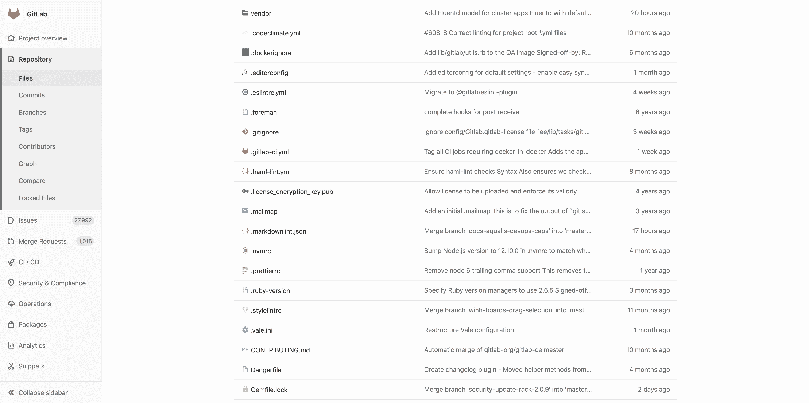
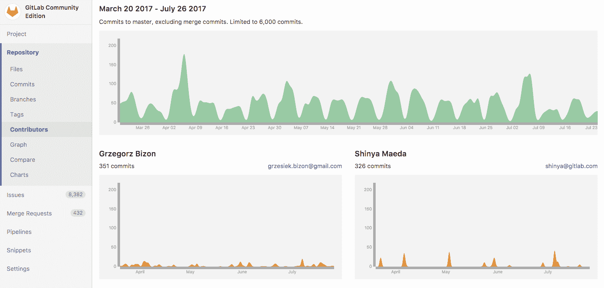
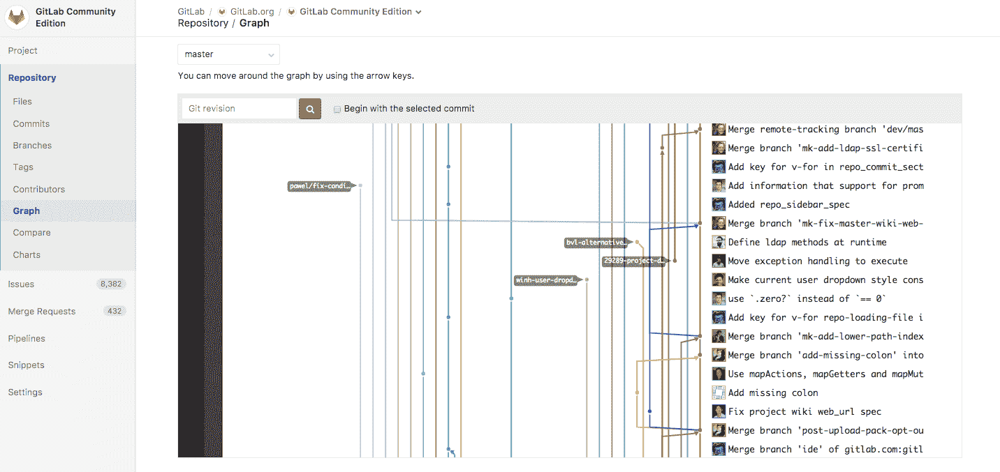
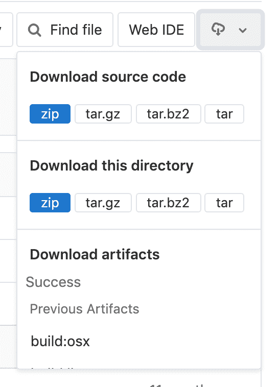

# Repository

> 原文：[https://docs.gitlab.com/ee/user/project/repository/](https://docs.gitlab.com/ee/user/project/repository/)

*   [Create a repository](#create-a-repository)
*   [Files](#files)
    *   [Create and edit files](#create-and-edit-files)
    *   [Find files](#find-files)
    *   [Supported markup languages and extensions](#supported-markup-languages-and-extensions)
    *   [Repository README and index files](#repository-readme-and-index-files)
    *   [Jupyter Notebook files](#jupyter-notebook-files)
    *   [OpenAPI viewer](#openapi-viewer)
*   [Branches](#branches)
*   [Commits](#commits)
*   [Project and repository size](#project-and-repository-size)
*   [Contributors](#contributors)
*   [Repository graph](#repository-graph)
*   [Repository Languages](#repository-languages)
*   [Locked files](#locked-files-premium)
*   [Repository’s API](#repositorys-api)
*   [Clone in Apple Xcode](#clone-in-apple-xcode)
*   [Download Source Code](#download-source-code)

# Repository[](#repository "Permalink")

[存储库](https://git-scm.com/book/en/v2/Git-Basics-Getting-a-Git-Repository)是用于将代码库存储在 GitLab 中并通过版本控制对其进行更改的存储库. 存储库是[项目的](../index.html)一部分，它具有许多其他功能.

## Create a repository[](#create-a-repository "Permalink")

要创建一个新的存储库，您需要做的就是[创建一个新项目](../../../gitlab-basics/create-project.html)或[创建](../../../gitlab-basics/create-project.html) [一个现有项目](forking_workflow.html) .

创建新项目后，您可以通过 UI（请参阅以下部分）或通过命令行添加新文件. 要从命令行添加文件，请遵循创建新项目时在屏幕上显示的说明，或在[命令行基础](../../../gitlab-basics/start-using-git.html)文档中通读它们.

> **重要提示：**出于安全原因，强烈建议您在使用命令行时[通过 SSH 与 GitLab 连接](../../../ssh/README.html) .

## Files[](#files "Permalink")

使用存储库将文件存储在 GitLab 中. 在[GitLab 12.10 及更高版本中](https://gitlab.com/gitlab-org/gitlab/-/issues/33806) ，您将在存储库的文件树中根据其扩展名在文件名旁边看到一个图标：

[](img/file_ext_icons_repo_v12_10.png)

### Create and edit files[](#create-and-edit-files "Permalink")

通过将文件推送到 GitLab，将代码库托管在 GitLab 存储库中. 您可以使用用户界面（UI），也可以[通过命令行将](../../../gitlab-basics/command-line-commands.html#start-working-on-your-project)本地计算机与 GitLab 连接.

要配置[GitLab CI / CD](../../../ci/README.html)来构建，测试和部署代码，请在存储库的根目录中添加一个名为[`.gitlab-ci.yml`](../../../ci/quick_start/README.html)的文件.

**从用户界面：**

GitLab 的用户界面允许您执行许多 Git 命令，而无需触摸命令行. 即使您定期使用命令行，有时[通过 GitLab UI](web_editor.html)也更容易做到：

*   [Create a file](web_editor.html#create-a-file)
*   [Upload a file](web_editor.html#upload-a-file)
*   [File templates](web_editor.html#template-dropdowns)
*   [Create a directory](web_editor.html#create-a-directory)
*   [Start a merge request](web_editor.html#tips)
*   [Find file history](git_history.html)
*   [Identify changes by line (Git blame)](git_blame.html)

**在命令行中：**

要开始使用命令行，请通读[命令行基础文档](../../../gitlab-basics/command-line-commands.html) .

### Find files[](#find-files "Permalink")

使用 GitLab 的[文件查找器](file_finder.html)在存储库中搜索文件.

### Supported markup languages and extensions[](#supported-markup-languages-and-extensions "Permalink")

GitLab 支持多种标记语言（有时称为[轻量标记语言](https://en.wikipedia.org/wiki/Lightweight_markup_language) ），您可以将其用于存储库中文件的内容. 它们主要用于文档目的.

只需为文件选择正确的扩展名，GitLab 就会根据标记语言来渲染它们.

| 标记语言 | Extensions |
| --- | --- |
| 纯文本 | `txt` |
| [Markdown](../../markdown.html) | `mdown`, `mkd`, `mkdn`, `md`, `markdown` |
| [reStructuredText](https://docutils.sourceforge.io/rst.html) | `rst` |
| [AsciiDoc](../../asciidoc.html) | `adoc`, `ad`, `asciidoc` |
| [Textile](https://textile-lang.com/) | `textile` |
| [rdoc](http://rdoc.sourceforge.net/doc/index.html) | `rdoc` |
| [Org mode](https://orgmode.org/) | `org` |
| [creole](http://www.wikicreole.org/) | `creole` |
| [MediaWiki](https://www.mediawiki.org/wiki/MediaWiki) | `wiki`, `mediawiki` |

### Repository README and index files[](#repository-readme-and-index-files "Permalink")

当存储库中存在`README`或`index`文件时，它的内容将由 GitLab 自动预渲染，而无需打开它.

它们可以是纯文本，也可以具有[受支持的标记语言](#supported-markup-languages-and-extensions)的扩展名：

有关优先级的一些注意事项：

1.  当`README`文件和`index`文件同时存在时， `README`文件将始终优先.
2.  如果存在多个具有不同扩展名的文件，则按字母顺序排列，但不带扩展名的文件例外，该扩展名始终优先. 例如， `README.adoc`将优先于`README.md` ，而`README.rst`将优先于`README` .

### Jupyter Notebook files[](#jupyter-notebook-files "Permalink")

[Jupyter](https://jupyter.org/) Notebook（以前的 IPython Notebook）文件用于许多领域的交互式计算，并且包含用户会话的完整记录，并包括代码，叙述性文本，方程式和丰富的输出.

[Read how to use Jupyter notebooks with GitLab.](jupyter_notebooks/index.html)

### OpenAPI viewer[](#openapi-viewer "Permalink")

在 GitLab 12.6 中[引入](https://gitlab.com/gitlab-org/gitlab/-/issues/19515) .

如果文件名包含`openapi`或`swagger`且扩展名为`yaml` ， `yml`或`json` ，则 GitLab 可以使用其文件查看器呈现 OpenAPI 规范文件. 以下示例都是正确的：

*   `openapi.yml`
*   `openapi.yaml`
*   `openapi.json`
*   `swagger.yml`
*   `swagger.yaml`
*   `swagger.json`
*   `gitlab_swagger.yml`
*   `openapi_gitlab.yml`
*   `OpenAPI.YML`
*   `openapi.Yaml`
*   `openapi.JSON`
*   `openapi.gitlab.yml`
*   `gitlab.openapi.yml`

然后，渲染它们：

1.  在 GitLab 的用户界面中导航至存储库中的 OpenAPI 文件.
2.  单击位于"显示源"和"编辑"按钮之间的"显示 OpenAPI"按钮（找到 OpenAPI 文件后，它将替换"显示渲染的文件"按钮）.

## Branches[](#branches "Permalink")

有关详细信息，请参见[分支](branches/index.html) .

## Commits[](#commits "Permalink")

[提交更改时](https://git-scm.com/book/en/v2/Git-Basics-Recording-Changes-to-the-Repository) ，您会将这些更改引入分支机构. 通过命令行，您可以在提交之前多次提交.

*   **提交消息：**提交消息对于标识正在更改的内容以及更重要的原因至关重要. 在 GitLab 中，您可以将关键字添加到提交消息中，以执行以下操作之一：
    *   **触发 GitLab CI / CD 管道：**如果您的项目配置有[GitLab CI / CD](../../../ci/README.html) ，则将在每次推送而不是每次提交时触发一个管道.
    *   **跳过管道：**您可以在提交消息中添加关键字[`[ci skip]`](../../../ci/yaml/README.html#skip-pipeline) ，GitLab CI / CD 将跳过该管道.
    *   **交叉链接问题和合并请求：** [交叉链接](../issues/crosslinking_issues.html#from-commit-messages)非常适合跟踪工作流程中与之相关的内容. 如果您在提交消息中提到问题或合并请求，它们将显示在各自的线程上.
*   **樱桃选择提交：**在 GitLab 中，您可以直接从 UI [樱桃选择提交](../merge_requests/cherry_pick_changes.html#cherry-picking-a-commit) .
*   **还原提交：**轻松[将提交](../merge_requests/revert_changes.html#reverting-a-commit)从 UI [还原](../merge_requests/revert_changes.html#reverting-a-commit)到所选分支.
*   **签署提交：**使用 GPG [签署您的提交](gpg_signed_commits/index.html) .

## Project and repository size[](#project-and-repository-size "Permalink")

在项目的" **详细信息"**页面上报告项目的大小. 报告的大小最多每 15 分钟更新一次，因此可能无法反映最近的活动. 显示的文件大小包括存储库文件，工件和 LFS.

由于压缩，内务处理和其他因素，每个项目的项目规模可能会略有不同.

[储存库大小限制](../../admin_area/settings/account_and_limit_settings.html)可以由管理员设置. GitLab.com 的存储库大小限制[由 GitLab 设置](../../gitlab_com/index.html#repository-size-limit) .

## Contributors[](#contributors "Permalink")

代码库的所有贡献者都显示在项目的**设置>贡献者下** .

它们是从协作者中以最少的提交次数排序的，并显示在一个漂亮的图形上：

[](img/contributors_graph.png)

## Repository graph[](#repository-graph "Permalink")

存储库图形以可视方式显示存储网络的历史记录，包括分支和合并. 这可以帮助您可视化存储库中使用的 Git 流策略：

[](img/repo_graph.png)

在您项目的**Repository> Graph**下找到它.

## Repository Languages[](#repository-languages "Permalink")

对于每个存储库的默认分支，GitLab 将确定使用了哪种编程语言，并将其显示在项目页面上. 如果缺少此信息，将在更新项目上的默认分支后添加. 此过程最多可能需要 5 分钟.

[](img/repository_languages_v12_2.gif)

Not all files are detected, among others; documentation, vendored code, and most markup languages are excluded. This behavior can be adjusted by overriding the default. For example, to enable `.proto` files to be detected, add the following to `.gitattributes` in the root of your repository.

```
*.proto linguist-detectable=true 
```

## Locked files[](#locked-files-premium "Permalink")

使用[文件锁定](../file_lock.html)来锁定文件，以防止发生任何冲突的更改.

## Repository’s API[](#repositorys-api "Permalink")

您可以通过[存储库 API](../../../api/repositories.html)访问您的[存储库](../../../api/repositories.html) .

## Clone in Apple Xcode[](#clone-in-apple-xcode "Permalink")

[Introduced](https://gitlab.com/gitlab-org/gitlab-foss/-/issues/45820) in GitLab 11.0

现在，可以使用位于用于克隆项目的 Git URL 旁边的新的" **在 Xcode 中打开"**按钮**在 Xcode 中**克隆包含`.xcodeproj`或`.xcworkspace`目录的项目. 该按钮仅在 macOS 上显示.

## Download Source Code[](#download-source-code "Permalink")

在 GitLab 11.11 中[引入](https://gitlab.com/gitlab-org/gitlab-foss/-/issues/24704)了对目录下载的支持.

可以从 UI 下载存储在存储库中的源代码. 单击下载图标，将打开一个下拉列表，其中包含下载以下内容的链接：

[](img/download_source_code.png)

*   **源代码：**允许用户在他们当前正在查看的分支上下载源代码. 可用扩展名： `zip` ， `tar` ， `tar.gz`和`tar.bz2` .
*   **目录：**仅在查看子目录时显示. 这使用户可以下载他们当前正在查看的特定目录. 也可以在`zip` ， `tar` ， `tar.gz`和`tar.bz2` .
*   **工件：**允许用户下载最新 CI 构建的工件.