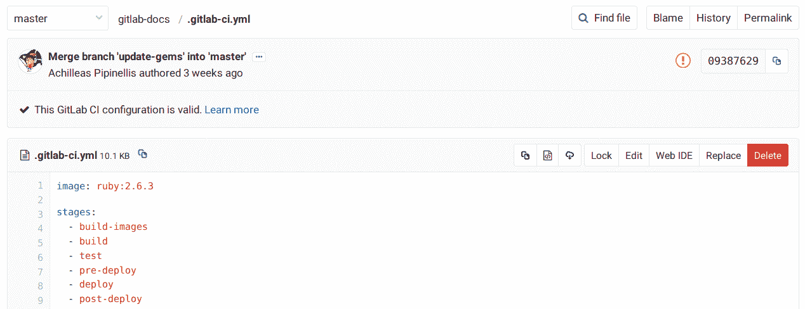
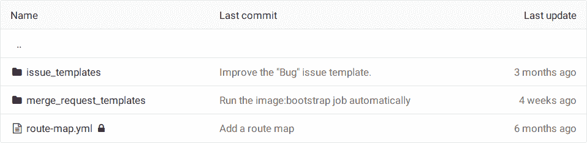
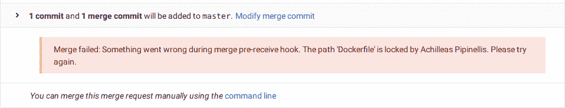

# File Locking

> 原文：[https://docs.gitlab.com/ee/user/project/file_lock.html](https://docs.gitlab.com/ee/user/project/file_lock.html)

*   [Overview](#overview)
*   [Use-cases](#use-cases)
*   [Locking a file or a directory](#locking-a-file-or-a-directory)
*   [Unlocking a file or a directory](#unlocking-a-file-or-a-directory)
*   [Viewing and managing existing locks](#viewing-and-managing-existing-locks)
*   [Permissions on file locking](#permissions-on-file-locking)

# File Locking[](#file-locking-premium "Permalink")

[Introduced](https://gitlab.com/gitlab-org/gitlab/-/merge_requests/440) in [GitLab Premium](https://about.gitlab.com/pricing/) 8.9.

与多个人一起使用同一文件可能会带来风险. 合并非文本文件时的冲突很难克服，将需要大量的手动工作来解决. 文件锁定可帮助您避免这些合并冲突并更好地管理二进制文件.

使用文件锁定，您可以锁定任何文件或目录，进行更改，然后将其解锁，以便团队的其他成员可以对其进行编辑.

## Overview[](#overview "Permalink")

与多个人一起使用同一文件可能会带来风险. 合并非文本文件时的冲突很难克服，将需要大量的手动工作来解决. 借助 GitLab Premium，文件锁定可防止他人（您除外）修改特定文件或整个目录，从而帮助您避免合并冲突并更好地管理二进制文件.

## Use-cases[](#use-cases "Permalink")

在以下情况下，文件锁定功能很有用：

*   多个人正在同一个文件上，您要避免合并冲突.
*   您的存储库包含二进制文件，在这种情况下，没有简单的方法来告诉您与同事的更改之间的区别.
*   防止设计资产被覆盖.

Locked directories are locked recursively, which means that everything that lies under them is also locked.

## Locking a file or a directory[](#locking-a-file-or-a-directory "Permalink")

**注意：**锁定仅适用于您在项目设置中设置的默认分支（通常是`master` ）.

锁定文件：

1.  导航到项目的" **存储库">"文件"** .
2.  选择您要锁定的文件.
3.  点击"锁定"按钮.

    [](img/file_lock.png)

要锁定整个目录，请在"历史记录"旁边查找"锁定"链接.

锁定文件或目录后，它在存储库视图中将显示为已锁定.

[](img/file_lock_repository_view.png)

一旦锁定，对默认分支的任何合并请求将无法合并，直到文件被解锁.

## Unlocking a file or a directory[](#unlocking-a-file-or-a-directory "Permalink")

要解锁文件或目录，请遵循与锁定文件或目录相同的步骤. 有关每个现有锁的详细视图，请参阅下一节"查看和管理现有锁".

您可以解锁自己或其他人先前锁定的文件，只要您对该项目具有"维护者"或更高[权限](../permissions.html) .

## Viewing and managing existing locks[](#viewing-and-managing-existing-locks "Permalink")

要查看或管理每个现有锁，请导航至" **项目">"存储库">"锁定文件"**区域. 在这里，您可以查看所有现有的锁，并[删除您拥有权限的](#permissions-on-file-locking)锁.

## Permissions on file locking[](#permissions-on-file-locking "Permalink")

锁定文件或目录的用户**是唯一**可以编辑并将其更改推回锁定对象所在存储库的用户.

可以对存储库进行[推送访问](../permissions.html)的任何人都可以创建锁. 即开发人员和更高级别的人员，并且只能由其作者和具有维护者权限及更高权限的任何用户删除.

如果文件被锁定并且您不是其锁定状态的作者，则在尝试推送时，预接收挂钩将拒绝您的更改. 在以下示例中，对锁定的`.gitignore`文件没有权限的用户将看到以下消息：

```
Counting objects: 3, done.
Delta compression using up to 4 threads.
Compressing objects: 100% (3/3), done.
Writing objects: 100% (3/3), 320 bytes | 0 bytes/s, done.
Total 3 (delta 1), reused 0 (delta 0)
remote: GitLab: The path '.gitignore' is locked by Administrator
To https://example.com/gitlab-org/gitlab-foss.git
 ! [remote rejected] master -> master (pre-receive hook declined)
 error: failed to push some refs to 'https://example.com/gitlab-org/gitlab-foss.git' 
```

同样，当不是文件锁定状态作者的用户接受合并请求时，将出现一条错误消息，指出文件已锁定.

[](img/file_lock_merge_request_error_message.png)