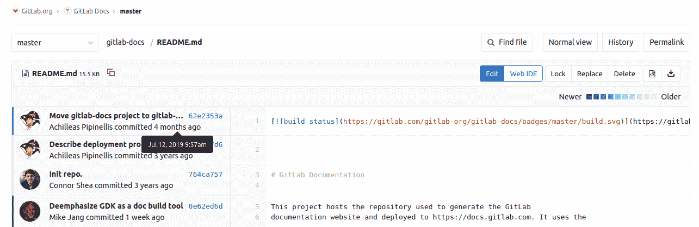
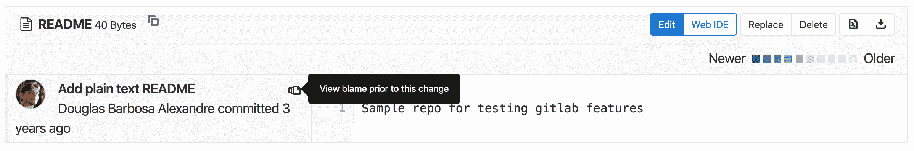

# Git file blame

> 原文：[https://docs.gitlab.com/ee/user/project/repository/git_blame.html](https://docs.gitlab.com/ee/user/project/repository/git_blame.html)

*   [Blame previous commit](#blame-previous-commit)
*   [Associated `git` command](#associated-git-command)
*   [File blame through the API](#file-blame-through-the-api)

# Git file blame[](#git-file-blame "Permalink")

在 GitLab 2.5 中[引入](https://git.sphere.ly/staff/publicgitlab/commit/39c657930625ddc3ac8a921f01ffc83acadce68f)

[Git blame](https://git-scm.com/docs/git-blame)提供有关文件中每一行的更多信息，包括最后修改时间，作者和提交哈希.

您可以在项目中的每个文件中找到" **责备"**按钮.

[](img/file_blame_button_v12_6.png)

选择" **责备"**按钮时，您会看到一个带有说明信息的屏幕：

[](img/file_blame_output_v12_6.png)

如果将鼠标悬停在 UI 中的提交上，您将看到该提交的确切日期和时间.

## Blame previous commit[](#blame-previous-commit "Permalink")

在 GitLab 12.7 中[引入](https://gitlab.com/gitlab-org/gitlab/-/issues/19299) .

要查看特定行的早期修订，请**在此更改**之前单击" **查看责备"，**直到找到您有兴趣查看的**更改**为止：

[](img/file_blame_previous_commit_v12_7.png)

## Associated `git` command[](#associated-git-command "Permalink")

如果从命令行运行`git` ，则等效命令为`git blame <filename>` . 例如，如果你想找到`blame`有关信息`README.md`在本地目录中的文件，运行以下命令：

```
git blame README.md 
```

您将看到类似于以下内容的输出，其中包括 UTC 格式的提交时间：

```
62e2353a (Achilleas Pipinellis     2019-07-11 14:52:18 +0300   1) [](https://gitlab.com/gitlab-com/gitlab-docs/commits/master)
fb0fc7d6 (Achilleas Pipinellis     2016-11-07 22:21:22 +0100   2)
^764ca75 (Connor Shea              2016-10-05 23:40:24 -0600   3) # GitLab Documentation
^764ca75 (Connor Shea              2016-10-05 23:40:24 -0600   4)
0e62ed6d (Mike Jang                2019-11-26 21:44:53 +0000   5) This project hosts the repository used to generate the GitLab
0e62ed6d (Mike Jang                2019-11-26 21:44:53 +0000   6) documentation website and deployed to https://docs.gitlab.com. It uses the 
```

## File blame through the API[](#file-blame-through-the-api "Permalink")

您也可以通过[Git 文件指责 REST API](../../../api/repository_files.html#get-file-blame-from-repository)来获取此信息.