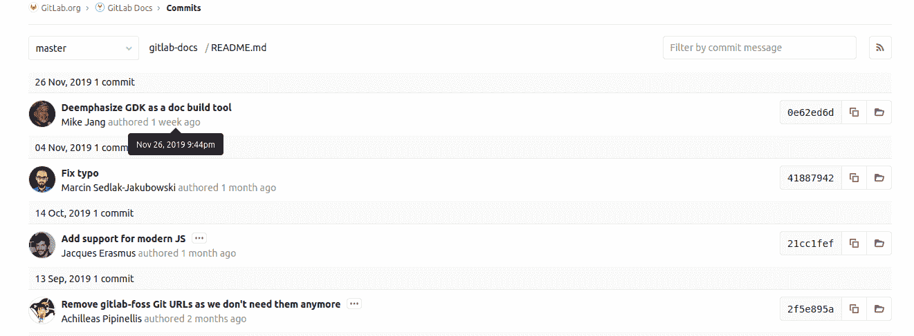

# Git file history

> 原文：[https://docs.gitlab.com/ee/user/project/repository/git_history.html](https://docs.gitlab.com/ee/user/project/repository/git_history.html)

*   [Associated `git` command](#associated-git-command)

# Git file history[](#git-file-history "Permalink")

在 GitLab 0.8.0 中[引入](https://gitlab.com/gitlab-org/gitlab/blob/9ba1224867665844b117fa037e1465bb706b3685/app/controllers/commits_controller.rb)

Git 文件历史记录提供有关与文件关联的提交历史记录的信息.

您可以在项目中的每个文件中找到" **历史记录"**按钮.

[](img/file_history_button_v12_6.png)

当选择" **历史记录"**按钮时，您将看到一个带有说明信息的屏幕：

[](img/file_history_output_v12_6.png)

如果将鼠标悬停在 UI 中的提交上，您将看到上次修改提交的确切日期和时间.

## Associated `git` command[](#associated-git-command "Permalink")

如果从命令行运行`git` ，则等效命令为`git log <filename>` . 例如，如果要在本地目录中找到有关`README.md`文件的`history`信息，请运行以下命令：

```
git log README.md 
```

您将看到类似于以下内容的输出，其中包括 UTC 格式的提交时间：

```
commit 0e62ed6d9f39fa9bedf7efc6edd628b137fa781a
Author: Mike Jang <mjang@gitlab.com>
Date:   Tue Nov 26 21:44:53 2019 +0000

    Deemphasize GDK as a doc build tool

commit 418879420b1e3a4662067bd07b64bb6988654697
Author: Marcin Sedlak-Jakubowski <msedlakjakubowski@gitlab.com>
Date:   Mon Nov 4 19:58:27 2019 +0100

    Fix typo

commit 21cc1fef11349417ed515557748369cfb235fc81
Author: Jacques Erasmus <jerasmus@gitlab.com>
Date:   Mon Oct 14 22:13:40 2019 +0000

    Add support for modern JS

    Added rollup to the project

commit 2f5e895aebfa5678e51db303b97de56c51e3cebe
Author: Achilleas Pipinellis <axil@gitlab.com>
Date:   Fri Sep 13 14:03:01 2019 +0000

    Remove gitlab-foss Git URLs as we don't need them anymore

    [ci skip] 
```