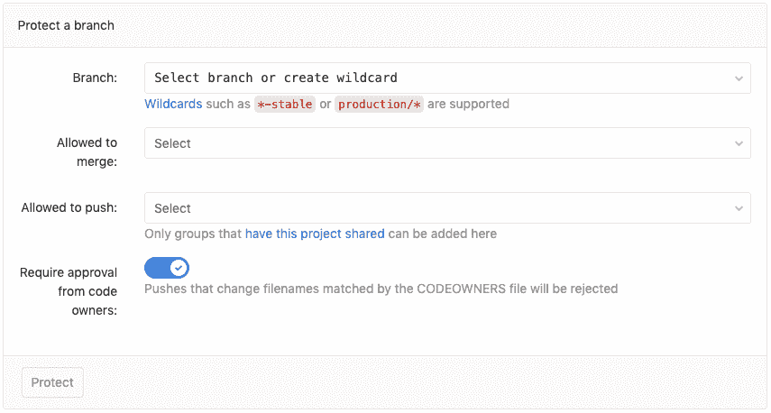
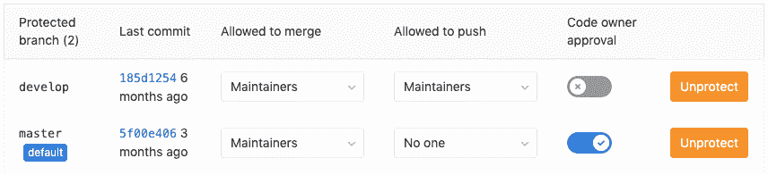
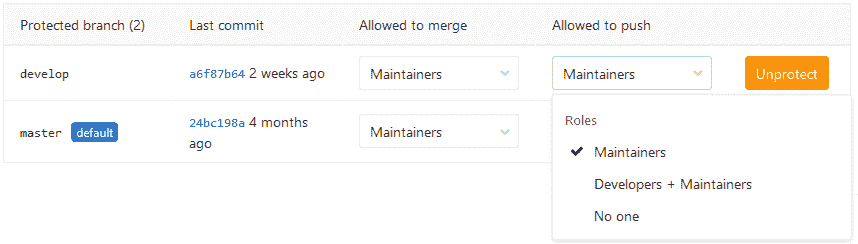
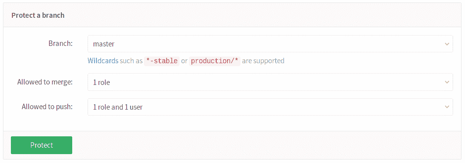
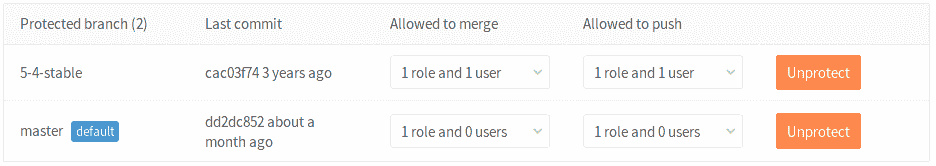
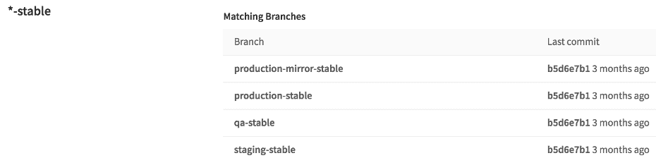
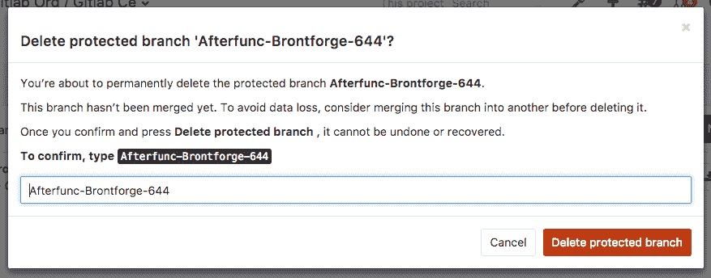
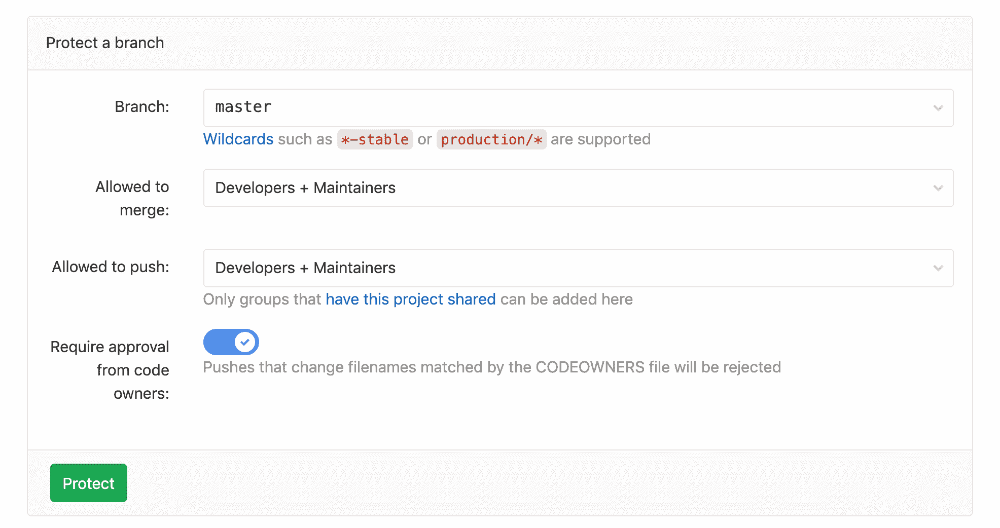
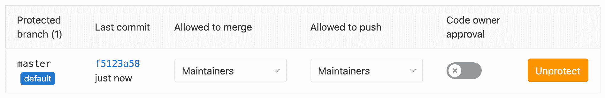

# Protected branches

> 原文：[https://docs.gitlab.com/ee/user/project/protected_branches.html](https://docs.gitlab.com/ee/user/project/protected_branches.html)

*   [Overview](#overview)
*   [Configuring protected branches](#configuring-protected-branches)
*   [Using the Allowed to merge and Allowed to push settings](#using-the-allowed-to-merge-and-allowed-to-push-settings)
*   [Restricting push and merge access to certain users](#restricting-push-and-merge-access-to-certain-users-starter)
*   [Wildcard protected branches](#wildcard-protected-branches)
*   [Creating a protected branch](#creating-a-protected-branch)
*   [Deleting a protected branch](#deleting-a-protected-branch)
*   [Protected Branches approval by Code Owners](#protected-branches-approval-by-code-owners-premium)
*   [Running pipelines on protected branches](#running-pipelines-on-protected-branches)
*   [Changelog](#changelog)

# Protected branches

GitLab 中的[权限](../permissions.html)基本上是围绕对存储库和分支具有读或写权限的想法定义的. 为了对某些分支机构施加进一步的限制，可以对其进行保护.

## Overview

默认情况下，受保护的分支执行以下四个简单的操作：

*   它会阻止除具有维护者权限的用户之外的所有用户创建它（如果尚未创建）.
*   它可以防止除具有**允许的**权限的用户以外的其他任何人推送.
*   它可以防止**任何人**用力推动分支机构.
*   它可以防止**任何人**删除分支.

**注意：**允许 GitLab 管理员推送到受保护的分支.

有关随时间的变化，请参见" [更改日志"](#changelog)部分.

默认的分支保护级别在[管理区域中](../admin_area/settings/visibility_and_access_controls.html#default-branch-protection)设置.

## Configuring protected branches

要保护分支，您需要至少具有维护者权限级别. 请注意，默认情况下`master`分支是受保护的.

1.  导航到项目的**"设置"➔"存储库"**
2.  滚动查找" **受保护的分支"**部分.
3.  从" **分支"**下拉菜单中，选择要保护的分支，然后单击" **保护"** . 在下面的屏幕截图中，我们选择了`develop`分支.

    

4.  完成后，受保护的分支将出现在"受保护的分支"列表中.

    

## Using the Allowed to merge and Allowed to push settings

在 GitLab 8.11 中[引入](https://gitlab.com/gitlab-org/gitlab-foss/-/merge_requests/5081) .

从 GitLab 8.11 开始，我们增加了分支保护的另一层，它提供了对受保护分支的更精细的管理. "开发人员可以推送"选项由"允许推送"设置代替，该设置可以设置为允许/禁止维护者和/或开发人员推送到受保护的分支.

使用"允许推送"和"允许合并"设置，您可以控制不同角色可以在受保护分支中执行的操作. 例如，您可以将"允许推送"设置为"无人"，将"允许合并"设置为"开发人员+维护人员"，以要求*每个人都*提交合并请求，以请求更改进入受保护分支. 这与[GitLab 工作](../../topics/gitlab_flow.html)流程等[工作流程](../../topics/gitlab_flow.html)兼容.

但是，有些工作流程不需要这样做，只有防止强行推动和移除分支才有用. 对于这些工作流程，您可以通过将"允许推送"设置为"开发人员+维护人员"来允许具有写访问权的每个人推送到受保护的分支.

您可以在创建受保护的分支时设置"允许推送"和"允许合并"选项，也可以在之后通过从"已保护"区域的下拉列表中选择所需的选项来设置.

如果在创建受保护的分支时未选择任何这些选项，则默认情况下会将它们设置为"维护者".

## Restricting push and merge access to certain users

[Introduced](https://gitlab.com/gitlab-org/gitlab-foss/-/merge_requests/5081) in [GitLab Starter](https://about.gitlab.com/pricing/) 8.11.

使用 GitLab 企业版，您可以通过选择角色（维护者，开发者）以及某些用户来限制对受保护分支的访问. 从下拉菜单中选择您要合并或推送访问的角色和/或用户.

单击" **保护"** ，该分支将出现在"受保护的分支"列表中.

## Wildcard protected branches

在 GitLab 8.10 中[引入](https://gitlab.com/gitlab-org/gitlab-foss/-/merge_requests/4665) .

您可以指定一个通配符保护的分支，该分支将保护所有与通配符匹配的分支. 例如：

| 通配符保护的分支 | 匹配分支 |
| --- | --- |
| `*-stable` | `production-stable`, `staging-stable` |
| `production/*` | `production/app-server`, `production/load-balancer` |
| `*gitlab*` | `gitlab`, `gitlab/staging`, `master/gitlab/production` |

受保护的分支设置（如"开发人员可以推送"）适用于所有匹配的分支.

两个不同的通配符可能会匹配同一分支. 例如， `*-stable` `production-stable`和`production-*`都将与`production-stable`分支匹配. 在这种情况下，如果*这些*受保护的分支有这样一个设定"允许推送"，然后`production-stable`也将继承这一设置.

如果单击受保护分支的名称，将显示所有匹配分支的列表：

## Creating a protected branch

在 GitLab 11.9 中[引入](https://gitlab.com/gitlab-org/gitlab-foss/-/issues/53361) .

当受保护的分支或通配符受保护的分支设置为" [**不允许任何人** **推送"时**](#using-the-allowed-to-merge-and-allowed-to-push-settings) ，只要允许开发人员（和具有较高[权限级别的](../permissions.html)用户） [**合并**](#using-the-allowed-to-merge-and-allowed-to-push-settings) ，就可以创建新的受保护分支. 这只能通过 UI 或 API 来完成（为避免意外地从命令行或 Git 客户端应用程序创建受保护的分支）.

通过用户界面创建新分支：

1.  Visit **资料库>分支机构**.
2.  Click on **新分支**.
3.  填写分支名称，然后选择一个现有的分支，标记或确认新分支将基于该分支. 仅接受现有的受保护分支和已经在受保护分支中的提交.

## Deleting a protected branch

在 GitLab 9.3 中[引入](https://gitlab.com/gitlab-org/gitlab-foss/-/issues/21393) .

有时可能需要删除或清理受保护的分支.

具有[维护者权限](../permissions.html)并具有[维护者权限的](../permissions.html)用户可以通过 GitLab 的 Web 界面手动删除受保护的分支：

1.  Visit **资料库>分支机构**
2.  单击您要删除的分支旁边的删除图标
3.  为了防止意外删除，需要额外的确认

    

只能通过 Web 界面而不是 Git 删除受保护的分支. 这意味着您不能从命令行或 Git 客户端应用程序中意外删除受保护的分支.

## Protected Branches approval by Code Owners

[Introduced](https://gitlab.com/gitlab-org/gitlab/-/issues/13251) in [GitLab Premium](https://about.gitlab.com/pricing/) 12.4.

对于合并请求更改的文件，可能需要[代码所有者的](code_owners.html)至少一项批准. 可以在保护新分支时设置"代码所有者"批准，也可以将其设置为已经受保护的分支，如下所述.

要保护新分支并获得代码所有者的批准：

1.  导航到项目的**"设置">"存储库"，**然后展开" **受保护的分支"** .
2.  向下滚动到**保护一个分支** ，选择**分支**或通配符你想保护，选择谁的**允许合并** **，**并**允许推** ，以及切换**需要从代码的业主**滑块**批准** .
3.  Click **Protect**.

要使代码所有者批准已受保护的分支机构，请执行以下操作：

1.  导航到项目的**"设置">"存储库"，**然后展开" **受保护的分支"** .
2.  向下滚动到" **受保护"分支，**然后切换所选分支的**"代码所有者"批准**滑块.

启用后，所有针对这些分支的合并请求都将需要代码所有者根据匹配的规则进行批准，然后才能合并. 此外，如果匹配规则，则拒绝直接推送到受保护的分支.

## Running pipelines on protected branches

合并或推送到受保护分支的权限用于定义用户是否可以运行 CI / CD 管道并在与那些分支相关的作业上执行操作.

有关管道安全模型的详细信息，请参阅[受保护分支上](../../ci/pipelines/index.html#pipeline-security-on-protected-branches)的安全性.

## Changelog

**11.9**

*   [允许](https://gitlab.com/gitlab-org/gitlab-foss/-/issues/53361)开发人员（和具有更高权限级别的用户）通过 API 和用户界面[创建受保护的分支](https://gitlab.com/gitlab-org/gitlab-foss/-/issues/53361) .

**9.2**

*   允许通过 Web 界面删除受保护的分支（ [问题＃21393](https://gitlab.com/gitlab-org/gitlab-foss/-/issues/21393) ）.

**8.11**

*   允许创建无法推送到的受保护分支（ [合并请求！5081](https://gitlab.com/gitlab-org/gitlab-foss/-/merge_requests/5081) ）.

**8.10**

*   允许没有推送访问权限的开发人员合并到受保护的分支中（ [合并请求！4892](https://gitlab.com/gitlab-org/gitlab-foss/-/merge_requests/4892) ）.
*   允许使用通配符指定受保护的分支（ [合并请求！4665](https://gitlab.com/gitlab-org/gitlab-foss/-/merge_requests/4665) ）.