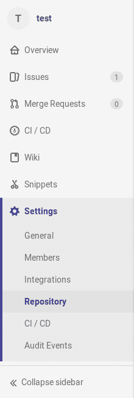
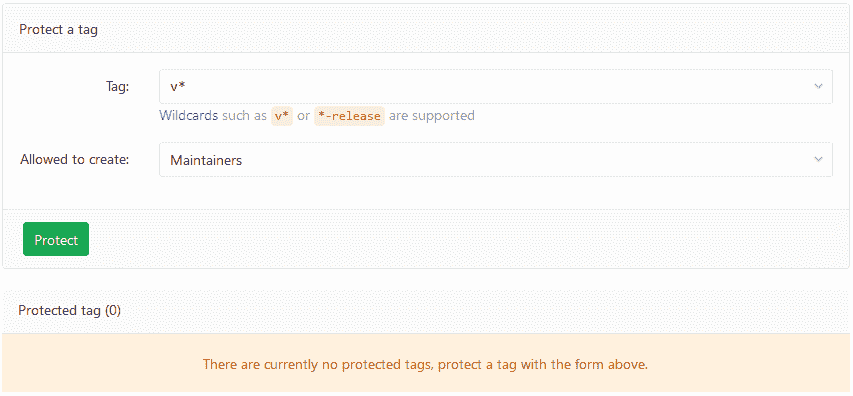
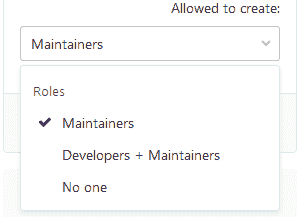
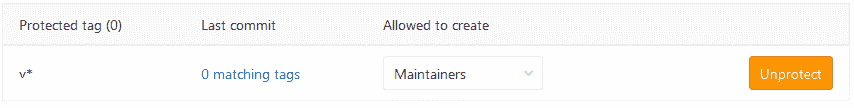
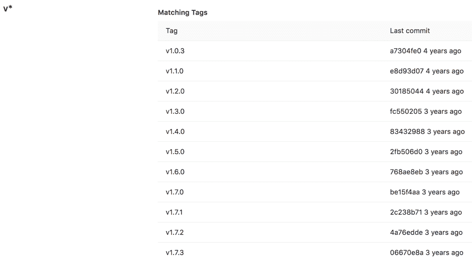

# Protected tags

> 原文：[https://docs.gitlab.com/ee/user/project/protected_tags.html](https://docs.gitlab.com/ee/user/project/protected_tags.html)

*   [Overview](#overview)
*   [Configuring protected tags](#configuring-protected-tags)
*   [Wildcard protected tags](#wildcard-protected-tags)

# Protected tags

在 GitLab 9.1 中[引入](https://gitlab.com/gitlab-org/gitlab-foss/-/merge_requests/10356) .

受保护的标签可控制谁有权创建标签，并防止创建后意外更新或删除. 每个规则都允许您匹配单个标签名称，或使用通配符一次控制多个标签.

此功能从[受保护的分支](protected_branches.html)演变而来

## Overview

受保护的标签将阻止任何人更新或删除标签，并且将根据您选择的权限阻止创建匹配的标签. 默认情况下，任何未经维护者许可的人都将无法创建标签.

## Configuring protected tags

为了保护标签，您需要至少具有维护者权限级别.

1.  导航到项目的**"设置">"存储库"** ：

    

2.  从**标签**下拉菜单中，选择要保护或输入的标签，然后点击**创建通配符** . 在下面的屏幕截图中，我们选择保护所有与`v*`匹配的标签：

    

3.  从" **允许创建"**下拉列表中，选择谁有权创建匹配的标签，然后单击" **保护"** ：

    

4.  完成后，受保护的标签将显示在" **受保护的标签"**列表中：

    

## Wildcard protected tags

您可以指定一个通配符保护的标记，它将保护所有与通配符匹配的标记. 例如：

| 通配符保护标签 | 匹配标签 |
| --- | --- |
| `v*` | `v1.0.0`, `version-9.1` |
| `*-deploy` | `march-deploy`, `1.0-deploy` |
| `*gitlab*` | `gitlab`, `gitlab/v1` |
| `*` | `v1.0.1rc2`, `accidental-tag` |

两个不同的通配符可以潜在地匹配同一标签. 例如， `*-stable` `production-stable`和`production-*`都将与`production-stable`标签匹配. 在这种情况下，如果*这些*受保护的标签都像**允许创建**一个设定，然后`production-stable`也将沿用此设置.

如果单击受保护标签的名称，将显示所有匹配标签的列表：

