# GitLab Web Editor

> 原文：[https://docs.gitlab.com/ee/user/project/repository/web_editor.html](https://docs.gitlab.com/ee/user/project/repository/web_editor.html)

*   [Create a file](#create-a-file)
    *   [Template dropdowns](#template-dropdowns)
*   [Upload a file](#upload-a-file)
*   [Create a directory](#create-a-directory)
*   [Create a new branch](#create-a-new-branch)
    *   [Create a new branch from an issue](#create-a-new-branch-from-an-issue)
    *   [Create a new branch from a project’s dashboard](#create-a-new-branch-from-a-projects-dashboard)
*   [Create a new tag](#create-a-new-tag)
*   [Tips](#tips)

# GitLab Web Editor

有时，直接从 GitLab 界面进行快速更改要比克隆项目并使用 Gi​​t 命令行工具容易. 在此功能中，我们重点介绍如何从文件浏览器创建新文件，目录，分支或标记. 所有这些操作都可以通过一个下拉菜单获得.

## Create a file

在项目的文件页面中，单击分支选择器右侧的" +"按钮. 从下拉列表中选择**新文件** .

[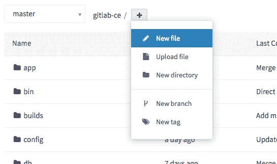](img/web_editor_new_file_dropdown.png)

在" **文件名"**框中输入文件名. 然后，在编辑器区域中添加文件内容. 添加描述性提交消息并选择一个分支. 分支字段将默认为您在文件浏览器中查看的分支. 如果输入新的分支名称，将出现一个复选框，允许您在提交更改后启动新的合并请求.

当您对新文件感到满意时，请单击底部的" **提交更改** ".

[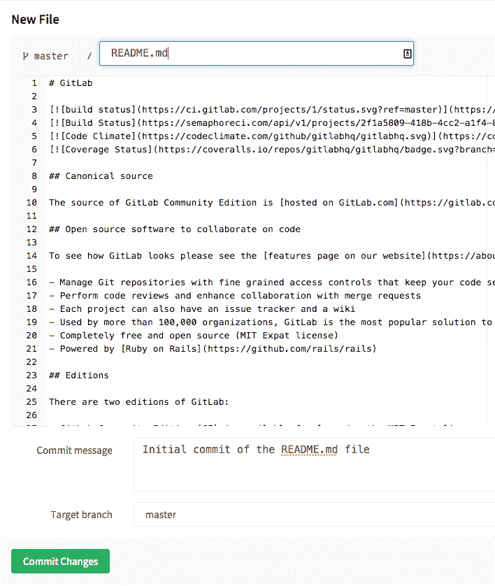](img/web_editor_new_file_editor.png)

### Template dropdowns

启动新项目时，新项目可能也需要一些通用文件. 因此，GitLab 将显示一条消息，以简化您的操作.

[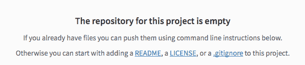](img/web_editor_template_dropdown_first_file.png)

当单击`LICENSE`或`.gitignore`等时，将显示一个下拉列表，为您提供适合您的项目的模板.

[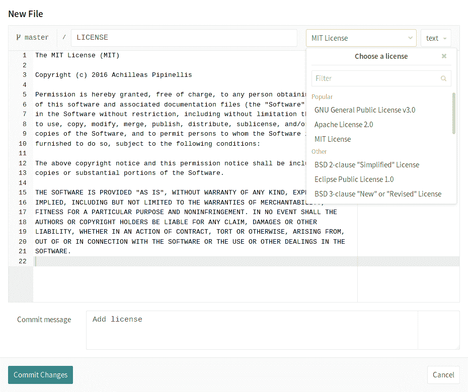](img/web_editor_template_dropdown_mit_license.png)

许可证， `.gitlab-ci.yml`日志，贡献指南或`.gitlab-ci.yml`文件也可以通过项目页面上的按钮添加. 在下面的示例中，许可证已经创建，这将创建指向许可证本身的链接.

[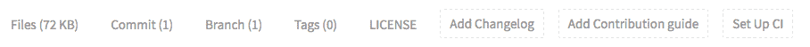](img/web_editor_template_dropdown_buttons.png)

> **Note:** The **设置 CI / CD** button will not appear on an empty repository. You have to at least add a file in order for the button to show up.

## Upload a file

当内容为文本时，创建文件的能力非常出色. 但是，这不适用于二进制数据，例如图像，PDF 或其他文件类型. 在这种情况下，您需要上传文件.

在项目的文件页面中，单击分支选择器右侧的" +"按钮. 从下拉菜单中选择上**载文件** .

[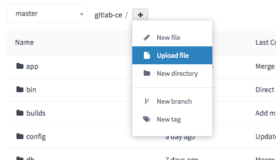](img/web_editor_upload_file_dropdown.png)

弹出上传对话框后，有两种方法可以上传文件. 可以在弹出窗口中拖放文件，也可以使用**点击上传**链接. 选择要上传的文件后，将显示文件预览.

输入提交消息，选择一个分支，并在准备好后单击"上**载文件"** .

[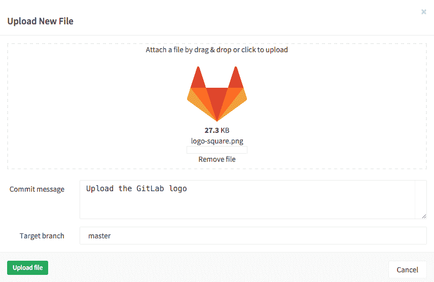](img/web_editor_upload_file_dialog.png)

## Create a directory

为了使档案库中的文件井井有条，创建一个新目录通常会很有帮助.

在项目的文件页面中，单击分支选择器右侧的加号按钮（ `+` ）. 从下拉菜单中选择" **新建目录** ".

[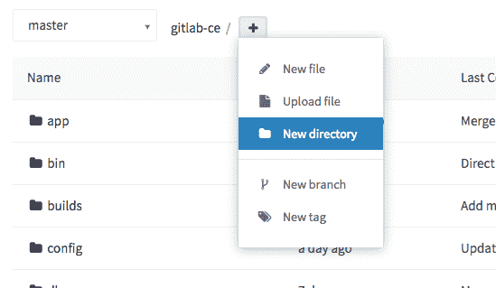](img/web_editor_new_directory_dropdown.png)

在新目录对话框中，输入目录名称，提交消息并选择目标分支. 单击**创建目录**以完成.

[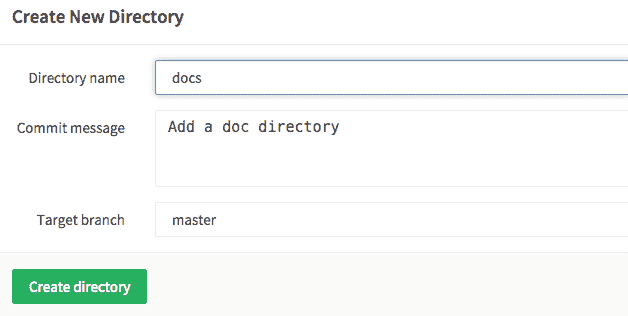](img/web_editor_new_directory_dialog.png)

## Create a new branch

有多种方法可从 GitLab 的 Web 界面创建分支.

### Create a new branch from an issue

在 GitLab 8.6 中[引入](https://gitlab.com/gitlab-org/gitlab-foss/-/merge_requests/2808) .

如果您的开发工作流程要求每个合并请求都存在问题，则可以直接从该问题快速创建分支，以加快流程. 新分支及其以后的合并请求将被标记为与此问题相关. 合并后，MR 将自动关闭问题. 您可以在问题说明下方看到" **创建合并请求"**下拉列表.

**注意：**如果已经有一个具有相同名称的分支或一个引用的合并请求，或者您的项目具有活动的派生关系，则不会看到" **创建合并请求"**按钮. 如果您想显示此按钮，则可能的解决方法是[删除项目的 fork 关系](../settings/index.html#removing-a-fork-relationship) . 删除后，派生关系将无法恢复，您将不再能够将合并请求发送到源.

[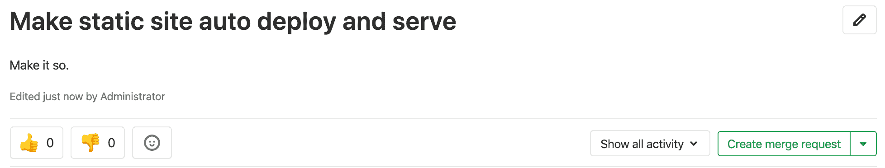](img/web_editor_new_branch_from_issue_create_button_v12_6.png)

该下拉列表包含选项**创建合并请求和分支**以及**创建分支** .

[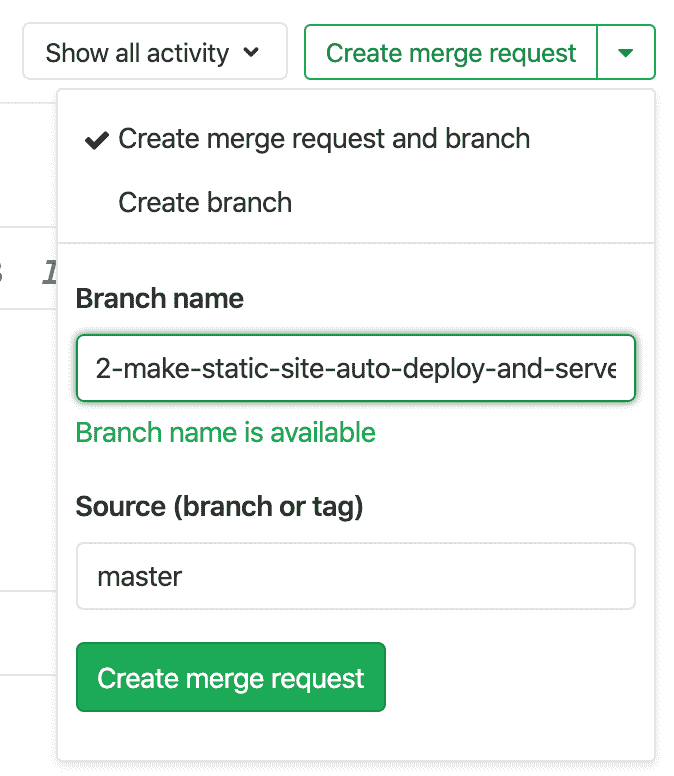](img/web_editor_new_branch_from_issue_v_12_6.png)

选择这些选项之一后，将基于项目的默认分支（默认为`master`创建新的分支或分支与合并请求. 分支名称将基于问题的标题，并作为前缀具有其内部 ID. 因此，上面的示例屏幕快照将创建一个名为`2-make-static-site-auto-deploy-and-serve`的分支.

当您在一个空的存储库项目中单击**创建分支**按钮时，GitLab 会自动创建一个`master`分支， `README.md`提交一个空白的`README.md`文件，并根据问题标题创建并将您重定向到新分支. 如果您的[项目已经配置了](../integrations/overview.html) Kubernetes 等[部署服务](../integrations/overview.html) ，则 GitLab 会更进一步，并通过帮助您创建`.gitlab-ci.yml`文件来提示您设置[自动部署](../../../topics/autodevops/stages.html#auto-deploy) .

创建分支后，您可以编辑存储库中的文件以解决此问题. 当基于新创建的分支创建合并请求时，描述字段将自动显示[问题关闭模式](../issues/managing_issues.html#closing-issues-automatically) `Closes #ID` ，其中`ID`为问题的 ID. 一旦合并请求被合并，这将解决问题.

### Create a new branch from a project’s dashboard

如果要在创建新的合并请求之前对多个文件进行更改，则可以预先创建一个新的分支. 在项目的文件页面上，从下拉列表中选择" **新建分支** ".

[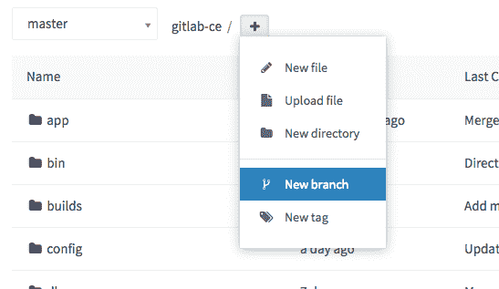](img/web_editor_new_branch_dropdown.png)

输入新的**分支名称** . （可选）更改" **创建自"**字段以选择该新分支将来自哪个分支，标记或提交 SHA. 如果您开始键入现有的分支或标签，则此字段将自动完成. 单击**创建分支** ，您将返回到该新分支上的文件浏览器.

[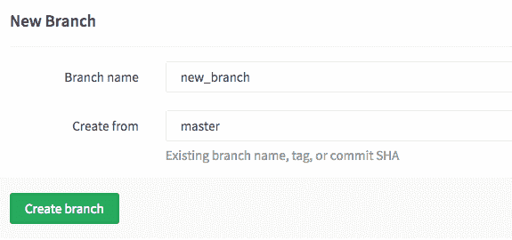](img/web_editor_new_branch_page.png)

现在，您可以根据需要更改任何文件. 当您准备好将更改合并回母版时，可以使用屏幕顶部的小部件. 在创建分支或修改文件后，此窗口小部件仅显示一段时间.

## Create a new tag

标签可用于标记主要的里程碑，例如生产版本，候选版本等等. 您可以从分支或提交 SHA 创建标签. 在项目的文件页面上，从下拉列表中选择" **新建标签** ".

[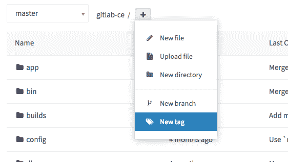](img/web_editor_new_tag_dropdown.png)

给标签起一个名字，例如`v1.0.0` . 选择您要从中创建此新标签的分支或 SHA. 您可以选择添加一条消息和发行说明. 发行说明部分支持 Markdown 格式，您也可以上传附件. 单击**创建标签** ，您将被带到标签列表页面.

[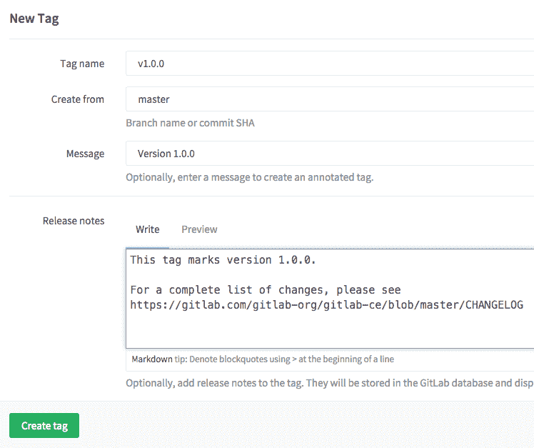](img/web_editor_new_tag_page.png)

## Tips

创建或上载新文件或创建新目录时，可以触发新的合并请求，而不是直接提交给 master. 在**目标分支**字段中输入新的分支名称. 您会注意到出现一个复选框，标**有"通过这些更改启动新的合并请求"** . 提交更改后，您将进入新的合并请求表单.

[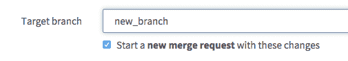](img/web_editor_start_new_merge_request.png)

如果你*不*希望使用您的主电子邮件地址通过 Web 编辑器创建的提交，您可以选择使用其他的链接的电子邮件地址的从**用户设置>编辑个人资料**页面.