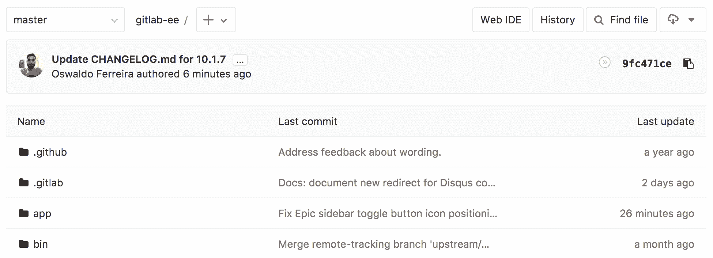
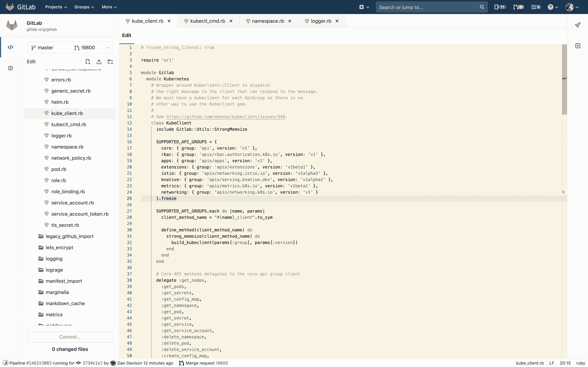
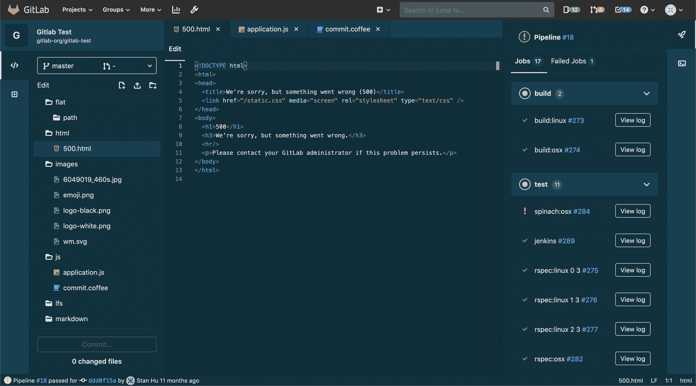
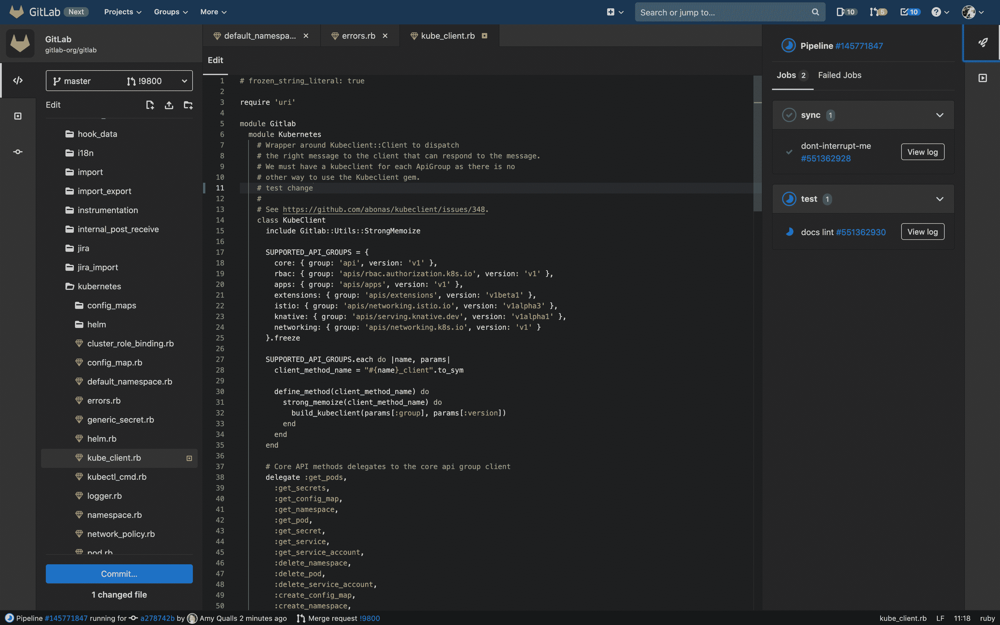
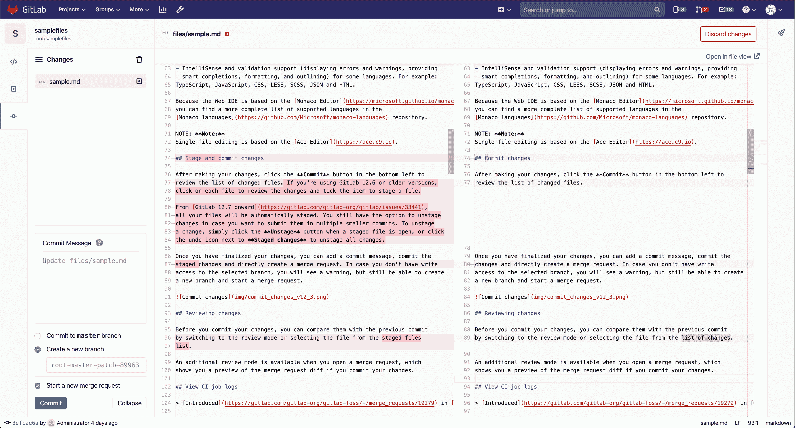
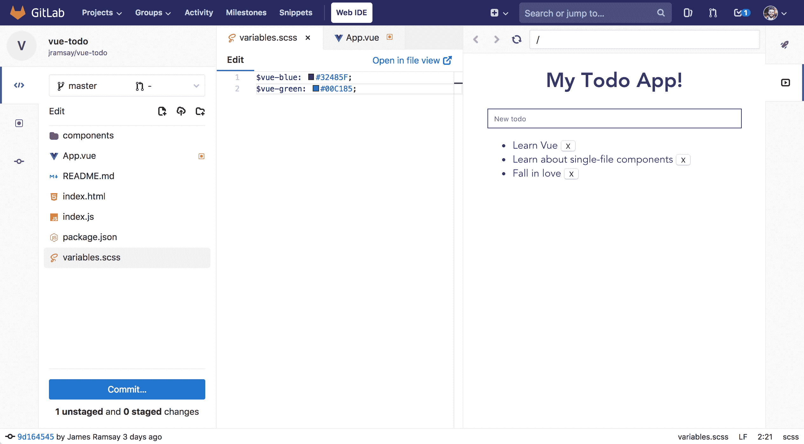
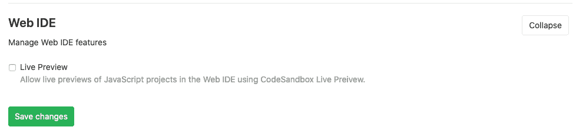
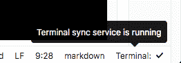

# Web IDE

> 原文：[https://docs.gitlab.com/ee/user/project/web_ide/](https://docs.gitlab.com/ee/user/project/web_ide/)

*   [Open the Web IDE](#open-the-web-ide)
*   [File finder](#file-finder)
*   [Syntax highlighting](#syntax-highlighting)
    *   [Themes](#themes)
*   [Configure the Web IDE](#configure-the-web-ide)
*   [Commit changes](#commit-changes)
*   [Reviewing changes](#reviewing-changes)
*   [View CI job logs](#view-ci-job-logs)
*   [Switching merge requests](#switching-merge-requests)
*   [Switching branches](#switching-branches)
*   [Markdown editing](#markdown-editing)
*   [Live Preview](#live-preview)
    *   [Enabling Live Preview](#enabling-live-preview)
*   [Interactive Web Terminals for the Web IDE](#interactive-web-terminals-for-the-web-ide)
    *   [Runner configuration](#runner-configuration)
    *   [Web IDE configuration file](#web-ide-configuration-file)
    *   [Running interactive terminals in the Web IDE](#running-interactive-terminals-in-the-web-ide)
    *   [File syncing to web terminal](#file-syncing-to-web-terminal)
    *   [Limitations](#limitations)
    *   [Troubleshooting](#troubleshooting)

# Web IDE[](#web-ide "Permalink")

版本历史

*   在[GitLab Ultimate](https://about.gitlab.com/pricing/) 10.4 中[引入](https://gitlab.com/gitlab-org/gitlab/-/issues/4539) .
*   在 10.7 版中[移至](https://gitlab.com/gitlab-org/gitlab-foss/-/issues/44157) GitLab Core.

Web IDE 编辑器通过提供具有提交阶段的高级编辑器，可以更快，更轻松地为项目贡献更改.

## Open the Web IDE[](#open-the-web-ide "Permalink")

您可以从存储库文件列表和合并请求中查看文件时打开 Web IDE.

[](img/open_web_ide.png)

## File finder[](#file-finder "Permalink")

[Introduced](https://gitlab.com/gitlab-org/gitlab-foss/-/merge_requests/18323) in [GitLab Core](https://about.gitlab.com/pricing/) 10.8.

通过文件查找器，您可以通过搜索快速打开当前分支中的文件. 使用键盘快捷键`Command-p` ， `Control-p`或`t` （当编辑器不在焦点时）启动文件查找器. 输入文件名或文件路径片段以开始查看结果.

## Syntax highlighting[](#syntax-highlighting "Permalink")

正如 IDE 所期望的那样，Web IDE 中多种语言的语法突出显示将使您的直接编辑更加容易.

Web IDE 当前提供：

*   基本语法着色，适用于各种编程，脚本和标记语言，例如 XML，PHP，C＃，C ++，Markdown，Java，VB，Batch，Python，Ruby 和 Objective-C.
*   某些语言的 IntelliSense 和验证支持（显示错误和警告，提供智能补全，格式设置和概述）. 例如：TypeScript，JavaScript，CSS，LESS，SCSS，JSON 和 HTML.

因为 Web IDE 基于[Monaco Editor](https://microsoft.github.io/monaco-editor/) ，所以您可以在[Monaco 语言](https://github.com/Microsoft/monaco-languages)存储库中找到更完整的受支持语言列表. 在幕后，摩纳哥使用[Monarch](https://microsoft.github.io/monaco-editor/monarch.html)库来突出显示语法.

如果您缺少对任何语言的语法突出显示支持，我们准备了一份简短指南，介绍如何[为缺少的语言语法突出显示添加支持.](https://gitlab.com/gitlab-org/gitlab/-/blob/master/app/assets/javascripts/ide/lib/languages/README.md)

**注意：**单个文件编辑基于[Ace 编辑器](https://ace.c9.io) .

### Themes[](#themes "Permalink")

版本历史

*   在 13.0 版的 GitLab 中[引入](https://gitlab.com/groups/gitlab-org/-/epics/2389) .
*   GitLab 13.1 中[引入](https://gitlab.com/gitlab-org/gitlab/-/issues/219228)了完全日光化黑暗主题.

GitLab 支持的语法突出显示的所有主题都添加到了 Web IDE 的代码编辑器中. 您可以从个人[资料首选项中](../../profile/preferences.html)选择一个主题.

主题仅在 Web IDE 文件编辑器中可用， [深色主题](https://gitlab.com/gitlab-org/gitlab/-/issues/209808)和[日光化深色主题](https://gitlab.com/gitlab-org/gitlab/-/issues/219228)除外，它们适用于整个 Web IDE 屏幕.

| 日光灯主题 | 日晒黑暗主题 | 黑暗主题 |
| --- | --- | --- |
| [](img/solarized_light_theme_v13_0.png) | [](img/solarized_dark_theme_v13_1.png) | [](img/dark_theme_v13_0.png) |

## Configure the Web IDE[](#configure-the-web-ide "Permalink")

[Introduced](https://gitlab.com/gitlab-org/gitlab/-/issues/23352) in [GitLab Core](https://about.gitlab.com/pricing/) 13.1.

Web IDE 支持使用[`.editorconfig`文件](https://editorconfig.org/)配置某些编辑器设置. 打开文件时，Web IDE 将在当前目录和所有父目录中查找名为`.editorconfig`的文件. 如果找到配置文件并且其设置与文件的路径匹配，则将在打开的文件上强制执行这些设置.

Web IDE 当前支持以下`.editorconfig`设置：

*   `indent_style`
*   `indent_size`
*   `end_of_line`
*   `trim_trailing_whitespace`
*   `tab_width`
*   `insert_final_newline`

## Commit changes[](#commit-changes "Permalink")

版本历史

*   在[GitLab Ultimate](https://about.gitlab.com/pricing/) 10.4 中[引入](https://gitlab.com/gitlab-org/gitlab/-/issues/4539) .
*   在 10.7 版中[移至](https://gitlab.com/gitlab-org/gitlab-foss/-/issues/44157) GitLab Core.
*   从[GitLab 12.7 开始](https://gitlab.com/gitlab-org/gitlab/-/issues/33441) ，将自动暂存文件.
*   从[GitLab 12.9 开始](https://gitlab.com/gitlab-org/gitlab/-/issues/196609) ，删除了对暂存文件的支持，以防止丢失未暂存的数据. 您当前的所有更改都必须提交或放弃.

进行更改后，单击左下角的" **提交"**按钮以查看已更改文件的列表.

完成更改后，可以添加提交消息，提交更改并直接创建合并请求. 如果您没有对所选分支的写访问权，则会看到警告，但仍然可以创建新分支并启动合并请求.

要放弃特定文件中的更改，请在"更改"选项卡中单击该文件上的" **放弃更改"**按钮. 要放弃所有更改，请单击更改侧栏右上角的垃圾桶图标.

[](img/commit_changes_v12_9.png)

## Reviewing changes[](#reviewing-changes "Permalink")

提交更改之前，可以通过切换到查看模式或从更改列表中选择文件来将它们与上一次提交进行比较.

当您打开合并请求时，还可以使用其他查看模式，如果您提交更改，该模式将向您显示合并请求 diff 的预览.

## View CI job logs[](#view-ci-job-logs "Permalink")

[Introduced](https://gitlab.com/gitlab-org/gitlab-foss/-/merge_requests/19279) in [GitLab Core](https://about.gitlab.com/pricing/) 11.0.

您可以使用 Web IDE 通过在 Web IDE 中打开分支或合并请求并打开失败作业的日志来快速修复失败的测试. 通过单击右上角的" **管道"**按钮，可以访问最新管道的所有作业的状态以及当前提交的作业跟踪.

管道状态也始终显示在左下方的状态栏中.

## Switching merge requests[](#switching-merge-requests "Permalink")

[Introduced](https://gitlab.com/gitlab-org/gitlab-foss/-/merge_requests/19318) in [GitLab Core](https://about.gitlab.com/pricing/) 11.0.

要在创作的和分配的合并请求之间切换，请单击侧栏顶部的下拉列表以打开合并请求列表. 在切换到其他合并请求之前，您将需要提交或放弃所有更改.

## Switching branches[](#switching-branches "Permalink")

[Introduced](https://gitlab.com/gitlab-org/gitlab-foss/-/merge_requests/20850) in [GitLab Core](https://about.gitlab.com/pricing/) 11.2.

To switch between branches of the current project repository, click the dropdown in the top of the sidebar to open a list of branches. You will need to commit or discard all your changes before switching to a different branch.

## Markdown editing[](#markdown-editing "Permalink")

版本历史

*   [GitLab Core](https://about.gitlab.com/pricing/) 10.7 中[引入](https://gitlab.com/gitlab-org/gitlab-foss/-/merge_requests/18059)了 Markdown 预览.
*   支持在[GitLab Core](https://about.gitlab.com/pricing/) 13.1 中[引入的](https://gitlab.com/gitlab-org/gitlab/-/issues/22822)粘贴图像.

在 Web IDE 中编辑 Markdown 文件时，可以通过单击文件编辑器上方的" **预览 Markdown"**选项卡来预览更改. Markdown 预览支持[GitLab 风味 Markdown](../../markdown.html#gitlab-flavored-markdown-gfm) .

您还可以通过将任何本地图像直接粘贴到 Markdown 文件中来上传它们. 该图像将上传到同一目录，默认情况下命名为`image.png` . 如果已经存在相同名称的另一个文件，则将数字后缀自动添加到文件名.

## Live Preview[](#live-preview "Permalink")

版本历史

*   在[GitLab Core](https://about.gitlab.com/pricing/) 11.2 中[引入](https://gitlab.com/gitlab-org/gitlab-foss/-/merge_requests/19764) .
*   在 GitLab 13.0 中从*客户端评估* [重命名](https://gitlab.com/gitlab-org/gitlab/-/issues/213853)为*实时预览* .

您可以使用 Web IDE 在浏览器中预览 JavaScript 项目. 此功能使用 CodeSandbox 编译和捆绑用于预览 Web 应用程序的 JavaScript.

[](img/live_preview_v13_0.png)

Additionally, for public projects an **在 CodeSandbox 中打开** button is available to transfer the contents of the project into a public CodeSandbox project to quickly share your project with others.

### Enabling Live Preview[](#enabling-live-preview "Permalink")

需要在 GitLab 实例管理员设置中启用实时预览功能. 在 GitLab.com 上为所有项目启用了实时预览

[](img/admin_live_preview_v13_0.png)

完成此操作后，您可以使用`package.json`文件和 Web IDE 内的`main`入口点预览项目. 下面显示了一个示例`package.json` .

```
{  "main":  "index.js",  "dependencies":  {  "vue":  "latest"  }  } 
```

## Interactive Web Terminals for the Web IDE[](#interactive-web-terminals-for-the-web-ide "Permalink")

版本历史

*   在[GitLab Ultimate](https://about.gitlab.com/pricing/) 11.6 中[引入](https://gitlab.com/gitlab-org/gitlab/-/issues/5426) .
*   在 13.1 版中[移至](https://gitlab.com/gitlab-org/gitlab/-/issues/211685) GitLab Core.

**警告：** Web IDE 的交互式 Web 终端当前处于**Beta 中** . 共享运行程序[尚不支持交互式 Web 终端](https://gitlab.com/gitlab-org/gitlab/-/issues/24674) ，因此您需要使用自己的私有运行程序来使用此功能.

[交互式 Web 终端](../../../ci/interactive_web_terminal/index.html)使项目[维护者](../../permissions.html#project-members-permissions)用户可以直接从 GitLab（包括通过 Web IDE）访问终端以与 Runner 进行交互.

### Runner configuration[](#runner-configuration "Permalink")

为了使交互式 Web 终端正常工作，需要在运行程序中配置一些内容：

*   跑步者需要[正确配置`[session_server]`](https://docs.gitlab.com/runner/configuration/advanced-configuration.html) . 本部分至少需要一个`session_timeout`值（默认为 1800 秒）和一个`listen_address`值. 如果未定义`advertise_address` ，则使用`listen_address` .
*   如果您对 GitLab 实例使用反向代理，则需要[启用](../../../administration/integration/terminal.html#enabling-and-disabling-terminal-support) Web 终端.

如果您打开终端并且作业已完成其任务，则终端将在[`[session_server].session_timeout`](https://docs.gitlab.com/runner/configuration/advanced-configuration.html)配置的持续时间内阻止作业完成，直到关闭终端窗口.

**注意：**并非所有执行程序都[受支持](https://docs.gitlab.com/runner/executors/) . [文件同步](#file-syncing-to-web-terminal)功能仅在 Kubernetes 运行程序上受支持.

### Web IDE configuration file[](#web-ide-configuration-file "Permalink")

为了启用 Web IDE 终端，您需要在存储库根目录内创建文件`.gitlab/.gitlab-webide.yml` . 该文件与[CI 配置文件的](../../../ci/yaml/README.html)语法非常相似，但有一些限制：

*   无法定义全局块（即： `before_script`或`after_script` ）
*   只能将一个名为`terminal`作业添加到该文件中.
*   仅允许使用关键字`image` ， `services` ， `tags` ， `before_script` ， `script`和`variables`来配置作业.
*   要连接到交互式终端， `terminal`作业必须仍然处于活动状态并且正在运行，否则终端将无法连接到作业的会话. 默认情况下， `script`关键字的值是`sleep 60`以防止作业结束并为 Web IDE 提供足够的连接时间. 这意味着，如果您覆盖默认`script`值，则必须添加一个使作业保持运行`sleep`的命令，例如`sleep` .

在下面的代码中，有此配置文件的示例：

```
terminal:
  # This can be any image that has the necessary runtime environment for your project.
  image: node:10-alpine
  before_script:
    - apt-get update
  script: sleep 60
  variables:
    RAILS_ENV: "test"
    NODE_ENV: "test" 
```

终端启动后，将显示控制台，我们可以访问项目存储库文件.

**重要的** . 终端作业取决于分支. 这意味着用于触发和配置终端的配置文件将是 Web IDE 所选分支中的配置文件.

如果分支中没有配置文件，将显示错误消息.

### Running interactive terminals in the Web IDE[](#running-interactive-terminals-in-the-web-ide "Permalink")

如果交互式终端可供当前用户使用，则" **终端"**按钮将显示在 Web IDE 的右侧栏中. 单击此按钮可以打开或关闭终端选项卡.

打开后，该选项卡将显示" **启动 Web 终端"**按钮. 如果环境配置不正确，则可能禁用此按钮. 如果是这样，状态消息将描述问题. 以下是可能会禁用" **启动 Web 终端"的**一些原因：

*   `.gitlab/.gitlab-webide.yml`不存在或设置错误.
*   该项目没有活跃的私人跑步者.

如果处于活动状态，则单击" **启动 Web 终端"**按钮将加载终端视图并开始连接到跑步者的终端. 任何时候都可以关闭并重新打开**终端**选项卡，并且不会影响终端的状态.

当终端启动并成功连接到跑步者时，跑步者的外壳提示将出现在终端中. 在这里，您可以输入将在跑步者的环境中执行的命令. 这类似于在本地终端或通过 SSH 运行命令.

在终端运行时，可以通过单击**Stop Terminal**停止它. 这将断开终端并停止跑步者的终端工作. 在此处，单击" **重新启动终端"**以启动新的终端会话.

### File syncing to web terminal[](#file-syncing-to-web-terminal "Permalink")

版本历史

*   在[GitLab Ultimate](https://about.gitlab.com/pricing/) 12.0 中[引入](https://gitlab.com/gitlab-org/gitlab/-/issues/5276) .
*   在 13.1 版中[移至](https://gitlab.com/gitlab-org/gitlab/-/issues/211686) GitLab Core.

Web IDE 中的文件更改可以同步到正在运行的 Web 终端. 这使用户能够在预配置的终端环境中测试其代码更改.

**注意：**仅将 Web IDE 中的文件更改同步到终端. 在终端中所做的更改**不会**同步到 Web IDE. 此功能仅适用于 Kubernetes Runners.

要使文件同步到 Web 终端， `.gitlab/.gitlab-webide.yml`文件需要配置`webide-file-sync`服务. 这是使用此服务的 Node JS 项目的示例配置：

```
terminal:
  # This can be any image that has the necessary runtime environment for your project.
  image:
    name: node:10-alpine
  services:
    - name: registry.gitlab.com/gitlab-org/webide-file-sync:latest
      alias: webide-file-sync
      entrypoint: ["/bin/sh"]
      command: ["-c", "sleep  5  &&  ./webide-file-sync  -project-dir  $CI_PROJECT_DIR"]
      ports:
        # The `webide-file-sync` executable defaults to port 3000.
        - number: 3000 
```

*   项目目录可用**后** ，必须启动`webide-file-sync`可执行文件. 这就是为什么我们需要在`command`添加`sleep 5`的原因. 有关更多信息，请参[见此问题](https://gitlab.com/gitlab-org/webide-file-sync/-/issues/7) .
*   `$CI_PROJECT_DIR`是 GitLab Runners 的[预定义环境变量](../../../ci/variables/predefined_variables.html) . 这是您项目的存储库所在的位置.

一旦将 Web 终端配置为用于文件同步，则在启动 Web 终端后，状态栏中将显示**终端**状态.

[](img/terminal_status.png)

在以下情况下，通过 Web IDE 对文件所做的更改将同步到正在运行的终端：

*   编辑文件时，按`Ctrl` + `S` （在 Mac 上为`Cmd` + `S` ）.
*   编辑文件后，将单击文件编辑器之外的所有内容.
*   创建，删除或重命名文件或文件夹.

### Limitations[](#limitations "Permalink")

交互式终端处于 beta 阶段，并将在以后的发行版中继续进行改进. 同时，请注意，用户一次只能拥有一个活动终端.

### Troubleshooting[](#troubleshooting "Permalink")

*   如果终端的文本为灰色且无响应，则表明终端已停止，无法再使用. 停止的终端可以通过单击**Restart Terminal 重新启动** .
*   如果终端显示**Connection Failure** ，则终端无法连接到流道. 请尝试停止并重新启动终端. 如果问题仍然存在，请仔细检查流道配置.