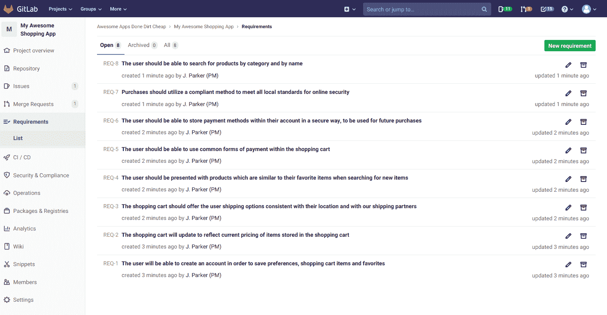
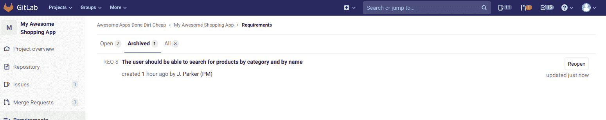

# Requirements Management

> 原文：[https://docs.gitlab.com/ee/user/project/requirements/](https://docs.gitlab.com/ee/user/project/requirements/)

*   [Create a requirement](#create-a-requirement)
*   [Edit a requirement](#edit-a-requirement)
*   [Archive a requirement](#archive-a-requirement)
*   [Reopen a requirement](#reopen-a-requirement)
*   [Search for a requirement](#search-for-a-requirement)
*   [Allow requirements to be satisfied from a CI job](#allow-requirements-to-be-satisfied-from-a-ci-job)
    *   [Add the manual job to CI](#add-the-manual-job-to-ci)
        *   [Specifying individual requirements](#specifying-individual-requirements)
    *   [Add the manual job to CI conditionally](#add-the-manual-job-to-ci-conditionally)

# Requirements Management[](#requirements-management-ultimate "Permalink")

[Introduced](https://gitlab.com/groups/gitlab-org/-/epics/2703) in [GitLab Ultimate](https://about.gitlab.com/pricing/) 12.10.

根据要求，您可以设置标准来检查产品. 它们可以基于用户，涉众，系统，软件或您认为重要的其他任何内容.

需求是 GitLab 中的工件，用于描述产品的特定行为. 需求是长期存在的，除非手动清除，否则它们不会消失.

如果行业标准*要求*您的应用程序具有某些功能或行为，则可以[创建一个要求](#create-a-requirement)来反映这一点. 如果不再需要某个功能，则可以[归档相关需求](#archive-a-requirement) .

有关概述，请参见[GitLab 12.10 引入需求管理](https://www.youtube.com/watch?v=uSS7oUNSEoU) .

[](img/requirements_list_v13_1.png)

## Create a requirement[](#create-a-requirement "Permalink")

每个项目都有一个分页的需求清单，您可以在其中创建一个新需求.

创建需求：

1.  在您的项目页面上，转到 **要求** .
2.  Click **新要求**.
3.  输入描述性标题，然后单击**创建需求** .

您将在列表顶部看到新创建的需求，因为需求列表按创建日期降序排列.

## Edit a requirement[](#edit-a-requirement "Permalink")

您可以从需求列表页面编辑需求（如果您具有必要的特权）.

要编辑需求：

1.  在需求清单中，按一下[ **编辑** （ ）.
2.  在文本输入字段中更新标题.
3.  Click **保存更改**.

## Archive a requirement[](#archive-a-requirement "Permalink")

在" **打开"**选项卡中时，可以存档一个未完成的需求（如果有必要的特权）.

要存档需求，请点击**存档** （ ）.

需求存档后，它不再出现在" **打开"**选项卡中.

## Reopen a requirement[](#reopen-a-requirement "Permalink")

您可以在"已**归档"**选项卡中查看已归档需求的列表.

[](img/requirements_archived_list_view_v13_1.png)

要重新打开已归档的需求，请点击**重新打开** .

重新打开需求后，它不再出现在" **归档"**选项卡中.

## Search for a requirement[](#search-for-a-requirement "Permalink")

[Introduced](https://gitlab.com/gitlab-org/gitlab/-/issues/212543) in [GitLab Ultimate](https://about.gitlab.com/pricing/) 13.1.

您可以根据以下条件从需求列表页面中搜索需求：

*   要求标题
*   作者的用户名

要搜索需求：

1.  在一个项目中，转到 **需求>清单** .
2.  单击**搜索或过滤结果**字段. 出现一个下拉菜单.
3.  从下拉列表中选择需求作者或输入纯文本以按需求标题进行搜索.
4.  在键盘上按`Enter`键以过滤列表.

您还可以通过以下方式对需求列表进行排序：

*   创建日期
*   最近更新时间

## Allow requirements to be satisfied from a CI job[](#allow-requirements-to-be-satisfied-from-a-ci-job "Permalink")

版本历史

*   在[GitLab Ultimate](https://about.gitlab.com/pricing/) 13.1 中[引入](https://gitlab.com/groups/gitlab-org/-/epics/2859) .
*   在[GitLab Ultimate](https://about.gitlab.com/pricing/) 13.2 中[增加](https://gitlab.com/gitlab-org/gitlab/-/issues/215514)了指定个别要求及其状态的功能.

GitLab 现在支持[需求测试报告](../../../ci/pipelines/job_artifacts.html#artifactsreportsrequirements-ultimate) . 您可以将作业添加到 CI 管道，该作业在触发时会将所有现有需求标记为"满足".

### Add the manual job to CI[](#add-the-manual-job-to-ci "Permalink")

要配置您的 CI 以在触发手动作业时将要求标记为"满足"，请将以下代码添加到`.gitlab-ci.yml`文件中.

```
requirements_confirmation:
  when: manual
  allow_failure: false
  script:
    - mkdir tmp
    - echo "{\"*\":\"passed\"}" > tmp/requirements.json
  artifacts:
    reports:
      requirements: tmp/requirements.json 
```

此定义将手动触发的（ `when: manual` ）作业添加到 CI 管道. 它阻止了（ `allow_failure: false` ），但是由您决定触发 CI 作业的条件是什么. 另外，您可以使用任何现有的 CI 作业将所有需求标记为已满足，前提是 CI 作业生成并上传了`requirements.json`工件.

当您手动触发此作业时，包含`{"*":"passed"}`的`requirements.json`文件将作为工件上传到服务器. 在服务器端，将检查需求报告中的"所有通过"记录（ `{"*":"passed"}` ），并在成功后将所有现有的打开需求标记为"满意".

#### Specifying individual requirements[](#specifying-individual-requirements "Permalink")

可以指定个别要求及其状态.

如果存在以下要求：

*   `REQ-1` （具有 IID `1` ）
*   `REQ-2` （具有 IID `2` ）
*   `REQ-3` （具有 IID `3` ）

可以指定第一个要求通过，第二个失败. 有效值为"通过"和"失败". 通过省略需求 IID（在这种情况下为`REQ-3`的 IID `3` ），没有发现结果.

```
requirements_confirmation:
  when: manual
  allow_failure: false
  script:
    - mkdir tmp
    - echo "{\"1\":\"passed\", \"2\":\"failed\"}" > tmp/requirements.json
  artifacts:
    reports:
      requirements: tmp/requirements.json 
```

### Add the manual job to CI conditionally[](#add-the-manual-job-to-ci-conditionally "Permalink")

要将 CI 配置为仅在有某些开放要求时才包括手动作业，请添加一条规则以检查`CI_HAS_OPEN_REQUIREMENTS` CI 变量.

```
requirements_confirmation:
  rules:
    - if: "$CI_HAS_OPEN_REQUIREMENTS" == "true"
      when: manual
    - when: never
  allow_failure: false
  script:
    - mkdir tmp
    - echo "{\"*\":\"passed\"}" > tmp/requirements.json
  artifacts:
    reports:
      requirements: tmp/requirements.json 
```