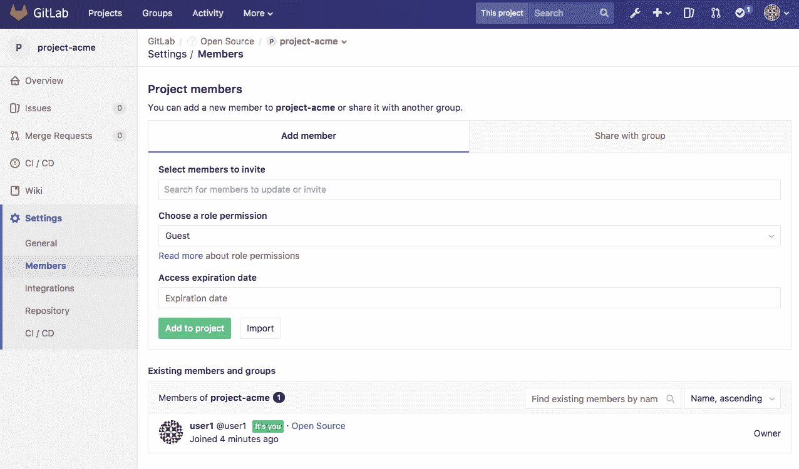
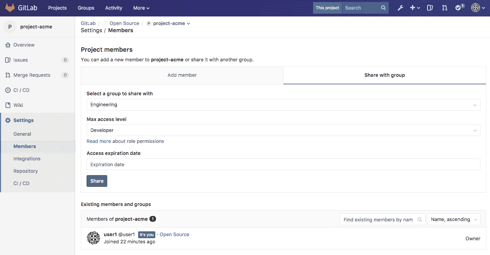
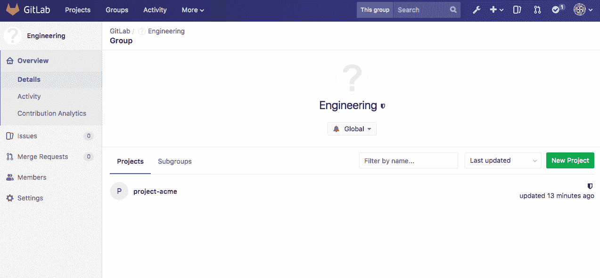

# Share Projects with other Groups

> 原文：[https://docs.gitlab.com/ee/user/project/members/share_project_with_groups.html](https://docs.gitlab.com/ee/user/project/members/share_project_with_groups.html)

*   [Groups as collections of users](#groups-as-collections-of-users)
*   [Sharing a project with a group of users](#sharing-a-project-with-a-group-of-users)
*   [Maximum access level](#maximum-access-level)
*   [Sharing public project with private group](#sharing-public-project-with-private-group)
*   [Share project with group lock](#share-project-with-group-lock)

# Share Projects with other Groups

您可以与其他[小组](../../group/index.html)共享项目. 这样就可以通过一个操作将一组用户添加到项目中.

## Groups as collections of users

组主要用于[创建项目集合](../../group/index.html) ，但是您还可以利用以下事实：组定义了*用户*集合，即组成员.

## Sharing a project with a group of users

在 GitLab 中授予一组用户（例如"工程"）访问项目（例如" Acme 项目"）的主要机制是使"工程"组成为" Project Acme"的所有者. 但是，如果" Acme 项目"已经属于另一个小组，比如"开源"，该怎么办？ 这是可以使用组共享功能的地方.

与"工程"组共享" Acme 项目"：

1.  对于" Acme 项目"，请使用左侧导航菜单转到" **会员"**

    

2.  选择"与组共享"标签
3.  添加具有您选择的最大访问权限级别的"工程"组
4.  点击**共享**分享

    

5.  与"工程"共享"项目 Acme"后，该项目将列在组仪表板上

    

请注意，您只能与以下项目共享一个项目：

*   您具有明确定义的成员资格的组
*   包含嵌套子组或项目的组，您对其具有明确定义的角色

管理员可以与系统中的任何组共享项目.

## Maximum access level

在上面的示例中，"工程"成员的最大"开发人员"访问级别意味着"工程"中具有较高访问级别的用户（"维护者"或"所有者"）将仅对" Acme 项目"具有"开发者"访问权限'.

## Sharing public project with private group

与私有组共享公共项目时，项目的所有者和维护者将在`members`页面上看到该组的名称. 所有者还可以在问题或合并请求中提及他们时，可以看到他们无权访问的私人群组的成员.

## Share project with group lock

可以防止一个组中[的项目与另一个组共享一个项目](../members/share_project_with_groups.html) . 这样可以更严格地控​​制项目访问.

了解更多有关[使用组锁共享的信息](../../group/index.html#share-with-group-lock) .