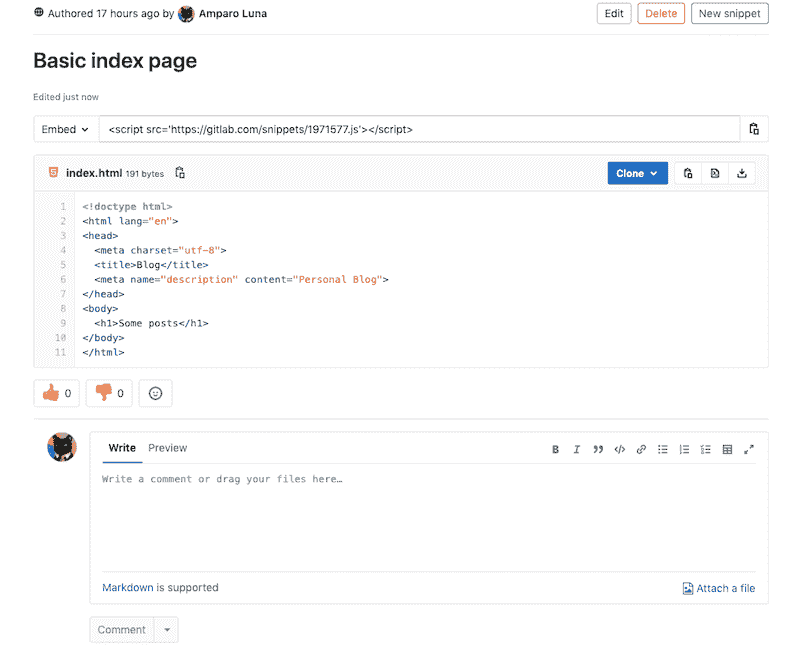
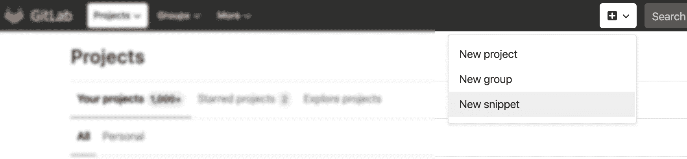
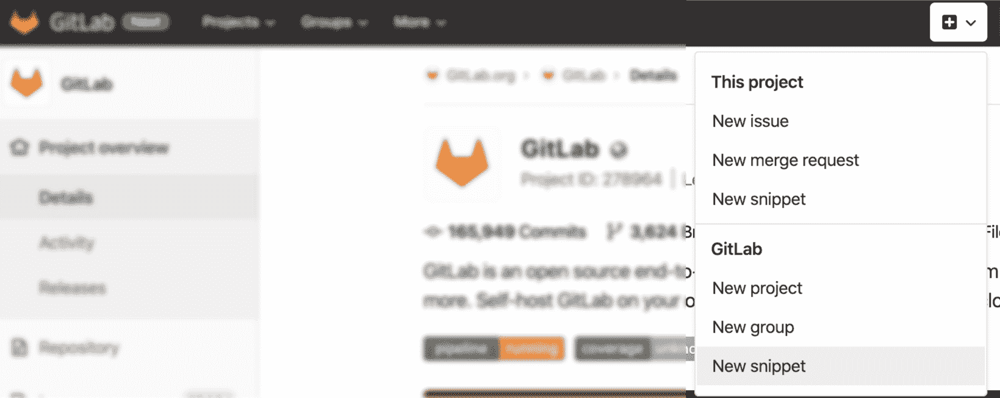
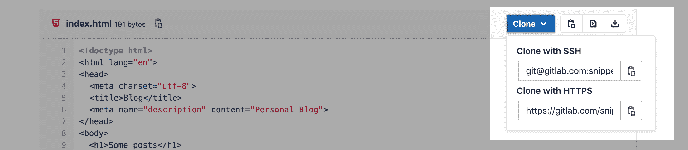

# Snippets

> 原文：[https://docs.gitlab.com/ee/user/snippets.html](https://docs.gitlab.com/ee/user/snippets.html)

*   [Personal snippets](#personal-snippets)
*   [Project snippets](#project-snippets)
*   [Create a snippet](#create-a-snippet)
*   [Versioned Snippets](#versioned-snippets)
    *   [File names](#file-names)
    *   [Cloning snippets](#cloning-snippets)
    *   [Limitations](#limitations)
*   [Discover snippets](#discover-snippets)
*   [Snippet comments](#snippet-comments)
*   [Downloading snippets](#downloading-snippets)
*   [Embedded snippets](#embedded-snippets)

# Snippets[](#snippets "Permalink")

借助 GitLab 代码片段，您可以存储和与其他用户共享代码和文本.

[](img/gitlab_snippet_v13_0.png)

可以使用[摘要 API](../api/snippets.html)来维护[摘要](../api/snippets.html) .

片段类型有两种：

*   个人摘要.
*   项目摘要.

## Personal snippets[](#personal-snippets "Permalink")

个人代码段与任何项目均无关，可以完全独立地创建. 可以设置 3 种可见性级别，公共，内部和私有. 有关更多信息，请参见[公共访问](../public_access/public_access.html) .

## Project snippets[](#project-snippets "Permalink")

项目摘要始终与特定项目相关. 有关更多信息，请参见[项目功能](project/index.html#project-features) .

## Create a snippet[](#create-a-snippet "Permalink")

要创建个人代码段，请点击加号图标（ ），然后从下拉菜单中选择" **新建代码段** "：

[](img/new_personal_snippet_v12_10.png)

如果您在项目页面上，但要创建一个新的个人代码段，请点击加号图标（ ），然后从下拉菜单的下部选择**新代码段** （在 GitLab.com 上为**GitLab** ；在自托管实例上为**您的**实例）：

[](img/new_personal_snippet_from_project_v12_10.png)

要创建项目摘要，请导航到您的项目页面，然后点击加号图标（ ），然后从下拉菜单的上方选择**新建代码段** （ **此项目** ）.

[](img/new_project_snippet_from_project_v12_10.png)

从那里添加**Title** ， **Description**和带有适当扩展名的**文件**名（例如`example.rb` ， `index.html` ）.

**警告：**确保添加文件名以突出显示代码并避免此[粘贴错误](https://gitlab.com/gitlab-org/gitlab/-/issues/22870) .

## Versioned Snippets[](#versioned-snippets "Permalink")

在 GitLab 13.0 中[引入](https://gitlab.com/groups/gitlab-org/-/epics/239) .

从 13.0 开始，片段（个人片段和项目片段）默认都启用了版本控制.

这意味着在创建代码段时，所有代码段都将获得自己的基础存储库，并使用`master`分支进行初始化. 每当保存对代码段的更改时，都会记录对 master 分支的新提交. 提交消息是自动生成的. 该代码段的存储库默认情况下只有一个分支（母版），不支持将其删除或创建其他分支.

现有代码段将在 13.0 中自动迁移. 它们的当前内容将被保存为对代码段存储库的初始提交.

### File names[](#file-names "Permalink")

代码段支持基于为其提供的文件名和扩展名突出显示语法. 尽管可以在不指定文件名和扩展名的情况下提交代码段，但它需要一个有效的名称，以便可以将内容作为文件创建在代码段的存储库中.

如果用户未将文件名和扩展名归于代码段，则 GitLab 会自动以`snippetfile<x>.txt`格式添加文件名，其中`<x>`代表添加到文件的数字，从 1 开始.添加了更多没有属性文件名的代码段.

从早期版本的 GitLab 升级到 13.0 时，不支持文件名的现有代码片段将重命名为兼容格式. 例如，如果代码段的文件名是`http://a-weird-filename.me` ，它将被更改为`http-a-weird-filename-me` ，以包含在代码段的存储库中. 由于代码段是通过 ID 存储的，因此更改其文件名不会破坏该代码段的直接链接或嵌入式链接.

### Cloning snippets[](#cloning-snippets "Permalink")

可以使用 SSH 或 HTTPS 将片段克隆为常规的 Git 存储库. 单击摘要内容上方的" **复制"**按钮以复制您选择的 URL.

[](img/snippet_clone_button_v13_0.png)

这使您可以获取代码段存储库的本地副本，并根据需要进行更改. 您可以提交这些更改并将其推送到远程 master 分支.

### Limitations[](#limitations "Permalink")

*   不支持二进制文件.
*   不支持创建或删除分支. 只有默认的*主人* . 使用分支.
*   代码段存储库中不支持 Git 标签.
*   片段的存储库仅限于一个文件. 尝试推送多个文件将导致错误.
*   修订在 GitLab UI 上对用户*尚不*可见，但计划在以后的迭代中添加. 有关更新，请参见[修订标签问题](https://gitlab.com/gitlab-org/gitlab/-/issues/39271) .
*   默认情况下， [摘要](../administration/snippets/index.html#snippets-content-size-limit)的[最大大小为](../administration/snippets/index.html#snippets-content-size-limit) 50 MB.

## Discover snippets[](#discover-snippets "Permalink")

在 GitLab 中发现片段的主要方法有两种.

要浏览对您可见的所有代码片段，您可以通过顶部导航转到 GitLab 实例的代码片段仪表板. 对于 GitLab.com，您可以在[这里](https://gitlab.com/dashboard/snippets)找到它. 这会将您导航到一个概述，该概述显示您创建的摘要，并允许您浏览所有摘要.

如果要发现属于特定项目的摘录，则可以通过项目页面上的左侧导航导航到摘录页面. 项目片段被启用，默认情况下可用，但他们可以通过导航到项目的**设置** ，扩大**知名度，项目功能，权限**和向下滚动到**片段**被禁用. 从那里，您可以切换以禁用它们，或从下拉菜单中选择其他可见性级别.

## Snippet comments[](#snippet-comments "Permalink")

在 GitLab 9.2 中[引入](https://gitlab.com/gitlab-org/gitlab-foss/-/issues/12910) .

使用 GitLab 代码片段，您可以参与有关该代码段的对话，从而促进用户之间的协作.

## Downloading snippets[](#downloading-snippets "Permalink")

您可以下载代码段的原始内容.

默认情况下，将下载带有 Linux 样式的行尾（ `LF` ）的代码段. 如果要保留原始的行尾，则需要添加参数`line_ending=raw` （例如， `https://gitlab.com/snippets/SNIPPET_ID/raw?line_ending=raw` : `line_ending=raw` ）. 如果使用 GitLab Web 界面创建了代码段，则原始行结尾类似于 Windows（ `CRLF` ）.

## Embedded snippets[](#embedded-snippets "Permalink")

在 GitLab 10.8 中引入.

公开片段不仅可以共享，还可以嵌入任何网站中. 这样，您可以在多个地方重用 GitLab 代码段，并且对源代码的任何更改都会自动反映在嵌入式代码段中.

To embed a snippet, first make sure that:

*   该项目是公开的（如果是项目摘要）
*   摘要是公开的
*   在" **项目">"设置">"权限"中** ，将片段权限设置为" **具有访问**权限的**所有人"**

满足以上条件后，"嵌入"部分将出现在您的代码片段中，您只需单击"复制"按钮即可. 这将复制一个单行脚本，您可以将其添加到任何网站或博客文章中.

示例代码如下所示：

```
<script src="https://gitlab.com/namespace/project/snippets/SNIPPET_ID.js"></script> 
```

嵌入式代码段的外观如下：

嵌入的代码片段带有一个标题，该标题显示文件名（如果已定义），代码片段大小，到 GitLab 的链接以及实际的代码片段内容. 标头中的操作使用户可以查看原始格式的代码段并下载.