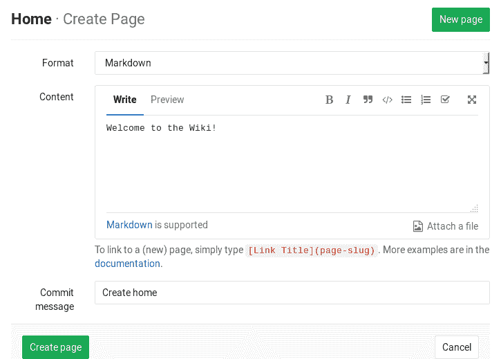
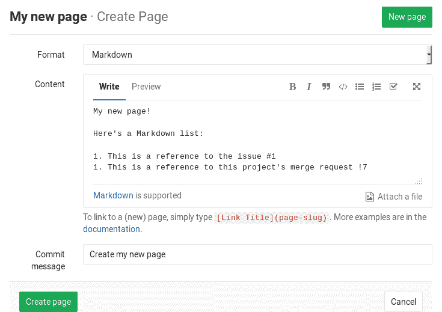
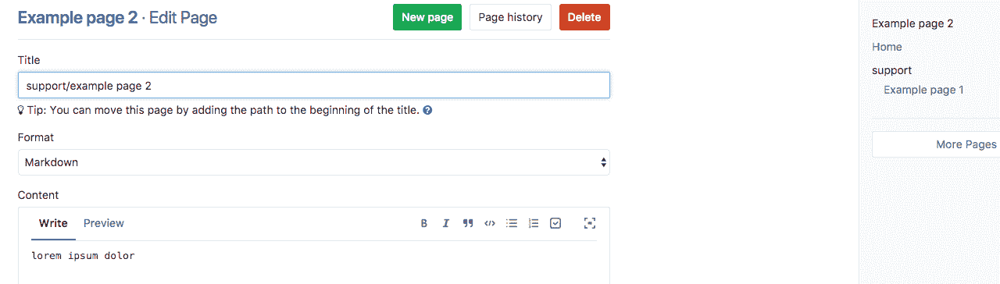
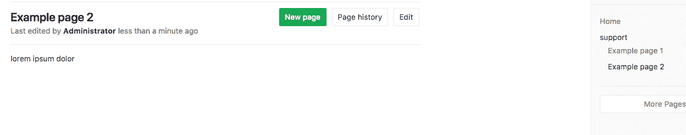
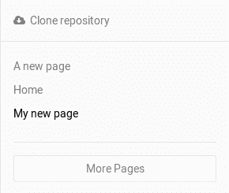
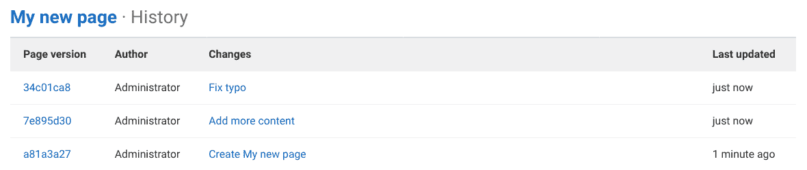
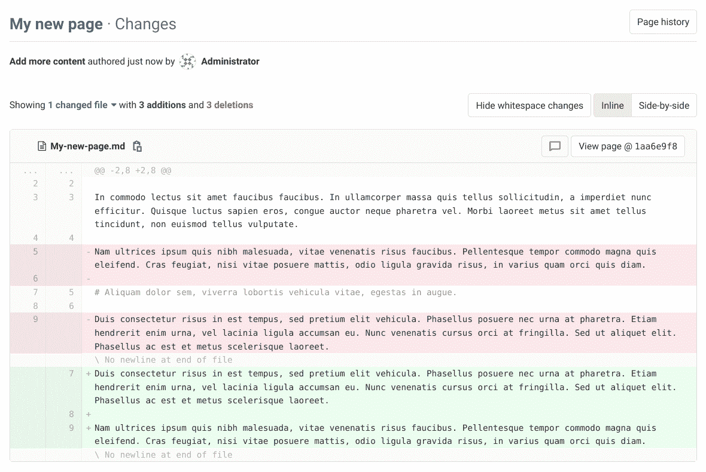

# Wiki

> 原文：[https://docs.gitlab.com/ee/user/project/wiki/](https://docs.gitlab.com/ee/user/project/wiki/)

*   [First time creating the Home page](#first-time-creating-the-home-page)
*   [Creating a new wiki page](#creating-a-new-wiki-page)
    *   [Attachment storage](#attachment-storage)
    *   [Special characters in page titles](#special-characters-in-page-titles)
    *   [Length restrictions for file and directory names](#length-restrictions-for-file-and-directory-names)
*   [Editing a wiki page](#editing-a-wiki-page)
    *   [Adding a table of contents](#adding-a-table-of-contents)
*   [Deleting a wiki page](#deleting-a-wiki-page)
*   [Moving a wiki page](#moving-a-wiki-page)
*   [Viewing a list of all created wiki pages](#viewing-a-list-of-all-created-wiki-pages)
*   [Viewing the history of a wiki page](#viewing-the-history-of-a-wiki-page)
    *   [Viewing the changes between page versions](#viewing-the-changes-between-page-versions)
*   [Wiki activity records](#wiki-activity-records)
    *   [Limitations](#limitations)
    *   [Enable or disable Wiki Events](#enable-or-disable-wiki-events-core-only)
*   [Adding and editing wiki pages locally](#adding-and-editing-wiki-pages-locally)
*   [Customizing sidebar](#customizing-sidebar)

# Wiki[](#wiki "Permalink")

每个 GitLab 项目都内置了一个称为 Wiki 的独立文档系统. 默认情况下，所有新项目都启用此功能，您可以在项目的**Wiki**下找到它.

如果您不想将文档保留在存储库中，但确实希望将其保留在代码所在的项目中，则 Wiki 非常方便.

您可以在 Web 界面中或[使用 Git 在本地](#adding-and-editing-wiki-pages-locally)创建 Wiki 页面，因为每个 Wiki 都是单独的 Git 存储库.

## First time creating the Home page[](#first-time-creating-the-home-page "Permalink")

首次访问 Wiki 时，系统将指示您创建主页. 必须创建主页，因为它是查看 Wiki 时的登录页面. 您只需要填写**内容**部分，然后单击**创建页面** . 您以后可以随时对其进行编辑，因此继续写欢迎信息.

[](img/wiki_create_home_page.png)

## Creating a new wiki page[](#creating-a-new-wiki-page "Permalink")

**注意：**需要开发者[权限](../../permissions.html) .

通过单击可在所有 Wiki 页面中找到的" **新页面"**按钮来创建新页面.

系统将要求您为新的 Wiki 页面填写标题.

您可以通过在标题中使用" /"指示子目录来为 Wiki 页面指定完整路径. 任何丢失的目录将自动创建. 例如， `docs/my-page`的标题将创建一个 Wiki 页面，其路径为`/wikis/docs/my-page` .

输入页面名称后，就该填写其内容了. GitLab Wiki 支持 Markdown，RDoc，AsciiDoc 和 Org. 对于基于 Markdown 的页面，所有[Markdown 功能](../../markdown.html)均受支持，对于链接，则存在一些[特定](../../markdown.html#wiki-specific-markdown)于[Wiki 的](../../markdown.html#wiki-specific-markdown)行为.

在 Web 界面中，提交消息是可选的，但是 GitLab Wiki 是基于 Git 的，并且需要提交消息，因此如果您不输入消息，则会为您创建一条.

When you’re ready, click the **建立页面** and the new page will be created.

[](img/wiki_create_new_page.png)

### Attachment storage[](#attachment-storage "Permalink")

在 GitLab 11.3 中[引入](https://gitlab.com/gitlab-org/gitlab-foss/-/issues/33475) .

从 GitLab 11.3 开始，通过 GitLab 界面上载到 Wiki 的任何文件都将存储在 Wiki Git 存储库中，如果您在本地克隆 Wiki 存储库，该文件将可用. GitLab 11.3 之前的所有上传文件都存储在 GitLab 本身中. 如果希望它们成为 Wiki 的 Git 存储库的一部分，则必须再次上传它们.

### Special characters in page titles[](#special-characters-in-page-titles "Permalink")

Wiki 页面作为文件存储在 Git 存储库中，因此某些字符具有特殊含义：

*   存储页面时，空格会转换为连字符.
*   显示页面时，连字符（ `-` ）转换回空格.
*   不能使用斜杠（ `/` ），因为它们用作路径分隔符.

### Length restrictions for file and directory names[](#length-restrictions-for-file-and-directory-names "Permalink")

在 GitLab 12.8 中[引入](https://gitlab.com/gitlab-org/gitlab/-/merge_requests/24364) .

许多常见的文件系统[的文件名和目录名限制为 255 个字节](https://en.wikipedia.org/wiki/Comparison_of_file_systems#Limits) ，尽管 Git 和 GitLab 都支持超出这些限制的路径，但是它们的存在使这些文件系统上的用户无法在本地检出 Wiki 存储库.

为了避免这种情况，通过 GitLab Web 界面和 API 编辑页面时会强制执行以下限制：

*   页面标题为 245 个字节（文件扩展名保留 10 个字节）.
*   255 个字节的目录名称.

请注意：

*   非 ASCII 字符占用多个字节.
*   仍然可以通过 Git 在本地创建超出限制的文件和目录，但这可能会在其他人的计算机上中断.

## Editing a wiki page[](#editing-a-wiki-page "Permalink")

**注意：**需要开发者[权限](../../permissions.html) .

要编辑页面，只需单击" **编辑"**按钮. 从那里开始，您可以更改其内容. 完成后，单击" **保存更改"**以使更改生效.

### Adding a table of contents[](#adding-a-table-of-contents "Permalink")

要从 Wiki 页面中的标题生成目录，请使用`[[_TOC_]]`标签. 有关示例，请参阅[目录](../../markdown.html#table-of-contents) .

## Deleting a wiki page[](#deleting-a-wiki-page "Permalink")

**注意：**需要维护者[权限](../../permissions.html) .

仅在编辑页面时才能找到" **删除"**按钮. 单击它并确认您要删除页面.

## Moving a wiki page[](#moving-a-wiki-page "Permalink")

通过在[编辑](#editing-a-wiki-page)表单的 Wiki 页面标题中指定完整路径，可以将 Wiki 页面从一个目录移动到另一个目录.

[](img/wiki_move_page_1.png)

[](img/wiki_move_page_2.png)

为了将 Wiki 页面移动到根目录，必须在 Wiki 页面标题前加上斜杠（ `/` ）字符.

## Viewing a list of all created wiki pages[](#viewing-a-list-of-all-created-wiki-pages "Permalink")

每个 Wiki 都有一个侧边栏，从中可以找到所创建页面的简短列表. 该列表按字母顺序排列.

[](img/wiki_sidebar.png)

如果页面很多，则不会在侧边栏中列出所有页面. 单击**查看所有页面**以**查看所有页面** .

## Viewing the history of a wiki page[](#viewing-the-history-of-a-wiki-page "Permalink")

Wiki 页面随时间的变化记录在 Wiki 的 Git 存储库中，您可以通过单击**Page history**按钮来查看它们.

从历史记录页面中，您可以看到页面的修订版（Git commit SHA），其作者，提交消息以及上次更新时间. 要查看页面的先前版本的外观，请在" **页面版本"**列中单击修订号.

[](img/wiki_page_history.png)

### Viewing the changes between page versions[](#viewing-the-changes-between-page-versions "Permalink")

在 GitLab 13.2 中[引入](https://gitlab.com/gitlab-org/gitlab/-/issues/15242) .

类似于版本化的差异文件视图，您可以看到在给定的 Wiki 页面版本中所做的更改：

1.  导航到您感兴趣的 Wiki 页面.
2.  单击**页面历史记录**以查看所有页面版本.
3.  单击" **更改"**列中的提交消息以获取您感兴趣的版本：

    [](img/wiki_page_diffs_v13_2.png)

## Wiki activity records[](#wiki-activity-records "Permalink")

版本历史

*   在 GitLab 12.10 中[引入](https://gitlab.com/gitlab-org/gitlab/-/issues/14902) .
*   它部署在功能标记后面，默认情况下处于禁用状态.
*   在 GitLab.com 上启用了它.
*   要在 GitLab 自管实例中使用它，请让 GitLab 管理员[启用它](#enable-or-disable-wiki-events-core-only) .

Wiki 事件（创建，删除和更新）由 GitLab 跟踪，并显示在[用户个人资料](../../profile/index.html#user-profile) ， [组](../../group/index.html#view-group-activity)和[项目](../index.html#project-activity)活动页面上.

### Limitations[](#limitations "Permalink")

只有在浏览器中或通过 API 进行的编辑才会记录其活动. 当前在活动列表中未列出通过 Git 进行和推送的编辑.

### Enable or disable Wiki Events[](#enable-or-disable-wiki-events-core-only "Permalink")

Wiki 事件活动正在开发中，尚未准备好用于生产. 它部署在**默认情况下禁用**的功能标志的后面. [有权访问 GitLab Rails 控制台的 GitLab 管理员](../../../administration/troubleshooting/navigating_gitlab_via_rails_console.html#starting-a-rails-console-session)可以为您的实例启用它. 欢迎您对其进行测试，但使用风险自负.

要启用它：

```
Feature.enable(:wiki_events) 
```

禁用它：

```
Feature.disable(:wiki_events) 
```

## Adding and editing wiki pages locally[](#adding-and-editing-wiki-pages-locally "Permalink")

由于 Wiki 基于 Git 存储库，因此您可以像在其他所有 Git 存储库中一样在本地克隆它们并进行编辑.

在右侧栏上，单击" **克隆存储库"，**然后按照屏幕上的说明进行操作.

根据您要使用的标记语言，您在本地添加到 Wiki 的文件必须具有以下受支持的扩展名之一，否则当推送到 GitLab 时将不会显示这些文件：

*   Markdown 扩展名： `.mdown` ， `.mkd` ， `.mkdn` ， `.md` ， `.markdown` .
*   AsciiDoc 扩展名： `.adoc` ， `.ad` ， `.asciidoc` .
*   其他标记扩展名： `.textile` ， `.rdoc` ， `.org` ， `.creole` ， `.wiki` ， `.mediawiki` ， `.rst` .

## Customizing sidebar[](#customizing-sidebar "Permalink")

在项目的 Wiki 页面上，有一个右侧导航，默认情况下呈现带有层次结构的完整 Wiki 页面列表.

要自定义边栏，您可以创建一个名为`_sidebar`的文件以完全替换默认导航.

**警告：**除非您从自定义导航链接`_sidebar`文件，否则要进行编辑，必须输入以下内容直接从浏览器的地址栏中访问： `https://gitlab.com/<namespace>/<project_name>/-/wikis/_sidebar` : `_sidebar` /- `https://gitlab.com/<namespace>/<project_name>/-/wikis/_sidebar` （对于自我管理的 GitLab 实例，将`gitlab.com`替换为实例的 URL）.

`_sidebar`示例（使用 Markdown 格式）：

```
### [Home](home)
 - [Hello World](hello)
- [Foo](foo)
- [Bar](bar)
 ---

- [Sidebar](_sidebar) 
```

计划支持使用自定义侧面导航显示生成的目录.