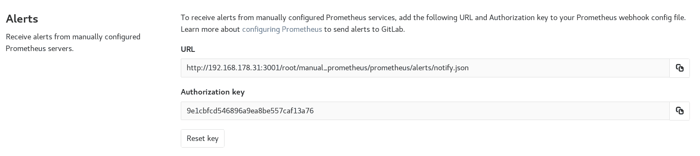

# Set up alerts for Prometheus metrics

> 原文：[https://docs.gitlab.com/ee/operations/metrics/alerts.html](https://docs.gitlab.com/ee/operations/metrics/alerts.html)

*   [Managed Prometheus instances](#managed-prometheus-instances)
*   [External Prometheus instances](#external-prometheus-instances)
*   [Trigger actions from alerts](#trigger-actions-from-alerts-ultimate)

# Set up alerts for Prometheus metrics[](#set-up-alerts-for-prometheus-metrics "Permalink")

在[为 CI / CD 环境配置指标](index.html)后，您可以根据实例的位置为 Prometheus 指标设置警报，并在环境性能超出您设置的范围时[触发警报操作](#trigger-actions-from-alerts-ultimate)以通知您的团队.

## Managed Prometheus instances[](#managed-prometheus-instances "Permalink")

在[GitLab Ultimate](https://about.gitlab.com/pricing/) 11.2 中[引入](https://gitlab.com/gitlab-org/gitlab/-/merge_requests/6590)了[自定义指标](index.html#adding-custom-metrics) ，在 11.3 中[引入](https://gitlab.com/gitlab-org/gitlab/-/merge_requests/6590)了[图书馆指标](../../user/project/integrations/prometheus_library/metrics.html) .

对于使用自动配置的托管 Prometheus 实例，您可以直接在[指标仪表板中](index.html) [配置指标警报](index.html#adding-custom-metrics) . 设置警报：

1.  在您的项目中，导航到 **操作>指标** ，
2.  确定要为其创建警报的指标，然后单击**省略号** 指标右上角的图标.
3.  Choose **Alerts**.
4.  设置阈值和运算符.
5.  单击**添加**以保存并激活警报.

[](../../user/project/integrations/img/prometheus_alert.png)

要删除警报，请在警报图标上返回所需的指标，然后单击" **删除"** .

## External Prometheus instances[](#external-prometheus-instances "Permalink")

版本历史

*   在[GitLab Ultimate](https://about.gitlab.com/pricing/) 11.8 中[引入](https://gitlab.com/gitlab-org/gitlab/-/issues/9258) .
*   在 12.10 中[移至](https://gitlab.com/gitlab-org/gitlab/-/issues/42640) [GitLab Core](https://about.gitlab.com/pricing/) .

对于手动配置的 Prometheus 服务器，GitLab 提供了一个通知端点，用于 Prometheus Webhooks. 如果启用了手动配置，则会将" **警报"**部分添加到 **设置>集成> Prometheus** . 本部分包含您需要的**URL**和**授权密钥** . **重置密钥**按钮将使密钥无效并生成一个新密钥.

[](../../user/project/integrations/img/prometheus_service_alerts.png)

要发送 GitLab 警报通知，请将**URL**和**授权密钥**复制到 Prometheus Alertmanager 配置的[`webhook_configs`](https://s0prometheus0io.icopy.site/docs/alerting/latest/configuration/)部分：

```
receivers:
  name: gitlab
  webhook_configs:
    - http_config:
        bearer_token: 9e1cbfcd546896a9ea8be557caf13a76
      send_resolved: true
      url: http://192.168.178.31:3001/root/manual_prometheus/prometheus/alerts/notify.json
  ... 
```

为了使 GitLab 将警报与[环境](../../ci/environments/index.html)相关联，您必须在 Prometheus 中设置的警报上配置`gitlab_environment_name`标签. 此值应与您在 GitLab 中的环境名称匹配.

**Note:** In GitLab versions 13.1 and greater, you can configure your manually configured Prometheus server to use the [Generic alerts integration](../../user/project/integrations/generic_alerts.html).

## Trigger actions from alerts[](#trigger-actions-from-alerts-ultimate "Permalink")

版本历史

*   在[GitLab Ultimate](https://about.gitlab.com/pricing/) 11.11 中[引入](https://gitlab.com/gitlab-org/gitlab/-/issues/4925) .
*   [从 GitLab Ultimate 12.5 起](https://gitlab.com/gitlab-org/gitlab/-/issues/13401) ，当 GitLab 收到恢复警报时，它将自动关闭相关问题.

警报可用于触发操作，例如自动打开问题（自`13.1`默认禁用）. 要配置操作：

1.  导航到您项目的 **设置>操作>事件** .
2.  启用该选项以创建问题.
3.  选择要从中创建问题的[问题模板](../../user/project/description_templates.html) .
4.  （可选）选择是否将电子邮件通知发送给项目的开发人员.
5.  Click **保存更改**.

启用后，当触发包含包含从[警报有效负载中](https://s0prometheus0io.icopy.site/docs/alerting/latest/configuration/)提取的值的警报时，GitLab 会自动打开一个问题：

*   问题作者： `GitLab Alert Bot`
*   问题标题：从`annotations/title` ， `annotations/summary`或`labels/alertname`
*   警报`Summary` ：属性列表
    *   `starts_at` ：通过`startsAt`警报的开始时间
    *   `full_query` ：从`generatorURL`提取的警报查询
    *   从`annotations/*`提取的附加注释的可选列表
*   Alert [GFM](../../user/markdown.html) ：来自`annotations/gitlab_incident_markdown` GitLab 风味`annotations/gitlab_incident_markdown`

当 GitLab 收到**Recovery Alert 时** ，它将关闭相关问题. 该操作记录为关于该问题的系统消息，表明该操作已由 GitLab Alert 机器人自动关闭.

要进一步自定义问题，您可以在所选问题模板中添加标签，提及或任何其他受支持的[快速操作](../../user/project/quick_actions.html) ，该操作适用于所有事件. 要将快速操作或其他信息限制为仅特定类型的警报，请使用`annotations/gitlab_incident_markdown`字段.

从[版本 12.2 开始](https://gitlab.com/gitlab-org/gitlab-foss/-/issues/63373) ，GitLab 会使用`incident`标签自动标记每个事件问题. 如果标签尚不存在，则会自动创建.

如果度量标准超过警报阈值超过 5 分钟，则 GitLab 会向该项目的所有[维护者和所有者](../../user/permissions.html#project-members-permissions)发送电子邮件.