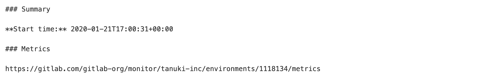
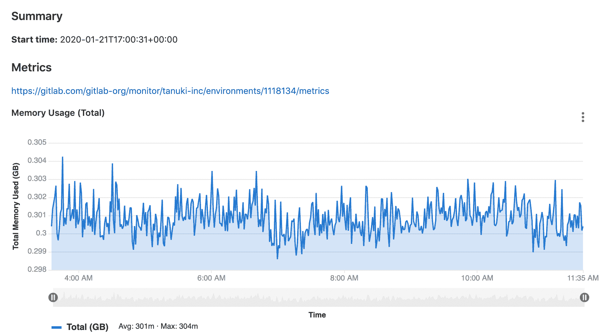
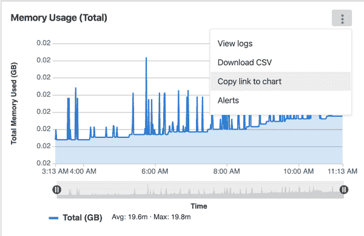
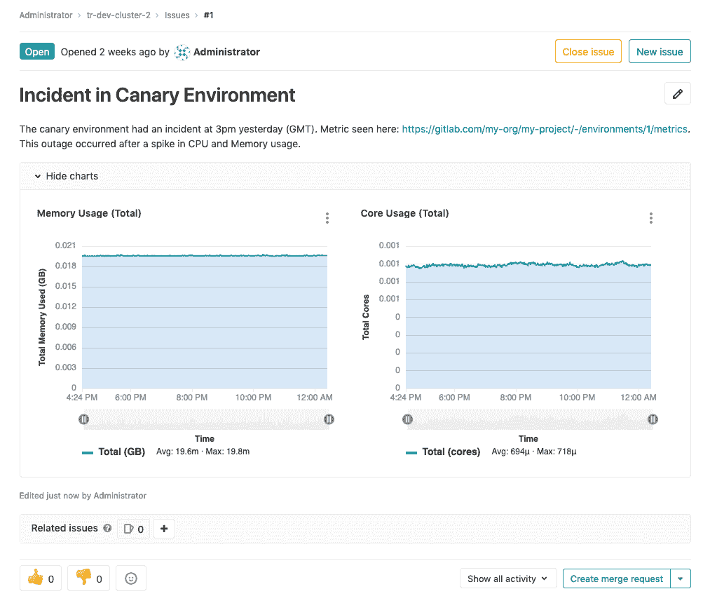
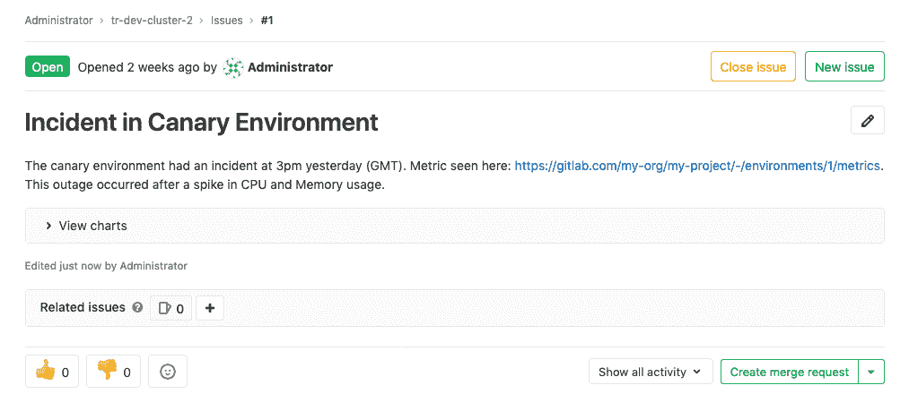
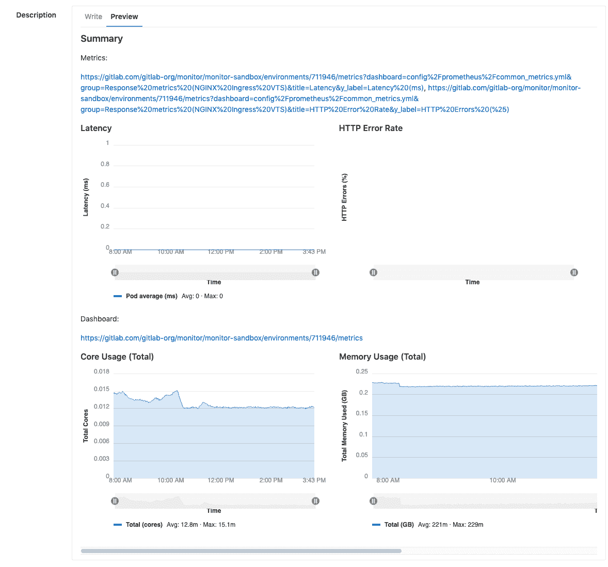

# Embedding metric charts within GitLab-flavored Markdown

> 原文：[https://docs.gitlab.com/ee/operations/metrics/embed.html](https://docs.gitlab.com/ee/operations/metrics/embed.html)

*   [Embedding GitLab-managed Kubernetes metrics](#embedding-gitlab-managed-kubernetes-metrics)
*   [Embedding metrics in issue templates](#embedding-metrics-in-issue-templates)
*   [Embedding metrics based on alerts in incident issues](#embedding-metrics-based-on-alerts-in-incident-issues)
*   [Embedding cluster health charts](#embedding-cluster-health-charts)

# Embedding metric charts within GitLab-flavored Markdown

您可以在[GitLab 风味降价](../../user/markdown.html#gitlab-flavored-markdown-gfm)字段中显示指标图表，例如发布或合并请求说明. GitLab 风味的 Markdown 字段中允许的最大嵌入图表数为 100.当与其他人共享应用程序事件或性能指标并且您想直接获得相关信息时，嵌入图表很有用.

## Embedding GitLab-managed Kubernetes metrics

在 GitLab 12.2 中[引入](https://gitlab.com/gitlab-org/gitlab-foss/-/merge_requests/29691) .

**Note:** Requires [Kubernetes](../../user/project/integrations/prometheus_library/kubernetes.html) metrics.

要显示度量图表，请在支持 GitLab 风格的 Markdown 的字段中包含`https://<root_url>/<project>/-/environments/<environment_id>/metrics`形式的链接：

GitLab 将链接展开为嵌入式指标面板：

您还可以嵌入一个图表. 要获取图表链接，请点击 图表右上角的" **更多操作"**菜单，然后选择" **将链接复制到图表"** ，如本示例所示：

指标必须满足以下要求：

*   `<environment_id>`必须与真实环境相对应.
*   普罗米修斯必须在监视环境.
*   必须将 GitLab 实例配置为从环境接收数据.
*   必须允许用户访问环境（ [Reporter 或更高版本](../../user/permissions.html) ）的监视仪表板.
*   仪表板必须在最近 8 小时内具有数据.

如果以上所有条件均成立，则该指标将展开，如下所示：

公制图表也可能被隐藏：

您可以直接在浏览器中打开链接[以获取数据](dashboards/index.html#expand-panel)的[详细视图](dashboards/index.html#expand-panel) .

## Embedding metrics in issue templates

您也可以在问题模板中嵌入默认仪表板指标或单个指标. 要使图表并排显示，请使用逗号或空格将指向整个指标仪表板或单个指标的单独链接分开.

## Embedding metrics based on alerts in incident issues

对于由[GitLab 管理的警报规则](alerts.html) ，问题包括与警报相对应的查询的嵌入式图表. 该图表显示了事件开始点前后一个小时（前后 30 分钟）的一小时数据.

对于[手动配置的 Prometheus 实例](../../user/project/integrations/prometheus.html#manual-configuration-of-prometheus) ，如果满足以下要求，则可以包括与查询相对应的图表：

*   该警报对应于通过 GitLab 管理的环境.
*   警报对应于[范围查询](https://s0prometheus0io.icopy.site/docs/prometheus/latest/querying/api/) .
*   警报包含下表中列出的必需属性.

| Attributes | Required | Description |
| --- | --- | --- |
| `annotations/gitlab_environment_name` | Yes | 与警报对应的由 GitLab 管理的环境的名称 |
| `annotations/title` ， `annotations/summary` ， `labels/alertname` | Yes | 用作图表标题 |
| `annotations/gitlab_y_label` | No | 用作图表的 y 轴标签 |

## Embedding cluster health charts

版本历史

*   在[GitLab Ultimate](https://about.gitlab.com/pricing/) 12.9 中[引入](https://gitlab.com/gitlab-org/gitlab/-/issues/40997) .
*   在 13.2 中[移至](https://gitlab.com/gitlab-org/gitlab/-/issues/208224) GitLab 核心.

[Cluster Health Metrics](../../user/project/clusters/index.html#visualizing-cluster-health)也可以嵌入到[GitLab 风格的 Markdown 中](../../user/markdown.html) .

要嵌入度量标准图表，请在支持 GitLab 风格的 Markdown 的任何位置以`https://<root_url>/<project>/-/cluster/<cluster_id>?<query_params>`的形式包含指向该图表的链接. 要生成并复制到图表的链接，请遵循[Cluster Health Metric 文档中的说明](../../user/project/clusters/index.html#visualizing-cluster-health) .

指标必须满足以下要求：

*   `<cluster_id>`必须与实际群集相对应.
*   Prometheus 必须监视群集.
*   必须允许用户访问项目集群指标.
*   仪表板必须在" [集群运行状况"页面](../../user/project/clusters/index.html#visualizing-cluster-health)上报告数据

如果满足上述要求，则度量标准将展开，如下所示.

