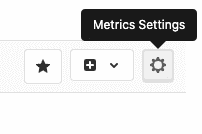
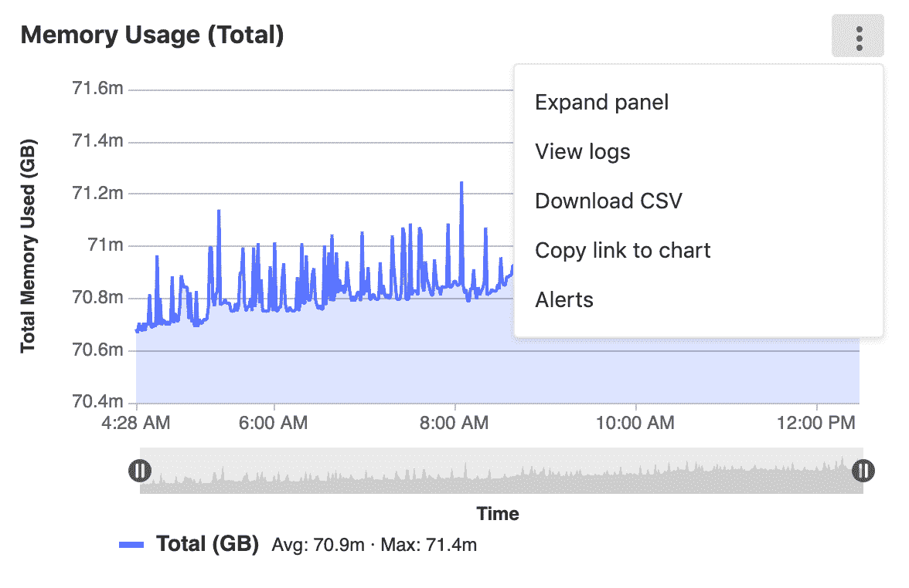
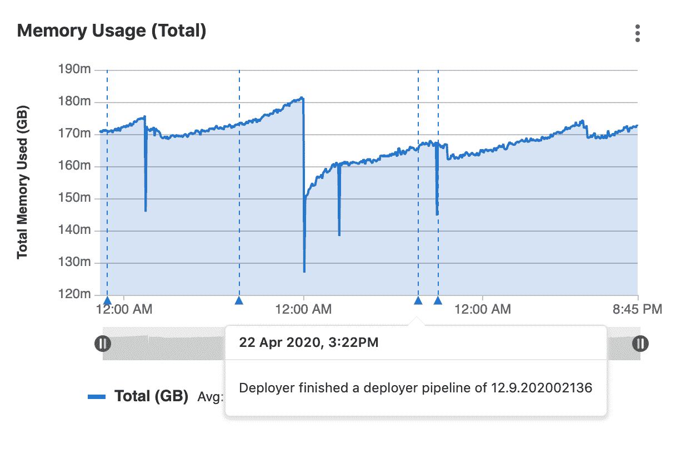
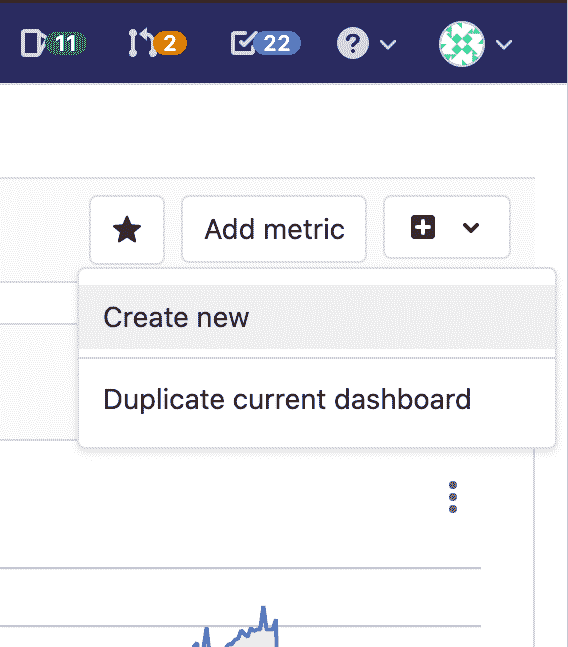

# Using the Metrics Dashboard

> 原文：[https://docs.gitlab.com/ee/operations/metrics/dashboards/](https://docs.gitlab.com/ee/operations/metrics/dashboards/)

*   [Manage the metrics dashboard settings](#manage-the-metrics-dashboard-settings)
*   [Chart Context Menu](#chart-context-menu)
    *   [View and edit the source file of a custom dashboard](#view-and-edit-the-source-file-of-a-custom-dashboard)
    *   [Expand panel](#expand-panel)
    *   [View Logs](#view-logs-ultimate)
    *   [Timeline zoom and URL sharing](#timeline-zoom-and-url-sharing)
    *   [Downloading data as CSV](#downloading-data-as-csv)
*   [Dashboard Annotations](#dashboard-annotations)
    *   [Retention policy](#retention-policy)
*   [Add related links to custom dashboards](#add-related-links-to-custom-dashboards)
    *   [Links Syntax](#links-syntax)
*   [Defining custom dashboards per project](#defining-custom-dashboards-per-project)
    *   [Adding a new dashboard to your project](#adding-a-new-dashboard-to-your-project)
    *   [Navigating to a custom dashboard](#navigating-to-a-custom-dashboard)
    *   [Duplicating a GitLab-defined dashboard](#duplicating-a-gitlab-defined-dashboard)
*   [Troubleshooting](#troubleshooting)
    *   [“No data found” error on Metrics dashboard page](#no-data-found-error-on-metrics-dashboard-page)

# Using the Metrics Dashboard[](#using-the-metrics-dashboard "Permalink")

## Manage the metrics dashboard settings[](#manage-the-metrics-dashboard-settings "Permalink")

在 GitLab 13.2 中[引入](https://gitlab.com/gitlab-org/gitlab/-/issues/223204) .

要管理指标信息中心的设置，请执行以下操作：

1.  以具有项目维护者或管理员[权限](../../../user/permissions.html#project-members-permissions)的用户身份登录.
2.  导航至以下位置的信息中心 **操作>指标** .
3.  在资讯主页的右上角，按一下 **指标设置** ：

    [](../../../user/project/integrations/img/metrics_settings_button_v13_2.png)

## Chart Context Menu[](#chart-context-menu "Permalink")

在信息中心的每个面板上，您都可以通过以下方式访问上下文菜单： 面板右上角上方的" **更多操作"**下拉框可采取与图表数据相关的操作.

[](../../../user/project/integrations/img/panel_context_menu_v13_0.png)

选项包括：

*   [Expand panel](#expand-panel)
*   [View logs](#view-logs-ultimate)
*   [Download CSV](#downloading-data-as-csv)
*   [Copy link to chart](../embed.html#embedding-gitlab-managed-kubernetes-metrics)
*   [Alerts](../alerts.html)

### View and edit the source file of a custom dashboard[](#view-and-edit-the-source-file-of-a-custom-dashboard "Permalink")

在 GitLab 12.5 中[引入](https://gitlab.com/gitlab-org/gitlab/-/issues/34779) .

查看项目的自定义仪表板时，可以通过单击" **编辑仪表板"**按钮来查看原始的`.yml`文件.

### Expand panel[](#expand-panel "Permalink")

在 GitLab 13.0 中[引入](https://gitlab.com/groups/gitlab-org/-/epics/3100) .

要查看较大的可视化版本，请点击 **更多操作**图标，然后选择**展开面板** .

要返回指标仪表板，请单击浏览器中的" **后退"**按钮，或按`Esc`键.

### View Logs[](#view-logs-ultimate "Permalink")

在 GitLab 12.8 中[引入](https://gitlab.com/gitlab-org/gitlab/-/issues/122013) .

如果启用了[日志](../../../user/project/clusters/kubernetes_pod_logs.html) ，则可以通过单击右上角的上下文菜单从仪表板中的图表导航以查看日志.

如果使用图表底部的**时间轴缩放**功能，日志将缩小到您选择的时间范围.

### Timeline zoom and URL sharing[](#timeline-zoom-and-url-sharing "Permalink")

在 GitLab 12.8 中[引入](https://gitlab.com/gitlab-org/gitlab/-/issues/198910) .

您可以使用图表底部的**时间轴缩放**功能来放大所选的日期和时间. 单击并拖动滑块以选择要显示的数据的其他开始或结束日期时，GitLab 会将所选的开始和结束时间添加到 URL，从而使您可以更轻松地共享特定的时间范围.

### Downloading data as CSV[](#downloading-data-as-csv "Permalink")

指标仪表板上 Prometheus 图表中的数据可以 CSV 格式下载.

## Dashboard Annotations[](#dashboard-annotations "Permalink")

版本历史

*   在 GitLab 12.10 中[引入](https://gitlab.com/gitlab-org/gitlab/-/issues/211330) （由功能标志`metrics_dashboard_annotations`启用）.
*   在 GitLab 13.0 中[删除](https://gitlab.com/gitlab-org/gitlab/-/issues/215224)了[功能标志](https://gitlab.com/gitlab-org/gitlab/-/issues/215224) .

您可以使用" **指标仪表板注释"**通过在每个指标仪表板上添加注释来标记任何重要事件. 在查看仪表板时，分配给所选时间范围的注释条目将自动获取并显示在该仪表板内的每个图表上. 鼠标悬停时，每个注释都会显示其他详细信息，包括事件的确切时间及其描述.

您可以通过向[Metrics 仪表板注释 API](../../../api/metrics_dashboard_annotations.html)发出请求来创建注释

[](../../../user/project/integrations/img/metrics_dashboard_annotations_ui_v13.0.png)

### Retention policy[](#retention-policy "Permalink")

在 GitLab 13.01 中[引入](https://gitlab.com/gitlab-org/gitlab/-/issues/211433) .

为了避免过时的注释浪费过多的存储空间，每天都会删除附加到超过两周时间段的记录. 此重复后台作业在本地服务器时间上午 1:00 运行.

## Add related links to custom dashboards[](#add-related-links-to-custom-dashboards "Permalink")

在 GitLab 13.1 中[引入](https://gitlab.com/gitlab-org/gitlab/-/issues/216385) .

You can embed links to other dashboards or external services in your custom dashboard by adding **相关链接** to your dashboard’s YAML file. Related links open in the same tab as the dashboard. Related links can be displayed in the following locations on your dashboard:

*   在仪表板顶部，作为顶层[`links`仪表板属性](../../../operations/metrics/dashboards/yaml.html#dashboard-top-level-properties) .
*   在图表中，上下文菜单作为[面板](../../../operations/metrics/dashboards/yaml.html#panel-panels-properties)的[`links`属性](../../../operations/metrics/dashboards/yaml.html#panel-panels-properties) .

相关链接可以包含以下属性：

*   `url` ：链接的完整 URL. 需要.
*   `title` ：描述链接的短语. 可选的. 如果未设置此属性，则将完整的 URL 用于链接标题.
*   `type` ：一个声明链接类型的字符串. 可选的. 如果设置为`grafana` ，则仪表板的时间范围值将转换为 Grafana 的时间范围格式并附加到`url` .

仪表板的时间范围作为 URL 参数附加到`url` .

以下示例显示了添加到仪表板的两个相关链接（ `GitLab.com`和`GitLab Documentation` ）：

[](../../../user/project/integrations/img/related_links_v13_1.png)

### Links Syntax[](#links-syntax "Permalink")

```
links:
  - title: GitLab.com
    url: https://gitlab.com
  - title: GitLab Documentation
    url: https://docs.gitlab.com
  - title: Public Grafana playground dashboard
    url: https://play.grafana.org/d/000000012/grafana-play-home?orgId=1
    type: grafana 
```

## Defining custom dashboards per project[](#defining-custom-dashboards-per-project "Permalink")

在 GitLab 12.1 中[引入](https://gitlab.com/gitlab-org/gitlab-foss/-/issues/59974) .

默认情况下，所有项目都包含一个由 GitLab 定义的 Prometheus 仪表板，其中包括一些关键指标，但是您也可以定义自己的自定义仪表板.

您可以从头开始创建新文件，也可以复制 GitLab 定义的 Prometheus 仪表板.

**注意：**与[自定义指标](../index.html#adding-custom-metrics)不同，以下[定义的指标](../index.html#adding-custom-metrics)不支持警报.

### Adding a new dashboard to your project[](#adding-a-new-dashboard-to-your-project "Permalink")

GitLab 13.2 中[引入的](https://gitlab.com/gitlab-org/gitlab/-/issues/223204) UI 选项.

您可以通过将新的 YAML 文件添加到项目的`.gitlab/dashboards/`目录中来配置自定义仪表`.gitlab/dashboards/` . 为了将仪表板显示在项目的 **在"操作">"度量标准"**页面上，文件必须具有`.yml`扩展名，并且应存在于项目的**默认**分支中.

要从 GitLab 用户界面创建新的仪表板，请执行以下操作：

1.  以具有"维护者"或"所有者" [权限](../../../user/permissions.html#project-members-permissions)的用户身份登录到 GitLab.
2.  导航至以下位置的信息中心 **操作>指标** .
3.  在信息中心的右上角，点击 **在"操作"**菜单上，然后选择" **新建"** ： [](../../../user/project/integrations/img/actions_menu_create_new_dashboard_v13_2.png)
4.  在模式窗口中，单击**打开存储库** ，然后按照说明从命令行创建新的仪表板.

要从命令行创建新的仪表板：

1.  在存储库的根目录下创建`.gitlab/dashboards/prom_alerts.yml` . 每个 YAML 文件都应定义仪表板的布局以及用于填充数据的 Prometheus 查询. 此示例仪表板显示一个面积图：

    ```
    dashboard: 'Dashboard  Title'
    panel_groups:
      - group: 'Group  Title'
        panels:
          - type: area-chart
            title: "Chart  Title"
            y_label: "Y-Axis"
            y_axis:
              format: number
              precision: 0
            metrics:
              - id: my_metric_id
                query_range: 'http_requests_total'
                label: "Instance:  {{instance}},  method:  {{method}}"
                unit: "count" 
    ```

2.  保存文件，提交并推送到您的存储库. 该文件必须存在于您的**默认**分支中.
3.  导航到项目的" **操作">"指标"，**然后从下拉列表中选择自定义仪表板.

**注意：**不支持嵌套在`.gitlab/dashboards`子目录下的配置文件，并且在 UI 中将不可用.

### Navigating to a custom dashboard[](#navigating-to-a-custom-dashboard "Permalink")

自定义仪表板通过其文件名唯一标识. 为了快速查看自定义仪表板，只需通过以下方式在 URL 中使用仪表板文件名： `https://gitlab-instance.example.com/project/-/metrics/custom_dashboard_name.yml` : `https://gitlab-instance.example.com/project/-/metrics/custom_dashboard_name.yml` .

### Duplicating a GitLab-defined dashboard[](#duplicating-a-gitlab-defined-dashboard "Permalink")

版本历史

*   在 GitLab 12.7 中[引入](https://gitlab.com/gitlab-org/gitlab/-/issues/37238) .
*   从[GitLab 12.8 开始](https://gitlab.com/gitlab-org/gitlab/-/issues/39505) ，自定义指标也将在您复制仪表板时被复制.

您可以保存 GitLab 定义的仪表板的完整副本以及添加到其中的所有自定义指标. 可以对生成的`.yml`文件进行自定义并使其适合您的项目. 您可以决定将仪表板`.yml`文件保存在项目的**默认**分支或新分支中.

1.  在仪表板下拉菜单或操作菜单中，单击**重复仪表**板.

    **注意：**您只能复制 GitLab 定义的仪表板.
2.  输入文件名和其他信息，例如新提交的消息，然后单击**Duplicate** .

如果选择**默认**分支，新的仪表板将立即可用. 如果选择另一个分支，则应首先将此分支合并到**默认**分支.

## Troubleshooting[](#troubleshooting "Permalink")

对托管的 Prometheus 应用程序的问题进行故障排除时， [查看 Prometheus UI](../../../development/prometheus.html#access-the-ui-of-a-prometheus-managed-application-in-kubernetes)通常很有用.

### “No data found” error on Metrics dashboard page[](#no-data-found-error-on-metrics-dashboard-page "Permalink")

如果继续出现"找不到数据"屏幕，则可能是由于：

*   此环境尚未成功部署.
*   Prometheus 没有此环境的性能数据，或者指标未正确标记. 要对此进行测试，请连接到 Prometheus 服务器并[运行查询](../../../user/project/integrations/prometheus_library/kubernetes.html#metrics-supported) ，将`$CI_ENVIRONMENT_SLUG`替换`$CI_ENVIRONMENT_SLUG`您的环境名称.
*   您可能需要重新添加 GitLab 预定义的通用指标. 这可以通过运行[导入公用度量 Rake 任务来完成](../../../administration/raketasks/maintenance.html#import-common-metrics) .