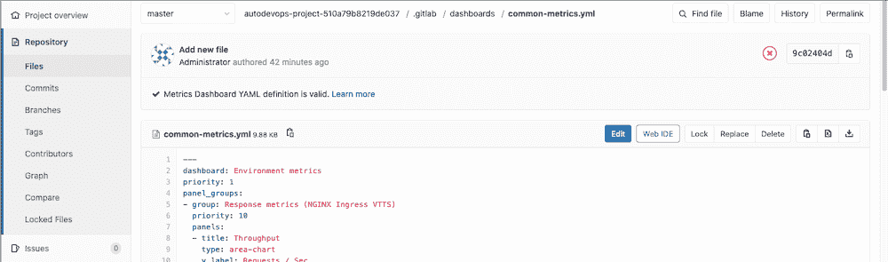

# Dashboard YAML properties

> 原文：[https://docs.gitlab.com/ee/operations/metrics/dashboards/yaml.html](https://docs.gitlab.com/ee/operations/metrics/dashboards/yaml.html)

*   [**Dashboard (top-level) properties**](#dashboard-top-level-properties)
*   [**Templating (`templating`) properties**](#templating-templating-properties)
*   [**Links (`links`) properties**](#links-links-properties)
*   [**Panel group (`panel_groups`) properties**](#panel-group-panel_groups-properties)
*   [**Panel (`panels`) properties**](#panel-panels-properties)
*   [**Axis (`panels[].y_axis`) properties**](#axis-panelsy_axis-properties)
*   [**Metrics (`metrics`) properties**](#metrics-metrics-properties)
*   [Dynamic labels](#dynamic-labels)
*   [Dashboard YAML syntax validation](#dashboard-yaml-syntax-validation)

# Dashboard YAML properties[](#dashboard-yaml-properties "Permalink")

仪表板包含几个组件：

*   模板变量.
*   面板组，由面板组成.
*   支持一个或多个指标的面板.

下表概述了预期属性的详细信息.

## **Dashboard (top-level) properties**[](#dashboard-top-level-properties "Permalink")

| Property | Type | Required | Description |
| --- | --- | --- | --- |
| `dashboard` | string | yes | 前往仪表板. 每个文件只能定义一个仪表板. |
| `panel_groups` | array | yes | 应在仪表板上的面板组. |
| `templating` | hash | no | 可以在其下添加模板相关选项的顶级键. |
| `links` | array | no | 添加链接以显示在仪表板上. |

## **Templating (`templating`) properties**[](#templating-templating-properties "Permalink")

| Property | Type | Required | Description |
| --- | --- | --- | --- |
| `variables` | hash | yes | 可以在这里定义变量. |

阅读有关[模板](templating_variables.html)的文档.

## **Links (`links`) properties**[](#links-links-properties "Permalink")

| Property | Type | Required | Description |
| --- | --- | --- | --- |
| `url` | string | yes | 链接的地址. |
| `title` | string | no | 显示链接的标题. |
| `type` | string | no | 链接的类型. 指定链接类型，可以是： `grafana` |

阅读有关[链接](index.html#add-related-links-to-custom-dashboards)的文档.

## **Panel group (`panel_groups`) properties**[](#panel-group-panel_groups-properties "Permalink")

| Property | Type | Required | Description |
| --- | --- | --- | --- |
| `group` | string | required | 前往面板组. |
| `priority` | number | 可选，默认为按文件顺序 | 命令显示在仪表板上. 数字越高意味着优先级越高，该页面上的优先级越高. 数字不必是连续的. |
| `panels` | array | required | 应在面板组中的面板. |

面板组中的面板排成一排，每行包含两个面板. 该规则的一个例外是一行上的单个面板：这些面板将采用其所在行的整个宽度.

## **Panel (`panels`) properties**[](#panel-panels-properties "Permalink")

| Property | Type | Required | Description |
| --- | --- | --- | --- |
| `type` | enum | 不，默认为`area-chart` | 指定要使用的面板类型，例如`area-chart` ， `line-chart`或`anomaly-chart` . [查看所有面板类型的文档.](panel_types.html) |
| `title` | string | yes | 前往面板. |
| `y_label` | string | 不，但强烈鼓励 | 面板的 Y 轴标签. |
| `y_axis` | string | no | 面板的 Y 轴配置. |
| `max_value` | number | no | 分母值用于计算[基于百分位数的结果](panel_types.html#percentile-based-results) |
| `weight` | number | 否，默认为按文件顺序 | 顺序出现在分组中. 较低的数字表示较高的优先级，在页面上较高. 数字不必是连续的. |
| `metrics` | array | yes | 应在面板中显示的指标. 当`type`是`area-chart`或`line-chart` ，可以显示任意数量的度量标准，而当`type`是`anomaly-chart`时，只能显示 3 个度量标准. |
| `links` | array | no | 添加链接以显示在图表的[上下文菜单上](index.html#chart-context-menu) . |

## **Axis (`panels[].y_axis`) properties**[](#axis-panelsy_axis-properties "Permalink")

| Property | Type | Required | Description |   |
| --- | --- | --- | --- | --- |
| `name` | string | 不，但强烈鼓励 | 面板的 Y 轴标签. 如果设置，则替换`y_label` . |   |
| `format` | string | 否，默认为`engineering` | 使用的单位格式. 请参阅[单位](yaml_number_format.html)的[完整列表](yaml_number_format.html) . |   |
| `precision` | number | 否，默认为`2` | 要显示在数字中的小数位数. |   |

## **Metrics (`metrics`) properties**[](#metrics-metrics-properties "Permalink")

| Property | Type | Required | Description |
| --- | --- | --- | --- |
| `id` | string | no | 用于将仪表板指标与数据库记录相关联. 在仪表板配置文件中必须唯一. [警报所](../alerts.html)必需（尚未启用支持，请参阅[相关问题](https://gitlab.com/gitlab-org/gitlab/-/issues/27980) ）. |
| `unit` | string | yes | 定义查询的返回数据的单位. |
| `label` | string | 不，但强烈鼓励 | 定义查询的图例标签. 在面板指标内应唯一. 可以包含时间序列标签作为内插变量. |
| `query` | string | 是，如果没有定义`query_range` | 定义用于填充图表/面板的 Prometheus 查询. 如果定义，将使用[Prometheus API](https://s0prometheus0io.icopy.site/docs/prometheus/latest/querying/api/)的`query`端点. |
| `query_range` | string | 是，如果未定义`query` | 定义用于填充图表/面板的 Prometheus 查询. 如果定义，将使用[Prometheus API](https://s0prometheus0io.icopy.site/docs/prometheus/latest/querying/api/)的`query_range`端点. |
| `step` | number | 不，如果未定义，则计算值 | 定义查询解析步长（以秒为单位）. 同一面板上的指标应使用相同的`step`值. |

## Dynamic labels[](#dynamic-labels "Permalink")

从 Prometheus 查询返回多个时间序列时，动态标签很有用.

当使用静态标签并且查询返回多个时间序列时，所有图例项将被标记为相同，这使得识别每个时间序列变得困难：

```
metrics:
  - id: my_metric_id
    query_range: 'http_requests_total'
    label: "Time  Series"
    unit: "count" 
```

这可能会生成如下图例：

[](../../../user/project/integrations/img/prometheus_dashboard_repeated_label.png)

为了使标签更明确，使用反映时间序列标签的变量是一个好习惯. 渲染图例时，变量将被时间序列标签的值替换：

```
metrics:
  - id: my_metric_id
    query_range: 'http_requests_total'
    label: "Instance:  {{instance}},  method:  {{method}}"
    unit: "count" 
```

生成的渲染图例将如下所示：

[](../../../user/project/integrations/img/prometheus_dashboard_label_variables.png)

动态仪表板标签还有一个简写值，该标签仅使用一个时间序列标签：

```
metrics:
  - id: my_metric_id
    query_range: 'http_requests_total'
    label: "Method"
    unit: "count" 
```

这可以通过降低`label`的值来实现，如果还有更多的单词用空格分隔，请用下划线（ `_` ）替换这些空格. 然后根据 Prometheus 查询返回的时间序列的标签检查转换后的值. 如果找到与转换后的值相等的时间序列标签，则将使用标签值并将其呈现在图例中，如下所示：

[](../../../user/project/integrations/img/prometheus_dashboard_label_variable_shorthand.png)

## Dashboard YAML syntax validation[](#dashboard-yaml-syntax-validation "Permalink")

在 GitLab 13.1 中[引入](https://gitlab.com/gitlab-org/gitlab/-/merge_requests/33202) .

要确认您的仪表板定义包含有效的 YAML 语法，请执行以下操作：

1.  导航 **存储库>文件** .
2.  导航到存储库中的仪表板文件.
3.  查看文件内容上方显示的有关文件的信息窗格.

具有有效语法的文件显示**Metrics 仪表板 YAML 定义有效** ，而具有无效语法的文件显示**Metrics Dashboard YAML 定义无效** .

[](../../../user/project/integrations/img/prometheus_dashboard_yaml_validation_v13_1.png)

当" **指标仪表板" YAML 定义无效时** ，将至少显示以下消息之一：

1.  `dashboard: can't be blank` [learn more](../../../operations/metrics/dashboards/yaml.html#dashboard-top-level-properties)
2.  `panel_groups: should be an array of panel_groups objects` [learn more](../../../operations/metrics/dashboards/yaml.html#dashboard-top-level-properties)
3.  `group: can't be blank` [learn more](../../../operations/metrics/dashboards/yaml.html#panel-group-panel_groups-properties)
4.  `panels: should be an array of panels objects` [learn more](../../../operations/metrics/dashboards/yaml.html#panel-group-panel_groups-properties)
5.  `title: can't be blank` [learn more](../../../operations/metrics/dashboards/yaml.html#panel-panels-properties)
6.  `metrics: should be an array of metrics objects` [learn more](../../../operations/metrics/dashboards/yaml.html#panel-panels-properties)
7.  `query: can't be blank` [learn more](../../../operations/metrics/dashboards/yaml.html#metrics-metrics-properties)
8.  `query_range: can't be blank` [learn more](../../../operations/metrics/dashboards/yaml.html#metrics-metrics-properties)
9.  `unit: can't be blank` [learn more](../../../operations/metrics/dashboards/yaml.html#metrics-metrics-properties)
10.  `YAML syntax: The parsed YAML is too big`

    当 YAML 文件大于 1 MB 时显示.

11.  `YAML syntax: Invalid configuration format`

    当 YAML 文件为空或不包含有效的 YAML 时显示.

指标仪表板 YAML 定义验证信息也可以作为[GraphQL API 字段获得](../../../api/graphql/reference/index.html#metricsdashboard)